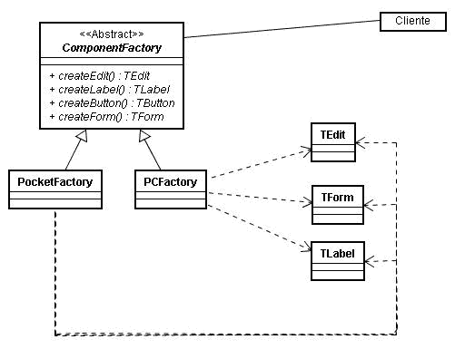
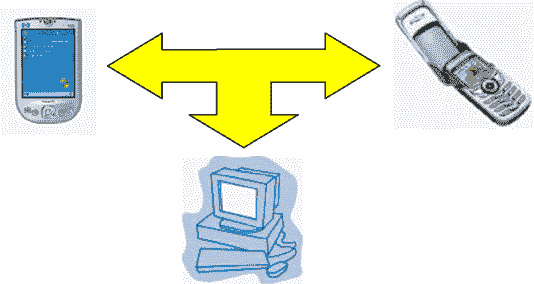

# 设计模式-抽象工厂

> 原文：<https://dev.to/osandrolucas/design-pattern---abstract-factory--n4f>

[T2】](https://res.cloudinary.com/practicaldev/image/fetch/s--Gt7sSB9U--/c_limit%2Cf_auto%2Cfl_progressive%2Cq_auto%2Cw_880/https://thepracticaldev.s3.amazonaws.com/i/9ce3ovm2mclca6xg9eu0.jpg)

*从头开始-我...。*

**什么是项目标准？**
好吧，让我们来看一下男性的定义，这些概念的父母在软件工程领域。(说真的，研究这些家伙):

[埃里希·伽马](https://pt.wikipedia.org/wiki/Erich_Gamma)，[理查德·赫尔姆](https://www.bcg.com/pt-br/about/people/experts/richard-helm.aspx)，[拉尔夫·约翰逊](https://pt.wikipedia.org/wiki/Ralph_Johnson) e [约翰·维里西德斯](https://pt.wikipedia.org/wiki/John_Vlissides)

Christopher Alexander 认为，“标准”描述了我们环境中的一个问题及其解决方案的核心，因此您可以使用此解决方案 100 多万次，而不必重复使用

简而言之，您可以将它理解为项目标准，即在上下文中(即使是在不同的项目和区域中)对问题的重复解决方案。请注意，此定义的关键术语是:上下文、问题和解决方案，因此必须明确了解每个术语。

**这些家伙有什么这么重要？他们做了什么？**

1995 年，Erich Gama、Richard Helm、Ralph Johnson、John Vlissides(被称为“四戈帮”)出版了一本名为《模式——可重用的面向对象软件的要素》的书，Addison Wesley 获得了葡萄牙语版的“面向对象的可重用软件解决方案”的项目名称 Bookman”.该书是一个目录，其中描述了 23 种设计模式，每种模式都为软件问题、其上下文、应用程序及其可能产生的后果提供了解决方案，并将它们分为三类:设计、结构和行为模式。

**好吧，那又怎样？现在呢 josé？**
和 ai？并且，使用设计标准有助于灵活构建应用程序和/或代码结构，并记录可重复使用的解决方案。通过它们，您可以确定同一问题的两种不同解决方案之间的共同点。
了解这些共同点使我们能够开发出越来越好、越来越高效的解决方案，可以重复使用，从而促进人类知识的进步。

标准通过简洁明了的语言使经验丰富的设计人员能够在较高的抽象级别将知识传授给年轻的设计人员，从而简化代码开发和重复使用。

[T2】](https://res.cloudinary.com/practicaldev/image/fetch/s--wBNYW_Uq--/c_limit%2Cf_auto%2Cfl_progressive%2Cq_auto%2Cw_880/https://thepracticaldev.s3.amazonaws.com/i/xgapir1tr3q8djus1s5a.jpg)

**让我们来看看有什么关系，什么是这样的“抽象工厂”？**

[T2】](https://res.cloudinary.com/practicaldev/image/fetch/s---6Z2_Uk0--/c_limit%2Cf_auto%2Cfl_progressive%2Cq_auto%2Cw_880/https://thepracticaldev.s3.amazonaws.com/i/57i96vfc8qfdzcyci0l1.jpg)

其目的是提供一个用于创建相关对象或相关对象的族的界面，而无需指定其特定类。也称为 Kit。

如果要将应用程序与特定类的实现隔离开来，则必须应用此模式，该类可以是应用程序只知道一个接口的特定组件或框架，而特定实现只能在运行时或编译时知道。

假设某个应用程序需要实施该应用程序以支持不同的平台和功能。例如:桌面视图和移动(Pocket PC 手机)。构建该组件的方法是为每个平台定义一个组件族，并根据应用程序将在其上运行的目标平台定义实例化它们的工厂。

据 4 位朋友介绍，抽象工厂模式的使用应限于以下情况:

系统必须独立于其产品的创建、组合或表示方式；
一个系统应配置为多产品系列的产品；
一个物品系列设计成一起使用，需要保证这种限制；
您要提供产品类库，并且只希望公开其界面，而不是其实现。
根据 GoF 定义的图案的建筑结构如图 1 所示。

**图 1。**图案的建筑结构

图 2 显示了符合开发人员实际情况的另一个示例的结构。此图所展示的基本概念是为用户(开发人员)提供在不同平台上运行应用程序的能力。

 
**图二。**多样的平台

与会者为:

*   ComponentFactory -为创建应用程序中使用的组件对象的操作声明接口。

*   pocket factory–实现以客户端设备格式创建对象的操作的特定类；

*   PCFactory -实现负责以 PC 格式创建对象的操作的特定类。

**但并非所有东西都是花...我...**
**抽象工厂标准具有以下优点和缺点:**

*   它隔离特定的类。
*   它使产品系列的交换变得容易。
*   她促进产品间的和谐。
*   很难支持新型产品。

-好吧-我...。是威尔逊！
进一步研究青年问题！

* * *

## 为软件工程学科 III，ifrs porto alegre 编写出版

参考文献

DevMedia : [了解机票标准](https://www.devmedia.com.br/conheca-os-padroes-de-projeto/957)
设计模式:[设计标准面向对象软件的可重用解决方案](https://pt.scribd.com/document/217373092/Padroes-de-Projeto-Solucoes-Reutilizaveis-de-Software-Orientado-a-Objetos-Erich-Gamma-pdf)