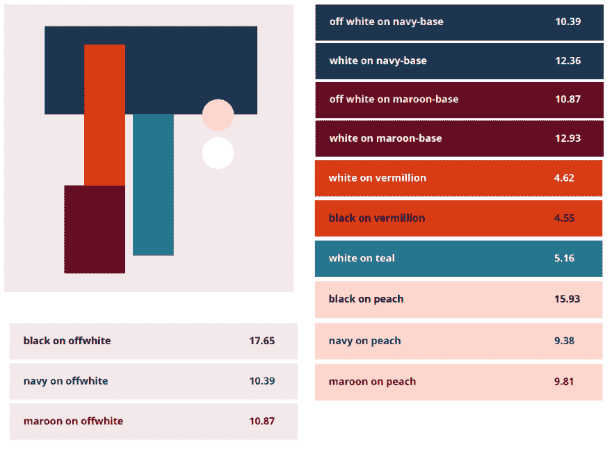

# 设计技巧-颜色和可访问性

> 原文：<https://dev.to/lkopacz/design-tips---color-and-accessibility-4oje>

这个话题有可能成为营销部门和设计师的敏感话题。我收到了很多被认可的设计，只是发现他们的新品牌的配色方案是不可行的。有时我们的客户或组织爱上了他们的新品牌和设计，要求他们改变品牌或设计实际上就像要求他们改变他们刚刚爱上的新身份。具有讽刺意味的是，客户的 SOW 上通常有可访问性要求，但设计师不知道他们的颜色是不可访问的。

## 经验法则

我们可以得到更多的细节，我们会的。然而，从技术和非技术的角度来看，在谈论颜色时有一个主要的经验法则:**不要依靠颜色来传达含义**。

在这里，我可以谈论很多技术性的东西，但是让我们来谈谈美式足球的颜色和意义。早在 2015 年，美国橄榄球联盟(NFL)就有一场“颜色抢购”活动。这场运动是为了庆祝联盟第一场彩色比赛 50 周年。看起来很有趣，对吧？

接下来是“喷气机-比尔”游戏(T1)，这对 1300 万患有红/绿色盲症的美国人来说是一场噩梦。

> 这是比尔喷气机队的比赛对红绿色盲的人来说的样子[pic.twitter.com/TAjoQpOfCj](https://t.co/TAjoQpOfCj)
> 
> — kurt (@kurtwearshats) [November 13, 2015](https://twitter.com/kurtwearshats/status/664992830629281792?ref_src=twsrc%5Etfw)

最终，你的设计对你来说可能看起来很壮观，但是对你的用户来说可能会很沮丧。尤其是当你用颜色来决定意义的时候。

## 有适当的对比

根据国家健康研究所和国家眼科研究所的数据，多达 8%的北欧血统男性和 0.5%的北欧血统女性患有常见的红绿色盲。然而，色彩对比并不仅仅对那些色盲患者重要。这也可能影响眼睛老化和/或困倦的人，甚至影响试图在户外阳光下通过移动设备阅读网站的人。

> 随着我的视力下降，我没有一天不诅咒那些用灰色字体的混蛋网页设计师。
> 
> — son of an asylum seeker, father of an immigrant (@doctorow) [September 15, 2017](https://twitter.com/doctorow/status/908702406338240512?ref_src=twsrc%5Etfw)

上面的推文让我发笑，多半是因为我比较年轻(29)，视力 20/20，只在电脑前戴眼镜以减轻眼睛疲劳。我已经*错过了*以前灰色上灰色的链接。

那么什么是合适的对比呢？较大文本的适当对比度为 3:1，较小文本的对比度为 4.5:1。当我第一次看到这些评价时，我心想:小或大到底是什么意思，那是主观的！？他们确实定义了它。大文本是指大于 14 磅(通常为 18.66 像素)、粗体或大于 18 磅(通常为 24 像素)的任何文本。任何更小的都是...小文本。

## 工具使用

1.  [WebAim 对比度检查器](https://webaim.org/resources/contrastchecker/)。说实话，我不知道如何自己手动检查色调和对比度。这远远超出了我的分析和艺术技巧。但是为了评估对比度，我使用了这个对比度检查器。我简单地输入前景色(文字颜色)和背景色的十六进制值，它会告诉我对比度是多少。我喜欢的另一件事是，如果你在玩颜色对比，你可以调整它变得更亮或更暗，以保持在品牌范围内，同时确定你的颜色使用是可以接受的。

2.  [色彩对比分析仪](https://chrome.google.com/webstore/detail/color-contrast-analyzer/dagdlcijhfbmgkjokkjicnnfimlebcll?hl=en)。我喜欢这个工具来分析背景图像与文本的对比。真正困难的是保证图像的对比度是合适的。自动化工具通常不会在这里使用，因为它们会寻找背景的十六进制值，而不是分析图像本身的色调和对比度。我最大的问题是，它不能真正告诉你是通过还是失败，我花了一段时间才知道如何使用它。尽管如此，总比没有好！

3.  [诺卡菲视觉刺激器](https://chrome.google.com/webstore/detail/nocoffee/jjeeggmbnhckmgdhmgdckeigabjfbddl?hl=en-US)。这个工具本身并不是为了对比，而是帮助你评估你的网站在各种不同的视觉障碍下会是什么样子。从色盲到白内障。至少，这是一个非常有用的工具，可以培养同理心，确保包容性。

## 如何开始评估自己的品牌

虽然我不是设计师，也没有和设计师一样的工作流程，但我和设计师 [Raquel Breternitz](https://www.linkedin.com/in/raquel-breternitz/) 一起设计了这个配色方案和我的标志。这对我们来说效果很好，我想分享我们是如何一起创造无障碍设计的。

当然，因为我的博客是关于可访问性的，所以我对那些需求非常坚定和清楚，这对于许多客户来说可能不是这样。然而，Raquel 会问我认为是关于我的品牌的正常问题，我的信息是什么，我想强调我的品牌和个性的哪些元素，等等。我们也有一个 Pinterest 板，我们可以在那里就配色方案进行头脑风暴，我会选择我最喜欢的方案。我不太了解设计师如何与客户合作，但我怀疑这是总的主题，尽管也许 Pinterest 董事会更适合个人而不是组织。

[T2】](https://res.cloudinary.com/practicaldev/image/fetch/s--5D9iCmcj--/c_limit%2Cf_auto%2Cfl_progressive%2Cq_auto%2Cw_880/https://www.a11ywithlindsey.com/static/color_schemes_example-7274cf3cb30ab3daf95c5539246ed92f-cd245.png)

一旦我选择了我最喜欢的配色方案，当她给我发送可交付成果时，她会做得更好。她给了我大约 5 - 6 种颜色，并将它们与文本和背景一起使用。对于每一种颜色，她都会告诉我这种组合的颜色对比是什么。这给了我很大的信心，我使用的所有颜色都有适当的对比度，我使用的颜色也很恰当。如果你想看看我们浏览过的一些样品，你可以[下载配色方案](https://www.a11ywithlindsey.com/ColorSchemes-857041f8d7c63506a8684f131ae31939.zip)。声明:配色方案 pdf 中的来源/灵感照片取自 Pinterest。

## 如何说服客户改变品牌

通常，我们作为开发人员不能直接与项目的设计者一起工作。我遇到过很多这样的情况，我被孤立在设计师之外，无法给他们反馈或标记我的顾虑。我刚刚完成了一个设计，并被告知要实现它。

当你接收到不可理解的颜色对比时，该如何进行对话？我不打算对你撒谎，这一部分我仍然在挣扎，这当然不容易。我们不想侮辱设计师或表现得好像他们忽略了 SOW 要求。在个人和职业环境中，指责他人通常是不允许的。我认为无障碍设计的缺陷通常是无意的。然而，有时设计师确实构建了一个可访问的设计，但是当设计师或开发人员标记了对比问题时，客户请求了一些不可访问的东西并且忽略了我。

当我有一个客户最小化对比度的例子时，我会做几件事。首先，如果他们的 SOW 中有要求，我会告诉他们这是我们要求的一部分，并且有法律和商业激励来遵守这些要求。不管他们的 SOW 中是否有可访问性，我都会向最终用户解释这意味着什么，而不是使用“WCAG 2.0”或“Section 508 compliance”这样的行话即使在联邦政府，使用行话也不能真正帮助你的客户理解这对他们的最终用户意味着什么。

在色彩对比的情况下，这将取决于观众。如果我和热爱这项运动的观众交谈，我真的很喜欢用上面的足球例子。至少，他们可以理解，如果你不能理解哪个队触地得分，哪个队失球，谁拦截了谁，这是多么令人沮丧。如果你把它与网络联系起来，我通常喜欢向他们解释说，我们希望确保人们能够区分物品，而不管他们的能力如何。

我计划写更多关于颜色的东西，因为我个人觉得视觉科学很迷人。我希望这是一个好的开始。如果您有任何问题，请随时通过 [Twitter](https://twitter.com/littlekope0903) 联系我。