# 2018 年作为开发者的设计

> 原文：<https://dev.to/bnevilleoneill/designing-as-a-developer-in-2018-1ee4>

[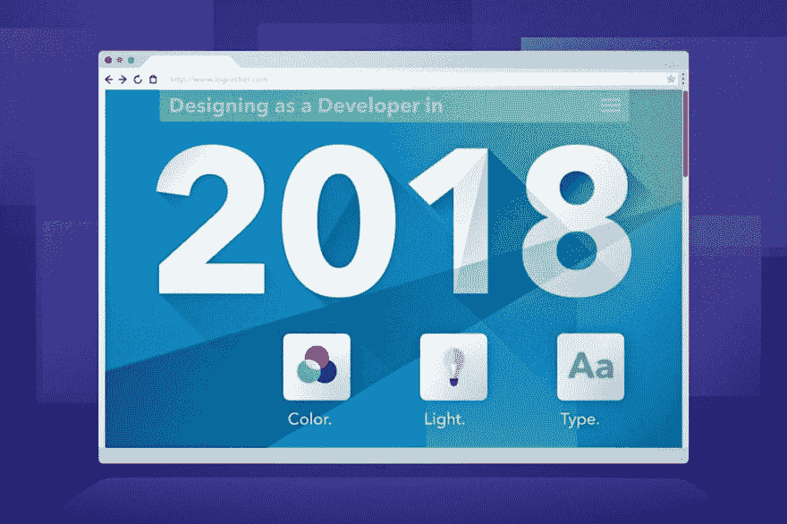T2】](https://res.cloudinary.com/practicaldev/image/fetch/s--FMlVzovc--/c_limit%2Cf_auto%2Cfl_progressive%2Cq_auto%2Cw_880/https://cdn-images-1.medium.com/max/1024/1%2ARXSuvIVO5oX2xSD42QKg_w.jpeg)

无论你是在打造一个产品、一个工具、一个网站、一项服务还是一家初创公司:第一印象就是一切。用户天生就被他们可以信任的产品所吸引，这些产品感觉合法并提供安全感。一个看起来像是孩子设计的网站总是让用户感到安全和健康。即使你的产品很棒，如果看起来你不知道自己在做什么，没有人会使用它。

然而，作为一名开发人员，设计常常让人觉得是一场艰苦的战斗。您的首要目标是确保您正在构建的软件能够运行，并且运行良好。大多数开发人员很少或根本不考虑他们工作的视觉设计，对大多数开发人员来说这没什么。

但是如果你是一名前端开发人员，设计应该是你所做的一切的核心。你不仅需要实现别人的设计，而且你真的应该能够设计你自己的项目。

那么，2018 年你是如何设计自己的前端的呢？

这就是我将在这里介绍的内容。可以把它看作是一个面向非设计师的综合备忘单。

我将讨论三个主要的设计组件:

*   颜色
*   光
*   排印

每一部分都分为一组要遵循的一般规则、一个示例和一个您可以使用的资源列表。

但是首先让我们让你了解相关的设计原则。

[T2】](https://logrocket.com/signup/)

### 半 skeuomorphism

在我们深入 2018 年设计前端时可以采取的所有捷径之前，理解我们将遵循的设计原则很重要:半 skeuomorphism。

听起来很可怕，但其实并不可怕。事实上，你可能已经非常熟悉这个概念了。

Skeuomorphism 是一种设计原则，其中阴影、渐变和纹理用于创建代表真实世界元素的元素。纹理和光线是 skeuomorphic 设计中的两个主要成分，从 2007 年到 2013 年，它们似乎无处不在。

<figcaption>iOS 6 Find My Friends app(2011)大量运用了 skeuomorphic 设计，以及当时苹果的大部分产品。</figcaption>

这在很大程度上可能归因于苹果自己对现代设计语言的解释，正如他们 2011 年的用户界面指南所指出的:

> 在适当的时候，给你的应用程序添加一个现实的、物理的维度。通常，您的应用程序看起来和表现得越真实，人们就越容易理解它是如何工作的，他们就越喜欢使用它…通常，与忠实的相似性相比，放大或增强的描述看起来更真实，传达更多的意义。

然而，到 2012 年，一个缓慢的迁移开始向一个更扁平的设计系统发展。在类似 [Metro UI](https://en.wikipedia.org/wiki/Metro_(design_language)) 和 [Material Design](https://en.wikipedia.org/wiki/Material_Design) 这样的设计语言的推动下，扁平化设计引入了更柔和、更统一的调色板，更薄的字体，以及使用阴影作为系统层次的工具，而不是强化超现实主义(被谷歌称为[“立面层次”](https://material.io/design/environment/elevation.html#elevation-hierarchy))。

[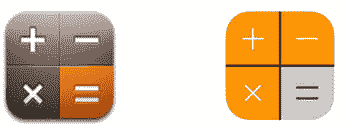](https://res.cloudinary.com/practicaldev/image/fetch/s--pAnDvPdQ--/c_limit%2Cf_auto%2Cfl_progressive%2Cq_auto%2Cw_880/https://cdn-images-1.medium.com/max/344/1%2A6D4JIJdPed8xjRigagieYQ.png) 

<figcaption>iOS 计算器:2011 年(skuomorphic)vs 2013 年(flat)</figcaption>

好吧，那么什么是半 skeuomorphism？Semiskeu 是一种设计原则，它将 skeuomorphic 设计中的彩色渐变和阴影的使用与平面设计中的许多原则结合在一起。

你可能对这个也很熟悉，因为它几乎无处不在。semiskeu 的一个很好的例子是 [Stripe 主页](http://stripe.com):

[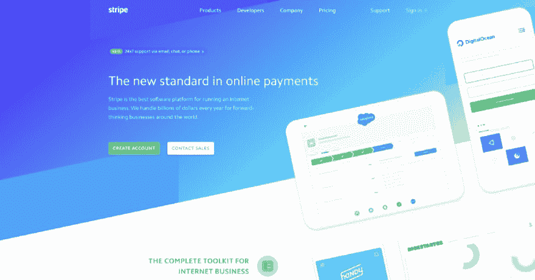T2】](https://res.cloudinary.com/practicaldev/image/fetch/s--ws7fRMHH--/c_limit%2Cf_auto%2Cfl_progressive%2Cq_auto%2Cw_880/https://cdn-images-1.medium.com/max/1024/1%2AJ7KSONL42WKfoA5Fo4GQUA.png)

你注意到了什么？

1.  柔和的阴影为页面的平面设备插图增加了微妙的维度
2.  标题渐变从暗到亮，从左到右，把你的眼睛拉向插图，创造一个重点
3.  插图与页面相比有一个角度，以突出重点

在 semiskeu 中，阴影和渐变不仅用于暗示光线，还用于强调、放大或引起页面上值得注意的元素的注意(第 1 点和第 2 点)。

此外，虽然 semiskeu 保持了平面设计中的几何简单性，但越来越多的网站采用了非常规的形状和弯曲的 div，以使页面成为一个流动的实体，而不是将页面分成清晰的水平部分(3)。

现在我们有了一些背景，让我们开始设计。

### 颜色

前端开发人员在构建网站时最常犯的一个错误就是在设计中忽略了微妙之处。

现在是 2018 年，不是 2003 年。人们再也不能逃避交付亮蓝色和绿色的操作系统了。网站不再有跳舞的 gif 或星空背景。

仔细选择你的调色板。

**一般经验法则:**

1.  你网站内容的背景应该是灰色的。使用白色、浅灰色或深灰色。
2.  仅在设计用来吸引用户注意力的部分使用彩色或渐变背景。想想标题、英雄、号召横幅等。
3.  大多数情况下，在任何图像、彩色或渐变背景上使用白色文本。此外，浅色阴影有时有助于提升文本的突出性。
4.  永远不要使用纯黑色。纯的不透明黑色(#000)对于大多数网页来说往往过于刺眼。甚至这篇文章的字体颜色设置为 84%的不透明度。
5.  **确保彩色组件不会相互邻接。**除非这两种颜色非常互补，否则通常两种相邻颜色的对比会产生一种两极分化的感觉，从而破坏页面的流动。如果一个导航条可能接触到一个彩色的英雄，选择一个透明的导航条背景。

[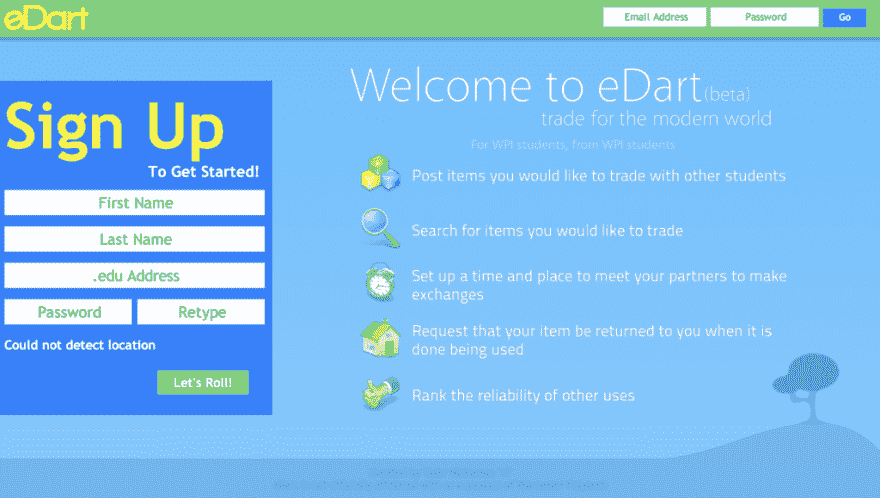T2】](https://res.cloudinary.com/practicaldev/image/fetch/s--sNnWgY-E--/c_limit%2Cf_auto%2Cfl_progressive%2Cq_auto%2Cw_880/https://cdn-images-1.medium.com/max/1024/1%2ABfmhuHqa6Vuq12NnENTntg.png)

[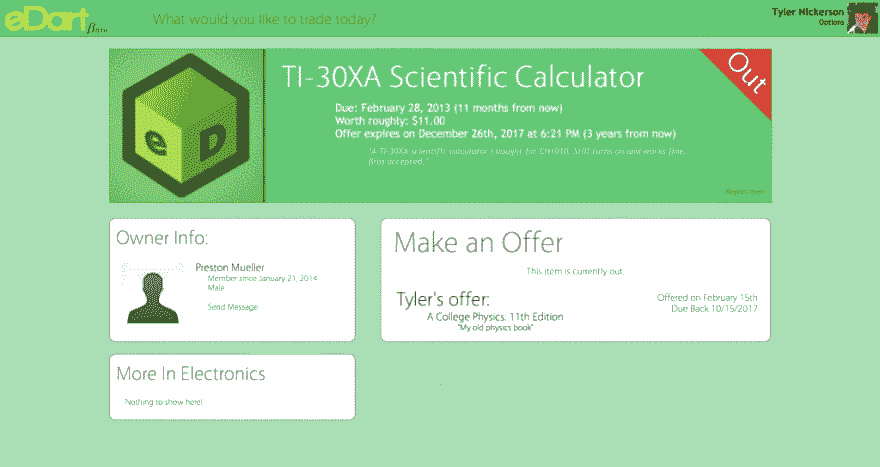T2】](https://res.cloudinary.com/practicaldev/image/fetch/s--8tXufYIw--/c_limit%2Cf_auto%2Cfl_progressive%2Cq_auto%2Cw_880/https://cdn-images-1.medium.com/max/1024/1%2AhsCOoLHntltn9xQ85va1Ow.png)

[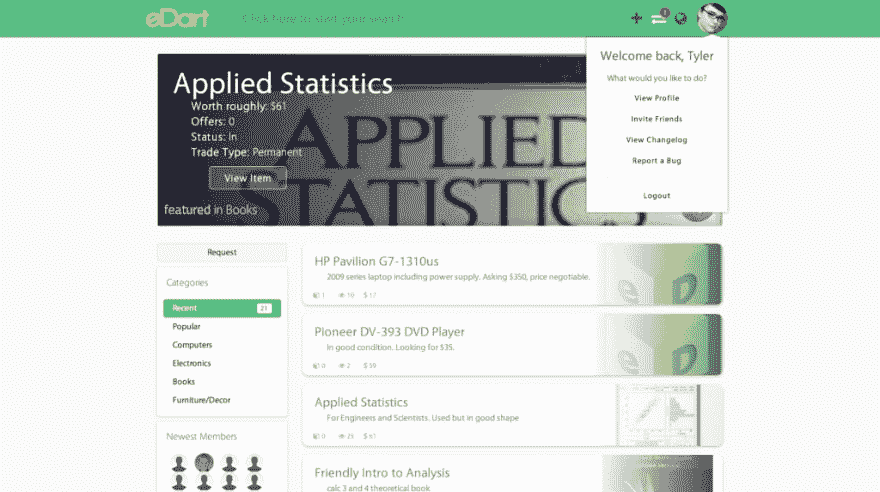](https://res.cloudinary.com/practicaldev/image/fetch/s--0GOwSxda--/c_limit%2Cf_auto%2Cfl_progressive%2Cq_auto%2Cw_880/https://cdn-images-1.medium.com/max/1024/1%2AVZZUGB6vARbB0JljrHdmSw.png) 

<figcaption>我写的第一个制作网站(2013 年)看起来就像 Windows XP 吐在一页纸上。它最大的设计错误是使用了太多的原色。与此同时，该项目的重新设计(2014 年初)过度使用了单一的原色，这同样是有害的。你的网站应该包含一种或两种原色，并为所有的正文内容使用灰度背景。到第三次重新设计时(2014 年末)，我已经吸取了教训。</figcaption>

**例子**

[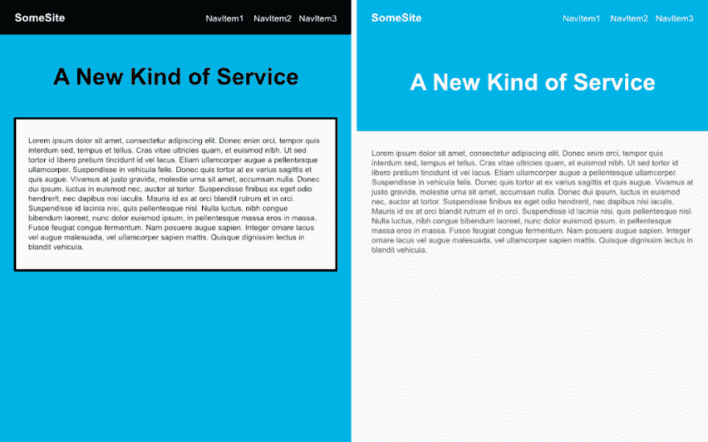T2】](https://res.cloudinary.com/practicaldev/image/fetch/s--t1CLFNOW--/c_limit%2Cf_auto%2Cfl_progressive%2Cq_auto%2Cw_880/https://cdn-images-1.medium.com/max/1024/1%2A_9xYvrjAESG6lLj4lgSQ4w.png)

仅仅使用这五个简单的规则，我们就可以彻底地将这个黑蓝色的网页转变成一个更加美观的网站:

*   网站的主体是浅灰色的，只有标题保留蓝色品牌颜色(规则 1 & 2)
*   标题文本是白色的，以补充蓝色(规则 3)
*   文本颜色从黑色提升到非常深的灰色(规则 4)
*   导航条的背景是透明的，所以黑色和蓝色的边框不会形成对比(规则 5)

**资源**

*   [平面 UI 颜色](https://flatuicolors.com/)
*   [平面 UI 颜色选择器](http://www.flatuicolorpicker.com/)
*   [土坯颜色](http://color.adobe.com)
*   [酷派](https://coolors.co/)

### 光

虽然颜色有多种用途，但它也可以通过渐变来暗示光线。在 semiskeu，这种做法非常普遍。我们再来看看条纹主页。

你觉得光源在哪里？

[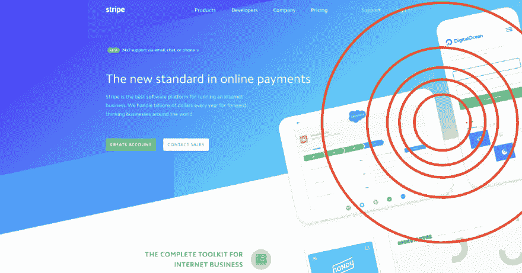T2】](https://res.cloudinary.com/practicaldev/image/fetch/s--IicxY9GK--/c_limit%2Cf_auto%2Cfl_progressive%2Cq_auto%2Cw_880/https://cdn-images-1.medium.com/max/1024/1%2A1GpXc2g2OaMZfUcEPXH8Bw.png)

这里有个提示:Stripe 使用的是径向光源。光线出现在元素的正上方，这解释了投影的低偏移和背景渐变中集中的浅绿色。

**一般经验法则:**

1.  确保所有组件的一致性。一旦你为你的页面定义了一个光源，确保所有的阴影都跟随它的方向。如果光线以 135 度“照射”你的页面，那么每个阴影和渐变都应该以 135 度倾斜。
2.  使用阴影作为工具来呈现等级或状态。应该使用阴影来突出页面组件，提供页面结构，或者描述状态。例如，您可以通过降低按钮的高度而不是改变其颜色来描述按钮被按下的情况。太多的阴影会呈现太多的维度，所以要小心(例如，不要创建一个有 18 个独特高度的站点)。
3.  你的阴影的偏移量应该大约等于它的模糊半径的一半。例如，x / y 偏移为 10px 的阴影应该具有大约 20px 的模糊半径。这种方法渲染出最真实的阴影。
4.  始终将阴影的不透明度保持在 25%以下。宁可小心谨慎，也不要偏离你的设计。如果你使用的是深色背景，在某些情况下，你可能需要提高阴影的不透明度，以确保其可见性。
5.  阴影并不总是需要黑色。在彩色表面上使用阴影时，使用非常暗或暗淡的背景色来改善阴影的混合通常是有利的。

 

<figcaption>在大多数情况下，可以使用简单的单色渐变来创建光线。然而，互补色，如紫色和粉红色，也能起到同样的效果。 [Udacity](http://udacity.com) 在他们的许多口音成分中使用了这种方法。</figcaption>

**例子**

现在让我们来运用这些规则。这里我们给两套平面名片增加了维度。主卡使用单调渐变来暗示和说明光线，而强调卡使用互补色来强调卡的标题:

[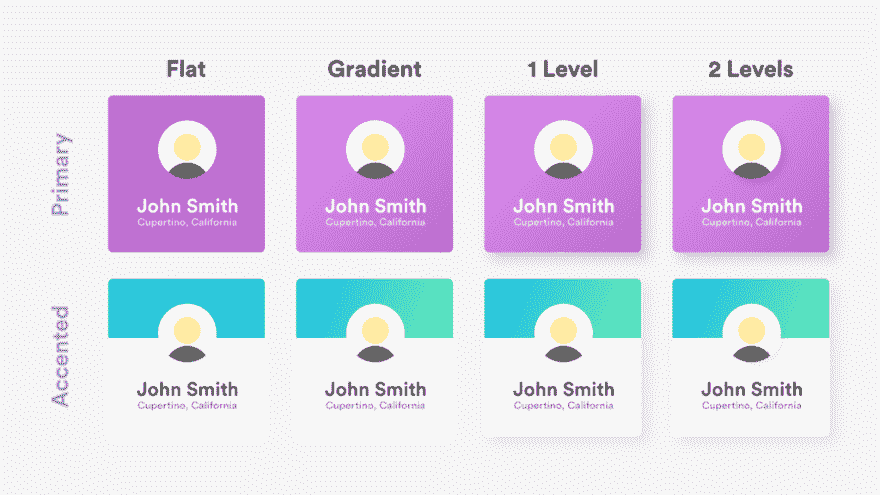T2】](https://res.cloudinary.com/practicaldev/image/fetch/s--02iORbyZ--/c_limit%2Cf_auto%2Cfl_progressive%2Cq_auto%2Cw_880/https://cdn-images-1.medium.com/max/1024/1%2An2zsiTK9VumkFYy7TX6qJw.png)

他们如何使用我们的经验法则？

*   所有阴影的角度都是 135 度。第一行的渐变与这个角度相匹配来创建光线(规则 1)。
*   阴影呈现出清晰的元素层次。用户的头像在最上面，因为它是最重要的元素(规则 2)。一般来说，用户会首先注意到最顶端的元素。在这种情况下，用户的注意力将从头像转移到卡片(姓名和位置)，转移到页面内容的其余部分。
*   每张卡片上的偏移量大致为 20px，而模糊设置为 40px(规则 3)。
*   每个阴影的不透明度小于 15%(规则 4)。
*   主卡头像上的阴影是#30163E，不是#000(规则 5)。

[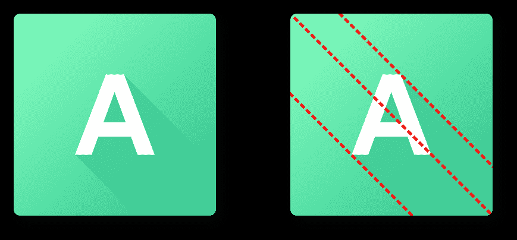](https://res.cloudinary.com/practicaldev/image/fetch/s--5A61iEef--/c_limit%2Cf_auto%2Cfl_progressive%2Cq_auto%2Cw_880/https://cdn-images-1.medium.com/max/869/1%2AplNLGc4iiPQ2fvXcliL-tg.png) 

<figcaption>始终保持你光线的角度一致。请注意渐变和平面阴影是如何遵循同一角度的。</figcaption>

**资源**

*   [CSC 梯度](https://cssgradient.io/gradient-backgrounds/?ref=producthunt)
*   [渐变搜索](https://gradienthunt.com/)
*   [网页渐变](https://webgradients.com/)
*   [立面层次指引](https://material.io/design/environment/elevation.html#depicting-elevation)

### 排版

你可能已经发现自己在挖掘上面卡片中使用的字体。这种字体称为圆形，是当今公司最常用的字体之一。事实上，它是 Spotify 和 Airbnb 的官方字体:

[T2】](https://res.cloudinary.com/practicaldev/image/fetch/s--O-cR6IeV--/c_limit%2Cf_auto%2Cfl_progressive%2Cq_auto%2Cw_880/https://cdn-images-1.medium.com/max/1024/1%2ANGFwQ6UvJjVfARjLEpS0KQ.png)

[T2】](https://res.cloudinary.com/practicaldev/image/fetch/s--A6wSvWaG--/c_limit%2Cf_auto%2Cfl_progressive%2Cq_auto%2Cw_880/https://cdn-images-1.medium.com/max/1024/1%2AUYcuD7k4zuPbbWq9YqfLLA.png)

圆形字体源于一种叫做几何 sans 的无衬线字体系列。Geo-sans 具有干净的几何形状，并提供现代主义风格，使其成为现代设计师中最受欢迎的字体家族之一。在你的网页上使用 geo-sans 字体永远不会出错。其中最受欢迎的有:

*   [开桑斯](https://fonts.google.com/specimen/Open+Sans)、[拉托](https://fonts.google.com/specimen/Lato)和[蒙塞拉特](https://fonts.google.com/specimen/Montserrat)(免费)
*   [无博物馆](https://typekit.com/fonts/museo-sans)、[比邻星新星](https://typekit.com/fonts/proxima-nova)和[万千](https://typekit.com/fonts/myriad)(起价 60 美元/年)
*   [圆形](https://lineto.com/The+Fonts/Font+Categories/Text+Fonts/Circular/)， [Avenir 下一个](https://www.fonts.com/font/linotype/avenir-next)，还有[哥谭](https://www.typography.com/fonts/gotham/overview/)(价格不菲)

**一般经验法则**

1.  不要使用两种以上的字体。大多数网页都坚持单一的字体，但是，偶尔你会看到不同的字体用于表示标题和正文。以中号为例。你会注意到这个页面的菜单，以及每个标题，都是无衬线字体，而正文仍然是衬线字体。
2.  **保留仅用于标识的风格字体。**这条规则有点宽泛，因为总会有边缘情况，但一般来说，你应该坚持只对徽标使用风格字体(任何类型的卷曲、弯曲或新奇字体)。以[语言](http://golinguistic.com)为例，它使用 Lily Script One 作为其标志，但使用 Lato / Proxima Nova 作为所有其他文本。
3.  保持一致的类型层次结构。你应该只使用少量的字体大小和一两种字体粗细来开发字体层次。想想 HTML 标题标签 h1、h2、h3 等等。至少其中四种应该有不同的视觉风格，使用不同的亮度、大小和粗细来表示文本的重要性。关于类型层次的一个很好的例子，请看[苹果公司的人机界面指南](https://developer.apple.com/design/human-interface-guidelines/ios/visual-design/typography)。
4.  保持正文的正常粗细和间距。文本应该始终清晰易读，因此，在大标题或字体粗细对文本清晰易读性影响不大的情况下，应保留浅色或粗体字体。此外，始终将正文文本的行距保持在 1.15 到 1.5 之间(取决于字号)，以最大限度地提高可读性。例如，这篇文章的行距大约为 1.5 雷姆。证明你的身体段落也没有坏处。

**例子**

[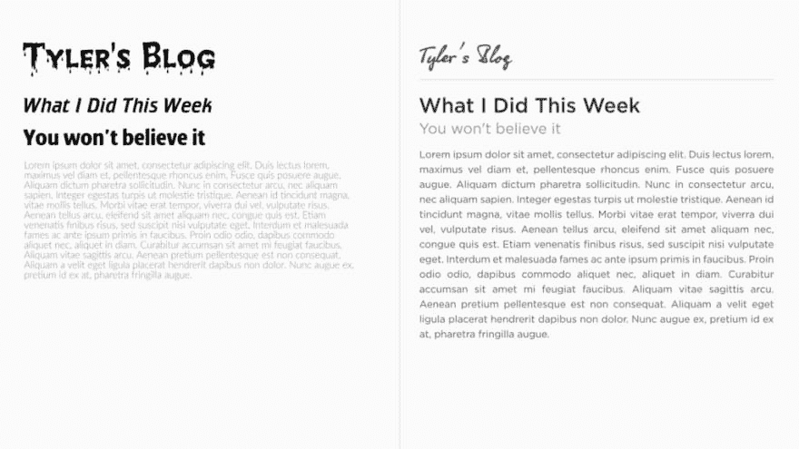T2】](https://res.cloudinary.com/practicaldev/image/fetch/s--QXs5wygj--/c_limit%2Cf_auto%2Cfl_progressive%2Cq_auto%2Cw_880/https://cdn-images-1.medium.com/max/1024/1%2AE15ljoIblP6QAMd-4Wtl8w.png)

使用这四条规则，我们可以将上述杂乱的文本转换成结构化的文章:

1.  字体的数量从四个减少到两个:OlgaC(标志)和 Gotham(主体)(规则 1)。
2.  Logo 使用页面上唯一新颖的字体(规则 2)。
3.  清晰、定义明确的样式说明了文章的标题、副标题和正文内容。这些隐含在字体大小、不透明度和粗细之中(规则 3)。
4.  大幅缩小徽标以维护品牌，同时避免暗示徽标是页面上最重要的元素(规则 3)。
5.  正文的字体间距为 1.5，左对齐(规则 4)。

在选择字体时，还有一些额外的考虑，比如不要像我一样使用 1996 年的微软视窗字体。

**资源**

*   [谷歌字体](https://fonts.google.com/)
*   [FontSquirrel](https://www.fontsquirrel.com/)
*   [型式](https://typekit.com/)
*   [丢失类型](http://www.losttype.com/)
*   [活字联盟](https://www.theleagueofmoveabletype.com/)
*   [标识字体](http://www.identifont.com/)
*   [什么东西](https://www.myfonts.com/WhatTheFont/)

### 接下来是什么

希望本指南对您在 2018 年设计和实施前端平台时应该追求的方向有所启发。有太多要谈的了，但我向自己保证不会在这里写书。欢迎关注[我的个人博客](http://blog.tylernickerson.com)了解更多设计和前端相关的话题，或者查看我正在开发的[指南](http://github.com/Nickersoft/design)，以便将所有这些设计规则写在纸上。

快乐的设计和开发！

### Plug: [LogRocket](https://logrocket.com/signup/) ，一款适用于网络应用的 DVR

<figcaption>[https://logrocket.com/signup/](https://logrocket.com/signup/)</figcaption>

LogRocket 是一个前端日志工具，可以让你回放问题，就像它们发生在你自己的浏览器中一样。LogRocket 不需要猜测错误发生的原因，也不需要向用户询问截图和日志转储，而是让您重放会话以快速了解哪里出错了。它可以与任何应用程序完美配合，不管是什么框架，并且有插件可以记录来自 Redux、Vuex 和@ngrx/store 的额外上下文。

除了记录 Redux 操作和状态，LogRocket 还记录控制台日志、JavaScript 错误、堆栈跟踪、带有头+正文的网络请求/响应、浏览器元数据和自定义日志。它还使用 DOM 来记录页面上的 HTML 和 CSS，甚至为最复杂的单页面应用程序重新创建像素级完美视频。

免费试用。

* * *