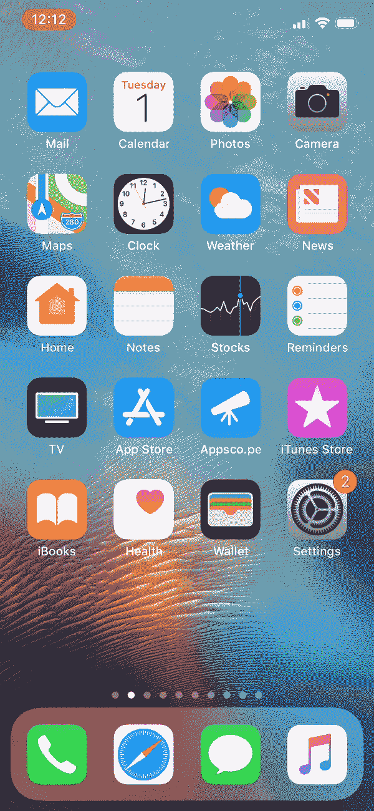
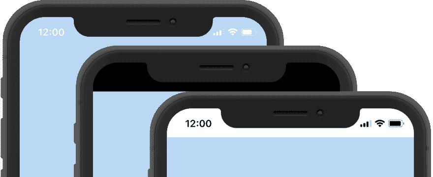
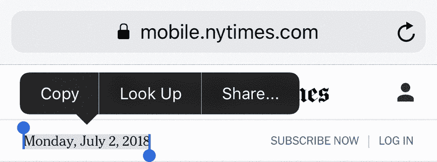
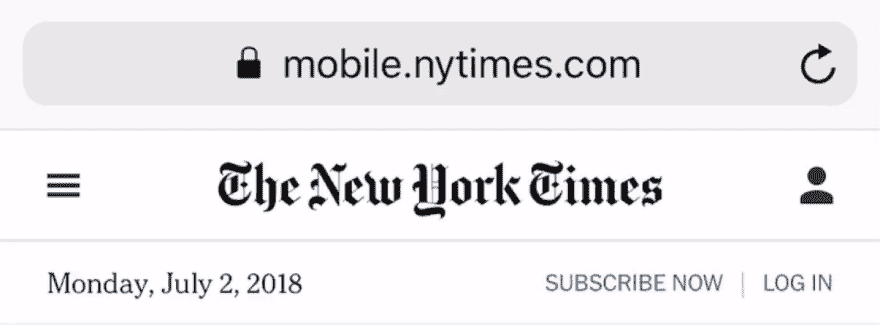
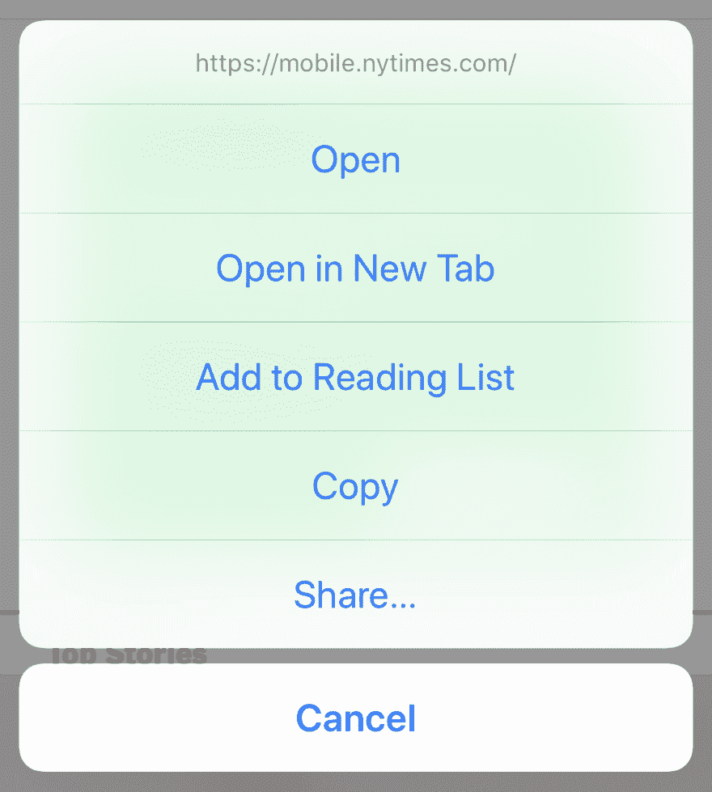
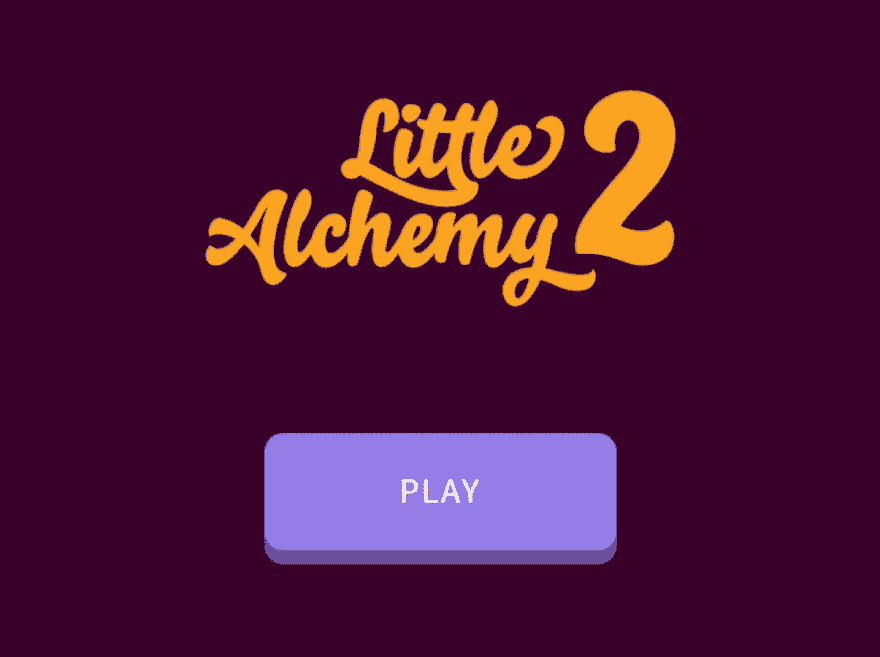

# 为 iOS 设计类似原生的渐进式网络应用

> 原文：<https://dev.to/oskarlarsson/designing-native-like-progressive-web-apps-for-ios-510o>

渐进式 Web 应用程序(PWA)的主要特征之一是应用程序相似性。虽然从技术上讲，你的应用程序是在网络浏览器中运行的，但你应该努力让它看起来和感觉起来像本地应用程序一样好。这包括将它安装在主屏幕上、添加自定义图标、禁用地址栏等等。与 Android 不同，iOS 需要一些额外的 HTML 和 CSS 技巧，Android 的许多类似本机的功能都是由 Web 应用程序清单自动生成的。以下是如何让你的 PWA 在 iOS 上更像原生的七点建议。

# 1。使其独立

有两种方法可以让您的 PWA 在 iOS 上作为独立的应用程序运行(即，在没有 web 浏览器 UI 控件的新窗口中运行)。第一种方法是在 HTML 代码的 head 元素中使用`apple-mobile-web-app-capable` meta 标记，代码如下。

```
<meta name="apple-mobile-web-app-capable" content="yes"> 
```

Enter fullscreen mode Exit fullscreen mode

第二种方法是将 Web 应用程序清单的`display`属性设置为`standalone`。Web 应用程序清单示例如下所示。

```
{  "name":  "Appscope",  "display":  "standalone",  "icons":  [{  "src":  "icons/icon-192.png",  "sizes":  "192x192"},  {  "src":  "icons/icon-512.png",  "sizes":  "512x512"}  ]  } 
```

Enter fullscreen mode Exit fullscreen mode

# 2。添加自定义图标

不幸的是，iOS 不使用 Web 应用清单中指定的图标。相反，要为应用程序的所有页面使用自定义图标，您必须提供 PNG 格式的图标，并在 PWA 的根文档文件夹中使用名称`apple-touch-icon.png`。

如果你想为你的应用程序的一个*页面添加一个特定的图标，在你的 HTML 代码的 head 元素中使用下面一行。* 

```
<link rel="apple-touch-icon" href="single-page-icon.png"> 
```

Enter fullscreen mode Exit fullscreen mode

不同的 iOS 设备对主屏幕图标使用不同的大小。要指定特定大小的图标，请使用 link 元素的`sizes`属性。如果没有为设备的推荐图标大小指定图标，则使用比推荐大小更大的最小图标。

下面的例子指定了最常见的 iOS 设备的大小，来自苹果的 [Safari 网络内容指南](https://developer.apple.com/library/archive/documentation/AppleApplications/Reference/SafariWebContent/ConfiguringWebApplications/ConfiguringWebApplications.html)。

```
<link rel="apple-touch-icon" href="touch-icon-iphone.png">
<link rel="apple-touch-icon" sizes="152x152" href="touch-icon-ipad.png">
<link rel="apple-touch-icon" sizes="180x180" href="touch-icon-iphone-retina.png">
<link rel="apple-touch-icon" sizes="167x167" href="touch-icon-ipad-retina.png"> 
```

Enter fullscreen mode Exit fullscreen mode

回想一下，iOS 需要不透明的图标。图标的任何透明部分将被涂成黑色。

# 3。添加自定义闪屏

让你的渐进式网络应用程序更像本地的下一步是用你自己的图像取代单调的白色启动屏幕。要添加自定义闪屏，请使用下面的 link 元素。

```
<link rel="apple-touch-startup-image" href="launch.png"> 
```

Enter fullscreen mode Exit fullscreen mode

为了显示该图像，它的尺寸必须与运行该应用程序的设备的尺寸相同，这一点很重要。例如，要在 iPhone X 上工作，`launch.png`的尺寸必须是 1125×2436 像素。这里出现的问题是，有多个不同分辨率的 iOS 设备，不幸的是，我们不能简单地对不同大小的图像多次重复这段代码。相反，我们需要使用`media`属性来指定哪个启动映像用于哪个设备。

将以下代码添加到 PWA 的 head 元素中，以支持不同 iOS 设备的自定义闪屏。

```
<!-- iPhone X (1125px x 2436px) -->
<link rel="apple-touch-startup-image" media="(device-width: 375px) and (device-height: 812px) and (-webkit-device-pixel-ratio: 3)" href="/apple-launch-1125x2436.png">

<!-- iPhone 8, 7, 6s, 6 (750px x 1334px) -->
<link rel="apple-touch-startup-image" media="(device-width: 375px) and (device-height: 667px) and (-webkit-device-pixel-ratio: 2)" href="/apple-launch-750x1334.png">

<!-- iPhone 8 Plus, 7 Plus, 6s Plus, 6 Plus (1242px x 2208px) -->
<link rel="apple-touch-startup-image" media="(device-width: 414px) and (device-height: 736px) and (-webkit-device-pixel-ratio: 3)" href="/apple-launch-1242x2208.png">

<!-- iPhone 5 (640px x 1136px) -->
<link rel="apple-touch-startup-image" media="(device-width: 320px) and (device-height: 568px) and (-webkit-device-pixel-ratio: 2)" href="/apple-launch-640x1136.png">

<!-- iPad Mini, Air (1536px x 2048px) -->
<link rel="apple-touch-startup-image" media="(device-width: 768px) and (device-height: 1024px) and (-webkit-device-pixel-ratio: 2)" href="/apple-launch-1536x2048.png">

<!-- iPad Pro 10.5" (1668px x 2224px) -->
<link rel="apple-touch-startup-image" media="(device-width: 834px) and (device-height: 1112px) and (-webkit-device-pixel-ratio: 2)" href="/apple-launch-1668x2224.png">

<!-- iPad Pro 12.9" (2048px x 2732px) -->
<link rel="apple-touch-startup-image" media="(device-width: 1024px) and (device-height: 1366px) and (-webkit-device-pixel-ratio: 2)" href="/apple-launch-2048x2732.png"> 
```

Enter fullscreen mode Exit fullscreen mode

如果你需要帮助为你的 PWA 设置闪屏，请查看 Appscope 上的[闪屏生成器](https://appsco.pe/developer/splash-screens)。

[](https://res.cloudinary.com/practicaldev/image/fetch/s--SrM3NaYK--/c_limit%2Cf_auto%2Cfl_progressive%2Cq_66%2Cw_880/https://cdn-images-1.medium.com/max/2000/1%2AEj2mBTO9cvJkZyGHnYcZZQ.gif)T3】

<center>*Splash screen for [Appscope](https://appsco.pe)*</center>

# 4。更改状态栏

[](https://res.cloudinary.com/practicaldev/image/fetch/s--lTCxLySe--/c_limit%2Cf_auto%2Cfl_progressive%2Cq_auto%2Cw_880/https://cdn-images-1.medium.com/max/2578/1%2AS3IV89JuxU07oiY6JjEkkA.png)T3】

<center>*Status bars with settings black-translucent, black, and default*</center>

您也可以自定义 PWA 的 iOS 状态栏(屏幕上沿显示时间和电池状态的区域)。为此，您必须在代码的 head 元素中使用`apple-mobile-web-app-status-bar-style` meta 标记。

```
<meta name="apple-mobile-web-app-status-bar-style" content="default"> 
```

Enter fullscreen mode Exit fullscreen mode

不幸的是，定制状态栏的方法非常有限，但是 Apple 为`content`属性提供了三种不同的设置。

*   `default`产生带有黑色文本和符号的白色状态栏。
*   `black`产生一个黑色的状态栏和黑色的文本和符号，使它看起来完全是黑色的。如果不使用状态栏 meta 标签，这就是状态栏的外观。
*   `black-translucent`产生白色文本和符号，状态栏将采用与 web 应用程序主体元素相同的背景色。

# 5。给它一个简短的名字

您的 PWA 标题将显示在主屏幕上的启动图标下方。为了避免截断，这个标题不应该超过 12 个字符，尽管它最终取决于所用字符的宽度(例如，字母 *w* 比字母 *i* 宽)。)如果您的 PWA 的原始名称不适合该图标，您可以指定一个简短的名称。

为 PWA 指定一个短名称的一种方法是在代码的 head 元素中使用下面一行的`apple-mobile-web-app-title` meta 标记。

```
<meta name="apple-mobile-web-app-title" content="Appscope"> 
```

Enter fullscreen mode Exit fullscreen mode

另一种方法是在 Web 应用程序清单中使用`short_name`属性。Web 应用程序清单示例如下所示。

```
{  "name":  "Little Alchemy 2",  "short_name":  "Alchemy 2",  "icons":  [{  "src":  "/public/icons/icon-192x192.png",  "sizes":  "192x192"},  {  "src":  "/public/icons/icon-512x512.png",  "sizes":  "512x512"}  ]  } 
```

Enter fullscreen mode Exit fullscreen mode

# 6。禁用选择、突出显示和标注

默认情况下，iOS web 浏览器为文本和链接添加了某些本地应用程序没有的交互效果。因此，为了让您的 PWA 看起来更像本机，而不像网站或文档，您可以禁用(或至少部分禁用)这些效果。以下小节针对三种最常见的效果。

## 6.1。禁用文本选择

[](https://res.cloudinary.com/practicaldev/image/fetch/s--VoCyD0Zh--/c_limit%2Cf_auto%2Cfl_progressive%2Cq_66%2Cw_880/https://cdn-images-1.medium.com/max/2250/1%2ArxyBfRQetPNALK3ztbP14w.gif)T3】

<center>*Text-selection on [New York Times](https://www.nytimes.com/)*</center>

就像大多数原生 iOS 应用程序不允许文本选择一样，您可以在 PWA 中禁用此功能。为此，对于不希望选择的元素，将`-webkit-user-select` CSS 属性设置为`none`。若要完全关闭文本选择，请将属性分配给 body 元素。

```
body {
   -webkit-user-select: none;
} 
```

Enter fullscreen mode Exit fullscreen mode

## 6.2。禁用高亮显示

[](https://res.cloudinary.com/practicaldev/image/fetch/s--zMENsUcc--/c_limit%2Cf_auto%2Cfl_progressive%2Cq_66%2Cw_880/https://cdn-images-1.medium.com/max/2250/1%2AwnXeYxpcqK6KwgfVTNRDKQ.gif)T3】

<center>*Link highlighting on [New York Times](https://www.nytimes.com/)*</center>

在 iOS web 浏览器中点击链接时，该元素周围会出现一个灰色框。虽然没有简单的方法来禁用这种效果，但是您可以将突出显示的颜色改为透明，从而有效地使其消失。要为您的 PWA 执行此操作，请将所需元素的`-webkit-tap-highlight-color`属性设置为`transparent`(或者将其分配给 body 元素，以禁用所有元素的链接高亮显示。)

```
body {
   -webkit-tap-highlight-color: transparent;
} 
```

Enter fullscreen mode Exit fullscreen mode

## 6.3。禁用标注

[](https://res.cloudinary.com/practicaldev/image/fetch/s--qjMd19zz--/c_limit%2Cf_auto%2Cfl_progressive%2Cq_auto%2Cw_880/https://cdn-images-1.medium.com/max/2250/1%2AR8W2EtXGRXzgtQiADuQtVw.png)T3】

<center>*Link callout on [New York Times](https://www.nytimes.com/)*</center>

如果您点击并按住 iOS 浏览器中的某个元素，它会打开一个标注菜单(如上图所示。)要在 iOS 上禁用这种效果，请将所需元素的`-webkit-touch-callout`属性设置为`none`。同样，要禁用所有元素的效果，请将属性分配给 body 元素。

```
body {
   -webkit-touch-callout: none;
} 
```

Enter fullscreen mode Exit fullscreen mode

# 7。启用点击效果

[](https://res.cloudinary.com/practicaldev/image/fetch/s--PiJyhMOn--/c_limit%2Cf_auto%2Cfl_progressive%2Cq_66%2Cw_880/https://cdn-images-1.medium.com/max/2250/1%2AlR3VtRZlw_8qWmv9N1K95g.gif)T3】

<center>*Tap effect (:active) on [Little Alchemy 2](https://littlealchemy2.com/)*</center>

点击链接时，您可以添加自己的点击效果，而不是使用默认的灰色突出显示。通过在代码的 body 标签中包含`ontouchstart`属性并保持其值为空，链接和其他元素将在点击时显示它们的:hover 和:active 效果。使用下面的代码，尝试不同的:hover 和:active 样式，找到最适合你的 PWA 的效果。

```
<html>
   <head>
      ...
   </head>
   <body ontouchstart=””>
      ...
   </body>
</html> 
```

Enter fullscreen mode Exit fullscreen mode

*本文原载于[媒体](https://medium.com/appscope/designing-native-like-progressive-web-apps-for-ios-1b3cdda1d0e8)。如果你想看看行为几乎和本地应用一样的先进网络应用的例子，看看 [Appscope](https://appsco.pe) 。*