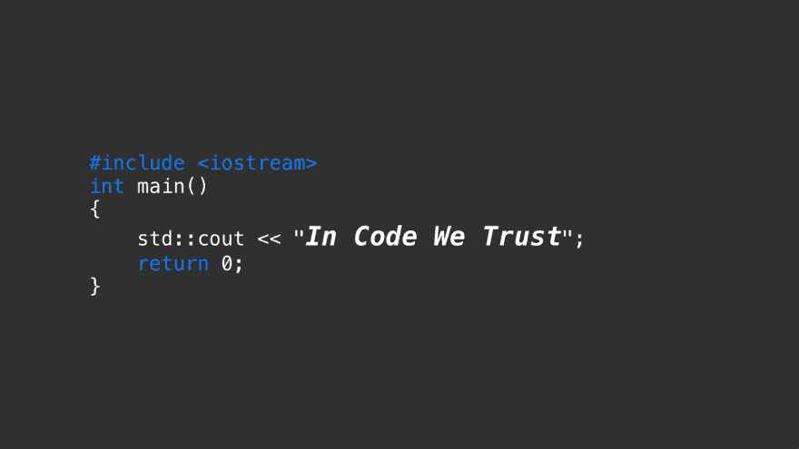
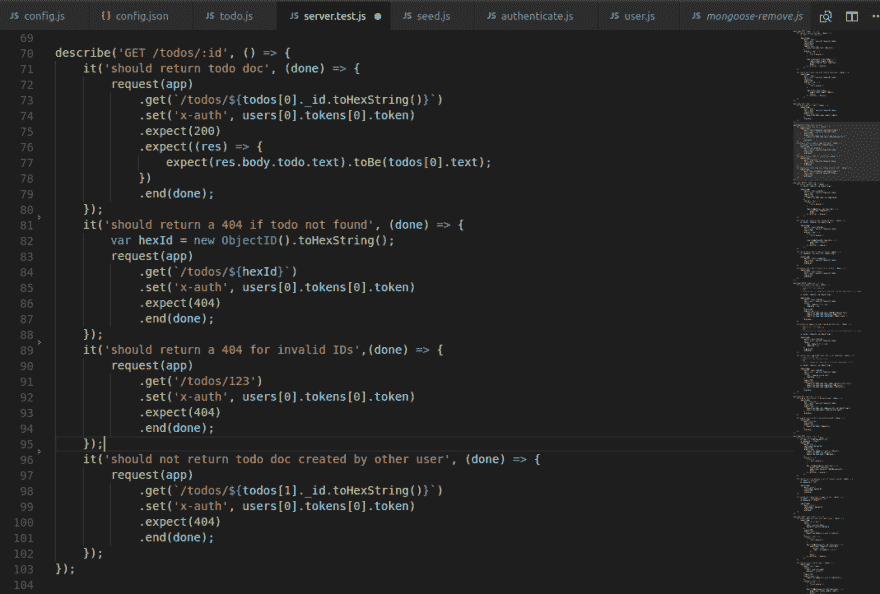
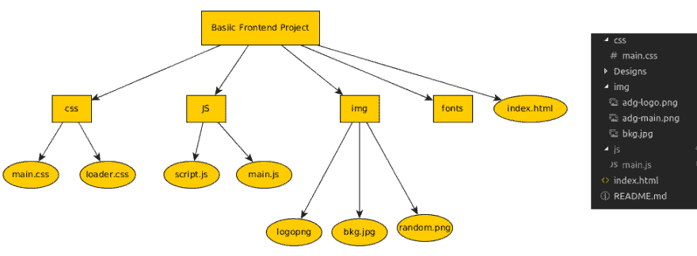
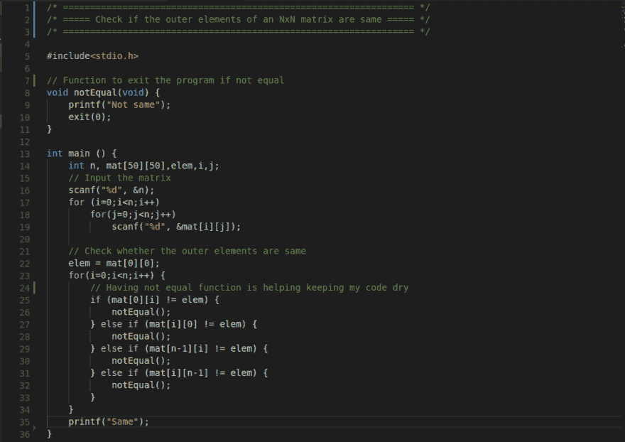
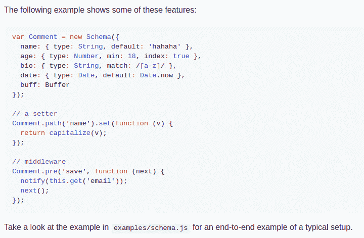
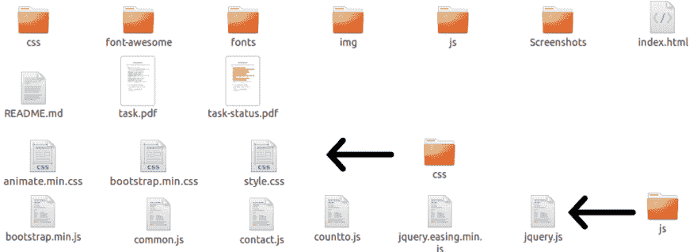

# 你不能忽视的发展礼仪

> 原文：<https://dev.to/madhavbahlmd/dev-etiquettes-that-you-must-not-ignore-1noe>

* * *

# 你绝不能忽视的  Dev **礼仪**

[](https://res.cloudinary.com/practicaldev/image/fetch/s--wWcpJ-eW--/c_limit%2Cf_auto%2Cfl_progressive%2Cq_auto%2Cw_880/https://cdn-images-1.medium.com/max/2000/1%2Agg0YLENYcyQbrs6J3gokMw.jpeg) “总是这样编码，就好像最终维护你的代码的人会是一个知道你住在哪里的暴力精神病患者”

有没有想过礼仪的真正含义是什么？为什么它们会产生？为什么它们在我们的日常生活中必不可少？

好的，我要做一个小演讲，请耐心听我讲 30 秒钟，之后我们将直奔主题。

[](https://res.cloudinary.com/practicaldev/image/fetch/s--VAUD2KJk--/c_limit%2Cf_auto%2Cfl_progressive%2Cq_auto%2Cw_880/https://cdn-images-1.medium.com/max/1600/0%2AfhtVSE20t_rYnuSk.jpg)***首先，解决问题。然后，编写代码。***—约翰·约翰逊

### 礼仪

> “社会中或特定职业或团体成员之间礼貌行为的习惯准则”

人类是群居动物，我们的首要职责是为他人着想，不要用我们不合逻辑和不礼貌的行为惹恼他们，因此，即使没有人强迫你保持行为准则，你作为一个好人也有责任保持你的礼貌行为，也就是说，如果你真的想在这个社会中和平地生活……

[](https://res.cloudinary.com/practicaldev/image/fetch/s--p-DEVZYX--/c_limit%2Cf_auto%2Cfl_progressive%2Cq_auto%2Cw_880/https://cdn-images-1.medium.com/max/1600/1%2AbhOdNJ5tBSj_2y_W_HRIPQ.png) 言归正传

### **好了，我为什么要说礼仪呢？**

是的，这对你来说可能听起来很奇怪(如果你是初学者)，我们程序员在编码时也保持一些礼仪。如果你想成为一名优秀的程序员/开发者，你一定不能忽视这些礼仪。

[](https://res.cloudinary.com/practicaldev/image/fetch/s--i15Mr-3E--/c_limit%2Cf_auto%2Cfl_progressive%2Cq_auto%2Cw_880/https://cdn-images-1.medium.com/max/1600/1%2AdUQuNsBDaBT1SYgpXf6M6Q.png) “在我们信任的代码中”

让我们来看看一些流行的开发礼仪，它们将有助于使您的代码更具可读性，结构更好，(显然比以前更好看)，并帮助您在开发人员社区中获得一些自尊。

[](https://res.cloudinary.com/practicaldev/image/fetch/s--Tl2nM2rL--/c_limit%2Cf_auto%2Cfl_progressive%2Cq_auto%2Cw_880/https://cdn-images-1.medium.com/max/1600/1%2AIkcQop8_z6QuZw_JUrw-jA.png) 写好质量代码，保持快乐:)

### 适当缩进

我见过很多初学者，在写代码的时候，他们没有记住适当的间距和缩进就开始写了。一般来说，他们的代码看起来像这样—

```
#include< iostream.h >
using namespace std;
void main() 
{
int a,b;
cout<<"Please enter a: ";
cin>>a;
cout<<"Please enter b: ";
cin>>b;
.
.
.
if(a < b)  
cout<<"a+b = "<< a+b;
else   
cout<<"a-b = "<< a-b;
} 
```

这些只有 14 行代码，所以没多大关系。但是现在想想，一段时间过去了，他们得到了一个项目。该项目可能包含 2000 行代码。想想看，代码看起来会有多乱。我甚至一想到它就害怕。
所以，根据我的看法，在`Hello, World!`程序之后，老师应该教的第一件也是最重要的事情就是如何写出一个整洁的代码。看看缩进适当的代码看起来有多漂亮。它变得像一首写得很好的诗，程序员可以很容易地阅读和理解。

[](https://res.cloudinary.com/practicaldev/image/fetch/s--yLx1oPkY--/c_limit%2Cf_auto%2Cfl_progressive%2Cq_auto%2Cw_880/https://cdn-images-1.medium.com/max/1600/1%2AIwoBJ-tyo44n8Q88SsUAdw.png) “一段写得整整齐齐的代码看起来多美”

这段代码看起来有多美，不是吗？
是的，所以让我们做个决定，“我们这些编码者，总是会给出适当的缩进”。在每个结构中给 2 或 4 个空格是当今普遍的缩进实践。此外，还有许多其他原因可以解释为什么您应该编写适当缩进的代码。适当的缩进会让你的代码更容易阅读、理解、修改和维护。

### 树状目录结构

无论何时你开始一个项目，记住一个基本的事情，你不打算在一个文件中写全部代码。你必须为不同的目的使用不同的文件。如图所示，保持适当的树状目录结构是一种很好的做法。

[T2】](https://res.cloudinary.com/practicaldev/image/fetch/s--8Ky3hzua--/c_limit%2Cf_auto%2Cfl_progressive%2Cq_auto%2Cw_880/https://cdn-images-1.medium.com/max/1600/1%2AhK3HmceEAw4ZmDf7nLO8Tg.png)

维护一个好的目录结构会使编码更加有效。当你在做一个大项目时，保持这样良好的结构将节省你搜索所需文件的时间。

### 请评论！

按照我的说法，这是最重要的编码礼仪之一。很多时候，人们只是继续写代码，匆忙完成，当他们过了一段时间(比如 1 个月)回来时，他们不知道代码是关于什么的。

[](https://res.cloudinary.com/practicaldev/image/fetch/s--4-AJ_9n1--/c_limit%2Cf_auto%2Cfl_progressive%2Cq_auto%2Cw_880/https://cdn-images-1.medium.com/max/1600/1%2ADv6_aCk8QTjUz94pS-KatQ.jpeg) “不懂自己的代码？太好了！”

为你写的每一个函数或模块写注释是一个很好的练习。这样做有助于在出现错误时调试代码。如果你对代码的每一个细节都有注释，这有助于理解代码哪里出错了，以防出现错误。

[](https://res.cloudinary.com/practicaldev/image/fetch/s--76sYLdqm--/c_limit%2Cf_auto%2Cfl_progressive%2Cq_auto%2Cw_880/https://cdn-images-1.medium.com/max/1600/1%2AotTaZoZHCErkJ-csCt4sdw.png) “好的代码是自文档化的。”

养成写注释的习惯，因为它们有助于任何人(包括你未来的自己)维护、重构或扩展你的代码。

### 记录你的代码

当你是一名开发人员时，永远不要忘记为你的代码做一个适当的文档。文档注释是为那些可能会使用你的源代码，但不太可能通读它的人准备的。

[](https://res.cloudinary.com/practicaldev/image/fetch/s--DfKQz30R--/c_limit%2Cf_auto%2Cfl_progressive%2Cq_auto%2Cw_880/https://cdn-images-1.medium.com/max/1600/0%2AVbd68YNeq8-OHeOw.jpg) 永远记录你的代码。

让我们举一个例子，假设你是一个后端开发人员，你刚刚做了一个 API(在这里阅读更多关于 API[的内容](https://en.wikipedia.org/wiki/Application_programming_interface))而一个前端开发人员喜欢将它用于一些特定的目的。现在，如果你不为你的代码写一个合适的文档，他必须阅读和浏览整个代码，这是浪费时间。为了防止这种情况，API 开发者的道德责任是为代码的工作创建和维护适当的文档。
例如，看下面的截图，它取自 [mongoosejs](https://github.com/Automattic/mongoose) 图书馆，它有令人惊叹的文档

[](https://res.cloudinary.com/practicaldev/image/fetch/s--VF_EMONZ--/c_limit%2Cf_auto%2Cfl_progressive%2Cq_auto%2Cw_880/https://cdn-images-1.medium.com/max/1600/1%2AMGsdop2LyyhmBE-_sJc1Nw.png) 这里看蒙古人的[是怎样的](http://mongoosejs.com/docs/guide.html)

### 不要只是到处叫板

如果你是一个完全的初学者，你可能不知道 foobar 是什么，像 foobar，foo，bar 和 baz 这些术语是常见的占位符，当你想不出一个合适的变量或文件的名字时就会用到。这些术语可以用来表示复杂系统或思想的任何部分，包括数据、变量、函数和命令。使用这种随意的名字是一种非常糟糕的做法，无论何时你写代码，都要记住你的变量和函数的名字必须清楚地代表它们各自的功能。

[](https://res.cloudinary.com/practicaldev/image/fetch/s--1cTlnklX--/c_limit%2Cf_auto%2Cfl_progressive%2Cq_auto%2Cw_880/https://cdn-images-1.medium.com/max/1600/0%2AkAKIQ9-JpIyaUAn6.jpg) 你的名字代表你的目的。

在测试和调试阶段，使用这样的随机名称会产生巨大的问题。没有人愿意浪费时间去寻找`foo`的用途和`bar`的用途。

### 有意义的文件名

不要给你的文件起一个随机的名字，就像变量名一样，你的文件名也必须代表它们被创建的目的。

[](https://res.cloudinary.com/practicaldev/image/fetch/s--gNG7e1F_--/c_limit%2Cf_auto%2Cfl_progressive%2Cq_auto%2Cw_880/https://cdn-images-1.medium.com/max/1600/1%2A7P3LwZid7bCsKYJe6CwQpw.png) 你的文件名应该可以理解

实际上，存在几种文件命名约定，这是推荐的，您应该遵循它们。但是即使你不能完全遵循它们，至少要以你能理解的方式保存文件名。不要保存文件名，如:`xyz.md`或`abc.txt`

> 文件命名约定(FNC)可以帮助您保持有序，因为它可以轻松地从标题中识别包含您要查找的信息的文件，并将包含相似信息的文件组合在一起。一个好的 FNC 还可以帮助其他人更好地理解和浏览你的作品。 [**在此阅读更多**](http://guides.lib.purdue.edu/c.php?g=353013&p=2378293)

### 选择您的案例类型

按照字体来命名你的变量总是一个很好的练习。选择你的案件类型，并始终写在这种情况下的名称，使他们变得更加清晰和可读。比如我一直用骆驼格。

看看一些流行的案例类型:

1.  **大写** —将单词的第一个字母大写，其余字母小写。
2.  **PascalCase —** 单词不加空格书写，每个单词首字母大写。PascalCase 有时也称为 UpperCamelCase。
3.  **camel Case**—Pascal 大小写的一种变体，其中单词的第一个字母是小写的，例如 iPhone。
4.  **snake_case** —标点符号被删除，空格被替换为单下划线。可以用大写或小写来完成，但无论使用哪一种都应该继续使用。

> 仅仅因为你能写程序并不意味着你是一个好的程序员，写一个外行也能理解的代码才是你成为一个好的程序员的原因

### 保持你的代码干燥

什么是干代码？DRY 是不要重复自己的缩写。如果你在做一个项目或者一个软件的时候不得不多次复制粘贴代码，那你根本就不是一个好的开发者。多次重复相同的代码行被认为是非常糟糕的编码实践。

[](https://res.cloudinary.com/practicaldev/image/fetch/s--Ya2tXcRc--/c_limit%2Cf_auto%2Cfl_progressive%2Cq_auto%2Cw_880/https://cdn-images-1.medium.com/max/1600/0%2A-v5er932CjzpQfp6.jpg) 我就不重复了:)

代码可以保持干燥，随着功能的广泛使用。每当你看到你在重复同样的代码行，就把它变成一个函数。保持代码干燥有很多好处，比如保持代码干净，减少出错的机会。
*“虫子喜欢湿湿的一团”——未知*

**干代码保持模块化**你甚至可以把程序的主要目的分成几个更小的功能，分别去做。它有助于管理大型项目。

### 选择一些常用的编码约定怎么样？

**编码惯例**是一套针对特定编程语言的指导方针，为用该语言编写的程序的每个方面推荐编程风格、实践和方法。
为你的项目选择一个编码约定，并坚持下去……**总是**在这里找到更多关于编码约定[的信息。](https://en.wikipedia.org/wiki/Coding_conventions)

### 玩得开心！

这是编程最重要的部分，无论你写什么程序，开发什么软件，都要开心。编码很神奇，让它成为你的日常习惯，你会发现它有多神奇。如果你写代码时没有乐趣，这将清楚地反映在你的代码中:)

* * *

### 结束语

我希望这篇文章对你有所帮助，我们可以在 [GitHub](https://github.com/MadhavBahlMD) 或 [LinkedIn](https://www.linkedin.com/in/madhavbahl/) 上联系，如果你发送反馈、建议或询问，我会非常高兴。此外，我喜欢结交新朋友，我们可以成为朋友，只需给我发短信:)
以防你想成为一名 web 开发人员，[看看这篇文章](https://medium.com/@madhavbahl10/a-practical-approach-to-web-development-1ee37a4ad829)，我写这篇文章是为了提供一个如何开始和继续 web 开发的清晰路线图。我们也有一个开放的社区来聚集开发人员，这样我们可以一起学习和成长，今天就加入 [Slack Workspace](https://codetoexpress.slack.com/join/shared_invite/enQtNDUwNzg0NDI1MzAwLWZiODY3OGZkZjdkZDA2MWNmMjFiNTY2MDlmMDg5ZGVjMzc5NDQ5OWU0NjEyNWZiM2Y4MmZmYmM0ZmQ3NjJmYWI) 。

想在 medium 上看这篇文章？[点击这里](https://medium.com/codeburst/dev-etiquettes-that-you-must-not-ignore-619e1bb490b8)

> 非常感谢你保持冷静，一直读到最后。
> 现在你知道了要写出好的代码都要采用哪些做法，
> 一切都好，快乐编码！【有任何疑问或者需要帮助的话可以联系我:
> 邮箱:[madhavbahl10@gmail.com](mailto:madhavbahl10@gmail.com)
> 网页:[http://madhavbahl.ml/](http://madhavbahl.ml/)
> Github:[https://github.com/MadhavBahlMD](https://github.com/MadhavBahlMD)
> LinkedIn:[https://www.linkedin.com/in/madhavbahl/](https://www.linkedin.com/in/madhavbahl/)