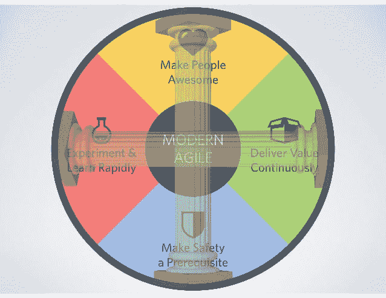

# DEV3L on Agile2016 主题演讲-现代敏捷

> 原文：<https://dev.to/dev3l/dev3l-on-agile2016-keynote---modern-agile-1enh>

[Agile2016 主题演讲 Joshua Kerievsky 的现代敏捷](https://www.agilealliance.org/resources/videos/modern-agile/)

* * *

Joshua Kerievsky 优雅地解释了他对现代敏捷的看法。

* * *

这是一个关于现代敏捷的基本原则的演讲。

[T2】](https://res.cloudinary.com/practicaldev/image/fetch/s--7jdu3Zv9--/c_limit%2Cf_auto%2Cfl_progressive%2Cq_auto%2Cw_880/https://thepracticaldev.s3.amazonaws.com/i/bqrykt33sq6otyoyirhq.jpg)

车轮的轴线有意与丰田路的两根柱子对齐。

*   **尊重人**(横)
*   **持续改进**(垂直)

* * *

# 现代敏捷原则

### 让人敬畏

> 秘制调味酱

*   **我们不仅要关注我们的用户，还要关注我们生态系统中的每一个人**
*   每个人都很棒
*   想想你的生态系统中的所有参与者...关注他们
*   **子弹头列车思维**
*   牛逼的理论定义
*   你还不知道怎么去那里
*   **乌合之众编程/结对让团队成员很棒**
*   难以置信的学习机会

### 把安全作为先决条件

> 快乐的奶牛产出更多的牛奶

*   "团队成员觉得冒险是安全的，在彼此面前是脆弱的."
*   "如果你有一种恐惧的文化，你的任何花哨的实践或过程都不会对你有所帮助."
*   自动化测试是软件的安全网
*   **Project Aristotle*: 2 年研究，200 多个团队访谈，180 多个活跃团队**
*   => #高绩效团队的第一属性

### 实验&快速学习

> 精益创业是改变行业的黑天鹅

*   **最大化超出可预测性的未完成工作量**
*   “智慧永远不会过时”
*   鼓励每天花一个小时去试验和建立一些有用的东西
*   **快速迭代，了解问题域是什么**
*   “问题是我们不知道问题出在哪里。”保罗·麦克里迪
*   "严格地从失败中提取价值."- HBR 文章
*   无可指责的回顾
*   “我们现在正在处理更大的失败。”——杰夫·贝索斯亚马逊 CEO——fire phone 故障

### 持续传递价值

> 交付速度如此之快，以至于客户无法改变主意

*   转向可变长度迭代(冲刺->连续流)
*   开始移除评估
*   开始更频繁地部署(手动构建->持续部署)
*   速度解放了！
*   数百万用户每天部署 50 次...让部署变得安全！
*   摆脱质量保证，转移到质量工程师
*   Amazon 每 12 秒部署一次生产

* * *

# 心理安全会议提示

*   鼓励每个人做出贡献
*   相互倾听
*   回顾/重复他人的观点
*   避免支配或打断
*   关心他人，保持好奇心，不做评判
*   永远不要把员工置于失败的边缘
*   人不怕失败，就怕被指责

* * *

# 古老的(不是现代的)敏捷实践

> “SprintCare 老年生活”
> 
> *   给敏捷一个光荣的退休

Josh 讲述了一个他与一位他尊敬的产品负责人交谈的趣闻。这个人拥有所有传统敏捷商店的工件:sprint burdown 图表和各种发布计划...在探究这是如何工作的时候，这个人说他们没有使用这些。

看着这些旧东西就像看着一台又大又重的笔记本电脑...这就是老的敏捷过程。然后，他继续讨论在固定长度迭代结束时出现的迷你瀑布。顾客决定事情何时完成。

简化任务，而不是使用辅助轮。他举了一个试着学骑自行车的例子。与其教孩子如何骑带辅助轮的自行车，不如先教孩子骑自行车而不用担心叫卖。动人心弦的...Scrum 正在为敏捷训练轮子。

*   “速度正在扼杀敏捷！”吉姆·海史密斯
*   “我可能发明了点数。如果我做了，我现在很抱歉。”罗恩·杰弗里斯
*   "非常古老的概念，产品所有者接受被认为已经完成的东西."