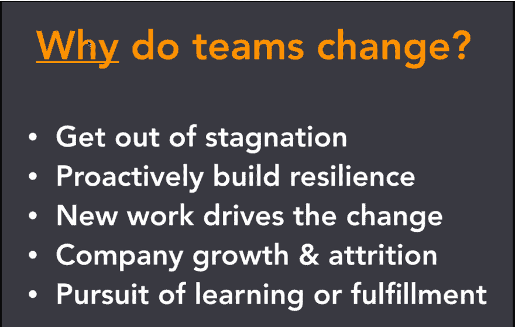

# 快速成长公司的动态再培训

> 原文：<https://dev.to/dev3l/dev3l-on-dynamic-reteaming-at-fast-growing-companies-3c1d>

> “这是关于掌握改变的能力。”

[T2】](https://res.cloudinary.com/practicaldev/image/fetch/s--tfNfGYfd--/c_limit%2Cf_auto%2Cfl_progressive%2Cq_auto%2Cw_880/https://thepracticaldev.s3.amazonaws.com/i/2cz3129q84dlqlh9e1bv.png)

*@heidihelfand*

* * *

## Reteam 分享专业知识！

当一个人改变团队时，他/她给团队带来了新的信息和观点！

#### 这可以通过让任何团队都可以做任何事情来实现！

*   需要多面手
*   集体所有制
*   有意地让团队从不同的领域工作
    *   你如何处理技术蔓延？
    *   Stuartship
    *   “用，不为”-> DevOps 原理

#### 导师——“第一对”

*   通过结对编程实现团队整合
    *   使用结对编程作为指导方法
    *   使用结对编程来共享文化
    *   传播信息
*   切换/动态配对

#### 变化是生生不息

*   有时候你需要解散你的团队，人，组织
*   释放囚犯

## 重新训练模式

**主动**:

*   有丝分裂模式
*   隔离再训练模式
*   重新安排事件-更新
*   有丝分裂

**无功**:

*   人们会离开
*   人们会加入