# 用 C#为初学者开发一个直线机器人第 2 部分:给你的机器人添加人工智能

> 原文：<https://dev.to/kenakamu/develop-a-line-bot-in-c-for-beginner-part-2--adding-ai-to-your-bot--2b5d>

在本文中，我将为您的机器人添加智能。如果你错过了本系列的第 1 部分，你可以在这里阅读

# 本文议程

*   设置您的语言理解智能服务(LUIS)并创建应用程序。
*   集成你的机器人与路易斯应用程序。
*   增强你的机器人根据意图回复。

好了，我们开始吧！

# 路易斯

LUIS 是微软认知服务之一，它可以将自然语言解析成
意图和实体。

1.登录 LUIS。您可以使用与您的 Azure 订阅相同的帐户登录，
[LUIS https://www . LUIS . ai](https://www.luis.ai)

2.单击“创建新应用程序”并设置如下值。名字:Contoso Burger LUIS
-文化:英语

3.首先，添加一个实体。实体是你想从句子中提取的关键字。单击左侧的实体，然后单击创建新实体。

[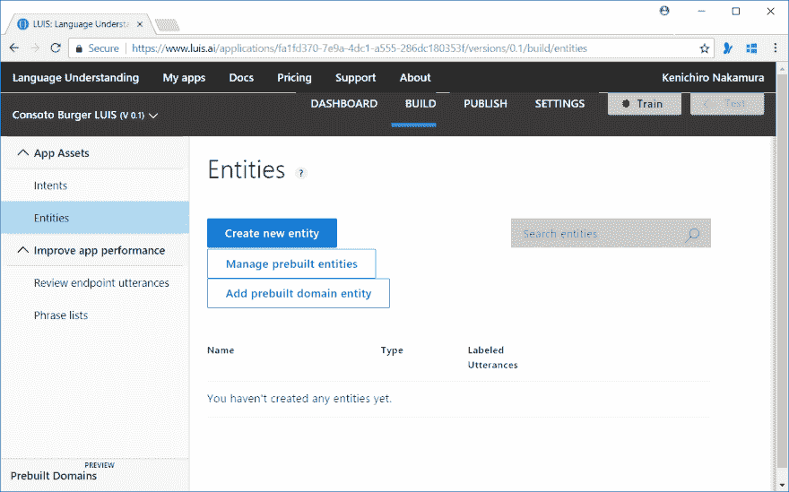T2】](https://res.cloudinary.com/practicaldev/image/fetch/s--YiVzoCIL--/c_limit%2Cf_auto%2Cfl_progressive%2Cq_auto%2Cw_880/https://thepracticaldev.s3.amazonaws.com/i/5401ys3zuho5xy373lhp.PNG)

4.将菜单设置为名称，并键入 Simple。

[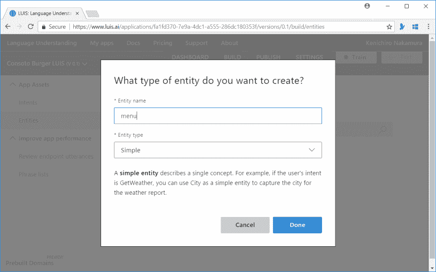T2】](https://res.cloudinary.com/practicaldev/image/fetch/s--8zcXYeeB--/c_limit%2Cf_auto%2Cfl_progressive%2Cq_auto%2Cw_880/https://thepracticaldev.s3.amazonaws.com/i/565a5bjz5tam49nxr039.PNG)

5.接下来，添加一个意图。意图是整个句子的意思。点击左侧菜单中的意向，然后点击“创建新意向”。命名为“秩序”。

6.现在，你需要至少 5 个例句。输入“我想要一个奶酪汉堡”，然后点击回车。然后选择“奶酪汉堡”并将其设置为菜单实体。要做到这一点，首先左键单击“奶酪”，然后我们你会看到上下文菜单弹出，移动鼠标到右边的“buger”，再次左键单击，然后单击“菜单”。

[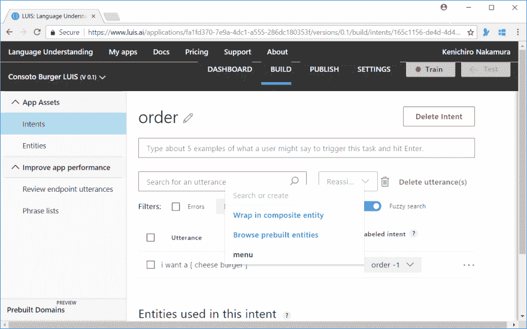T2】](https://res.cloudinary.com/practicaldev/image/fetch/s--1DlyKtKy--/c_limit%2Cf_auto%2Cfl_progressive%2Cq_auto%2Cw_880/https://thepracticaldev.s3.amazonaws.com/i/yrwpfw5rnccnxpsigrav.PNG)

7.“芝士汉堡”转化为“菜单”。

[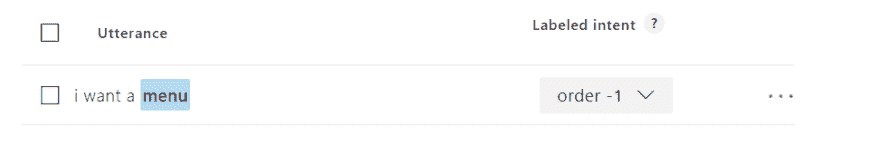T2】](https://res.cloudinary.com/practicaldev/image/fetch/s--Xf73IFBp--/c_limit%2Cf_auto%2Cfl_progressive%2Cq_auto%2Cw_880/https://thepracticaldev.s3.amazonaws.com/i/ipbjmtoys0td0gepbv1d.PNG)

8.至少再输入四个类似的话语。

9.创建另一个意图作为“问候”。

10.输入至少五个问候语，如你好、嗨、晚上好等。

11.点击右上角的“培训”按钮，让 LUIS 了解您的意图。

目前就这些。

## 发布 LUIS 并获取访问密钥

1.训练完成后，选择顶部的“发布”菜单。

[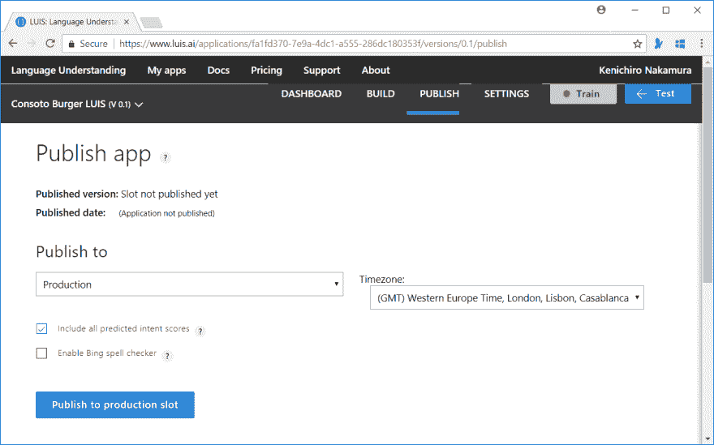T2】](https://res.cloudinary.com/practicaldev/image/fetch/s--8X1XG_hE--/c_limit%2Cf_auto%2Cfl_progressive%2Cq_auto%2Cw_880/https://thepracticaldev.s3.amazonaws.com/i/kxly2avbi0eyw20g8ecq.PNG)

2.单击“发布到生产插槽”以发布它。

3.复制底部的“密钥字符串”。

4.选择设置选项卡，并在设置页面中复制“应用程序 ID”。

# 将 LUIS 添加到您的机器人中

1.在 Visual Studio 代码中打开集成终端。

2.运行以下命令添加 NuGet 包。

```
dotnet add package microsoft.cognitive.luis
dotnet restore 
```

Enter fullscreen mode Exit fullscreen mode

3.LineBotApp.cs 中添加 using 语句

```
using Microsoft.Cognitive.LUIS; 
```

Enter fullscreen mode Exit fullscreen mode

4.在构造函数前添加以下属性。将 AppId 和密钥 appKey 更新到您的 LUIS。

```
private LuisClient luisClient = new LuisClient(
            appId: "fa1fd370-7e9a-4dc1-a555-286dc180353f", 
            appKey: "4501df87a8944328b3bd07ed8adb6508"); 
```

Enter fullscreen mode Exit fullscreen mode

5.使用以下代码更新 HandleTextAsync 方法。

```
private async Task HandleTextAsync(string replyToken, string userMessage, string userId)
{  
    var replyMessage = new TextMessage($"You said: {userMessage}");
    // Analyze the input via LUIS
    var luisResult = await luisClient.Predict(userMessage);
    if(luisResult.TopScoringIntent.Name == "greeting")
    {
        replyMessage.Text = "Welcome to Contoso Burger!"; 
    }
    else if(luisResult.TopScoringIntent.Name == "order")
    {
        // If menu is specified.
        if(luisResult.Entities.ContainsKey("menu"))
        {
            replyMessage.Text = $"You order is {luisResult.Entities["menu"].First().Value}.";
        }
        else
        {
            replyMessage.Text = "Welcome to Contoso Burger! What do you want to order?"; 
        }
    }

    await messagingClient.ReplyMessageAsync(replyToken, new List<ISendMessage> { replyMessage });
} 
```

Enter fullscreen mode Exit fullscreen mode

6.获取 luisResult 后放置断点，并按 F5 开始调试。

[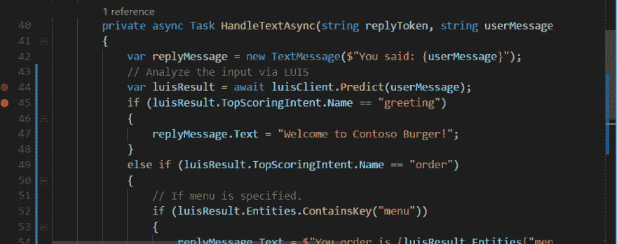T2】](https://res.cloudinary.com/practicaldev/image/fetch/s--LHYVXWC_--/c_limit%2Cf_auto%2Cfl_progressive%2Cq_auto%2Cw_880/https://thepracticaldev.s3.amazonaws.com/i/op3bw7zsiqkxggw9hmd8.PNG)

7.从模拟器发送问候。一旦断点命中，则确认 luisResult 的数据。

[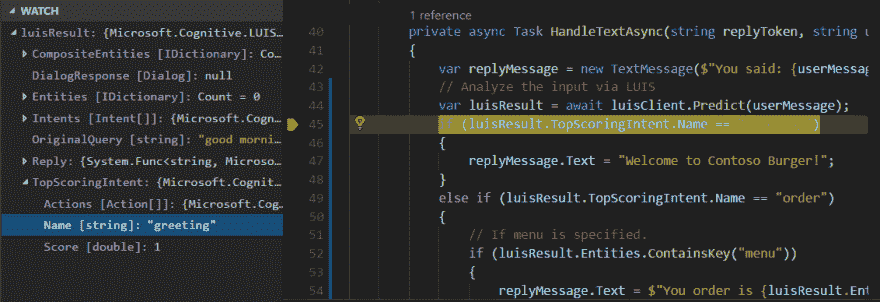T2】](https://res.cloudinary.com/practicaldev/image/fetch/s--ZHQ1yZfk--/c_limit%2Cf_auto%2Cfl_progressive%2Cq_auto%2Cw_880/https://thepracticaldev.s3.amazonaws.com/i/3lk8dw6m2tv334ggyvsq.PNG)

8.发送“请来一个奶酪汉堡”并确认它被归类为“订单”并且菜单包含“奶酪汉堡”。

[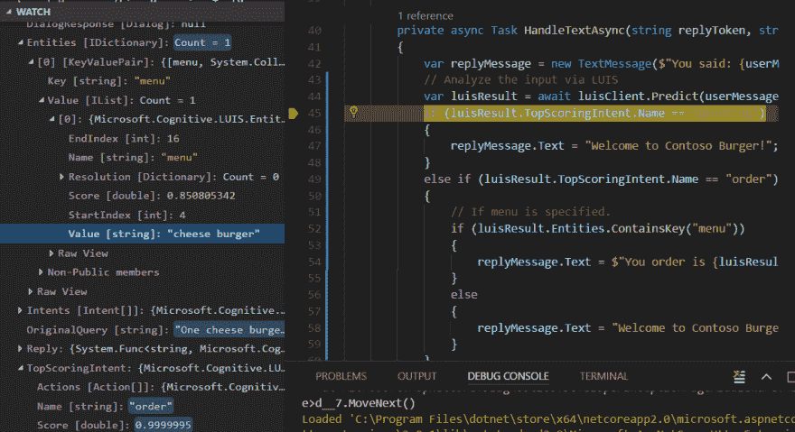T2】](https://res.cloudinary.com/practicaldev/image/fetch/s--puXPxbyh--/c_limit%2Cf_auto%2Cfl_progressive%2Cq_auto%2Cw_880/https://thepracticaldev.s3.amazonaws.com/i/8g52b54mie3bfvdp2bbw.PNG)

# 改善谈话流程

目前看来效果不错。但是顾客现在可以点任何东西，比如“我想点一个苹果”。LUIS 提供了其他类型的实体和“列表”类型，如果你已经知道菜单的话效果会更好。

1.回到 LUIS，转到 BUILD 选项卡-> Entities。

2.选择已有的菜单实体，点击“删除实体”。

3.然后“创建新实体”。这一次，选择“列表”类型。

[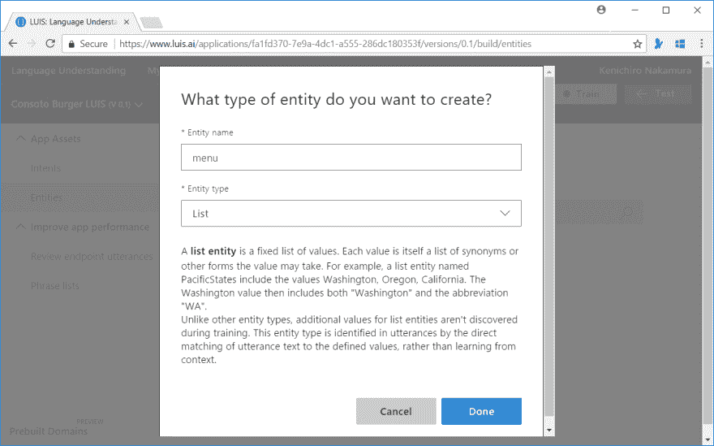T2】](https://res.cloudinary.com/practicaldev/image/fetch/s--6XLNJgrZ--/c_limit%2Cf_auto%2Cfl_progressive%2Cq_auto%2Cw_880/https://thepracticaldev.s3.amazonaws.com/i/smnr1kdcnv7rmxngvtaa.PNG)

4.在列表中输入“奶酪汉堡”、“普通汉堡”、“蔬菜汉堡”、“神奇汉堡”。也可以添加同义词。

[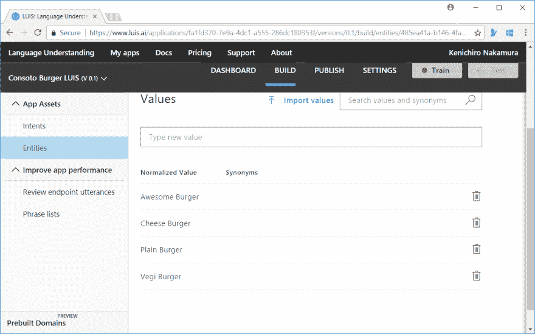T2】](https://res.cloudinary.com/practicaldev/image/fetch/s--PwQbAAAm--/c_limit%2Cf_auto%2Cfl_progressive%2Cq_auto%2Cw_880/https://thepracticaldev.s3.amazonaws.com/i/jw19ui1q19tjujw35xw7.PNG)

5.点击训练按钮并重新学习。与简单类型不同，您不必指定在发音中要显示哪些单词。培训完成后，发布它。

6.更新 HandleTextAsync 以处理未找到菜单实体的情况。

```
private async Task HandleTextAsync(string replyToken, string userMessage, string userId)
{  
    ISendMessage replyMessage = new TextMessage("");
    // Analyze the input via LUIS
    var luisResult = await luisClient.Predict(userMessage);
    if(luisResult.TopScoringIntent.Name == "greeting")
    {
        replyMessage = new TextMessage("Welcome to Contoso Burger!"); 
    }
    else if(luisResult.TopScoringIntent.Name == "order")
    {
         // If menu is specified.
        if(luisResult.Entities.ContainsKey("menu"))
        {
             replyMessage = new TextMessage($"You order is {luisResult.Entities["menu"].First().Value}.");
        }
        else
        {
            // If no menu is specified, then shows them using buttons.
            replyMessage = new TemplateMessage("menu", new ButtonsTemplate(
                title: "menu",
                text: "Which burger you want to eat?",
                actions: new List<ITemplateAction>(){
                    new MessageTemplateAction("Cheese Burger", "cheese"),
                    new MessageTemplateAction("Plain Burger","plain"),
                    new MessageTemplateAction("Vegi Burger","vegi"),
                    new MessageTemplateAction("Awesome Burger","awesome"),
                }));
        }
    }

    await messagingClient.ReplyMessageAsync(replyToken, new List<ISendMessage> { replyMessage });
} 
```

Enter fullscreen mode Exit fullscreen mode

7.重启调试器，发送“我想点个汉堡”。你可以看到按钮模板被返回。

[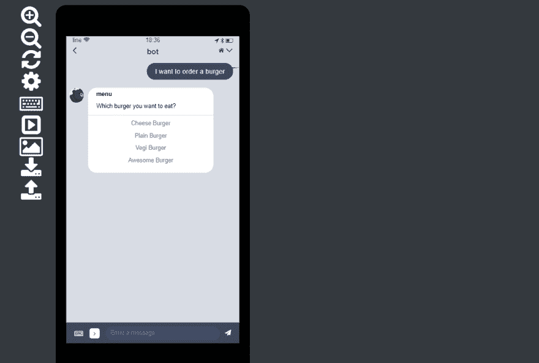T2】](https://res.cloudinary.com/practicaldev/image/fetch/s--8631mHJX--/c_limit%2Cf_auto%2Cfl_progressive%2Cq_auto%2Cw_880/https://thepracticaldev.s3.amazonaws.com/i/wf3c4xyg8wjvmsf2ygiq.PNG)

8.接受订单部分看起来没问题。接下来让我们实现询问送货地址。但在这样做之前，我们需要编写一个代码来存储这个用户的订单，否则 bot 会忘记订单。有很多方法可以实现这一点，但是模板默认包含 Azure 存储集成，所以让我们使用它。在 Models 文件夹中添加 Order.cs。

##### Order.cs

```
using Microsoft.WindowsAzure.Storage.Table;

namespace contosoburgerbot.Models
{
    public class Order : EventSourceState
    {
        public string Menu { get; set; }
        public string Location_Address { get; set; }
        public string Location_Title { get; set; }

        public Order() 
        {
            SourceType = "order";
        }
    }
} 
```

Enter fullscreen mode Exit fullscreen mode

9 更新控制器 LineBotControllers.cs，让存储处理订单模型。

```
public async Task<IActionResult> Post([FromBody]JToken req)
{ 
    var events = WebhookEventParser.Parse(req.ToString());
    var connectionString = appsettings.LineSettings.StorageConnectionString;
    var blobStorage = await BlobStorage.CreateAsync(connectionString, "linebotcontainer");
    var orderState = await TableStorage<Order>.CreateAsync(connectionString, "eventsourcestate");
    var app = new LineBotApp(lineMessagingClient, orderState, blobStorage);
    await app.RunAsync(events);
    return new OkResult();
} 
```

Enter fullscreen mode Exit fullscreen mode

10 更新 LineBotApp.cs，以便 bot 可以将订单存储到存储中。

*   添加属性和构造函数来处理 order 对象。
*   添加处理位置消息的方法。
*   在 HandleTextAsync 方法中添加保存顺序和处理位置消息的逻辑。顺便说一下，我使用 [URL Scheme](https://developers.line.me/ja/docs/messaging-api/using-line-url-scheme/#opening-the-location-screen) 自动启动地图来选择位置。这是 LINE app 的一个很好的功能。

```
using Line.Messaging;
using Line.Messaging.Webhooks;
using System;
using System.Collections.Generic;
using System.IO;
using System.Linq;
using System.Threading.Tasks;
using contosoburgerbot.CloudStorage;
using contosoburgerbot.Models;
using Microsoft.Cognitive.LUIS;

namespace contosoburgerbot
{
    internal class LineBotApp : WebhookApplication
    {
        private LineMessagingClient messagingClient { get; }
        private TableStorage<Order> orderState { get; }
        private BlobStorage blobStorage { get; }
        private LuisClient luisClient = new LuisClient(
            appId: "fa1fd370-7e9a-4dc1-a555-286dc180353f",
            appKey: "4501df87a8944328b3bd07ed8adb6508");

        public LineBotApp(LineMessagingClient lineMessagingClient, TableStorage<Order> tableStorage, BlobStorage blobStorage)
        {
            this.messagingClient = lineMessagingClient;
            this.orderState = tableStorage;
            this.blobStorage = blobStorage;
        }

        protected override async Task OnMessageAsync(MessageEvent ev)
        {
            switch (ev.Message.Type)
            {
                case EventMessageType.Text:
                    await HandleTextAsync(ev.ReplyToken, ((TextEventMessage)ev.Message).Text, ev.Source.UserId);
                    break;
                case EventMessageType.Location:
                    var location = ((LocationEventMessage)ev.Message);
                    await HandleLocationAsync(ev.ReplyToken, location, ev.Source.Id);
                    break;
            }
        }

        private async Task HandleLocationAsync(string replyToken, LocationEventMessage location, string userId)
        {
            // Get an order
            var order = await orderState.FindAsync("order", userId);
            // Save the address first
            order.Location_Address = location.Address;
            order.Location_Title = location.Title;
            await orderState.UpdateAsync(order);
            await messagingClient.ReplyMessageAsync(replyToken, new[] {
                        new TextMessage($"Thanks! We will deliver {order.Menu}to {order.Location_Title}!!")
                    });
        }

        private async Task HandleTextAsync(string replyToken, string userMessage, string userId)
        {
            ISendMessage replyMessage = new TextMessage("");

            // Analyze the input via LUIS
            var luisResult = await luisClient.Predict(userMessage);
            if (luisResult.TopScoringIntent.Name == "greeting")
            {
                replyMessage = new TextMessage("Welcome to Contoso Burger!");
            }
            else if (luisResult.TopScoringIntent.Name == "order")
            {
                // If menu is specified.
                if (luisResult.Entities.ContainsKey("menu"))
                {
                    // Save the order in Azure storage
                    var menu = luisResult.Entities["menu"].First().Value;
                    var order = new Order(){ Menu = menu, SourceId = userId };
                    await orderState.UpdateAsync(order);
                    // Send URL scheme to check delivery address.
                    replyMessage = new TemplateMessage("location", new ButtonsTemplate(
                        title: "Send address",
                        text: $"Thanks for order. Please give me the delivery address.",
                        actions: new List<ITemplateAction>(){
                            new UriTemplateAction("Send address","line://nv/location")
                            }));
                }
                else
                {
                     // If no menu is specified, then shows them using buttons.
                    replyMessage = new TemplateMessage("menu", new ButtonsTemplate(
                        title: "menu",
                        text: "Which burger you want to eat?",
                        actions: new List<ITemplateAction>(){
                            new MessageTemplateAction("Cheese Burger", "cheese"),
                            new MessageTemplateAction("Plain Burger","plain"),
                            new MessageTemplateAction("Vegi Burger","vegi"),
                            new MessageTemplateAction("Awesome Burger","awesome"),
                        }));
                }
            }

            await messagingClient.ReplyMessageAsync(replyToken, new List<ISendMessage> { replyMessage });
        }
    }
} 
```

Enter fullscreen mode Exit fullscreen mode

# 部署到 Azure 并最终测试

1.运行以下命令提交并推送到 Azure。

```
git add .
git commit -m update
git push 
```

Enter fullscreen mode Exit fullscreen mode

2.推送完成后，使用您的移动设备测试应用程序。

希望一切顺利:)

# 总结

在本文中，我们通过使用 LUIS 和 Azure Storage 为机器人添加了智能。当然，你需要不断改进机器人来处理你的各种输入！

# 参考文献

*   [消息 API - SDK](https://developers.line.me/en/docs/messaging-api/line-bot-sdk/)
*   [消息 API -社区 SDK - C#](https://github.com/pierre3/LineMessagingApi)
*   [针对 BOT 开发者的线路模拟器](https://www.npmjs.com/package/line-simulator)
*   [线条丰富的菜单管理器](https://www.npmjs.com/package/line-richmenus-manager)
*   [LINE Bot 模板](https://www.npmjs.com/package/generator-line-bot)
*   [机器人快递](https://github.com/nkjm/bot-express)