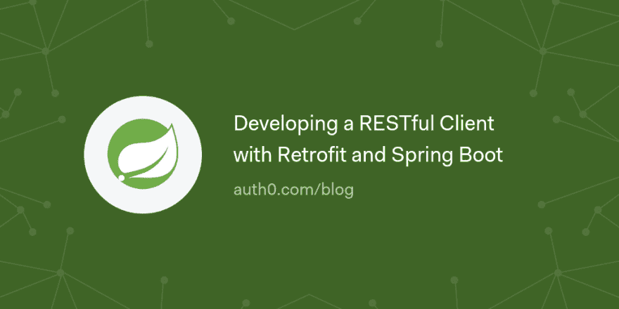

# 用翻新和 Spring Boot 开发 RESTful 客户端

> 原文：<https://dev.to/auth0/developing-a-restful-client-with-retrofit-and-spring-boot--5c0h>

在本文中，您将学习如何使用 Retrofit(一个 HTTP 客户端库)和 Spring Boot 为 RESTful API 创建一个客户端。您将使用 Spring Boot 及其 RestController 功能以及改型来开发一个基于 GitHub API 的门面。您还将学习如何使用 Google 的 Gson 库将 JSON 转换成 POJOs(普通 Java 对象),最后但同样重要的是，您将学习如何利用 RESTful API 的文档。

[读下去🍃](https://auth0.com/blog/developing-a-restful-client-with-retrofit-and-spring-boot/?utm_source=dev&utm_medium=sc&utm_campaign=retrofit_spring)

[T2】](https://res.cloudinary.com/practicaldev/image/fetch/s--ZcEjW71g--/c_limit%2Cf_auto%2Cfl_progressive%2Cq_auto%2Cw_880/https://thepracticaldev.s3.amazonaws.com/i/ynvz5csmrop0c7v6yrqu.png)