# 用 Visual Studio 代码开发 C++

> 原文：<https://dev.to/acharluk/developing-c-with-visual-studio-code-4pb9>

欢迎来到我的第一篇帖子！我将向你展示我是如何使用 [Visual Studio 代码](https://code.visualstudio.com/)以及 [C++](https://marketplace.visualstudio.com/items?itemName=ms-vscode.cpptools) 和 [Easy C++项目](https://marketplace.visualstudio.com/items?itemName=ACharLuk.easy-cpp-projects)扩展来开发 C++的。

## 下载 Visual Studio 代码

首先，我们需要一个代码编辑器或 IDE，我个人喜欢 Visual Studio Code(简称 VSC ),因为它像 Sublime 一样轻量级，但有一些我喜欢的 IDE 的功能，特别是智能感知。你可以在这里下载 Visual Studio 代码[，你会登陆这样一个页面:
](https://code.visualstudio.com/)[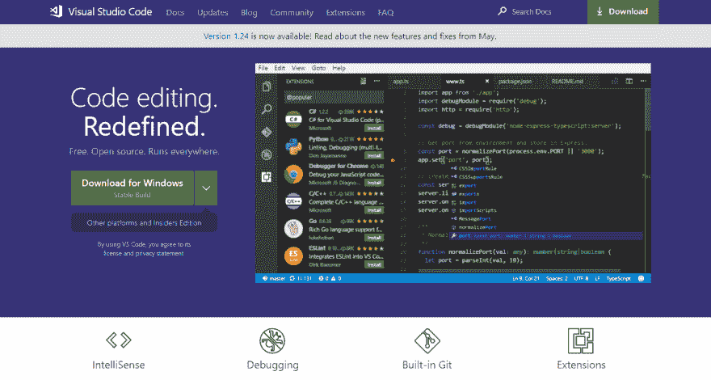](https://res.cloudinary.com/practicaldev/image/fetch/s--_Silqx57--/c_limit%2Cf_auto%2Cfl_progressive%2Cq_auto%2Cw_880/https://raw.githubusercontent.com/acharluk/UsefulStuff/master/programming/C%2B%img/1/1_vscode_website.png) 
点击下载按钮，等待几秒钟下载开始。

* * *

## 为 C++开发设置 VSC

第一次打开 VSC 时，你会看到一个欢迎窗口。VSC 有一个非常简单的布局:左边的一个栏有 5 个按钮(文件资源管理器，查找，Git 集成，调试，扩展)，底部有一个状态栏和一个编辑标签窗口。点击最后一个按钮打开
[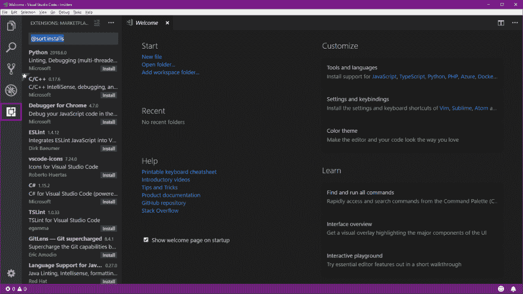](https://res.cloudinary.com/practicaldev/image/fetch/s--2PfYlUyd--/c_limit%2Cf_auto%2Cfl_progressive%2Cq_auto%2Cw_880/https://raw.githubusercontent.com/acharluk/UsefulStuff/master/programming/C%2B%img/1/2_searching_extensions.png)

为了开发 C++，我们将安装两个扩展，第一个是 C/C++，已经在最后一个图中显示了，要安装它，只需点击绿色按钮`Install` :
[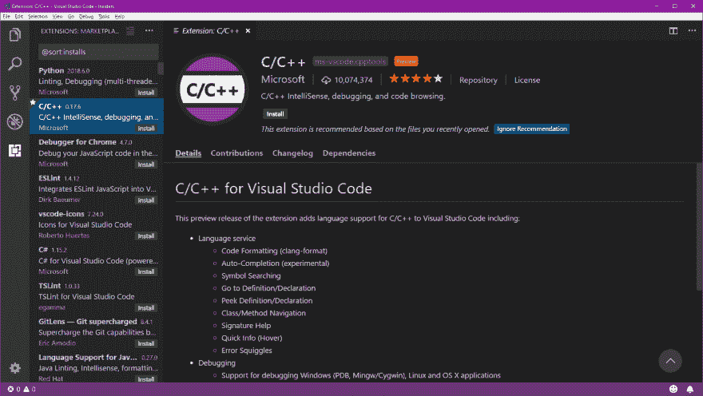](https://res.cloudinary.com/practicaldev/image/fetch/s--B2HAFyKB--/c_limit%2Cf_auto%2Cfl_progressive%2Cq_auto%2Cw_880/https://raw.githubusercontent.com/acharluk/UsefulStuff/master/programming/C%2B%img/1/3_cpp_extension_install.png)

然后我们会搜索“easy c++”然后安装名为“Easy C++ Projects”的扩展
[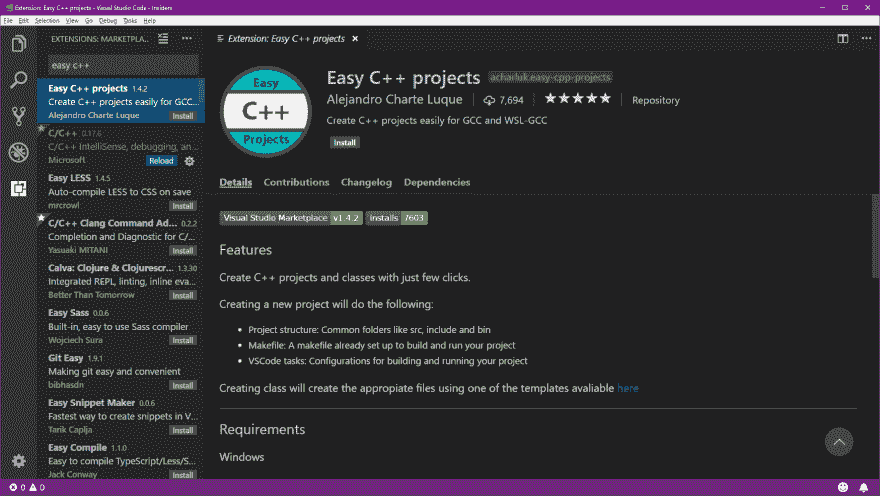](https://res.cloudinary.com/practicaldev/image/fetch/s--5Ipp_BRO--/c_limit%2Cf_auto%2Cfl_progressive%2Cq_auto%2Cw_880/https://raw.githubusercontent.com/acharluk/UsefulStuff/master/programming/C%2B%img/1/4_easy_cpp_extension_install.png)

* * *

## 环境设置完成

安装完扩展后，会出现一个蓝色按钮`Reload`，点击它会重新加载窗口并激活我们刚刚安装的扩展，如下图:
[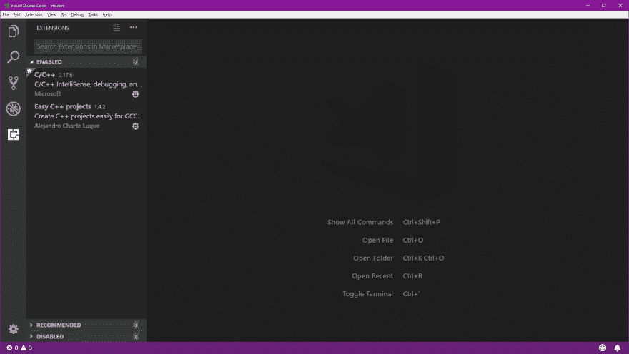](https://res.cloudinary.com/practicaldev/image/fetch/s--ohlBVV4x--/c_limit%2Cf_auto%2Cfl_progressive%2Cq_auto%2Cw_880/https://raw.githubusercontent.com/acharluk/UsefulStuff/master/programming/C%2B%img/1/5_extensions_installed.png)

干得好！现在我们有了一个开发我们第一个 C++项目的环境！

* * *

# 用 Visual Studio 代码创建我们的第一个 C++项目！

在为 C++开发设置了 VSC 之后，我们只需要创建一个新项目！这是通过几个步骤完成的:

## 为项目创建文件夹

要为项目设置文件夹，进入文件>打开文件夹(或者按[Ctrl+K Ctrl+O])，会弹出这样一个对话框:
[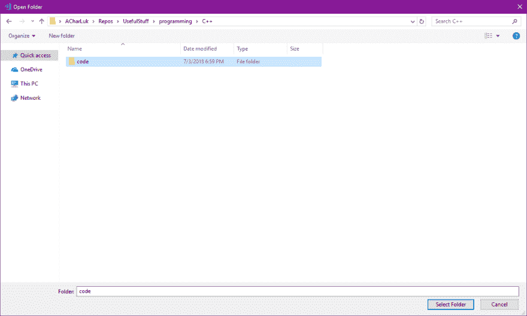](https://res.cloudinary.com/practicaldev/image/fetch/s--M0UpQrS8--/c_limit%2Cf_auto%2Cfl_progressive%2Cq_auto%2Cw_880/https://raw.githubusercontent.com/acharluk/UsefulStuff/master/programming/C%2B%img/2/1_opening_working_folder.png)

创建一个新文件夹，然后按“选择文件夹”，对话框将关闭，窗口将重新加载并打开我们创建的文件夹。

* * *

## 创建 C++项目

按 F1，会出现一个小窗口，里面有很多不同的命令，搜索“C++”，点击“创建新的 c++项目”:
[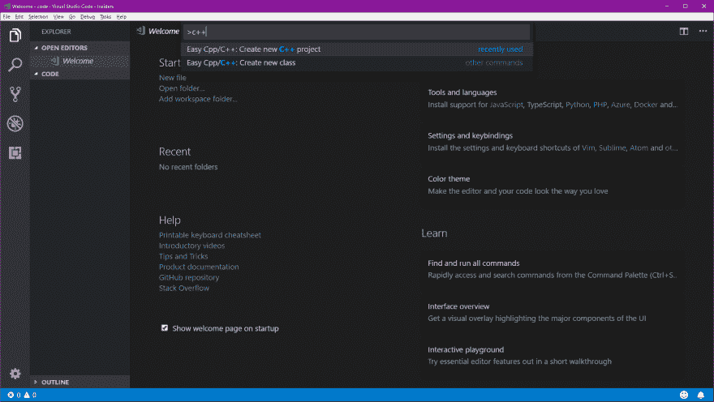](https://res.cloudinary.com/practicaldev/image/fetch/s--n9zLVf0Z--/c_limit%2Cf_auto%2Cfl_progressive%2Cq_auto%2Cw_880/https://raw.githubusercontent.com/acharluk/UsefulStuff/master/programming/C%2B%img/2/2_creating_cpp_project.png)

现在我们会被问到我们想要使用什么编译器，查看 Easy C++扩展页面，了解如何为您的操作系统设置编译器的信息。我将使用 Linux 的 Windows 子系统。
[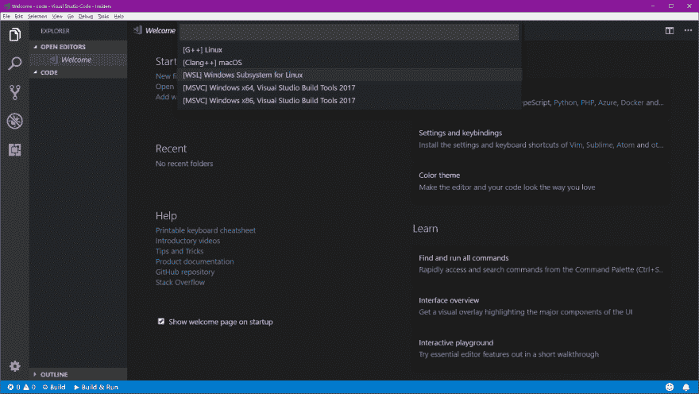T3】](https://res.cloudinary.com/practicaldev/image/fetch/s--JX8l6xJs--/c_limit%2Cf_auto%2Cfl_progressive%2Cq_auto%2Cw_880/https://raw.githubusercontent.com/acharluk/UsefulStuff/master/programming/C%2B%img/2/3_creating_cpp_project_2.png)

[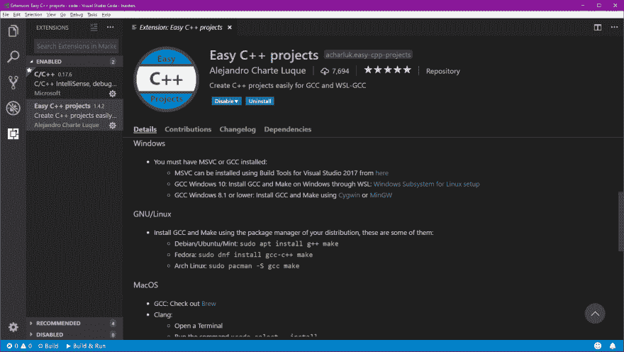T2】](https://res.cloudinary.com/practicaldev/image/fetch/s--7I6KIvwM--/c_limit%2Cf_auto%2Cfl_progressive%2Cq_auto%2Cw_880/https://raw.githubusercontent.com/acharluk/UsefulStuff/master/programming/C%2B%img/2/4_compiler_setup.png)

* * *

## 代码！

现在我们已经完成了创建步骤，VSC 将为我们生成项目结构，并打开`main.cpp`和一些示例代码:
[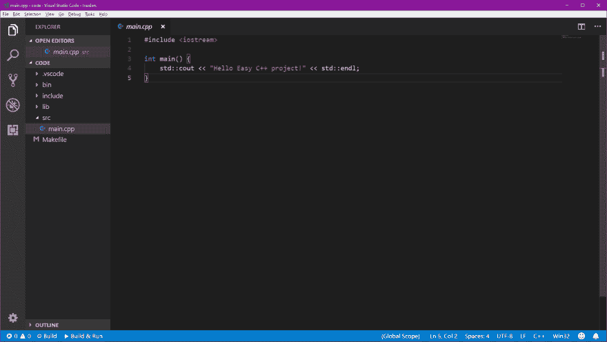](https://res.cloudinary.com/practicaldev/image/fetch/s--tsLeXq9O--/c_limit%2Cf_auto%2Cfl_progressive%2Cq_auto%2Cw_880/https://raw.githubusercontent.com/acharluk/UsefulStuff/master/programming/C%2B%img/2/5_main_cpp.png)

为了测试项目是否工作，按下状态栏上的`Build & Run`按钮，一个终端将打开，它将第一次编译并执行我们的程序！
[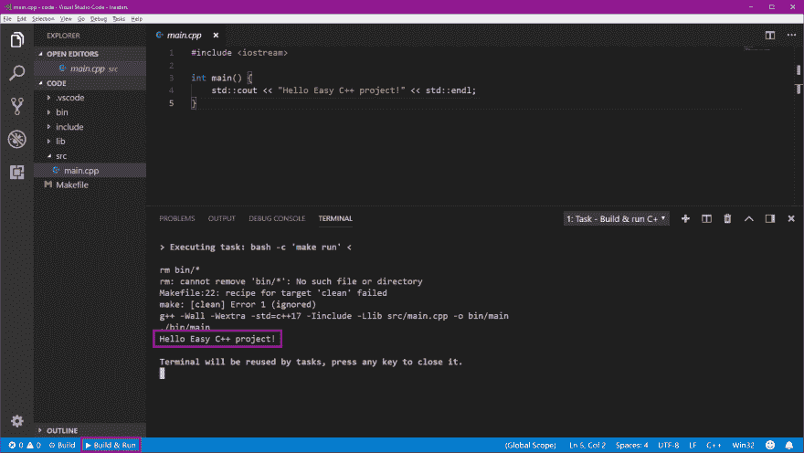](https://res.cloudinary.com/practicaldev/image/fetch/s--rj5uwq7W--/c_limit%2Cf_auto%2Cfl_progressive%2Cq_auto%2Cw_880/https://raw.githubusercontent.com/acharluk/UsefulStuff/master/programming/C%2B%img/2/6_first_run.png)