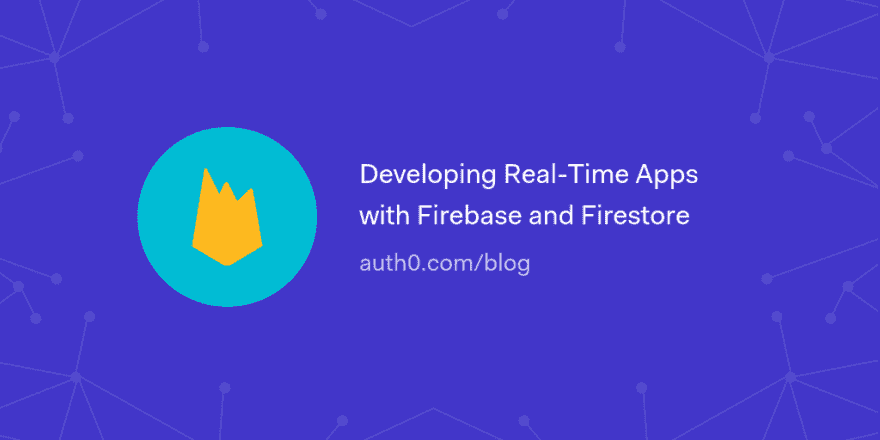

# 用 Firebase 和 Firestore 开发实时应用

> 原文：<https://dev.to/auth0/developing-real-time-apps-with-firebase-and-firestore-1kba>

在本文中，您将了解如何使用 Firebase 和 Firestore 开发实时 web 应用程序。

为了熟悉这些技术和集成，您将构建一个简单的实时 web 聊天，它将在 Firestore(Firebase 提供的一个实时数据库)上安全地存储消息，并允许用户进行身份验证。

[读下去🔥](https://auth0.com/blog/developing-real-time-apps-with-firebase-and-firestore/?utm_source=dev&utm_medium=sc&utm_campaign=rt_fire)

[T2】](https://res.cloudinary.com/practicaldev/image/fetch/s--fwulK4LA--/c_limit%2Cf_auto%2Cfl_progressive%2Cq_auto%2Cw_880/https://thepracticaldev.s3.amazonaws.com/i/ami8l84yxmmq2vdjpwh5.png)