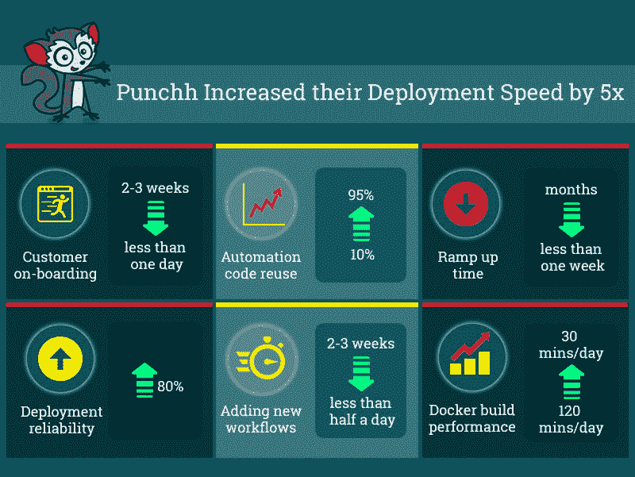

# 【DevOps 案例分析】Punchh 在不到一个月的时间内实现了零接触 CI/CD 和 DevOps as-code。

> 原文：<https://dev.to/pavanbelagatti/devops-case-study-punchh-achieved-zero-touch-cicd-and-devops-as-code-in-less-than-a-month-45kg>

你知道吗，大多数公司都是临时采用#DevOps 这个标签，没有明确的路线图或战略计划？
我们最近偶然发现了一家数字营销平台公司 Punchh，它因为这个而举步维艰。

用 Punchh CTO Aditya Sanghi 的话说:“我们缺乏清晰的 CI/CD 战略，我们的自动化过于依赖人和定制。因此，接纳新客户或对现有服务进行更改需要大量定制工作，我们的环境和配置很容易出现偏差。我们需要一种方法来跟上快速增长的客户群，同时又不会让团队精疲力竭。”

Aditya 开始寻找一个 CI/CD 平台，在他们加速发展的同时，为他们提供零接触自动化和规模经济。

在 Shippable，他找到了一个团队，他们采取“共同解决问题”的方法，而不仅仅是“出售一个平台”。结果呢？在不到一个月的时间内实现所有服务和客户部署的零接触自动化，同时将自动化代码库缩减 80%，并将部署速度提高 5 倍。

### 结果

借助 Shippable，Punchh 团队在不到 1 个月的时间内通过简化的工具链实现了[零接触自动化](https://www.shippable.com/how-punchh-scaled-devops.html)。新的 CI/CD 自动化工作流的一些亮点是:

1.  客户入职时间不到一天，在此期间，Punchh team 团队可以提供一个全新的服务实例。这减少了 2-3 周的工作量。
2.  部署可靠性提高了 80 %，花在调试发布问题上的时间减少了 4 倍。
3.  自动化代码重用已经从大约 10%上升到 95%。
4.  添加新工作流或更改现有工作流只需不到半天的时间，而之前需要 2-3 周。
5.  新开发人员的加速时间从几个月缩短到不到一周。
6.  Docker 构建性能提高了 400%，从 120 分钟/天提高到 30 分钟/天。

[T2】](https://res.cloudinary.com/practicaldev/image/fetch/s--svXjl5XK--/c_limit%2Cf_auto%2Cfl_progressive%2Cq_auto%2Cw_880/https://thepracticaldev.s3.amazonaws.com/i/frdigfdhzffu2nxw2eb5.jpg)

完整的案例分析在[这里](http://bit.ly/PunchhCaseStudy)

在您的组织中，您是如何完成 DevOps 的？你有系统的路线图和战略计划吗？