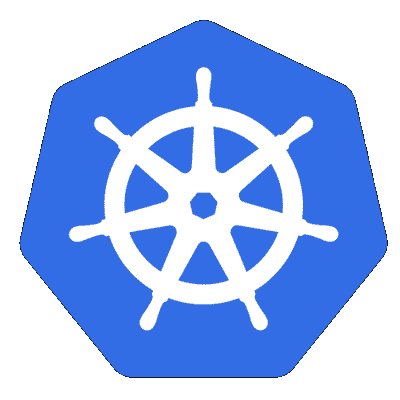
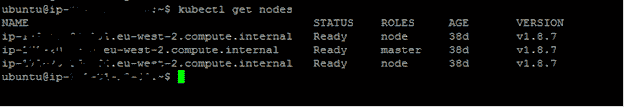

# Kubernetes 集群上的 DevOps 工具链设置。第 1/3 部分

> 原文：<https://dev.to/sr_balaji/devops-tool-chain-setup-on-kubernetes-cluster-59cn>

[T2】](https://res.cloudinary.com/practicaldev/image/fetch/s--cemFoOyb--/c_limit%2Cf_auto%2Cfl_progressive%2Cq_auto%2Cw_880/https://thepracticaldev.s3.amazonaws.com/i/298l0v54pjqkldy2j34e.png)

## 简介

DevOps 已经成为具有 CI/CD 管道的软件生命周期管理的一部分，以自动化的方式向生产交付变更。

[T2】](https://res.cloudinary.com/practicaldev/image/fetch/s--v6AWyfOd--/c_limit%2Cf_auto%2Cfl_progressive%2Cq_auto%2Cw_880/https://thepracticaldev.s3.amazonaws.com/i/8ko3m7l823612pap65zd.png)

在 CI/CD 管道中，流行的开源工具是用于源代码库的 Github、用于持续集成、构建、测试和部署编排的 Jenkins、用于静态代码分析的 SonarQube 和用于工件库的 Nexus。也有许多开源工具可供测试。本文并不太关注 DevOps 或 CI/CD pipline，而是描述如何使用 kubectl 在 Kubernetes 集群环境上创建 CI/CD 管道。

### 容器:

这些是操作系统虚拟化的方法，允许我们在资源隔离的进程中运行应用程序及其依赖项。容器允许开发人员将应用程序与它需要的部分打包在一起，比如库和其他依赖项，然后作为一个包发送出去。有许多可用的容器选项，Docker 就是其中一个使用非常广泛的开源容器。

### Kubernetes:

它是一个可移植的开源平台，用于管理容器化的工作负载和服务，促进了声明式配置和自动化。Kubernetes 已经成为管理大多数公共、私有和混合云中以及裸机系统上的容器的默认工具。

这篇文章描述了如何在 AWS 云上使用 Jenkins、Sonar、Nexus 创建 Kubernetes 集群。它不包括 Jenkins、SonarQube 和 Nexus 的功能细节。

我已经写了一篇关于在 AWS Cloud 上建立一个 Kubernetes 集群的文章，这个集群有一个主节点和两个工作节点。更多详细信息，请参考链接-[https://dev . to/Sr _ Bala Ji/kubernetes-cluster-setup-on-AWS-13m 6](https://dev.to/sr_balaji/kubernetes-cluster-setup-on-aws-13m6)

[T2】](https://res.cloudinary.com/practicaldev/image/fetch/s--psoxCKBL--/c_limit%2Cf_auto%2Cfl_progressive%2Cq_auto%2Cw_880/https://thepracticaldev.s3.amazonaws.com/i/739ut1xpewm555pf418f.png)

### Kubernetes 组件

下面详细列出了该集群中使用的 Kubernetes 组件。我已经提供了关于 Kubernetes 组件的非常高层次的细节。更多详情请参考 [https://kubernetes.io](https://kubernetes.io) 。

*   集群:它是一组物理或虚拟机，在 Kubernetes 中，所有机器都作为一个集群来管理。

*   节点:它是 Kubernetes 中的一个工作机。它可以是虚拟机或物理机。(在本文中，我使用 EC2 实例来提供 Kubernetes 集群)

*   Pod:它是一组一个或多个容器(比如 Docker 容器)，具有共享的存储/网络，以及一组运行容器的规范。pod 的内容总是位于同一位置，共同调度，并在共享的上下文中运行。

*   部署:它为 pod 和副本集提供声明性更新。

*   持久卷:它是集群中由管理员提供的一块存储。它是群集资源中的一个节点。

*   持久卷声明:它是用户对存储的请求。

*   服务:它是一个抽象概念，定义了一组逻辑单元

*   Storageclass:它为管理员提供了一种描述他们提供的存储“类别”的方式。

### Kubernetes 集群环境

在这个 Kubernetes 集群中，我创建了 Jenkins、SonarQube & Nexus 的一个实例，并以这样一种方式进行配置，即这些服务器的一个实例总是可用的。这些服务器的数据是持久的，即使在这些服务器崩溃的情况下，它也会用保留的数据自动重建。

我为 Jenkins、SonarQube 和 Nexus 创建了单独的存储类，具有数据持久性。每台服务器都作为一个单独的单元提供，其端口作为服务公开。我已经使用 deployment 为单个工具创建了 pod。

### Kubernetes 集群上的 Jenkins 设置

Jenkins 是一个开源的持续集成(CI)/持续交付(CD)编排工具。它提供了一种为任何语言和源代码库建立 CI/CD 环境的简单方法。我已经创建了下面的 Kubernetes 组件列表来在集群上托管 Jenkins 服务器。

#### 詹金斯的存储类

我在集群上为 Jenkins 数据创建了存储类。

```
kind: StorageClass
apiVersion: storage.k8s.io/v1
metadata:
  name: jenkins-storage
  labels: 
    app: jenkins-storage
provisioner: kubernetes.io/aws-ebs
parameters:
  type: gp2
  zone: eu-west-2a
allowVolumeExpansion: true 
```

Enter fullscreen mode Exit fullscreen mode

#### 对詹金斯的持久卷

我已经创建了一个永久卷声明，并分配了 2GB 作为存储空间来保存 Jenkins 数据。

```
kind: PersistentVolumeClaim
apiVersion: v1
metadata:
  name: jenkins-data
  annotations:
    volume.beta.kubernetes.io/storage-class: "jenkins-storage"
spec:
  accessModes:
    - ReadWriteOnce
  resources:
    requests:
      storage: 2Gi 
```

Enter fullscreen mode Exit fullscreen mode

#### 为詹金斯部署

我已经创建了一个部署脚本，它从互联网上获取 Jenkins 的官方映像，并且我已经为 Jenkins 配置了默认端口 8080。它的数据保存在上一步中创建的持久卷上。这个部署是用单个副本创建的，这意味着 Kubernetes 将确保 Jenkins 的一个实例始终启动并运行。在这种配置中，端口不会暴露给集群，这将在下一节中介绍。

```
apiVersion: extensions/v1beta1
kind: Deployment
metadata:
  name: jenkins
spec:
  replicas: 1
  template:
    metadata:
      labels:
        app: jenkins
    spec:
      securityContext:
        runAsUser: 1000
        fsGroup: 1000
      containers:
      - name: jenkins
        image: jenkins:2.60.3
        imagePullPolicy: IfNotPresent
        ports:
        - containerPort: 8080
        volumeMounts:
          - name: jenkins-home
            mountPath: /var/jenkins_home
      volumes:
        - name: jenkins-home
          persistentVolumeClaim:
            claimName: jenkins-data 
```

Enter fullscreen mode Exit fullscreen mode

#### 为詹金斯服务

我创建了一个服务，在端口 9500 而不是默认端口上显示 Jenkins。

```
apiVersion: v1
kind: Service
metadata:
  name: jenkins
  labels:
    app: jenkins
spec:
  type: NodePort
  ports:
    - port: 9500
      targetPort: 8080
      name: jenkinsport
  selector:
    app: jenkins
  type: LoadBalancer 
```

Enter fullscreen mode Exit fullscreen mode

到目前为止，我已经为 Jenkins 创建了存储类、持久卷、部署和服务。Jenkins 的所有组件都已创建并开始运行。

```
$kubectl get deployment
$kubectl get pod
$kubectl get svc 
```

Enter fullscreen mode Exit fullscreen mode

### 结论

在本文中，我介绍了如何在 Kubernetes 集群上用单个副本集设置 Jenkins。我将在接下来的文章中介绍 SonarQube 和 Nexus 的设置。

##### 注:

yaml 文件对空间敏感，本文中可用的脚本可能有制表符而不是空格。如果您在复制和粘贴时没有将制表符更改为空白，这些脚本将会失败。