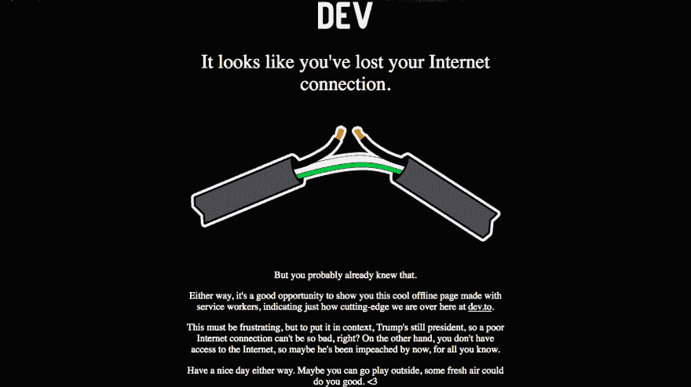

# Dev.to 成就了我的一天:)

> 原文：<https://dev.to/wangonya/devto-made-me-day--1hg1>

因此，我决定开始撰写技术文章，以帮助我更深入地理解编程概念，并在这个过程中帮助像我一样的初学者。还有比德夫·托更好的地方吗😁。

当我在网站上寻找灵感时，我失去了连接，我不得不说，离线页面真的很酷。

[T2】](https://res.cloudinary.com/practicaldev/image/fetch/s--OI8pMmIG--/c_limit%2Cf_auto%2Cfl_progressive%2Cq_auto%2Cw_880/https://thepracticaldev.s3.amazonaws.com/i/ez266x2sh37654m1k68s.png)

最近刚刚了解了服务人员，我真的很感激它是多么有用。突然下线并没有让我感到沮丧，(请注意，我的 WiFi 已经满了——或者，我应该说，LieFi)，这个意想不到的机智信息让我感觉比继续搜索更好😅。

这正好说明，没有联系不应该等于没有内容，或者内容无聊。我觉得作为编码人员，我们没有太多的机会去体验另一面，所以我们可能没有意识到额外的努力将一个看似糟糕的情况变成一个令人振奋的情况意味着什么。

不管是谁做的离线页面，这都是个好主意。我很高兴我遇到了它。它给了我一个想法，让我的第一个开发者来发布这个帖子...你好世界！🎉

为更多的🥂.干杯我现在去外面玩。