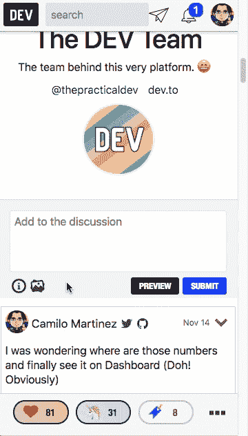
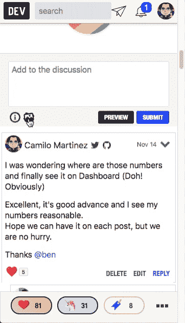
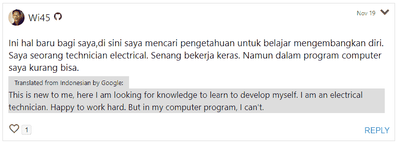
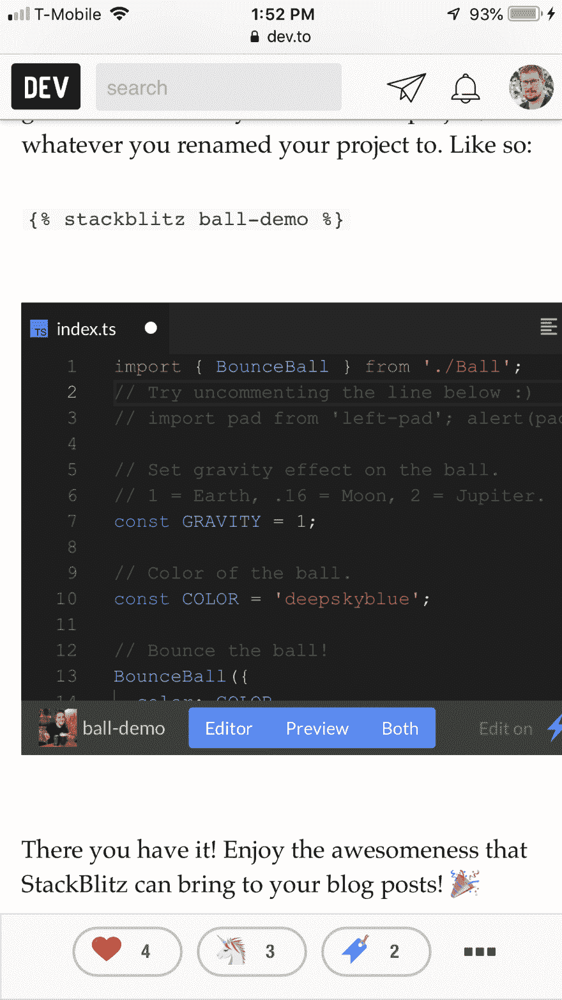

# 开发人员对上周的回购进行总结

> 原文：<https://dev.to/devteam/devto-repo-recap-from-the-past-week-3c39>

我们又回来了，带来了另一个回顾！我们将报道 11 月 12 日至 11 月 19 日。上周发生了很多变化。

# 特性

*   @gautamkrishnar 增加了一个漂亮的触感，防止反应被误击。它与上周的乐观渲染配合得非常好。谢谢，高塔姆！
    [链接到公关](https://github.com/thepracticaldev/dev.to/pull/989)

*   [@ben](https://dev.to/ben) 添加了一个新的徽章，方便查看 feed 中的组织帖子。查看更多细节和截图的公关。
    [链接到公关](https://github.com/thepracticaldev/dev.to/pull/1089)

*   每个人现在都可以进行分析！更多详情见本的帖子:

    [](/devteam) [## 变更日志:所有人都可以使用帖子分析

    ### 开发团队的 Ben Hal pern 11 月 14 日 181 分钟阅读

    #meta #changelog](/devteam/changelog-post-analytics-available-for-all-5eb0)
    *   多种 PRs，作者:Ben:
    *   [https://github.com/thepracticaldev/dev.to/pull/1115](https://github.com/thepracticaldev/dev.to/pull/1115)
    *   [https://github.com/thepracticaldev/dev.to/pull/1117](https://github.com/thepracticaldev/dev.to/pull/1117)
    *   [https://github.com/thepracticaldev/dev.to/pull/1118](https://github.com/thepracticaldev/dev.to/pull/1118)
*   我们现在有了关于组织的官方文件。 PR 通过 [@peter](https://dev.to/peter)

    [链接到 PR](https://github.com/thepracticaldev/dev.to/pull/1119)

*   [@johnwoodruff91](https://dev.to/johnwoodruff91) 添加了 StackBlitz Liquid 标签，可以让你在帖子和评论中嵌入 StackBlitz 编辑器。谢谢你，约翰！

    [链接到公关](https://github.com/thepracticaldev/dev.to/pull/1120)

*   我们实现了一种更直观的方式来显示低质量或无建设性的评论。公关由本

    [链接到公关](https://github.com/thepracticaldev/dev.to/pull/1129)

*   更多可访问性改进在这里！我们在大部分地方移除了`outline: 0`，现在你可以通过键盘访问导航条菜单。公关由本

    [链接到公关](https://github.com/thepracticaldev/dev.to/pull/1132)

*   @lightalloy 给你的阅读列表增加了正确的分页。如果你的阅读列表中有超过 45 篇文章，你会看到一个“加载更多文章”按钮。谢谢安娜。

    [链接到公关](https://github.com/thepracticaldev/dev.to/pull/1149)

# Bug 修复/其他贡献

*   @mariocsee 在测试我们的前端代码方面给了我们很多帮助。感谢所有的工作，马里奥！
    [链接到公关](https://github.com/thepracticaldev/dev.to/pull/1046)

*   [@韵脚](https://dev.to/rhymes)修复了一个在推特上分享帖子时`#`符号被编码的错误。感谢修复，[@韵](https://dev.to/rhymes)！
    [链接到 PR](https://github.com/thepracticaldev/dev.to/pull/1092)

*   @maestromac 为我们的 onboarding 模型写了更多的测试。为更多的测试欢呼！
    [链接到公关](https://github.com/thepracticaldev/dev.to/pull/1111)

*   [@harsh8398](https://github.com/harsh8398) 修复了一个错别字。谢了，哈什！
    [链接到公关](https://github.com/thepracticaldev/dev.to/pull/1136)

*   @alex_barashkov 让我们的 favicon 在 retina 显示屏上正确渲染。谢谢，亚历克斯！
    [链接到公关](https://github.com/thepracticaldev/dev.to/pull/1139)

# 新问题/讨论

在 iOS 回购中，我们有三个新问题:

1.  我们希望在应用程序中添加通用链接功能。引用本的话，“如果我点击网上的 dev.to/ben 链接，我会被带到应用程序，但它只会显示我打开的页面。”

    # [ 添加通用链接功能 #99](https://github.com/thepracticaldev/DEV-ios/issues/99) 

    [](https://github.com/benhalpern) **[benhalpern](https://github.com/benhalpern)** posted on [<time datetime="2018-11-17T15:48:51Z">Nov 17, 2018</time>](https://github.com/thepracticaldev/DEV-ios/issues/99)

    我们在 web 应用程序上已经有了通用链接映射，所以手机知道打开 iOS 应用程序。

    但是目前我们不支持实际页面被打开的功能。

    如果我点击网页上的 dev.to/ben 链接，我会被带到应用程序，但它只会显示我打开的页面。

    我想这可以像我们在适当的链接上处理打开通知一样来处理。鉴于我们的应用程序只有一个`wkwebview`，打开一个特定的网页应该是相当容易的。

    [View on GitHub](https://github.com/thepracticaldev/DEV-ios/issues/99)
2.  通过电子邮件报告了两个错误。第一个是点击`mailto`链接，这会导致应用程序崩溃。

    # [ 如果没有邮件应用设置  #97](https://github.com/thepracticaldev/DEV-ios/issues/97) 点击邮件链接会使应用崩溃

    [](https://github.com/Zhao-Andy) **[Zhao-Andy](https://github.com/Zhao-Andy)** posted on [<time datetime="2018-11-14T18:17:28Z">Nov 14, 2018</time>](https://github.com/thepracticaldev/DEV-ios/issues/97)

    **描述 bug** 这是有人通过邮件举报的；详情照原样。

    > 我没有在手机里设置邮件应用程序。我在应用“ [yo@dev.to](mailto:yo@dev.to) 中点击了你的邮件”应用崩溃了。我觉得你没管好设备里有没有设置邮件 app。然后，您正在尝试打开邮件编辑器。它因为无引用而崩溃。

    **重现**重现行为的步骤:

    1.  拥有一部没有邮件应用程序设置的 iPhone
    2.  访问带有`mailto`链接的页面，比如[https://dev.to/contact](https://dev.to/contact)
    3.  点击 mailto 链接
    4.  应用程序应该崩溃

    **预期行为**应用程序应该正确处理 mailto 链接。这可能有助于找到解决方案:

    > 我觉得你没管好设备里有没有设置邮件 app。然后，您正在尝试打开邮件编辑器。它因为无引用而崩溃。

    **智能手机(请填写以下信息):**

    *   设备:iPhone 8
    *   操作系统:11.4.1

    ```
    </div>
    <div class="gh-btn-container"><a class="gh-btn" href="https://github.com/thepracticaldev/DEV-ios/issues/97">View on GitHub</a></div> 
    ```

    Enter fullscreen mode Exit fullscreen mode

3.  第二个错误涉及到无意识的行为和切换出应用程序。更多细节请见本期。

    # [ 切换出 app，使用相机 app，切换回死机 DEV app  #96](https://github.com/thepracticaldev/DEV-ios/issues/96) 

    [](https://github.com/Zhao-Andy) **[Zhao-Andy](https://github.com/Zhao-Andy)** posted on [<time datetime="2018-11-14T17:17:52Z">Nov 14, 2018</time>](https://github.com/thepracticaldev/DEV-ios/issues/96)

    **描述 bug** 这是有人通过邮件举报的；详情照原样。

    > 我正在回复一个帖子。我按下 home 键，打开相机应用程序，然后拍了张照片。回到应用程序后，我在 uitextfield 中写的所有内容都不见了。事实上，应用程序重新启动自己。但是如果我什么都不做就从应用程序返回到主屏幕，然后再返回到应用程序，就没有问题了。

    **重现**重现行为的步骤:

    1.  打开开发应用程序
    2.  转到文章
    3.  在注释文本字段中键入注释
    4.  前往主屏幕
    5.  打开相机应用程序
    6.  拍照
    7.  切换回开发应用程序
    8.  文本字段被删除，开发应用程序重新启动

    **预期行为**确保将文本留在评论栏中并执行以下操作不会擦除文本栏，也不会重启应用程序:

    *   导航到主屏幕并返回
    *   导航到主屏幕，打开相机应用程序(或任何其他应用程序)并返回
    *   导航到主屏幕，在不同的应用程序中执行操作(拍照、发送文本等)并返回

    **智能手机(请填写以下信息):**

    *   设备:iPhone 8
    *   操作系统:11.4.1

    [View on GitHub](https://github.com/thepracticaldev/DEV-ios/issues/96)

从主回购，我们有几个新的问题:

*   搜索结果有时会显示无法再访问的结果。这主要是因为该应用程序没有处理 Algolia 的索引问题。感谢 [@tone-dev](https://dev.to/tonedev) 。

    # [ 搜索结果返回不可用用户/文章 #1102](https://github.com/thepracticaldev/dev.to/issues/1102) 

    [](https://github.com/tone-dev) **[tone-dev](https://github.com/tone-dev)** posted on [<time datetime="2018-11-12T13:00:06Z">Nov 12, 2018</time>](https://github.com/thepracticaldev/dev.to/issues/1102)

    **描述 bug**

    点击搜索结果时返回 404 错误。我只能为受影响的文章和创建文章的用户复制这一点——我相信他们的帐户要么不再存在，要么已经更改了别名。

    标题中将出现“您要查找的页面不存在(404)”。“你迷路了。”出现在正文中，链接回主页。

    [用户](https://dev.to/kasperfred)，[文章](https://dev.to/kasperfred/how-to-securely-store-user-passwords-497a)。

    **重现**重现行为的步骤:

    1.  转到“开发工具中的任何功能页面”
    2.  点击搜索栏，输入“python 密码”
    3.  向下滚动到 Kasper Fredenslund 在 3 月 30 日发表的“如何安全地存储用户密码”。
    4.  参见错误

    **预期行为**要么显示帖子，要么搜索结果不返回不再可用的文章。

    听起来太刺耳了，抱歉！只是提出可能是未知问题-找不到另一个示例问题。

    **桌面(请填写以下信息):**

    *   操作系统:Ubuntu 18.04，Windows 10
    *   浏览器:火狐、Chrome
    *   版本:火狐 62.0.3，Chrome 69.0.3497.100

    ```
    </div>
    <div class="gh-btn-container"><a class="gh-btn" href="https://github.com/thepracticaldev/dev.to/issues/1102">View on GitHub</a></div> 
    ```

    Enter fullscreen mode Exit fullscreen mode

*   我们希望找到报告违反我们的服务条款或行为准则的用户的方式。[感谢@清教徒](https://dev.to/puritanic)。

    # [ 添加举报方式 #1112](https://github.com/thepracticaldev/dev.to/issues/1112) 

    [](https://github.com/Puritanic) **[Puritanic](https://github.com/Puritanic)** posted on [<time datetime="2018-11-13T07:54:07Z">Nov 13, 2018</time>](https://github.com/thepracticaldev/dev.to/issues/1112)

    **您的功能请求是否与某个问题相关？请描述一下。**我听说你最近有很多垃圾邮件帐户加入 DEV.to，我猜有时一些帐户会逃过你的过滤器，在我看来，如果我们有办法报告一些用户，这将是有帮助的。这里有一个例子: [](https://user-images.githubusercontent.com/25148427/48398198-68526480-e720-11e8-8541-c290afafd761.png) 我昨天就被这个跟踪了，看起来像是垃圾账号。前几周看过几个，现在好像被禁了。

    **描述您想要的解决方案**将报告链接添加到用户页面，我们可以在此报告垃圾邮件帐户。

    **附加上下文**当然，有一个问题是以一种意想不到的方式使用它，我猜想一些 troll 用户或被某个特定用户惹恼的用户可能会报告他一些事情，这可能会导致一些并发症，也许会给开发管理员带来垃圾邮件和不良报告<g-emoji class="g-emoji" alias="confused" fallback-src="https://github.githubassets.cimg/icons/emoji/unicode/1f615.png">😕</g-emoji>也许在下拉上下文菜单中隐藏报告按钮，因为这不是一个常见的操作。

    想法？

    [View on GitHub](https://github.com/thepracticaldev/dev.to/issues/1112)

*   标题说明了一切:“写文章时，文本视图不会跟随光标。”本期还有一个视频例子。感谢 [@trueneu](https://dev.to/trueneu) 。

    # [ 写帖子时，文字视图不跟随光标 #1109](https://github.com/thepracticaldev/dev.to/issues/1109) 

    [](https://github.com/trueneu) **[trueneu](https://github.com/trueneu)** posted on [<time datetime="2018-11-12T21:52:14Z">Nov 12, 2018</time>](https://github.com/thepracticaldev/dev.to/issues/1109)

    **描述 bug** 写新帖时，文字视图不跟随光标。

    **重现**重现行为的步骤:

    1.  前往[https://dev.to/new](https://dev.to/new)
    2.  在“文章”文本框中，输入足够大的文本，如果不滚动，它就不适合单个视图
    3.  尝试使用箭头键向上滚动
    4.  参见错误和闪烁标题

    **预期行为**视口确实跟随光标。标题不闪烁。

    **截图**【https://youtu.be/2ALeGuxrC7k】T2。注意光标。每当图像抽动时，按下一个箭头键。

    **桌面**

    *   苹果操作系统
    *   谷歌浏览器
    *   v 70.0.3538.102
    *   常规模式，匿名模式(无扩展)

    [View on GitHub](https://github.com/thepracticaldev/dev.to/issues/1109)

*   如上所述，我们为 navbar 添加了可访问性支持，但是我们还需要为其他浏览器添加该功能。再次感谢 [@trueneu](https://dev.to/trueneu) 。

    # [ 个人资料菜单(表头最右边的项目)不可点击【更新:需要非 Chrome 支持】 #1110](https://github.com/thepracticaldev/dev.to/issues/1110) 

    [](https://github.com/trueneu) **[trueneu](https://github.com/trueneu)** posted on [<time datetime="2018-11-12T22:04:58Z">Nov 12, 2018</time>](https://github.com/thepracticaldev/dev.to/issues/1110)

    **描述 bug** 档案菜单(表头最右边的项目)不可点击。“仪表板”、“写文章”、“阅读列表”等菜单项只在悬停时出现。

    **重现**重现行为的步骤:

    1.  进入任意一个[https://dev.to/](https://dev.to/)页面，包括【https://dev.to/】T2
    2.  单击个人资料图片，但不要将鼠标指针悬停在它上面。(以 Vimium 为例)
    3.  什么都没发生

    **预期行为**所有菜单项(“仪表盘”、“写文章”、“阅读列表”等)在点击时应该显示出来，就像它们在悬停时一样。不悬停指针就无法访问它们。

    **桌面(请填写以下信息):**

    *   苹果操作系统
    *   谷歌浏览器
    *   v 70.0.3538.102

    **附加上下文**[https://medium . com/simple-human/why-hover-menus-is-problem-b 21 D6 c 7 de 91 c](https://medium.com/simple-human/why-hover-menus-are-problematic-b21d6c7de91c)

    [View on GitHub](https://github.com/thepracticaldev/dev.to/issues/1110)

*   [@link2twenty](https://dev.to/link2twenty) 请求了一个可以让你轻松关注他人的功能，类似 Twitter 的处理方式。谢谢你安德鲁。

    # [ 快速跟随选项 #1122](https://github.com/thepracticaldev/dev.to/issues/1122) 

    [](https://github.com/Link2Twenty) **[Link2Twenty](https://github.com/Link2Twenty)** posted on [<time datetime="2018-11-15T10:03:07Z">Nov 15, 2018</time>](https://github.com/thepracticaldev/dev.to/issues/1122)

    当你将鼠标悬停在用户的个人资料图片上时，无论是在评论中还是在查看文章时，如果能看到用户的少量信息并可以选择关注它们，那就太好了。

    [T2】](https://user-images.githubusercontent.com/3534427/48545316-8903f100-e8bd-11e8-9916-3c476fe7ee83.png)

    [View on GitHub](https://github.com/thepracticaldev/dev.to/issues/1122)

*   @equiman 报告了一个在评论中上传图片有点麻烦的错误。更多详细信息，请参见其中的问题和讨论。谢谢卡米洛。

    # [ 图片上传回复评论 #1123](https://github.com/thepracticaldev/dev.to/issues/1123) 

    [](https://github.com/equiman) **[equiman](https://github.com/equiman)** posted on [<time datetime="2018-11-15T14:20:57Z">Nov 15, 2018</time>](https://github.com/thepracticaldev/dev.to/issues/1123)

    **描述 bug**

    1.  图片上传图标上的链接不是所有图片都可以点击的，右侧没有覆盖。影响台式机和移动设备
    2.  上传图片时，不能在输入框中选择 url，所以不能复制 URL 用于评论。
    3.  在移动设备上，当图像上传输入框可见时，取消按钮与取消按钮使用相同的空间。然后，如果您尝试选择图像，没有办法不点击取消按钮。与#188 问题相关。

    **重现**重现行为的步骤:

    1.  公开发布
    2.  转到评论
    3.  点击回复按钮
    4.  尝试点击上传图像

    **预期行为**当点击上传图像按钮的任何部分时，起作用。

    **截图** [ ](https://user-images.githubusercontent.com/933393/48558427-450ded80-e8b7-11e8-8ef8-34eda34da440.gif) [ ](https://user-images.githubusercontent.com/933393/48558591-a635c100-e8b7-11e8-9849-d984e93ebfed.gif)

    **桌面(请填写以下信息):**

    *   操作系统:苹果操作系统
    *   浏览器:铬
    *   版本:70.0.3538.102(官方版本)(64 位)

    **智能手机(请填写以下信息):**

    *   设备:[例如 iPhone6]
    *   操作系统:[例如 iOS8.1]
    *   浏览器[例如股票浏览器、safari]
    *   版本[例如 22]

    **附加内容**可能是一个更好的图像输入框和向下动作按钮的网站。我想。

    [View on GitHub](https://github.com/thepracticaldev/dev.to/issues/1123)

*   [@加贝克](https://dev.to/gabek)请求改进我们的 RSS 提要，它有一个`<category>`标签，显示文章有哪些标签。谢谢加布。

    # [  RSS 源:用帖子的标签填充类别 #1128](https://github.com/thepracticaldev/dev.to/issues/1128) 

    [](https://github.com/gabek) **[gabek](https://github.com/gabek)** posted on [<time datetime="2018-11-15T21:28:39Z">Nov 15, 2018</time>](https://github.com/thepracticaldev/dev.to/issues/1128)

    看起来好像有一个针对单个标签的 RSS 提要的开放请求，#201，但是这可能是获得相同结果的更快的方法。

    我使用 RSS 阅读器，它允许我根据标签进行过滤，所以过滤掉某些我不关心的话题会很好。这与#201 有些相反，它不是每个标签一个 feed，而是允许人们继续订阅全局 feed，但过滤掉一些东西。

    **描述你想要的解决方案**在 RSS 订阅源中为每篇文章填充`category`标签。

    [https://www.w3schools.com/xml/rss_tag_category_item.asp](https://www.w3schools.com/xml/rss_tag_category_item.asp)

    [View on GitHub](https://github.com/thepracticaldev/dev.to/issues/1128)

*   @flexdinesh 为主页 feed 请求了一个简洁的列表视图，因为我们增长了很多，帖子数量也更多了。谢谢，迪内什。

    # [ 良心榜查看中家提要 #1138](https://github.com/thepracticaldev/dev.to/issues/1138) 

    [](https://github.com/flexdinesh) **[flexdinesh](https://github.com/flexdinesh)** posted on [<time datetime="2018-11-18T02:51:14Z">Nov 18, 2018</time>](https://github.com/thepracticaldev/dev.to/issues/1138)

    Dev 有了巨大的增长，每天的博客帖子和主题的数量也随之增长。以前，我的 feed 通常会有比今天更多我想打开的帖子。这主要是因为这些天我们有如此多类型的帖子(讨论等)和大量的贡献者。回到那天，我会在几分钟内滚动浏览我的整个订阅源并打开所有我想看的帖子。但是现在，仅仅浏览所有的帖子就让人不知所措，因为我不得不滚动很多次，发现我想打开的帖子数量明显减少。

    我想有一个列表视图选项，在饲料中的职位在一个简洁的视图中列出，如在 HN 或 reddit。这将使我能够浏览所有的职位，而不必滚动太多。

    **TLDR: *简洁的 feed 视图可以在窗口中显示更多的文章，这样用户就不必滚动太多。*T3】**

    注意:这与其说是一个特性，不如说是 UX 的改进。

    [View on GitHub](https://github.com/thepracticaldev/dev.to/issues/1138)

*   @link2twenty 请求另一个功能，我们可以即时翻译评论，也类似于 Twitter 所做的。再次感谢你，安德鲁。

    # [ 翻译评论 #1150](https://github.com/thepracticaldev/dev.to/issues/1150) 

    [](https://github.com/Link2Twenty) **[Link2Twenty](https://github.com/Link2Twenty)** posted on [<time datetime="2018-11-19T15:55:25Z">Nov 19, 2018</time>](https://github.com/thepracticaldev/dev.to/issues/1150)

    用户应该能够读和写评论，并张贴(？)，用自己的语言。这有助于 dev 接触到更多的人。

    类似于 twitter 的评论可以被检查，如果他们不匹配显示语言的一个选项来翻译应该提供。

    我认为我们现在已经到了一个地步，翻译软件是如此之好，以至于没有必要期望用户学习英语。

    **推特:** [](https://user-images.githubusercontent.com/3534427/48718375-29864800-ec13-11e8-98f1-9a2f081a5799.png)

    开发。至: [链接至](https://dev.to/wi45/comment/71io) [](https://user-images.githubusercontent.com/3534427/48718364-24c19400-ec13-11e8-98b1-f200a92d91dc.png)

    [View on GitHub](https://github.com/thepracticaldev/dev.to/issues/1150)

*   [@ryankilleen](https://dev.to/ryankilleen) 提出了两个可访问性问题:

    1.  Provide content skip links for keyboard/screen reader users.

        # [  A11y: provide content jump links for keyboard/screen reader users   # 1153](https://github.com/thepracticaldev/dev.to/issues/1153) 

        [](https://github.com/RyKilleen) **[RyKilleen 【T1 8]](https://github.com/RyKilleen)** Posted on [<time datetime="2018-11-19T18:55:09Z">Nov 19, 2018</time>](https://github.com/thepracticaldev/dev.to/issues/1153)

        **Is your function request related to a problem? Please describe it.** When users use keyboard jump, screen reader or other assistive technologies to navigate pages, a useful mode is to provide a jump link that "jumps to the main content" before navigation or long list (tag list, etc.).

        **Describe your desired solution** When the user clicks on elements such as navigation or long tag list, a visible jump link will pop up.

        **Additional context** [https://webaim.org/techniques/skipnav/ T2]

        [View on GitHub](https://github.com/thepracticaldev/dev.to/issues/1153)
    2.  Allow exiting focused navigation with the `escape` key. Thanks, Ryan.

        # [  A11Y: The keyboard user exits the focus navigation with Escape   # 1154](https://github.com/thepracticaldev/dev.to/issues/1154) 

        [](https://github.com/RyKilleen) **[RyKilleen 【T1 9]](https://github.com/RyKilleen)** Posted on [<time datetime="2018-11-19T19:02:57Z">Nov19, 2018</time>](https://github.com/thepracticaldev/dev.to/issues/1154)

        **Is your function request related to a problem? Please describe it.** When the user's context focuses on navigation, modality or any other pop-up menu, it is useful to refocus on the Escape key outside the context.

        **Additional Context** Add any other context or screenshots about the function request here.

        [View on GitHub](https://github.com/thepracticaldev/dev.to/issues/1154)

*   [@johnwoodruff91](https://dev.to/johnwoodruff91) 报道了 StackBlitz Liquid 标签在 mobile 中渲染不正确，似乎只发生在 Safari mobile webviews 中。谢谢，约翰。

    # [  StackBlitz 液体标签嵌入手机上施胶不当 #1155](https://github.com/thepracticaldev/dev.to/issues/1155) 

    [](https://github.com/johnbwoodruff) **[johnbwoodruff](https://github.com/johnbwoodruff)** posted on [<time datetime="2018-11-19T20:58:09Z">Nov 19, 2018</time>](https://github.com/thepracticaldev/dev.to/issues/1155)

    **描述 bug**

    在移动设备上，StackBlitz 液体标签会轻微溢出。(见截图)

    **重现**

    1.  转到[https://dev . to/johnwoodruff 91/changelog-new-stack blitz-liquid-tag-187 e](https://dev.to/johnwoodruff91/changelog-new-stackblitz-liquid-tag-187e)
    2.  向下滚动到嵌入式 StackBlitz iframe
    3.  查看嵌入内容如何溢出到右侧。

    **预期行为**

    应该适当地调整到 100%的宽度(减去外部填充)

    **截图**如果适用，添加截图来帮助解释您的问题。

    [T2】](https://user-images.githubusercontent.com/5883616/48734358-7150a380-ec02-11e8-9ea1-992b0b7e6d3c.PNG)

    **智能手机(请填写以下信息):**

    *   设备:iPhone 7s Plus
    *   OS: iOS 12.1
    *   浏览器:Safari

    [View on GitHub](https://github.com/thepracticaldev/dev.to/issues/1155)

这星期到此为止！再次感谢所有的贡献者！