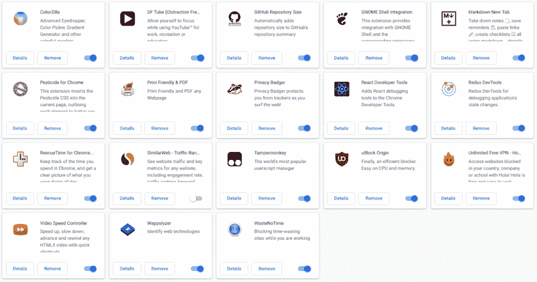
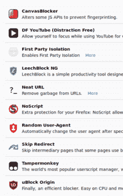

# 日记- 2018.09.26

> 原文：<https://dev.to/miku86/diary---20180926-ggj>

# 我从 Chrome 换到 Firefox 的尝试

今天看了关于 [Google](https://news.ycombinator.com/item?id=18064537) 的新闻，给火狐打了一针新针。

过去我尝试过几次从 Chrome 到 Firefox 的转换，但从未完全完成，总是回到 Chrome，主要是因为我懒得真正进入 Firefox。

我最担心的两个问题是:

1.  日常使用的所有分机都有
2.  足以替代同步我的 Chrome 收藏夹

* * *

## 日常使用的所有分机都有(？！)

[T2】](https://res.cloudinary.com/practicaldev/image/fetch/s--CtikNMlq--/c_limit%2Cf_auto%2Cfl_progressive%2Cq_auto%2Cw_880/https://thepracticaldev.s3.amazonaws.com/i/w80vpnyasbca7yaqeuex.png)

所以我去了[火狐插件](https://addons.mozilla.org)搜索所有扩展。

只有这三个扩展不可用:Markdown New Tab，Pesticide (=> Open Pesticide)，WasteNoTime (=> LeechBlock NG)。

👍

## 足以替代同步我的 Chrome 收藏夹(？！)

我已经找到了 [Firefox Sync](https://www.mozilla.org/en-US/firefox/features/sync/) 和浏览器同步器的[对比。](https://en.wikipedia.org/wiki/Comparison_of_browser_synchronizers)

👍👍

* * *

## 安装火狐

因为我想使用最新的开发者特权，所以我决定使用 Firefox 开发者版。

去了火狐主页，只找到一个`tar.bz2`文件，所以通常只有原始文件，没有自动更新。

我在 Stackoverflow 和 askubuntu 上找了一些说明[如何在 Ubuntu](https://askubuntu.com/questions/548003/how-do-i-install-the-firefox-developer-edition) 上安装火狐开发者版，用了`Ubuntu Make`，因为 PPA 的解决方案确实安装了普通版火狐。

后来，我在一个德国网站上阅读了关于隐私的内容，安装了一些插件(不是全部)，把我的标准搜索引擎改成了 T2 搜索引擎，并做了一些其他设置。

[T2】](https://res.cloudinary.com/practicaldev/image/fetch/s--te8pAVfM--/c_limit%2Cf_auto%2Cfl_progressive%2Cq_auto%2Cw_880/https://thepracticaldev.s3.amazonaws.com/i/ta55yzrnmwg4oe7x9sgc.png)

我设置了一个火狐同步账户，将我的 Chrome 书签导出到一个 HTML 文件中，然后导入火狐。

总之，这花了我 4 个小时，包括创建一个合适的 Ubuntu Dash 快捷方式和其他一些小问题。

* * *

## 见解至此

*   火狐在我的电脑上真的很快(英特尔 i5，8GB 内存，固态硬盘)。在我的 Raspi 上，它慢得令人难以置信，甚至只有一个标签
*   每(！)网页/webapp (dev.to，github，kanbanflow，deepl，tinypng 等。)，没有 JavaScript 就无法使用(我将 NoScript 设置为默认值:无 JS)
*   大多数有用的搜索结果来自谷歌

你有额外的建议或提示吗？