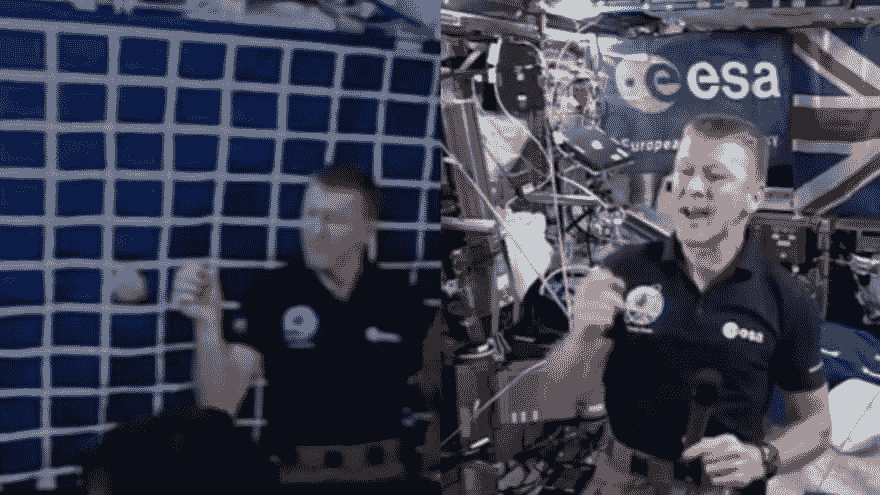
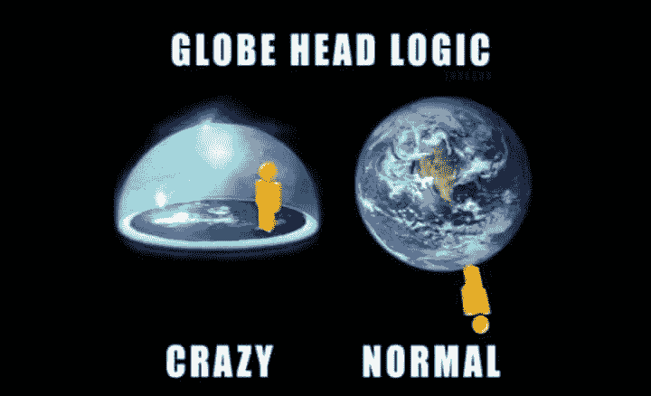
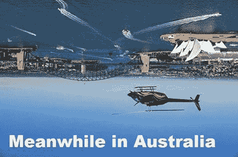
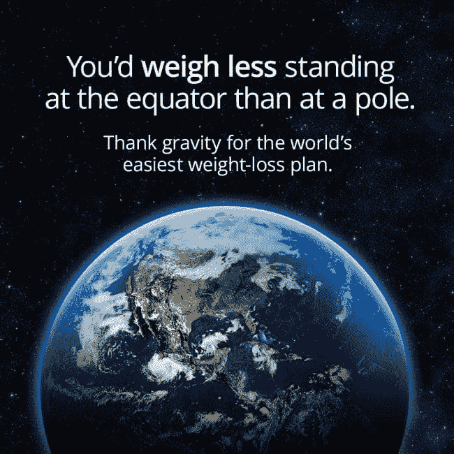
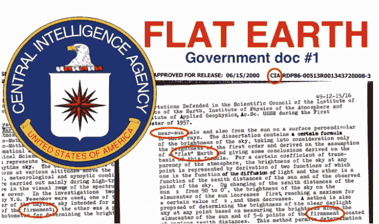
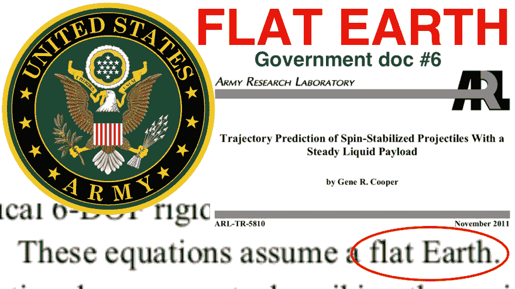
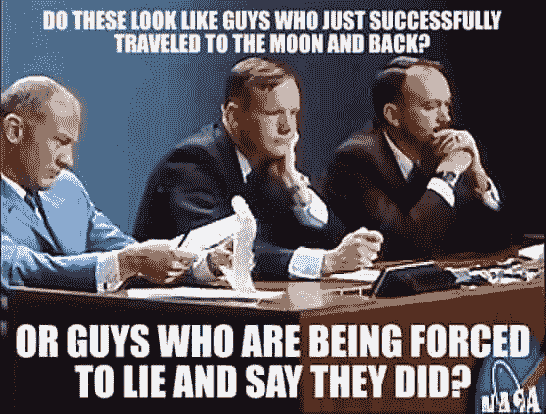
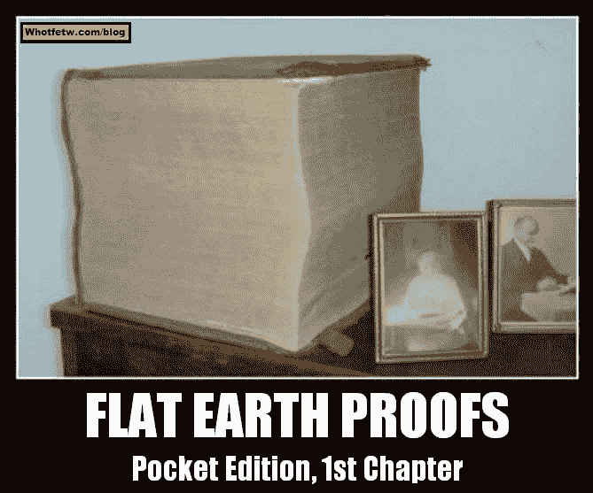

# 你是把房子建在真理的岩石上还是谎言的沙上？

> 原文：<https://dev.to/mcflat/did-you-build-your-house-on-the-rock-of-truth-or-the-sand-of-lies-1n50>

[T2】](https://res.cloudinary.com/practicaldev/image/fetch/s--jY21mY-O--/c_limit%2Cf_auto%2Cfl_progressive%2Cq_auto%2Cw_880/https://thepracticaldev.s3.amazonaws.com/i/mgjiic0u6jvs5gf0nr2x.jpeg)

NASA 我们有个问题。我们的部署脚本不再工作了。

哔哔声...哔哔声...

毫无疑问，在科技行业中，你会遇到“部署”这个术语，对于这个术语，很多人使用火箭发射到“太空”的图像。

[T2】](https://res.cloudinary.com/practicaldev/image/fetch/s--H1tvQ-WT--/c_limit%2Cf_auto%2Cfl_progressive%2Cq_auto%2Cw_880/https://thepracticaldev.s3.amazonaws.com/i/omi55fxani12hnj8w5m2.jpg)

一切都很好，直到这些火箭开始向远处倾斜。然后你可能要开始提问了。我是不是对部署过程过于信任了？这是真的还是只是你的想象？

[T2】](https://res.cloudinary.com/practicaldev/image/fetch/s--vc6Oevsz--/c_limit%2Cf_auto%2Cfl_progressive%2Cq_auto%2Cw_880/https://thepracticaldev.s3.amazonaws.com/i/m8jirnuyqxlsg5a7grty.jpg)

[T2】](https://res.cloudinary.com/practicaldev/image/fetch/s--vG12Q9vq--/c_limit%2Cf_auto%2Cfl_progressive%2Cq_auto%2Cw_880/https://thepracticaldev.s3.amazonaws.com/i/km5exiimq6vkbxdoi2ff.jpg)

看起来这并不重要，但事实是，事情远比看上去的要复杂。

[T2】](https://res.cloudinary.com/practicaldev/image/fetch/s--CNYEo6z4--/c_limit%2Cf_auto%2Cfl_progressive%2Cq_auto%2Cw_880/https://thepracticaldev.s3.amazonaws.com/i/b0xbrfshnnqzctrm0ph5.png)

不仅有很多证明地球真实形状的证据，而且有解密的政府文件证明他们知道真相，只是他们喜欢对你我和其他人隐瞒。我敢打赌，如果你知道现实，你今天的生活会有很大的不同，毫无疑问。

[T2】](https://res.cloudinary.com/practicaldev/image/fetch/s--wgOTWSSS--/c_limit%2Cf_auto%2Cfl_progressive%2Cq_auto%2Cw_880/https://thepracticaldev.s3.amazonaws.com/i/mly42twm6614aoz78j98.jpg)

[T2】](https://res.cloudinary.com/practicaldev/image/fetch/s--6DH_DSxg--/c_limit%2Cf_auto%2Cfl_progressive%2Cq_auto%2Cw_880/https://thepracticaldev.s3.amazonaws.com/i/m9ngvmdrf2qydviyt69s.jpg)

我向你发出挑战，向我证明地球是一个球体！你会发现，甚至有人愿意给任何人 10 万美元，如果他们能证明地球确实是一个球体。如果你能证明给我看，那么毫无疑问你能证明给他们收 100k。你准备好迎接挑战了吗？Youtube 搜索“100000 平地球挑战”，别忘了查看这些频道的其他视频。

[T2】](https://res.cloudinary.com/practicaldev/image/fetch/s--BgsYILx7--/c_limit%2Cf_auto%2Cfl_progressive%2Cq_auto%2Cw_880/https://thepracticaldev.s3.amazonaws.com/i/u8hhccpp0tg1ijlq032a.jpg)

要找到答案，你必须自己去研究。请注意，在野外有相当多的虚假信息，真的只有那些能够放下他们一生中所知道的一切重新开始的人才能找到真相。

[T2】](https://res.cloudinary.com/practicaldev/image/fetch/s--_LxmqDtv--/c_limit%2Cf_auto%2Cfl_progressive%2Cq_auto%2Cw_880/https://thepracticaldev.s3.amazonaws.com/i/fsa7rbmsbrrm6id566ox.jpg)

YouTube 上有很多很棒的视频频道，人们可以在那里谈论不同的话题。有些人知道发生了什么，有些人不知道，所以你必须半信半疑，真正倾听人们的意见，并亲自研究他们在谈论什么。不要仅仅因为某人这么说或者甚至因为他们做了测试就相信他们，亲自去做实际的测试来看看结果。

[T2】](https://res.cloudinary.com/practicaldev/image/fetch/s--2FRopO2G--/c_limit%2Cf_auto%2Cfl_progressive%2Cq_auto%2Cw_880/https://thepracticaldev.s3.amazonaws.com/i/xx0c1cyzvhme07s998oo.jpg)

[https://www.youtube.com/channel/UCG7dQ1yYLMtereOsH80u2jQ](https://www.youtube.com/channel/UCG7dQ1yYLMtereOsH80u2jQ)

如果你追求真理，喜欢阅读绝密文件，可以看看这些 youtube 视频！与其知道谎言还信以为真，不如知道真实的真相！你不会在电视上或学校里听到真正的真相！它不容易找到，当你找到它时，它就像毒品一样。

[https://youtu . be/1 akpcwabbw](https://youtu.be/1aKRPcWAfbw)
[https://youtu . be/pz crsymm 1zm](https://youtu.be/PZcrSyMM1ZM)[【https://youtu . be/sfscvtcdpo](https://youtu.be/SFascvtCDpo)
[https://youtu](https://youtu.be/WLZ9z0vPZ94)

事实上，所有这些我们如此热爱的技术将会被那些控制世界的人用来控制人类，而且很快，时间很短，他们将会被用来杀人。

[T2】](https://res.cloudinary.com/practicaldev/image/fetch/s--fWGrxebW--/c_limit%2Cf_auto%2Cfl_progressive%2Cq_auto%2Cw_880/https://thepracticaldev.s3.amazonaws.com/i/kln8xgiej3t07o38e9wl.jpeg)

在圣经中说，在最后的时代，真相会出现，这只是一个问题，如果你对真相感兴趣，并寻求它，如果它会影响你的生活！他们说地球 500 年来一直是一个球体，但那是谎言，如果你做一些研究，你会发现仅仅在 100 年前，他们会因为一个人在学校教孩子们地球理论而处以私刑。平坦的地球事实上是真理。运行政府的撒旦教徒在对立面上工作！如果你认为“平地球理论”是愚蠢的，那么你太相信这个试图杀死你并偷走你灵魂的系统了！你的灵魂比世界上所有的财富都有价值！寻求真相，它会让你从撒旦的精神控制中解放出来。作为做研究的结果，你会变得真正聪明，做你想做的或者做上帝想做的，你决定吧！

埃隆是个骗子！
[https://youtu.be/Ecjpt9ZFs5g](https://youtu.be/Ecjpt9ZFs5g)

爱因斯坦是个骗子！
[https://youtu.be/BOGa8OQzjQ4](https://youtu.be/BOGa8OQzjQ4)

牛顿是个骗子！牛顿创造了他所谓的万有引力定律！控制我们和我们思想的政府创造了法律，牛顿创造了万有引力定律来隐藏上帝！https://youtu.be/dgGL-7H7vIw
T2

911 是内鬼干的！在 Youtube 上搜索“Russianvids”并查看他的视频，这家伙做了他的研究，如果你是那种希望别人在你说话时也听完你的话的人，请听他说完！https://www.youtube.com/user/BuildingNumber7
[https://www.youtube.com/channel/UCFLyRiIh_37N1OcXlx7FaKQ](https://www.youtube.com/user/BuildingNumber7)
T5

这里有一个播放列表，你可以通过观看来了解更多关于其他人的信息，比如牛顿
[https://www.youtube.com/watch?v=pNe1wWeaHOU&list = ply I 8318 yydkcsz 7 dsyv 01 n6 tzhxa 6 wf 9 I](https://www.youtube.com/watch?v=pNe1wWeaHOU&list=PLYI8318YYdkCsZ7dsYV01n6TZhXA6Wf9i)

这里有一个关于美国宇航局和共济会
[https://youtu.be/MC0c4EyiStU](https://youtu.be/MC0c4EyiStU)

科学主义暴露！你相信真正的科学还是精英们强加给我们的让我们变得愚蠢的假科学？
[https://youtu.be/AeIGrEtPMmE](https://youtu.be/AeIGrEtPMmE)

Youtube 搜索“新时代圣经版本”，看看他们是如何通过添加假圣经来混淆视听的！
[https://youtu.be/OE2gOqpj9jU](https://youtu.be/OE2gOqpj9jU)

Youtube 搜索“约翰·托德”这里有一个播放列表，你有空的时候可以看看。
[https://www.youtube.com/watch?v=WA23geH5OpU&list = plmhktejvqnopqw 9-paosbmxjhgtks 89 LH](https://www.youtube.com/watch?v=WA23geH5OpU&list=PLmhKTejvqnoPQW9-PaOsBmXJhgtks89Lh)

Youtube 搜索“庆祝真理”
[https://www.youtube.com/channel/UCz81IIi1Fu_TRUvrc_iiVDA](https://www.youtube.com/channel/UCz81IIi1Fu_TRUvrc_iiVDA)

Youtube 搜索“呼吁起义”
[https://www.youtube.com/channel/UCv_-yc055n1fxFfTYpdaKBg](https://www.youtube.com/channel/UCv_-yc055n1fxFfTYpdaKBg)

Youtube 搜索“Richie from Boston”
[https://www.youtube.com/user/27TUBGUY](https://www.youtube.com/user/27TUBGUY)

他们的生活是一部纪录片！
[http://truthstreammedia . com/2013/10/02/rowdy-roddy-piper-admisses-they-live-was-actually-a-documentary/](http://truthstreammedia.com/2013/10/02/rowdy-roddy-piper-admits-they-live-was-actually-a-documentary/)
Youtube 搜索“理查布鲁斯”
[https://www.youtube.com/channel/UCY71q12u4OIUJGOg5MAlttQ](https://www.youtube.com/channel/UCY71q12u4OIUJGOg5MAlttQ)

这只是冰山一角，但我们都必须从某个地方开始。如果你真的明智和聪明，那么请为你自己和你的家人做这件事，做研究。

1 你们要向耶和华唱新歌。全地都要向耶和华歌唱。
2 向耶和华歌唱，称颂他的名；天天传扬他的救恩。在列邦中述说他的荣耀，在万民中述说他的奇事。
因为耶和华是至大的，当受极大的赞美；他在万神之上当受敬畏。外邦的神都属虚无，惟独耶和华创造诸天。
6 尊荣和威严在他面前，能力与华美在他圣所。
7 民中的万族啊，你们要将荣耀能力归给耶和华，都归给耶和华。8 要将耶和华的名所当得的荣耀归给他，拿供物来进入他的院宇。当以圣洁的妆饰敬拜耶和华。全地都要在他面前战抖。
10 人要在列邦中说，耶和华作王了。世界就坚定，不得动摇。他要按公义审判众民。愿天欢喜，愿地快乐；愿海和其中所充满的澎湃。
12 愿田和其中所有的都欢乐。那时，林中的树木都要在耶和华面前欢乐
13 因为他来了，他来要审判全地。他要以公义审判世界，以诚实审判万民。

*   诗篇 96-[https://biblehub.com/kjv/psalms/96.htm](https://biblehub.com/kjv/psalms/96.htm)

[T2】](https://res.cloudinary.com/practicaldev/image/fetch/s--demeHqjK--/c_limit%2Cf_auto%2Cfl_progressive%2Cq_auto%2Cw_880/https://thepracticaldev.s3.amazonaws.com/i/elf6v2a9znthj7k8cws9.jpg)

太阳之前创造的地球

创世纪 1:1-19

宇宙是完整的，不会膨胀

创世纪 2:1

地球测量未知

约伯记 38:4-5，耶利米书 31:37，箴言 25:3

地球是一个圆盘/圆圈，不是一个球

以赛亚书 40:22，约伯记 38: 13-14

用直线而不是曲线来测量地球

约伯记 38:4-5

道路是直的，不是弯曲的

撒母耳记上 6:12，诗篇 5:8，诗篇 27:11，以赛亚书 40:3，耶利米书 31:9，马太福音 3:3，马可福音 1:3，路加福音 3:4，约翰福音 1:23，使徒行传 16:11，使徒行传 21:1，希伯来书 12:13

水是直的，不是弯曲的

伯 37:10

地震震动地球，但它并不移动

撒母耳记下 22:8，以赛亚书 13:13，启示录 6:12-13

地球是固定不动的

历代志上 16:30，诗篇 33:9，诗篇 93:1，诗篇 96:10，诗篇 104:5，诗篇 119:89-90，以赛亚书 14:7，以赛亚书 45:18，撒迦利亚书 1:11

不要作声，要知道我是神

诗篇 46:10

地球有柱子，没有悬挂在任何东西上

撒母耳记上 2:8，约伯记 9:6，约伯记 26:7，诗篇 75:3，彼得后书 3:5

地球有一个面(几何平面)

创世纪 1:29，创世纪 4:14，创世纪 6:1，创世纪 6:7，创世纪 7:3，创世纪 7:4，创世纪 8:9，创世纪 11:8，创世纪 11:9，创世纪 41:56，出埃及记 32:12，出埃及记 33:16，民数记 12:3，申命记 6:15，申命记 7:6，撒母耳记上 20:15，列王记上 13:34，约伯记 37:12，诗篇 104:30，耶利米书 25

水有一个面(一个几何平面)

创世纪 1:2，创世纪 7:18，约伯记 38: 30

地球有尽头

申命记 28:49，申命记 28:64，申命记 33:17，撒母耳记上 2:10，约伯记 37:3，约伯记 38:13，诗篇 46:9，诗篇 48:10，诗篇 59:13，诗篇 61:2，诗篇 65:5，诗篇 67:7，诗篇 72:8，诗篇 98:3，诗篇 135:7，箴言 8:29，箴言 17:24

地球有角落

以赛亚书 11:12，启示录 7:1

苍穹/穹顶

创世纪 1:6-8，创世纪 1:14-18，创世纪 1:20，创世纪 7:11，创世纪 8:2，约伯记 37:18，诗篇 19:1，诗篇 150:1，以赛亚书 40:22，以西结书 1:22-26，以西结书 10:1，但以理书 12:3

太阳在移动，而不是地球

创世纪 15:12，创世纪 15:17，创世纪 19:23，创世纪 32:31，出埃及记 17:12，出埃及记 22:3，出埃及记 22:26，利未记 22:7，民数记 2:3，民数记 21:11，民数记 34:15，申命记 4:41，申命记 4:47，申命记 11:30，申命记 16:6，申命记 23:11，申命记 24:13， 诗篇 113:3 传道书 1:5，以赛亚书 41:25，以赛亚书 45:6，以赛亚书 59:19，耶利米书 15:9，但以理书 6:14，阿摩司书 8:9，约拿书 4:8，弥迦书 3:6，那鸿书 3:17，玛拉基书 1:11，马太福音 5:45，马可福音 16:2，以弗所书 4:26，雅各书 1:11

太阳停止移动

以赛亚书 60:20，约伯记 9:7，约书亚记 10:12-14，哈巴谷书 3:11

太阳向后移动

列王纪下 20:8-11

月亮有它自己的光

创世纪 1:16，以赛亚书 13:10，以赛亚书 30:26，以赛亚书 60:19-20，耶利米书 31:35，马太福音 24:29，马可福音 13:24，以西结书 32:7，启示录 21:23

高空视角

但以理书 4:11，但以理书 4:20，马太福音 4:8

每个人都看到耶稣

启示录 1:7

新耶路撒冷这个巨大的立方体

启示录 21:15-17

地球的“宽度”，平展开来

启示录 20:9

1537 年的马修斯圣经说“平坦的地球”

撒母耳记下 11:11

创世崇拜者

申命记 4:19，申命记 17:3，列王纪下 23:5，耶利米书 8:2

神的话永远是信实和真实的

耶利米书 42:5，启示录 3:14，启示录 19:11，启示录 21:5，启示录 22:6

约 3:12 我对你们说地上的事，你们尚且不信，若对你们说天上的事，怎能信呢？

耶稣基督是主，是万王之王！