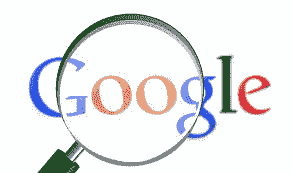

# 你知道谷歌是一个邪恶的垄断吗？

> 原文：<https://dev.to/bobnadler/did-you-know-that-google-is-an-evil-monopoly--16ma>

 
参见:[谷歌的问题以及你为什么要在意](http://bobonmedicaldevicesoftware.com/blog/2018/03/03/the-problem-with-google-and-why-you-should-care/)

阅读 [Medgadget 文章](https://www.medgadget.com/2018/03/google-serfdom-publishing-digital-age.html)对我来说是一个真正的警钟，但我怀疑大多数人没有意识到谷歌的行为继续对创新和在线内容产生重大影响。这已经持续了很长时间，但似乎仍然是一个保守得很好的秘密。

问题:

1.  对于谷歌员工:你知道你为一个邪恶的垄断者工作吗？
2.  对其他人来说:你知道谷歌是邪恶的垄断吗？
3.  您是否曾直接受到此影响(例如，失败的启动)？