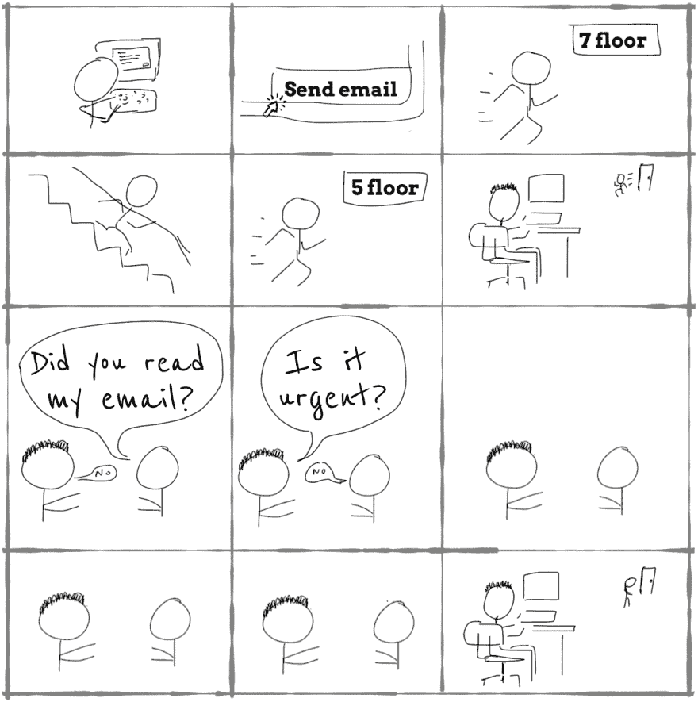

# 你看了我的邮件吗？

> 原文：<https://dev.to/danlebrero/did-you-read-my-email-2b7e>

[T2】](https://res.cloudinary.com/practicaldev/image/fetch/s--LYli83Bn--/c_limit%2Cf_auto%2Cfl_progressive%2Cq_auto%2Cw_880/http://danlebrero.cimg/blog/did-you-read-my-email.png)

把我所有的喜爱献给那个老朋友，他过去常常这样做，但从来没有意识到这是多么令人讨厌。

我即将在 WeAreDevelopers 2018 上发表的会议演讲“高效开发者的习惯”的一部分。