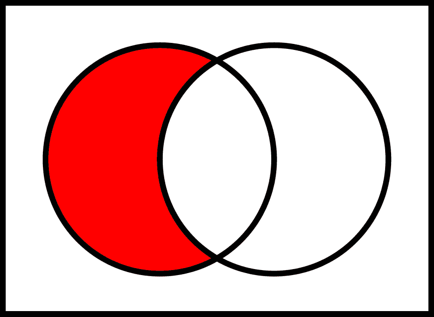

# Ruby 数组中的差、并和交

> 原文：<https://dev.to/tonioriol/difference-union-and-intersection-in-ruby-arrays-5hb1>

它是用基本操作符而不是方法来完成的:`-`表示差，`|`表示并，`&`表示交。

一个重要的细节是，所有重复的项目都会自动删除。这使得一个数组能够找到它自身的交集:`[1, 1, 2] & [1, 1, 2] = [1, 2]`。

### 区别

[T2】](https://res.cloudinary.com/practicaldev/image/fetch/s--lxRAjaZo--/c_limit%2Cf_auto%2Cfl_progressive%2Cq_auto%2Cw_880/https://thepracticaldev.s3.amazonaws.com/i/mlusgek25ysbdg49lsnl.png)

```
[1, 2, 3] - [3, 4, 5] = [1, 2]

[3, 4, 5] - [1, 2, 3] = [4, 5] 
```

总之，它返回只存在于第一个数组中的唯一值。

### 工会

[T2】](https://res.cloudinary.com/practicaldev/image/fetch/s--m3IIqN8F--/c_limit%2Cf_auto%2Cfl_progressive%2Cq_auto%2Cw_880/https://thepracticaldev.s3.amazonaws.com/i/yglqkaqwi6wcdlafvobg.png)

```
[1, 2, 1, 2, 3] | [1, 2, 3, 4] = [1, 2, 3, 4] 
```

### 交集

[T2】](https://res.cloudinary.com/practicaldev/image/fetch/s--STLm9wDq--/c_limit%2Cf_auto%2Cfl_progressive%2Cq_auto%2Cw_880/https://thepracticaldev.s3.amazonaws.com/i/4ci0qs73r29xe1g3sppf.png)

```
[1, 1, 3, 5] & [1, 2, 3] = [1, 3] 
```

来源:[https://www . endpoint . com/blog/2011/06/07/using-set-operators-with-ruby-arrays](https://www.endpoint.com/blog/2011/06/07/using-set-operators-with-ruby-arrays)