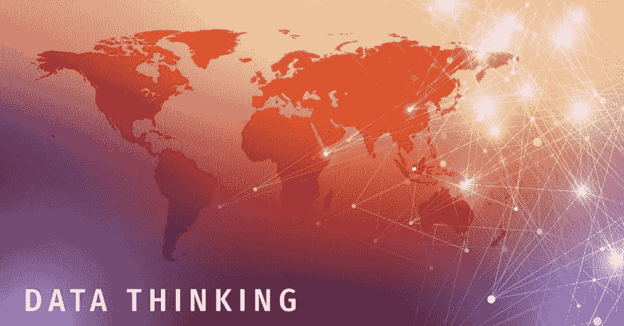

# 数字化转型:一切从数据思维开始

> 原文：<https://dev.to/scalegrid/digital-transformation-it-all-starts-with-data-thinking-2ni4>

[T2】](https://res.cloudinary.com/practicaldev/image/fetch/s--WTzuQxb2--/c_limit%2Cf_auto%2Cfl_progressive%2Cq_auto%2Cw_880/https://mongodb.scalegrid.io/hubfs/Digital-Transformation-It-All-Starts-With-Data-Thinking-ScaleGrid-Blog-493336-edited.jpg)

每隔几年，技术模式和数字杠杆都会发生范式转变。最近是数字颠覆的时代，这是因为组织需要进行数字化转型才能在竞争中生存。物联网(IoT)、人工智能、机器人流程自动化、机器学习和区块链等新技术平台和服务已经开始产生红利，丰富了数字化转型之旅，并创造了新的摇滚明星:数据。甚至像首席数据官、首席数字官之类的 rew 角色也突然出现来驾驭数据的力量。

阅读原文: **[数字化转型:一切从数据思维开始](https://scalegrid.io/blog/digital-transformation-it-all-starts-with-data-thinking/)**

如今，围绕数字化转型战略的每个组织决策都是由数据驱动的。无论是 **[优化库存水平](https://scalegrid.io/blog/introduction-to-redis-data-structures-sets/)** ，减少供应商的交货时间，还是为客户群设计定价和促销策略，所有决策都需要数据来了解哪些方面可以改进，从而为组织赢得竞争优势。随着企业以极快的速度进行数字化、数字化和数字化转型(是的， **[有所不同](https://www.forbes.com/sites/jasonbloomberg/2018/04/29/digitization-digitalization-and-digital-transformation-confuse-them-at-your-peril/#291cf5e32f2c)** ),新的企业和商业模式不断发展，业务流程和技术之间的界限变得模糊，一个元素仍然是一个恒定的分母。你猜对了，数据。

正如组织决策的演变一样，数据也经历了重大的转变。它成倍增长，爆炸式发展，变得普遍和民主化。在当今数字时代，数据是组织最有价值的资产。商家可以通过数据改造自己，数据通过数字化改造。

然而，有多少数字节目是从数据开始的呢？ **[福布斯](https://www.forbes.com/sites/brucerogers/2016/01/07/why-84-of-companies-fail-at-digital-transformation/#a8411e9397bd)** 估计 8 个数字化转型项目中有 7 个失败[。](https://www.forbes.com/sites/brucerogers/2016/01/07/why-84-of-companies-fail-at-digital-transformation/#a8411e9397bd)举一个亲身经历来说，一家领先的零售商实施关键的数字化转型计划已进入第四个年头，该计划将影响从商品销售到订单履行等各个重要业务流程。已经投入了大量投资，包括软件许可和支持成本，以及开发、测试和咨询时间，但该计划被认为是失败的，因为它甚至在任何功能打开之前都没有达到每一个 ROI 指标。我与新加入的 IT 副总裁(他最终聘请我的组织进行调查和重新实施)一起工作，我们震惊地发现，应用程序有效所需的底层数据中只有极小一部分是可用、干净、同步、一致甚至有效的。新的 IT 副总裁搁置了该计划，并在重新启动数字化转型计划之前执行了一个新的数据清理项目。我很高兴地说，经过三年多的时间，它已经成功推出，该公司正在收获一个设计良好、无缝连接的数字零售平台的回报。

数据是贯穿组织系统的命脉，无论是流程、工作流、ERP、应用程序、配送中心、数据中心，只要是你能想到的。它在程序或过程开始之前就开始了。高质量的数据是成功数字化转型的开始(也是结束)。从数据思维开始。

**[数据思维](https://wiki2.org/en/Data_thinking)** 的官方定义是在挑选一个主题开始、识别其部分或组成部分、以与过程的动机和发起相关的信息方式组织和描述它们的过程中观察到的一般思维模式。这是数字化的先决条件。

换句话说，数据思维是一种数据驱动型转变的整体方法，旨在创造一种智能利用和消费数据的文化。它是对数据的作用、存在理由、消费、对底层逻辑的内部和外部影响、变化、模式的深入理解，以及灌输意识、开放创新和采用以建立数据思维文化。