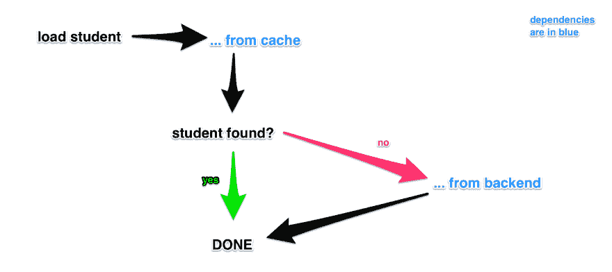

# 发现和提取依赖关系

> 原文：<https://dev.to/wolframkriesing/discover-and-extract-dependencies-16ip>

在重构一些测试不佳的代码时，我如何提取依赖关系的模式出现了。实际意图是提高可测试性。在这种情况下，依赖注入是帮助我的工具。阅读这里，找出我发现的分离依赖关系的步骤。

## 浮现的图案(快速版)

从本文中，您可能会了解到，为了更好地了解代码的依赖关系，如何将它们分开并使代码易于测试，这些步骤都是必要的。

这些步骤是:

1.  编写第一个测试
2.  在测试中找到并使用第一个依赖项
3.  隔离依赖关系
4.  提供生产/默认依赖关系

最后你会得到

*   快速和小型测试
*   分离的依赖关系
*   也许是关于如何模块化代码的提示

## 任务

[](https://res.cloudinary.com/practicaldev/image/fetch/s--ZPUtoqL6--/c_limit%2Cf_auto%2Cfl_progressive%2Cq_auto%2Cw_880/http://picostitch.com/blog/2017/03/discover-extract-dependencies/load-student-flow.png)

*loadStudent 函数流*

我想展示如何分离最初可能不明显的依赖关系。通过添加测试，我将“感觉”到它们。我将被迫把他们分开。这使得我的代码更容易测试，也让我了解代码有什么(外部)依赖。

我分解了原始代码，以真正突出实际的依赖关系。代码加载了一些数据，在这个例子中是一个学生。为了提高性能，首先从缓存中读取学生，如果失败，则从(较慢的)后端加载。

让我们开始吧。

此代码被**遗漏检测**。所以我会开始添加它们。起点是下面的代码。

```
import { fetch } from './backend';

const cache = {};
const loadStudent = ({ studentId }) => {
  if (!cache[studentId]) {
    cache[studentId] = fetch({ studentId });
  }
  return cache[studentId];
}; 
```

## 第一次测试

我写的第一个测试是针对缓存的(见提交)。实际上，我不确定这是不是应该写的测试，因为 fetch 更重要。但是不管怎样？我遵循代码的流程。

```
describe('Load a student', () => {
  it('from the cache', () => {
    cache[42] = 'student 42';
    const student = loadStudent({ studentId: 42 });
    assertThat(student, equalTo('student 42'));
  });
}); 
```

首先跳出来的是 ***全局*** `cache`变量的共享。生产代码和测试现在通过访问一个全局变量来共享它。吓人。这可不好。在这种情况下，我想控制缓存，所以我需要注入它。这是我的第一个结论，也是我发现的第一个依赖。注:第一依赖`cache`。

## 先隔离依赖

我重写测试(并使其失败)，我将`cache`作为参数传递给函数([参见提交](https://gitlab.com/wolframkriesing/article-discover-extract-dependencies/commit/2c485ba353c252e913d8430a49cda39894f30431))。我分离出第一个依赖项。至少在测试中，它现在被隔离了。

```
it('from the cache', () => {
  const cache = { 42: 'student 42' }; // <<< no more globals :)
  const student = loadStudent({ studentId: 42, cache });
  assertThat(student, equalTo('student 42'));
}); 
```

为了使这个测试绿色，我需要改变产品代码。我需要
使用通过参数给定的缓存。

我将改变产品代码，功能`loadStudent()`而不需要测试。`fetch()`方法还没有被测试。没错。我暂时没意见。

```
const loadStudent = ({ studentId, cache }) => {
  if (!cache[studentId]) {
    cache[studentId] = fetch({ studentId });
  }
  return cache[studentId];
}; 
```

不再有全局`cache`变量。非常适合测试。但实际上，真正的缓存功能丢失了。因为不再有全局高速缓存。没错。这是一个真正的问题。我马上会谈到这一点。坚持住！让我们先清理一下。

## 分隔依赖关系

首先，我想稍微重构一下代码。参数很好，析构也使得有命名参数更好。但是我认为`studentId`和`cache`是两种不同的参数。`studentId`是这个函数需要的实际参数，以便做一些有用的事情。而`cache`是一个注入依赖。我想在函数中说明这一点。所以我把它们分开了([提交](https://gitlab.com/wolframkriesing/article-discover-extract-dependencies/commit/a17fec979562c0d58311b87bf431a8542878212f))。

```
const loadStudent = ({ studentId }, { cache }) => {
  // ...
}; 
```

因为我喜欢明确性，所以我不喜欢析构第二个参数，而是命名整个参数，就像这样( [commit](https://gitlab.com/wolframkriesing/article-discover-extract-dependencies/commit/ce657f84069e27a4640c8fa0759b7fe7a5bf2bae) ):

```
const loadStudent = ({ studentId }, dependencies) => {
  // ...
}; 
```

这将在代码中冒泡，函数`cache`将需要由`dependencies.cache`替换。这需要编写更多的代码，但是代码的每个读者都会从中受益。很明显，高速缓存是一种依赖，而不是该功能的主要关注点。缓存如何工作在这里并不重要。我个人很喜欢这一点，并认为它为任何未来的读者增加了代码的价值。

## 发现第二个依赖项，`fetch()`功能

让我们解决一个未解决的问题，那就是测试`fetch()`函数。目前，它是一个全局函数。所以我们现在把它当作一个讨厌的全局函数，并在下面的测试中覆盖它( [commit](https://gitlab.com/wolframkriesing/article-discover-extract-dependencies/commit/aaf3278c68aaf39b060585b9b309f3a1295a0bbc) )。

```
it('fetch the student if not in the cache', () => {
  let emptyCache = {};
  fetch = () => 'student 23';
  const student = loadStudent({ studentId: 23 }, { cache: emptyCache });
  assertThat(student, equalTo('student 23'));
}); 
```

我们**现在知道了**，因为`fetch()`被用在了`loadStudent()`的内部。这种知识不在我们的测试中，这也很糟糕。我们需要让这一点显而易见。

## 注入第二个依赖项

我们通过(跟我说)是的，正确的:**注入依赖** ( [提交](https://gitlab.com/wolframkriesing/article-discover-extract-dependencies/commit/9d808180666de271e1c7a37e4e2a4f96add0b08f))来使这一点变得明显。

```
it('fetch the student if not in the cache', () => {
  const emptyCache = {};
  const dependencies = { cache: emptyCache, fetch: () => 'student 23' };
  const student = loadStudent({ studentId: 23 }, dependencies);
  assertThat(student, equalTo('student 23'));
}); 
```

查看在`dependencies`对象中传递的`fetch()`。并且不再覆盖任何全局变量。

## 提供生产依赖关系

现在我们已经确定了所有的依赖项。我们有`cache`和`fetch()`(尽管`fetch`是一个相当糟糕的名字)。这两个依赖项可以被注入，函数使用它们工作。现在，我们不仅要运行测试，还要进行生产设置。为此，我们也需要提供对它的依赖。

怎么会？让我们为它尝试一个集成测试，它采用一个工作缓存和一个给定的工作`fetch()`函数([提交](https://gitlab.com/wolframkriesing/article-discover-extract-dependencies/commit/5f18dfbdc69fc38f4ee636f04aac286072ecdac8))。

```
describe('Load a student', () => {
  it('from the cache', () => {
    const student = loadStudent({ studentId: 42 });
    assertThat(student, equalTo(''));
  });
}); 
```

如您所见，该测试假设 1)没有 ID 为 42 的学生，2)对该学生的提取返回一个空字符串。是的，我们假设这些外部依赖在我们的控制之下，我们知道这些事情。

部署它并让它在真实的 CI 环境中运行，可能需要进行更多的设置，以便为这些集成测试提供正确的数据。让它们稳定下来可能还需要更多的工作。这就是为什么一个人应该很好地弄清楚什么是正确的测试集(大部分是愉快的路径)。如果你在你的代码中使用了很多，也要考虑到它们必须保持可维护性！这里的这个例子是为了理解一个安全的软件可能不仅仅由微小的测试组成(我是在防止“单元测试”这个被污染的名字)。

为了让这个测试绿色，我们设置了我们的生产环境将使用的默认依赖项。还有许多注入依赖关系的其他方法。到目前为止，下面的方法对我来说效果很好。但是请记住，要尽可能保持注入的依赖关系尽可能小，这将很好地为您服务。

```
const defaultDependencies = () => {
  return { fetch, cache };
};

const loadStudent = ({ studentId }, dependencies = defaultDependencies()) => {
  // ...
}; 
```

正如你在上面看到的，我在函数上面定义了`defaultDependencies`。大部分只包括一些进口商品。我们可以更进一步，将它移出，只在这个文件中注入一个结构。我看到这种不太通用、更明确的方法一直工作得很好，并且允许(代码的)读者看到依赖项由什么组成，以及它们在哪里被使用。

为什么是函数`defaultDependencies()`而不仅仅是一个简单的对象？简单回答，一个函数让它变懒。在不需要依赖关系之前，它们不会得到解决，这可能会影响调用堆栈。如果需要的话，它还允许配置一个依赖项。

## 还剩下什么？

变量`cache`现在是一个非常简单，非常愚蠢的缓存。这很酷。但是考虑到一个缓存，可能有更多的东西。我可能想创建一个简单的 API 来读取和写入缓存。

`fetch()`本身就是一个非常通用的名字。但是它可以更好地命名，比如`readFromBackend()`或者`loadStudentFromStorage()`。背后可能只是简单的`fetch()`功能，这是次要的。

也许让它异步会是一个不错的附加功能。这很容易，但不幸的是，这也涉及到测试代码的变化。但这是 JavaScript 的本质，它不能简单地在代码中隐藏异步性。

## 结论

可以通过为未测试的代码编写测试来分离依赖关系。看起来像是把代码炸了？再想想！它还在您可能不希望耦合的地方解耦您的代码。脱钩就像每个人用不同的杯子从同一个瓶子里喝水，为了不分享所有的细菌。纯粹是卫生。