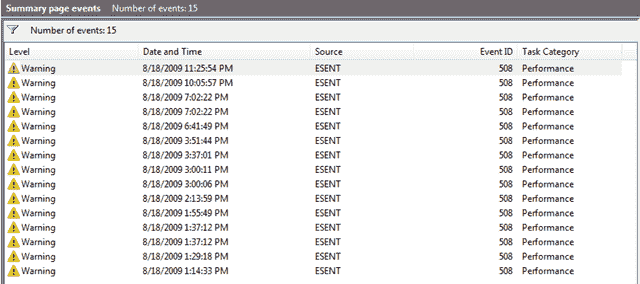

# Windows Server Essentials 的磁盘问题

> 原文：<https://dev.to/jermdavis/disk-problems-with-windows-server-essentials-kfg>

几年前[我给自己写了一些关于在英特尔 NUC 硬件上设置 Windows Server Essentials 的笔记](https://jermdavis.wordpress.com/2014/06/16/fun-with-nuc-servers/)。最近，我对其中一台机器进行了升级，结果陷入了痛苦的世界。谷歌在帮助我尝试解决这个问题的信息上非常单薄，所以我认为这需要写下来…

## 这一切是如何开始的……

我的服务器已经安静而愉快地运行了几年，但是我最近意识到我有两个问题。一个明显的问题是，我在服务器上安装的 1TB 硬盘上的磁盘空间快用完了，所以我认为是时候将它升级到 2TB 的硬盘了。第二个问题是，我开始看到很多我不喜欢的事件日志消息。最令人担忧的错误是由“ESENT”子系统引发的，包括错误 IDs 510、508、533。我会发现我的事件日志是这样的:

[T2】](https://jermdavis.files.wordpress.com/2018/05/e244dd62558553460bab4d622839bc83.png)

附带的错误消息看起来有点吓人:

`A request to write to the file "[some file name]" at offset 229376 (0x0000000000038000) for 4096 (0x00001000) bytes succeeded, but took an abnormally long time (28 seconds) to be serviced by the OS. This problem is likely due to faulty hardware. Please contact your hardware vendor for further assistance diagnosing the problem.`

问题中的文件略有不同，但通常看起来与 Windows 本身有关。值得注意的是，在每一个错误前后的一小段时间内，计算机通常没有反应。

因此，鉴于 Windows 说“硬件故障”，我知道我需要更多的磁盘空间，我决定肯定是时候换个新硬盘了。

## 但情况变得更糟了……

所以在快速点击了一些出售硬盘的网站后，我给自己订购了一个 2TB 的硬盘。当它出现时，我使用了一些[磁盘镜像软件将数据从旧驱动器克隆到新的](https://www.macrium.com/reflectfree)驱动器，希望避免重新安装 Windows，我将新的驱动器放入机器并再次启动。

并且错误仍在生成…

我尝试重新安置所有电缆，并再次重启。错误仍在发生。

我尝试更换驱动电缆。错误仍在发生。

我试了另一个硬盘。错误仍在发生。

我试了另一块同型号的主板。错误仍在发生。我试着更新服务器的 bios。错误仍在发生。

我尝试在新硬盘上全新安装最新版本的 Windows Server Essentials。错误仍在发生。我尝试了一款更新的 NUC 车型。错误仍在发生。

在这一点上，我可能使用了一些相当强烈的语言。已经改变了机器的每个方面，我仍然看到同样的错误。不一定是立即，但值得注意的是，当我试图运行 Windows Update 时，我会开始在日志中看到 ESENT 错误，Windows Update 将永远不会成功安装更新。(让它过夜——这似乎是一个足够长的等待时间)

## 找到解决方案…

我将为您节省大约两周的描述，进一步搜索，重启，重新安装散热器，重新安装 Windows，并在这一点上敲打我的头。

但最终我发现了一些博客帖子，这些帖子谈到了 [PCI 电源管理](https://www.wintips.org/fix-windows-10-freezing-bsod-restart-issues/)导致[挂起和潜在的磁盘问题](https://blogs.technet.microsoft.com/kevinholman/2013/06/21/event-id-129-storachi-reset-to-device-deviceraidport0-was-issued/)。虽然这些并没有谈到我的具体硬件或问题，但这让我想到，也许我应该检查一下该硬件的电源管理功能和 Windows Server 2016 的默认安装的设置。在大多数情况下，它们似乎被设置为“尝试并节省能量”。所以我试着调整以下设置:

*   我更改了 BIOS 电源管理设置，以防止它降低性能来节省能源。
*   我更改了 Windows 电源选项“AHCI 链接电源管理”设置以关闭它们，并防止 Windows 关闭与这些设备的连接。

完成后，我的日志中不再出现 ESENT 错误。

我从提升的命令提示符下运行“SFC /scannow”命令，并允许它修复一些不满意的系统文件。这样做后，我发现我终于可以成功运行 Windows Update 了。

发出一声如释重负的巨大叹息。

我仍然偶尔看到来自“磁盘”子系统的错误 ID 153 的实例，在系统日志中出现类似于“`The IO operation at logical block address 0x5a9088 for Disk 0 (PDO name: \Device\00000036) was retried.`”的消息。但就我的搜索而言，这实际上并不是一个问题，只是最近的 windows 版本更积极地记录了一些过去被视为不重要并被悄悄忽略的内容。

所有这些混乱让我相信我原来的硬盘从来没有任何问题，所有这一切都是由 Windows 中的一些变化引起的，这些变化导致它对这些磁盘电源管理问题更加敏感，或者只是开始记录它实际上一直遇到的错误。

## 我需要改变的其他事情

所有的重建工作都指出，自从我上次尝试以来，在 NUCs 上安装这个软件的其他一些事情已经发生了变化:

*   随着新硬件的推出，英特尔终于为其以太网卡提供了 Windows 服务器驱动程序，因此您不必再为了让有线局域网工作而修改驱动程序设置文件。这是一件好事。
*   默认安装似乎无法正确配置时间同步。[您可能会看到(并需要纠正)关于此](https://enterpriseit.co/windows-server/configure-time-service/)的日志错误。
*   如果您有使用 RDP 连接到最近打了补丁的服务器的旧机器，[您可能需要解决与加密错误相关的安全设置，当您尝试连接](https://support.microsoft.com/en-gb/help/4295591/credssp-encryption-oracle-remediation-error-when-to-rdp-to-azure-vm)时，该错误会抛出关于“CredSSP”和“Oracle remediation”的警告。
*   您可能会看到许多关于使用签名提高 LDAP 安全性的日志消息。[如果您不支持传统的 ldap 客户端，请启用签名以消除消息](https://support.microsoft.com/en-gb/help/935834/how-to-enable-ldap-signing-in-windows-server-2008)。

所以让我的服务器恢复速度是一个漫长而痛苦的过程。但我现在运行的是[一个漂亮的新 NUC](https://www.intel.co.uk/content/www/uk/en/products/boards-kits/nuc/boards/nuc7i3dnbe.html) ，我还借此机会安装了“[我的 Alexa 媒体](https://www.mymediaalexa.com/)服务器，这样我现在就可以享受试图让我的亚马逊 Echo 理解我让它播放我的 MP3 收藏中特定曲目的挫败感了。

Fingres crossed 我很长一段时间都不用重新安装了…