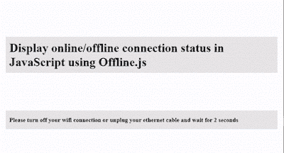

# 使用 Offline 在 JavaScript 中显示在线/离线连接状态。射流研究…

> 原文：<https://dev.to/skptricks/display-onlineoffline-connection-status-in-javascript-using-offlinejs-m04>

Post 链接:[使用 Offline 在 JavaScript 中显示在线/离线连接状态。Js](https://www.skptricks.com/2018/03/display-online-offline-connection-status-using-javascript.html)

在本教程中，我们将学习如何使用 Offline.js 在 Javascript 中显示离线/在线连接状态。Offline.js 是一个在用户失去互联网连接时自动提醒用户的库，就像脸书的 Gmail 一样。

[T2】](https://res.cloudinary.com/practicaldev/image/fetch/s--REUxDqsL--/c_limit%2Cf_auto%2Cfl_progressive%2Cq_66%2Cw_880/https://4.bp.blogspot.com/-WR6yvMApZzA/Wq0Wd6CdSDI/AAAAAAAABak/krT5GaApeAAKonVA2lLzFuWxq79_A4FtQCLcBGAs/s400/1.gif)

最棒的是，它可以捕获连接中断时发出的 AJAX 请求，并在连接恢复时重新创建这些请求，因此您的应用程序可以完美地做出反应。

[https://www.youtube.com/embed/QEE3uZcGgEg](https://www.youtube.com/embed/QEE3uZcGgEg)

[**下载源代码**](https://www.skptricks.com/2018/03/display-online-offline-connection-status-using-javascript.html)