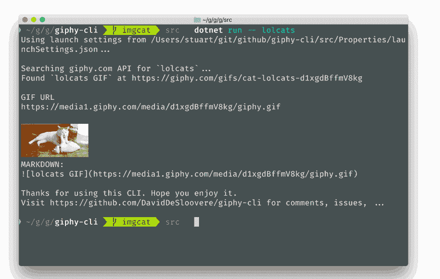

# 在 iTerm 中显示图像。NET 控制台应用程序

> 原文：<https://dev.to/stuartblang/displaying-images-in-iterm-from-net-console-apps-3i39>

现在，dotnet 全球工具已经成为现实，我们看到了用 dotnet 构建的新的跨平台命令行应用程序的爆炸式增长。最近的一个例子是 Giphy CLI T1，这是一个从 giphy.com 快速获取 gif url 和准备粘贴的 markdown 片段的工具。

使用 Mac 时，我最喜欢的终端是 [iTerm2](https://iterm2.com/) ，它有很多很酷的功能，[包括可以在控制台上显示图像](https://iterm2.com/documentation-images.html)！所以我认为在 Giphy CLI 中加入这个特性会很棒，但首先，它是如何工作的？

### 来自单据的指令

iTerm2 用一组专有的转义序列扩展了 xterm 协议。一般来说，模式是:

`ESC ] 1337 ; key = value ^G`

这里显示空白是为了便于阅读:实际上，不应该使用空格。

对于文件传输和内嵌图像，代码为:

`ESC ] 1337 ; File = [optional arguments] : base-64 encoded file contents ^G`

### [T1。净实施](#net-implementation)

所以说实话，从大部分的试错中，我发现这就是你需要做的。网络:

```
Console.Write("\u001B]1337");
Console.Write(";File=;inline=1:");
Console.Write(Convert.ToBase64String(imageBytes));
Console.Write("\u0007"); 
```

其中`imageBytes`是您想要显示的图像的字节。您可能还想首先检测您是否正在 iTerm 中运行，如果是这样，就只运行这段代码。谢天谢地，iTerm 设置了一个我们可以使用的环境变量，名为`TERM_PROGRAM`，在 iTerm 下运行的情况下，这个变量的值为`iTerm.app`。让我们这样做:

```
if (Environment.GetEnvironmentVariable("TERM_PROGRAM") == "iTerm.app") 
{
    Console.Write("\u001B]1337");
    Console.Write(";File=;inline=1:");
    Console.Write(Convert.ToBase64String(imageBytes));
    Console.Write("\u0007");
} 
```

结果如下:

[T2】](https://res.cloudinary.com/practicaldev/image/fetch/s--g2ikg3MF--/c_limit%2Cf_auto%2Cfl_progressive%2Cq_66%2Cw_880/https://stu.dev/conteimg/2018/09/giphy-animated-gif-1.gif)

你可以[看到这个 PR 的完整工作示例](https://github.com/DavidDeSloovere/giphy-cli/pull/2/files)。

感谢 David De Sloovere 构建了这个很酷的小工具。