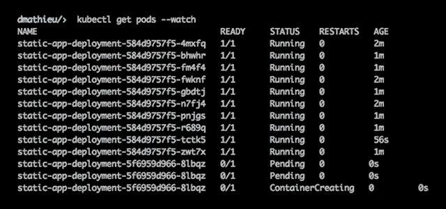

# 剖析 Kubernetes 部署

> 原文：<https://dev.to/heroku/dissecting-kubernetes-deployments--16ej>

这篇文章最初出现在 Heroku 的[工程博客](https://blog.heroku.com/engineering)上。

Kubernetes 是一个起源于谷歌的容器编排系统，现在由 T2 云计算基金会维护。在这篇文章中，我将剖析一些 Kubernetes 的内部机制——特别是，[部署](https://kubernetes.io/docs/concepts/workloads/controllers/deployment/)以及如何处理新容器的逐步推出。

## 什么是部署？

Kubernetes 文档是这样描述部署的:

> 部署控制器为单元和副本集提供声明性更新。

一个 [Pod](https://kubernetes.io/docs/concepts/workloads/pods/pod/) 是一组一个或多个容器，可以在一个集群内启动。手动启动的 pod 不会非常有用，因为如果它崩溃了，它不会自动重启。一个[副本集](https://kubernetes.io/docs/concepts/workloads/controllers/replicaset/)确保一个 Pod 规范总是以设定数量的副本运行。它们允许启动同一个 Pod 的几个实例，如果其中一些实例崩溃，它们会自动重启。部署位于副本集之上。它们允许无缝地推出应用程序的新版本。

下面是一个基本应用程序中的滚动部署示例:

[T2】](https://res.cloudinary.com/practicaldev/image/fetch/s--gh0CKQTm--/c_limit%2Cf_auto%2Cfl_progressive%2Cq_66%2Cw_880/https://heroku-blog-files.s3.amazonaws.com/posts/1518733263-kuber-blog-post-animation.gif)

在此视频中，我们可以看到一个 10 机架部署正在展开，一次一个机架。当更新被触发时，部署将引导一个新的 Pod 并等待，直到该 Pod 响应请求。当这种情况发生时，它将终止一个 Pod 并启动一个新的。这种情况一直持续到所有旧的 pod 停止运行，并且我们有 10 个新的 pod 运行更新的部署。

让我们看看在幕后是如何处理的。

## 基于触发器的系统

Kubernetes 是一个基于触发器的环境。创建或更新部署时，其新状态存储在 [etcd](https://github.com/coreos/etcd) 中。但是如果没有任何控制器对新对象执行某些操作，什么也不会发生。

对集群拥有适当授权访问权限的任何人都可以监听某些触发器并对其执行操作。让我们举下面这个例子:

```
package main

import (
  "log"
  "os"
  "path/filepath"
  "reflect"
  "time"

  "k8s.io/api/apps/v1beta1"
  metav1 "k8s.io/apimachinery/pkg/apis/meta/v1"
  "k8s.io/apimachinery/pkg/runtime"
  "k8s.io/apimachinery/pkg/watch"
  "k8s.io/client-go/kubernetes"
  "k8s.io/client-go/tools/cache"
  "k8s.io/client-go/tools/clientcmd"
)

func main() {
  // doneCh will be used by the informer to allow a clean shutdown
  // If the channel is closed, it communicates the informer that it needs to shutdown
  doneCh := make(chan struct{})
  // Authenticate against the cluster
  client, err := getClient()
  if err != nil {
    log.Fatal(err)
  }

  // Setup the informer that will start watching for deployment triggers
  informer := cache.NewSharedIndexInformer(&cache.ListWatch{
    // This method will be used by the informer to retrieve the existing list of objects
    // It is used during initialization to get the current state of things
    ListFunc: func(options metav1.ListOptions) (runtime.Object, error) {
      return client.AppsV1beta1().Deployments("default").List(options)
    },
    // This method is used to watch on the triggers we wish to receive
    WatchFunc: func(options metav1.ListOptions) (watch.Interface, error) {
      return client.AppsV1beta1().Deployments("default").Watch(options)
    },
  }, &v1beta1.Deployment{}, time.Second*30, cache.Indexers{}) // We only want `Deployments`, resynced every 30 seconds with the most basic indexer

  // Setup the trigger handlers that will receive triggerss
  informer.AddEventHandler(cache.ResourceEventHandlerFuncs{
    // This method is executed when a new deployment is created
    AddFunc: func(deployment interface{}) {
      log.Printf("Deployment created: %s", deployment.(*v1beta1.Deployment).ObjectMeta.Name)
    },
    // This method is executed when an existing deployment is updated
    UpdateFunc: func(old, cur interface{}) {
      if !reflect.DeepEqual(old, cur) {
        log.Printf("Deployment updated: %s", cur.(*v1beta1.Deployment).ObjectMeta.Name)
      }
    },
  })

  // Start the informer, until `doneCh` is closed
  informer.Run(doneCh)
  }

// Create a client so we're allowed to perform requests
// Because of the use of `os.Getenv("HOME")`, this only works on unix environments
func getClient() (*kubernetes.Clientset, error) {
  config, err := clientcmd.BuildConfigFromFlags("", filepath.Join(os.Getenv("HOME"), ".kube", "config"))
    if err != nil {
      return nil, err
    }
  return kubernetes.NewForConfig(config)
} 
```

Enter fullscreen mode Exit fullscreen mode

如果您遵循这个代码示例中的注释，您可以看到我们创建了一个 informer，它监听创建和更新部署触发器，并将它们记录到`stdout`。

回到部署控制器。当[初始化](https://github.com/kubernetes/kubernetes/blob/master/pkg/controller/deployment/deployment_controller.go#L100)时，它配置几个消息器监听:

*   部署创建
*   部署更新
*   部署删除
*   复制集创作
*   副本集更新
*   复制集删除
*   豆荚缺失

所有这些触发器都允许逐步推出的整个处理。

## 滚滚而出

对于任何提到的触发器，部署控制器将执行[部署同步](https://github.com/kubernetes/kubernetes/blob/master/pkg/controller/deployment/deployment_controller.go#L561)。该方法将检查部署状态，并基于此执行所需的操作。

让我们举一个新部署的例子。

### 一个部署被创建

控制器接收创建触发并执行同步。在执行完所有检查后，它会寻找[部署策略](https://github.com/kubernetes/kubernetes/blob/master/pkg/controller/deployment/deployment_controller.go#L641)并触发它。在我们的例子中，我们对滚动更新感兴趣，因为它是您应该用来防止停机的。

然后， [`rolloutRolling`](https://github.com/kubernetes/kubernetes/blob/master/pkg/controller/deployment/rolling.go#L33) 方法将创建一个新的副本集。我们需要一个新的副本集，因为我们希望能够一次更新一个。如果部署保持相同的副本，并且只是更新它，那么所有的 pod 都将重新启动，并且会有几分钟我们无法处理请求。

此时，我们至少有 2 个副本集。其中一个是我们刚刚创建的。另一个(如果我们有几个并发的部署，可能会有更多)是旧的。然后，我们将相应地放大[和缩小](https://github.com/kubernetes/kubernetes/blob/master/pkg/controller/deployment/rolling.go#L70)和[两个副本集。](https://github.com/kubernetes/kubernetes/blob/master/pkg/controller/deployment/rolling.go#L88)

为了[扩展](https://github.com/kubernetes/kubernetes/blob/master/pkg/controller/deployment/rolling.go#L70)新的副本集，我们从查看部署预期有多少副本开始。如果我们的规模足够大，我们就止步于此。如果我们需要继续扩大规模，我们会检查[最大浪涌值](https://kubernetes.io/docs/concepts/workloads/controllers/deployment/#max-surge)，并将其与运行吊舱的数量进行比较。如果运行的太多，它将不会扩大规模，直到一些旧的 pod 完成终止。否则，它将引导所需数量的新 pod。

为了[缩小](https://github.com/kubernetes/kubernetes/blob/master/pkg/controller/deployment/rolling.go#L88)，我们查看总共有多少个 pod 正在运行，减去我们想要的[最大可用 pod](https://kubernetes.io/docs/concepts/workloads/controllers/deployment/#max-unavailable)，然后减去任何未完全启动的 pod。基于此，我们知道需要终止多少个 pod，并可以随机完成它们。

此时，控制器已经完成了对电流的触发。然而部署本身并没有结束。

### 副本集被更新

因为新的部署刚刚启动了新的 pod，我们将收到新的触发器。具体来说，当 Pod 上升或下降时，ReplicaSet 将发送一个更新触发器。通过监听 ReplicaSet 更新，我们可以寻找已经完成引导或终止的 pod。

当这种情况发生时，我们再次进行同步，根据配置寻找要关闭的 pod 和要启动的其他 pod，然后等待新的更新。

### 一个副本集被删除

复制集已删除触发器用作确保所有部署始终正常运行的一种方式。如果一个副本集被删除，而部署没有预料到这一点，我们需要再次执行同步，以创建一个新的副本集并重新启动 pod。

这意味着，如果您想要快速重启应用程序(带停机时间)，您可以安全地删除部署的副本集。将立即创建一个新的。

### 一个 Pod 被删除

部署允许设置一个 [`ProgressDeadlineSeconds`](https://kubernetes.io/docs/concepts/workloads/controllers/deployment/#progress-deadline-seconds) 选项。如果在设定的秒数后部署没有进展(任何 Pod 启动或停止),它将被标记为失败。这通常发生在吊舱进入崩溃循环时。当这种情况发生时，我们将永远不会收到副本集更新，因为 Pod 永远不会联机。

但是，我们将收到 Pod 删除更新—每个崩溃循环重试一次。通过在这里同步，我们可以检查自上次更新以来已经过了多长时间，并在一段时间后可靠地将部署标记为失败。

### 部署完毕

如果我们认为部署已经[完成](https://github.com/kubernetes/kubernetes/blob/master/pkg/controller/deployment/rolling.go#L60)，我们就[清理
东西](https://github.com/kubernetes/kubernetes/blob/eff9f75f707a0ae9af56a55d08292eb87a632b97/pkg/controller/deployment/sync.go#L525)。

清理时，我们将删除任何太旧的副本集。我们保留一定数量的旧副本集(没有任何 Pod 运行),这样我们可以回滚一个损坏的部署。

> 注意:副本集只包含一个 Pod 模板。因此，如果您总是对 Pod 使用`:latest`标签(或者使用默认标签)，您将不会回滚任何东西。为了在这里进行正确的回滚，您需要在每次重新构建时更改容器标记。例如，您可以用`git` commit SHA 来标记容器，它们是针对这个 SHA 构建的。

您可以使用`kubectl rollout undo`命令[回滚部署](https://kubernetes.io/docs/concepts/workloads/controllers/deployment/#rolling-back-a-deployment)。

## 到无限远处

虽然 Kubernetes 通常被视为一个复杂的工具，但要理解其工作原理并不困难。此外，尽可能通用也是好的，使系统高度模块化。

例如，正如我们在这篇文章中看到的，监听部署触发器并在其上实现您自己的逻辑是非常容易的。或者在您自己的控制器中完全重新实现它们(这可能是个坏主意)。这种基于触发器的系统也使事情变得更加简单，因为每个控制器不需要定期检查它所拥有的对象的更新。它只需要监听适当的触发器并执行适当的操作。