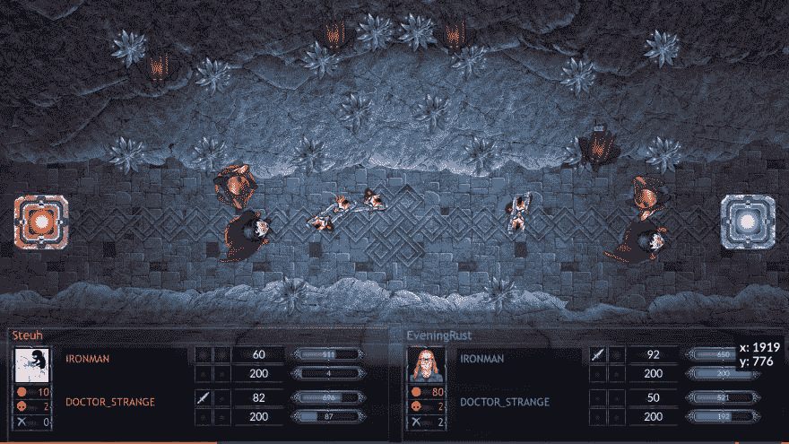
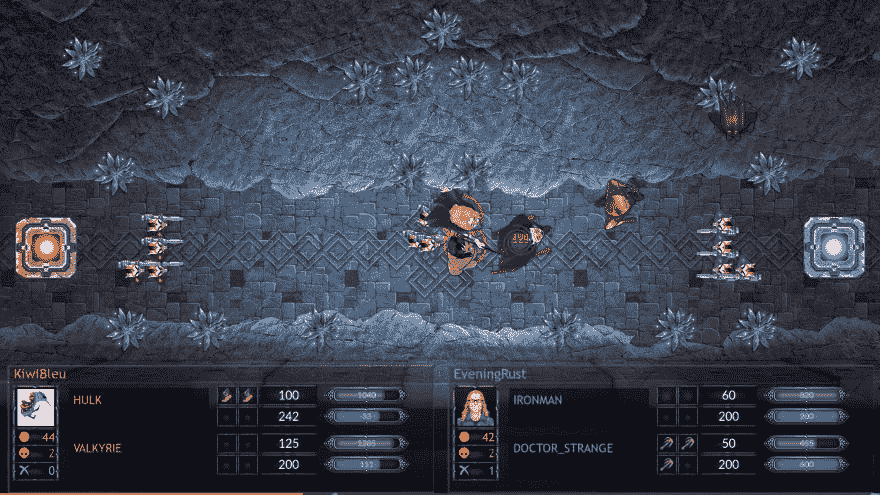

# 解剖我生锈的超级英雄机器人

> 原文：<https://dev.to/mortoray/dissecting-my-rusty-superhero-bots--1o86>

我在一次机器人编程竞赛中进入了顶级传奇联赛。这是我第一次参加这样的比赛，用的是一种语言 Rust，我几乎不知道它，而这一切都是在流媒体上进行的。在这里，我将回顾我所做的，好的和坏的，并计划下一次的改进。

> 我使用的是 CodinGame 网站上的个人资料 [EveningRust](https://www.codingame.com/profile/d80803a736ead2e22ac1485b5557492b4353142) ，这与我在 Twitch 上的[流相吻合。我的最终排名是 1713 名中的第 68 名，因为生锈排在第二位。](https://www.twitch.tv/mortoray)

在[的后续文章](https://mortoray.com/2018/03/16/dissecting-my-rusty-superhero-bots-the-code-review/)中，我会更详细地介绍代码和 Rust 语言。

## 游戏

这个游戏是一场玩家对玩家的超级英雄之战。每一方选择两个英雄；我最终选择了铁人和奇异博士——这是最受欢迎的组合。他们在一个有几个灌木丛，几个洞穴和一个房屋塔的地方战斗。目标是杀死其他英雄或摧毁他们的塔。

[T2】](https://res.cloudinary.com/practicaldev/image/fetch/s--2mUo9inW--/c_limit%2Cf_auto%2Cfl_progressive%2Cq_auto%2Cw_880/https://mortoray.files.wordpress.com/2018/03/screenshot_20180314_070501.png)

字符完全由代码控制。通过`stdin`为它们提供初始设置条件。每一次我们都会得到状态更新，并期望打印出我们想要的动作。

对我不利，但明智的是，游戏规则分阶段在几个“木头联盟”中发布。交错允许玩家从更宽松的规则集开始，鼓励人们玩游戏而不会被最初的复杂性淹没。

考虑到我想在所有联赛中进步，这些进步的规则有点阻碍。我看不到完整游戏需要什么，只能猜测代码结构。幸运的是，我的信息流的观众，他们已经在进一步的联盟中，可以填补遗漏的细节。即使没有，也不会是悲剧；最初的规则暗示了将要发生的事情，这些变化不会成为巨大的负担。尽管如此，我还是希望一次就知道全部细节。

## 战略战术

在这里，我将从更高的层面来谈谈我的所作所为。查看[“代码结构”](https://mortoray.com/2018/03/16/dissecting-my-rusty-superhero-bots-the-code-review/)来了解一下代码是如何构造的。

对于每个英雄，我创造了一个整体战略。每个英雄的大部分行为都是一样的——回想一下，我们控制了其中的两个。我创造了一系列“战术”功能。这一战略将这些战术结合成一个有一定凝聚力的整体。

例如，我的铁人三项战略的一部分将考虑这些战术，顺序如下:

*   逃跑:带我离开地图上的危险地方
*   攻击一个攻击我的格鲁特人
*   攻击 _ 英雄 _ 射程:如果火球可以击中敌方英雄，那么施放它
*   杀死我即将死亡的单位，以此来拒绝敌人的黄金
*   寻找一个我可以杀死的敌人单位
*   buy_item:查看物品清单，买一些有用的东西

这是一种启发式的人工智能方法:我用我的知识和游戏状态来尝试做出合理的判断。这是一组庞大的 if-else 分支代码。这不是一个优化策略:它不做任何分数评估或前瞻。鉴于游戏的开放性，以及缺乏本地对手，启发式似乎是一种合理的方式。

虽然这是一个创建机器人的好方法，但它有一个致命的缺陷:它从根本上限制了我的创造力和对策略的理解。像任何专家系统一样，它不能超越我在游戏中的能力。没有自动化培训。机器人无法自行改进。它不可能衍生出新的战术。

> 竞赛的设置会让机器学习变得相当棘手。你无法接触到对手进行本地执行，因此没有什么可以训练的。除了看个别游戏，你无法从提交的机器人获得反馈。你可以在本地构建所有这些，但这需要很大的努力。你仍然需要创建一个适合游戏的学习模型。

想出策略是这一努力中最有创造性的部分。它包括观看比赛和思考一些对我有利的特殊行动。观察敌方玩家也能揭示新的战术。

### 微调和调谐

这些策略提供了很多调整的途径。调音并没有改变发生的事情，只是在什么情况下发生的。例如，我的健康检查很低，这让我躲了起来。这是在 100 点生命值、150 点、10%还是敌人攻击伤害的总和时触发？

这种类型的调整对我的排名产生了实质性的影响，但这很难做到。每个改变都需要提交，然后等待战斗发生——大约 15-20 分钟，但有时更长。除此之外，在设定的战斗之后，等级可以继续改变。当其他人提交新代码时，我的机器人会与他们对抗，并上升或下降。对手的选择有很大的随机性，你战斗的顺序会影响你的等级。所有这些都使得很难知道一个小的调整是否真的有影响。

另一种选择是与特定的敌人对战。我会浏览我的战斗列表，选择一个失败，并将其复制到测试区。我可以在同样的条件下重演这场战斗(所有的随机设置元素都是一样的)。然后我会调整我的代码，直到我战胜这种情况。然后和这个对手多打几次，确保我有好的胜率。然后我会再次提交...

...最后往往排名靠后。对一方有效的方法对另一方无效。诀窍是要么找到一个合适的平衡，要么找到区分好与坏情况的输入。

### 转弯限制

随着比赛的进行，我的基本方法开始显示出另一个局限性。我理论化了会有帮助的策略，但是我不能在代码中实现。

我的方法是完全基于回合的:每一回合我都阅读状态，并完全基于该状态做出决定。没有办法对需要多次执行的战术进行编码。

例如，铁人可以发射火球。当我的法力值满的时候，它会造成最大的伤害，所以除非是这样，否则我不会开火。但是，随着距离的增加，它也造成了更多的伤害:离目标越远越好。计划移动几圈然后开火不符合我的规则！

我所有的战术都必须简化为回合制决策。我的超级英雄们经常来回跳舞或者做出可怕的决定。

### 没有策略

虽然我把代码组织成“策略”，但我没有一个整体策略。我只是在每个回合都运用我的战术，并期待最好的结果。我认识到很多失败的场景。

一个明显的例子是，一个对手会慢慢地消耗我的英雄直到他们死去，但是从来不会去攻击中立单位。如果我随着分数的增加变得更加保守，我会赢得更多的战斗-如果至少有一个英雄和塔在 500 回合中幸存，分数越高，我就赢。

我也很难对付近战对手。这些通常涉及浩克-由于一个缺陷，最终在比赛中与两个浩克。面对近战的时候，我的整个策略应该已经改变了。我需要做一些完全不同的事情。相反，我只是调整参数，试图在弹幕中生存。混战的对手拖住了我。更好的做法是认清对手，使用一套全新的战术。

[T2】](https://res.cloudinary.com/practicaldev/image/fetch/s--jy2lZulI--/c_limit%2Cf_auto%2Cfl_progressive%2Cq_auto%2Cw_880/https://mortoray.files.wordpress.com/2018/03/screenshot_20180314_161725.png)

在上面的游戏中，对手也会躲在灌木丛中，等着伏击我。我对我的`run_away`策略做了一个简单的改变，那就是检测隐藏的对手，并防止走得太远进入他们的身边。理想情况下，一旦我意识到隐藏，我会采取一个全新的计划:我可以沿着底部走，攻击他们的塔，或者我可以采取防御，向他们所在的灌木丛开枪(即使他们隐藏，火球仍然可以击中他们)。

唉，我没有制定全球决策和多回合策略的机制。

## 元游戏

比赛分为几个联盟，从训练木材联盟到铜牌，银牌，金牌，然后是传奇。每次你提交新的代码，你都要重新设置你在联盟中的位置，首先和随机的对手战斗，然后和相对的对手战斗。这不仅使测试微小的变化变得困难，还会产生分段。

> 联赛，过去的木材，每隔几天开放。他们的老板必须被击败才能进入下一个。这个 boss 是从提交的机器人中选择的一个“稳定”的 AI。我们的一个老观众创造了黄金联赛老板。

每个联盟都有不同类型的有效策略。联赛的前五名和后五名不同。底部充满了许多随机的东西，人们测试新的想法，和一些退化的策略。他们的排名并不高，但他们确实成功地干扰了其他机器人。因此，我需要一些在最初的课程中幸存下来，并在顶级课程中表现良好的东西。

更复杂的是，联盟的老大也必须被击败。在第五天，我遇到了创建一个机器人的问题，这个机器人在对抗玩家机器人时表现足够好，但在对抗老板时却非常失败。因此我不能离开黄金联赛。

老板也只是排行榜的一部分，对它的任何损失都会推高它的排名分数。老板越高，其他机器人就越难退出联盟——我不认为我在那个周六受欢迎，因为我在推高老板方面做得相当好。当然，我也遇到了同样的问题，拥有一个足够好的机器人，但有足够多的人对抗老板，我无法得到足够高的分数。

这个老板争论的效果是，你越晚进入更高的联赛，你的机器人在没有调整的情况下做得越好。随着比赛的进行，越来越难得到老板们的认可。

对元游戏缺乏欣赏让我很难过。当我排在第 3-5 名的时候，我经常放弃流，而不是强迫自己多流一点。第二天，我就降到了 40 岁，需要做大量的工作来弥补。每当我接近下一个联赛的时候，我就应该坚持下去。当然，由于我通常会因为筋疲力尽而停下来，这可能不是一个选项。

耐心也是一个因素。当你提交一个机器人时，你进行固定次数的战斗并从中获得分数。即使这个机器人足够好，它也可能不会打足够多的仗来获得足够好的分数*。但是当其他人提交机器人时，你会继续得分。

最终，我仅仅通过坐着看排行榜就获得了传奇。通过让足够多的人在我面前失败，并避免推高我附近的其他玩家，我成功晋级。作为所有调整的证明，我在下一个阶梯中没有改变就达到了 50%!

> *显然，如果这个机器人比其他机器人好得多，它就不会有这个问题。如果我找到了变得优秀的方法，而不仅仅是让人接受，我会进步得更快。唉，不像我的电脑生成的机器人，我不是一个超级英雄。

我又做了一个小改动，然后让我的机器人自行其是。我说完了。我达到了传奇，这就足够了。

## 结论

这场比赛既有趣又充满压力。我学到了一些关于 Rust，关于 AI，关于竞赛的新东西。流增加了压力，但借给我的编程一个新颖的方面。我想我在第一个周末流得太多了。更明智的做法是离线做更多的工作，每次只流几个小时。

如果你想了解更多关于代码的细节，请阅读我的后续文章。

非常感谢我所有的观众。他们很支持我，帮助我，为我加油。你让我受益匪浅！

我现在将继续做非竞赛机器人，在[我的流](https://www.twitch.tv/mortoray)上看我。当下一个上下文出现时，我会注册并重新做一遍！希望我能利用这些知识来提高我的表现。

> 如果你喜欢我的写作，那么[在推特](https://twitter.com/edaqa)或[脸书](https://www.facebook.com/mortoray/)上关注我，或者为了让我继续下去，[成为赞助人](https://www.patreon.com/mortoray)。感谢您的阅读。