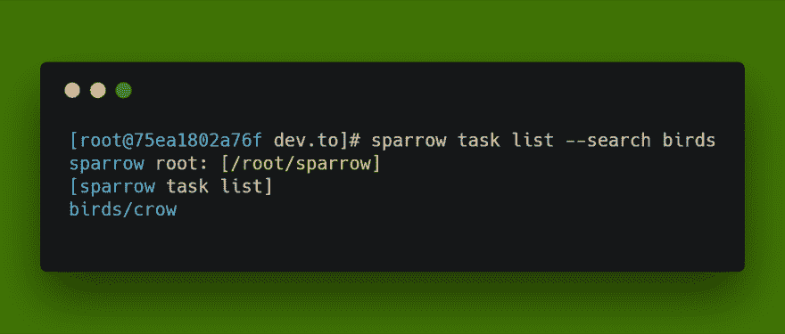

# 用 Sparrow 分发可移植脚本

> 原文：<https://dev.to/melezhik/distributing-portable-scripts-with-sparrow-8f4>

[T2】](https://res.cloudinary.com/practicaldev/image/fetch/s--1U_p-oFd--/c_limit%2Cf_auto%2Cfl_progressive%2Cq_auto%2Cw_880/https://thepracticaldev.s3.amazonaws.com/i/0xs8lpxxkmdfmy3bhdud.png)

所以，你有很多脚本想要移植到其他服务器或与你的团队分享。

虽然直截了当的`git push, git pull`方法很有效，但你*仍然*有事情要关心:

*   设置脚本输入参数
*   安装脚本依赖项
*   生成脚本文档
*   脚本版本控制

有了用 Perl 编写的脚本管理平台——所有这些任务都可以轻而易举地完成。

# 开发脚本

由于 Sparrow for today 支持多种语言，您几乎不受限制，请选择您想要的语言:

*   Perl 语言
*   红宝石
*   计算机编程语言
*   尝试
*   Powershell

Windows 和 Linux 平台都受支持。

为了简单起见，我将向您展示一个 Bash 示例:

`cat $story.bash`

```
echo "hello world" 
```

Enter fullscreen mode Exit fullscreen mode

# 定义输入参数的默认值。

很简单。只需创建名为`suite.yaml`的配置来定义默认的配置数据:

`cat suite.yaml`

```
 name: Sparrow 
```

Enter fullscreen mode Exit fullscreen mode

然后调整脚本读取配置文件:

```
echo "hello world, my name is " $(config name) 
```

Enter fullscreen mode Exit fullscreen mode

# 定义脚本元数据

我们将使用元数据跨不同的服务器安装脚本，并安装到本地系统中，我们可以在元数据文件中定义*多个*属性，同时它只是一个脚本名:

`cat sparrow.json`

```
{  "name"  :  "hello-world"  } 
```

Enter fullscreen mode Exit fullscreen mode

# 测试脚本

在本地安装:

`sparrow plg install . --local`

```
sparrow root: [/root/sparrow]
install from source: /root/projects/dev.to/plugins ...
install public@hello-world version 0 from local source
install deps for /root/sparrow/plugins/public/hello-world ... 
```

Enter fullscreen mode Exit fullscreen mode

并运行它:

`sparrow plg run hello-world`

```
sparrow root: [/root/sparrow]
plugin is not listed in the index, locally installed one? at /usr/local/share/perl5/Sparrow/Commands/Plugin.pm line 415.
2018-11-20 08:53:57 : [plg] hello-world [path] /
hello world, my name is  Sparrow
ok      scenario succeeded
STATUS  SUCCEED 
```

Enter fullscreen mode Exit fullscreen mode

# 添加文档

很简单，只需创建包含 markdown 格式文档的`README.md`文件:

`cat README.md`

```
# Description

This is hello-world script

# Usage

sparrow plg run hello-world

# Parameters

## Name

# Author

Alexey Melezhik 
```

Enter fullscreen mode Exit fullscreen mode

让我们重新安装脚本，添加文档位:

`sparrow plg install . --local --force`

现在我们可以看到脚本的文档:

`sparrow plg man hello-world`

# 覆盖配置文件的默认值

这只是一个小小的额外步骤，我们需要创建 sparrow 任务来运行脚本:

`sparrow project create birds`

`sparrow task add birds crow hello-world`

```
project birds successfully created
task - set plugin to public@hello-world
task birds/crow successfully created 
```

Enter fullscreen mode Exit fullscreen mode

`sparrow task ini birds/crow`

```
name: Crow 
```

Enter fullscreen mode Exit fullscreen mode

我们刚刚创建的任务覆盖了 hello-world 脚本的默认值，让我们运行它:

`sparrow task run birds/crow`

```
sparrow root: [/root/sparrow]
2018-11-20 09:08:50 : [task] crow [path] /
hello world, my name is  crow
ok      scenario succeeded
STATUS  SUCCEED 
```

Enter fullscreen mode Exit fullscreen mode

# 保存脚本和配置数据

这只是一个简单的命令，并将所有数据推送到 git 存储库:

`cd ../ && sparrow task save $PWD`

```
sparrow root: [/root/sparrow]
read task ignore file from /root/task.ignore ...
save current tasks to [/root/projects/dev.to] ...
=========================
birds/crow ... 
```

Enter fullscreen mode Exit fullscreen mode

`git add . && git commit -a -m "my cool scripts" && git push`

# 分发脚本

在目标服务器上只有`git clone`个脚本库:

`git clone $git-repo.tasks ~/scripts-repo`

然后运行:

`sparrow plg install ~/scripts-repo/plugins --local --recursive`

```
sparrow root: [/root/sparrow]
install from source: /root/scripts-repo/plugins ...
install public@hello-world version 0 from local source
install deps for /root/sparrow/plugins/public/hello-world ... 
```

Enter fullscreen mode Exit fullscreen mode

`sparrow task restore ~/scripts-repo`

```
sparrow root: [/root/sparrow]
restore tasks from [/root/scripts/repo] ...
=========================
restore birds/crow ...
plugin /root/sparrow/plugins/public/hello-world/ installed locally, nothing to do here ... 
```

Enter fullscreen mode Exit fullscreen mode

现在，您已经在新服务器上启动并运行了所有脚本:

`sparrow task run birds/crow`

# 进一步阅读

## 处理依赖关系

这非常容易。Sparrow 支持许多流行的包管理器(cpan，rubygems，pip)，只需将适当的依赖文件放入脚本的文件夹中(cpanfile，Gemfile，requirements.txt)

## 脚本版本化

只需在图元文件中添加脚本版本，让用户安装并使用最新版本:

```
{  "name"  :  "hello-world",  "version"  :  "0.1.1"  } 
```

Enter fullscreen mode Exit fullscreen mode

* * *

感谢您的阅读。