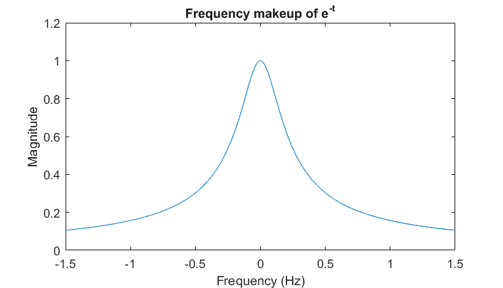
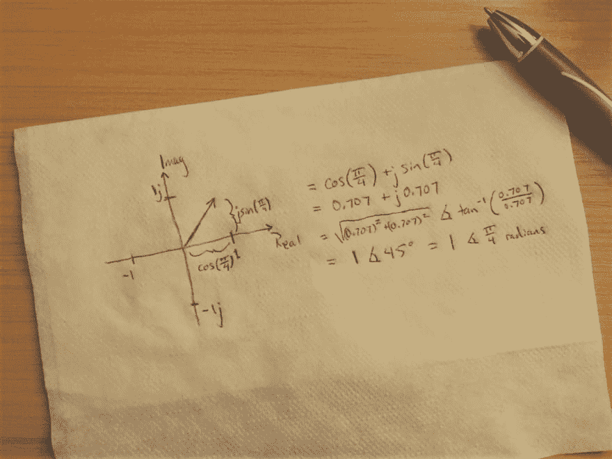
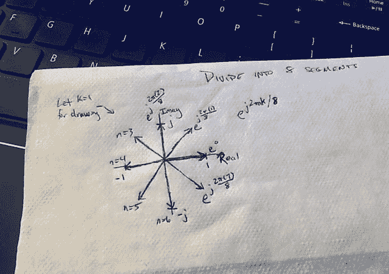

# 分而治之快速傅立叶变换

> 原文：<https://dev.to/micahshute/divide-and-conquer-the-fast-fourier-transform-c5g>

## 什么是傅立叶变换，我为什么要关心它

简单来说，傅立叶变换允许人类或机器在频域中看到时域信号。常见应用包括示波器和函数发生器中的数据可视化、雷达、声纳、[频谱分析](https://en.wikipedia.org/wiki/Fourier-transform_spectroscopy)、数字通信信号处理和仪器监控。

傅立叶变换还有广泛的用途，不仅仅是可视化，甚至是频率分析的终极游戏。线性时不变(LTI)系统和信号通过[卷积](https://en.wikipedia.org/wiki/Convolution)相互响应，这在数学上是不切实际的运算。这些系统输出可以精确建模，只需将它们的傅里叶变换相乘，然后将其转换回时域即可，前提是这样做可以避免混叠。

最后，许多数据压缩使用类似于快速傅立叶变换的算法。例如，[JPEG 使用离散余弦变换](https://en.wikipedia.org/wiki/Discrete_cosine_transform)，它与离散傅立叶变换非常相似。

## 为什么以及如何工作

这是一个回答很长的问题。下面是简短而肮脏的:

这是将时域信号 x(t)转换为频域信号 X(f)的等式:

[ = \int_{-\infty}^{\infty}{x(t)}e^{-j2\pi t}dt$")T2】](http://www.codecogs.com/eqnedit.php?latex=%24X(f)&space;=&space;%5Cint_%7B-%5Cinfty%7D%5E%7B%5Cinfty%7D%7Bx(t)%7De%5E%7B-j2%5Cpi&space;t%7Ddt%24)

其中 t 是时间，f 是以 Hz 为单位的频率。

如果你以前没看过这个，那就没什么意义了。在不被数学困扰的情况下，你需要知道以下几点:

1.  几乎所有存在的信号都可以由余弦和正弦信号的和组成，甚至包括非周期性的连续时间信号。
    *   例如，衰减的指数信号

[ = e^{-t}u(t)$")](http://www.codecogs.com/eqnedit.php?latex=%24x(t)&space;=&space;e%5E%7B-t%7Du(t)%24) 有频率: [ = \frac{1}{1 + j2\pi f}")](http://www.codecogs.com/eqnedit.php?latex=X(f)&space;=&space;%5Cfrac%7B1%7D%7B1&space;&plus;&space;j2%5Cpi&space;f%7D)

其幅度看起来像这样:
- [](https://res.cloudinary.com/practicaldev/image/fetch/s--99E98kUm--/c_limit%2Cf_auto%2Cfl_progressive%2Cq_auto%2Cw_880/https://thepracticaldev.s3.amazonaws.com/i/qmsde0ac0zkp70meiz62.png) 
-你可能知道电容器通过指数衰减来响应电压脉冲，随着时间的推移慢慢释放其积累的电压。因此，指数衰减的频率构成在较低频率下较大，在较高频率下较小，这一事实直观上是有道理的，因为只有当输入值变化足够慢，足以允许放电过程发生时，电容两端的电压才会看起来像输入。这就是为什么频率范围在这种情况下看起来是这样的。
-注意:负频率是正弦和余弦信号的一部分。当我们对时间信号进行数学建模时，这是保持时间信号“真实”的原因，这将在下面解释。

1.  我们可以利用欧拉的性质建立数学上方便的方程:
    *   [ + j\sin(2\pi ft)")T2】](http://www.codecogs.com/eqnedit.php?latex=e%5E%7Bj2%5Cpi&space;ft%7D&space;=&space;%5Ccos(2%5Cpi&space;ft)&space;&plus;&space;j%5Csin(2%5Cpi&space;ft))
    *   [ - j\sin(2\pi ft)")T2】](http://www.codecogs.com/eqnedit.php?latex=e%5E%7B-j2%5Cpi&space;ft%7D&space;=&space;%5Ccos(2%5Cpi&space;ft)&space;-&space;j%5Csin(2%5Cpi&space;ft))
    *   [ = \frac12(e^{j2\pi t} + e^{-j2\pi t})")T2】](http://www.codecogs.com/eqnedit.php?latex=%5Ccos(2%5Cpi&space;ft)&space;=&space;%5Cfrac12(e%5E%7Bj2%5Cpi&space;t%7D&space;&plus;&space;e%5E%7B-j2%5Cpi&space;t%7D))
    *   [ = \frac{1}{2j}(e^{j2\pi t} - e^{-j2\pi t})")T2】](http://www.codecogs.com/eqnedit.php?latex=%5Csin(2%5Cpi&space;ft)&space;=&space;%5Cfrac%7B1%7D%7B2j%7D(e%5E%7Bj2%5Cpi&space;t%7D&space;-&space;e%5E%7B-j2%5Cpi&space;t%7D))
        *   不要对虚数感到困惑。它们是在频域中显示相角数据的一种方式。实时信号永远不会变成“虚的”时间信号——虚的部分总是会抵消，给你一个正弦和余弦的混合体。
        *   请注意，这说明了为什么负频率对于以这种方式模拟正弦曲线是必要的。

因此，如果我们从(1)中知道所有信号都可以由正弦和余弦之和组成，我们就可以利用这一事实从时间信号中检索这些余弦和正弦。这些恢复的正弦和余弦就是我们的频域信号。这是通过上面的等式用数学方法完成的，如示例所示。

## 好的...所以我不知道我怎么能做一个这样的程序

到目前为止，我们的方程通过无穷积分作用于连续时间(CT)信号。这不利于数字处理和编程。在我们试图编写一个程序来获得我们需要的信息之前，你必须做一些事情来获得一个我们可以操纵的信号。

1.  将无限的 CT 信号转换成离散时间的有限大小的信号。这可以通过对有限数量的样本进行采样和量化来实现。如果采样速率> =信号最高频率成分(即奈奎斯特频率)的两倍，则可以避免混叠。这通常由专用硬件来完成。然而，我们现在关心的是如何使用这些样本，而不是如何获得它们。
2.  改变获取信号频域的公式，使其能够处理有限大小的采样数据点阵列，而不是无限连续的时间信号。因此，我们需要求和来代替积分，我们使用采样数据数组的大小来代替无穷大小:

    *   不过还有一个问题——非周期信号的频域，不管离散与否，仍然是连续的——所以我们不能在计算机上操纵它。这个问题的答案是离散傅立叶变换，离散时间信号的傅立叶变换的周期性采样版本。为此，我们可以将频率项替换为在 n 个样本上将其分成相等部分的一项: [](http://www.codecogs.com/eqnedit.php?latex=2%5Cpi&space;f&space;%5CRightarrow&space;%5Cfrac%7B2%5Cpi&space;k%7D%7BN%7D) 其中我们评估 k^th 样本，总共有 n 个样本。

        *   如果您想知道我们能否从频域的这一采样版本中精确地重建时域样本，简单的答案是肯定的，只要我们通过确保频域的总样本大于或等于时域样本的长度来避免时域混叠。通过在时域信号末尾添加零，我们可以在不增加采样数据长度的情况下提高频域的采样速率。这将使我们的频域样本更加接近。
    *   总之，我们可以通过这个等式从一组采样数据中获得频域变换函数:

    *   [ = \sum_{n = 0}^{N-1}{x(n)e^{-j\frac{2\pi kn}{N}}}")T2】](http://www.codecogs.com/eqnedit.php?latex=X(k)&space;=&space;%5Csum_%7Bn&space;=&space;0%7D%5E%7BN-1%7D%7Bx(n)e%5E%7B-j%5Cfrac%7B2%5Cpi&space;kn%7D%7BN%7D%7D%7D)

## 你是怎么计算的

现在我们有了方程，这部分就简单了！

```
signal = ->(t){Math.cos(2 * Math::PI * t)} # 1 Hz cosine signal
sample_times = (0..1000).map{ |int| int / 100.0} # Sample for 10 seconds every 0.01 seconds (100 times per period over 10 periods)
data = sample_times.map{ |time| signal.call(time) } # turn time into sample values

#Discrete Fourier Transform
ft = []
for k in 0...data.length do
    tot = 0
    data.each_with_index do |x_n, n|
        tot += x_n * Math::E ** (Complex(0,-1) * 2.0 * Math::PI * k * n / data.length.to_f)
    end
    ft << tot
end 
```

太容易了！完成了，对吗？

不完全是。你得到了正确的答案，但在我看来这像是一个嵌套循环。θ(n^2)正在抬起它丑陋的头，让我们知道我们不能用这种算法做任何实时处理。

由于许多实时应用都需要 FFT，而采样信号通常很长，因此我们需要找到一种方法来大幅缩短处理时间。

## 如何计算好:分而治之

这就是快速傅立叶变换(FFT)的用武之地，它允许我们实时使用该信号。

首先，让我们直觉地知道我们可以利用的捷径是什么，这使得将这个问题分成更小的子问题变得有利和可能。我们想要使用的特征是双重的，并且来自于我们通过乘以来操作单位的复数根

[T2】](http://www.codecogs.com/eqnedit.php?latex=e%5E%7B-j%5Cfrac%7B2%5Cpi&space;kn%7D%7BN%7D%7D)

在每次迭代中。那是什么意思？好吧，请记住上面的内容

[ + j\sin(2\pi ft)")T2】](http://www.codecogs.com/eqnedit.php?latex=e%5E%7Bj2%5Cpi&space;ft%7D&space;=&space;%5Ccos(2%5Cpi&space;ft)&space;&plus;&space;j%5Csin(2%5Cpi&space;ft))

让我们先来看看这个例子是什么样子的；我做了一个简单的演示:
[](https://res.cloudinary.com/practicaldev/image/fetch/s--JAx1aDBE--/c_limit%2Cf_auto%2Cfl_progressive%2Cq_auto%2Cw_880/https://thepracticaldev.s3.amazonaws.com/i/dbgcpuajxw7mjio1p867.jpg)

因此，您可以将实轴和虚轴想象为东/西线和北/南线，而 [](http://www.codecogs.com/eqnedit.php?latex=e%5E%7Bj2%5Cpi&space;ft%7D) 则想象为指向角度 [](http://www.codecogs.com/eqnedit.php?latex=2%5Cpi&space;f) 并随时间 t 变化的指南针。我们想要利用的属性是基于将 2π弧度分成 N 个偶数段的情况，就像我们正在计算离散傅里叶变换一样。这是可以想象的:

[T2】](https://res.cloudinary.com/practicaldev/image/fetch/s--WxxtSmLe--/c_limit%2Cf_auto%2Cfl_progressive%2Cq_auto%2Cw_880/https://thepracticaldev.s3.amazonaws.com/i/mpxvxaiqzda8evcw51kc.jpg)

你能看到我们想要开发的属性吗？它们是:

1.  i^th 分划是 N-i^th 分划的复共轭。这意味着，如果我们有 8 个分区(k = 1)，1^st 分区是 [](http://www.codecogs.com/eqnedit.php?latex=e%5E%7Bj2%5Cpi&space;/&space;8%7D) ，-1^st 分区(即第 7 个分区)是 [](http://www.codecogs.com/eqnedit.php?latex=e%5E%7Bj14%5Cpi&space;/&space;8%7D) 。
    *   n = 1: [ +j\sin(2\pi/8) = 0.707 +j0.707")](http://www.codecogs.com/eqnedit.php?latex=%5C,%5C,e%5E%7Bj2%5Cpi&space;/8%7D&space;=&space;%5Ccos(2%5Cpi/8)&space;&plus;j%5Csin(2%5Cpi/8)&space;=&space;0.707&space;&plus;j0.707)
    *   n = 7: [ + j\sin(14\pi /8) = 0.707 - j0.707")](http://www.codecogs.com/eqnedit.php?latex=%5C,%5C,e%5E%7Bj14%5Cpi/8%7D&space;=&space;cos(14%5Cpi/8)&space;&plus;&space;j%5Csin(14%5Cpi&space;/8)&space;=&space;0.707&space;-&space;j0.707)
    *   如您所见，1 和 N-1 信号是相关的，因为它们的实部相同，虚部互为负值。你可以在上面看到。

2_ 这个圆是周期性的，所以当变量 k 开始增加的时候，我们只是以 n 为增量绕着圆循环。

**现在，让我们最后看看如何使用基数 2 FFT 算法来利用这些特性。**

1.  我们知道为了分而治之，我们要把一个问题分解成两半(或者一些基数)。我们从我们的图中注意到，如果我们在 8 个分区的情况下采用偶数分区，我们将得到这样的分区，就好像我们有 4 个单位的复数根而不是 8 个(即 4 个 2π的偶数分)，从而给我们一个更小的问题要解决，这就是我们想要的。从数学上来说，让我们看看如果将信号分解为偶数和奇数样本会是什么样子:
    *   
    *   这简化为两个子数据阵列的等式，这两个子数据阵列的大小是原始数据集的一半，并且将乘以 N/2 而不是 N 的单位根，本质上产生两个相同的子问题:
        *   
    *   现在，我们可以用偶数和奇数子阵列进行递归，直到遇到 N = 1 的基本情况(这里 n 和 k 将为零，因此您只需将这一个值乘以 e^0 = 1)，并返回该值作为其自身的 DFT。然后按照上面的等式合并。
2.  太棒了，但是我们还有一件事可以做。还记得我们说过 i^th 和 N-i^th 的根是彼此的复共轭吗(例如，单位绘图的根是穿过 x 轴的镜像)？这意味着，一旦我们解决了大小为 N/2 的两个子问题，我们就可以通过同时创建它们相应的“镜像”值来组合它们，从而获得 N 个 DFT 值。这将使我们不必遍历 N/2 个子问题的数据两次来创建使 X(k)上升一级所需的 N 个数据值。我们希望获得偶数阵列的 DFT 的 k^th 结果，并将其与奇数阵列的 DFT 的 k^th 结果的 [](http://www.codecogs.com/eqnedit.php?latex=e%5E%7B-j%5Cfrac%7B2%5Cpi&space;k%7D%7BN%7D%7D) 倍相加，并将其放入将为 0 的阵列中...X(k)的 N/2 个值。我们再次取得偶数阵列的 DFT 的 k^th 结果，但是现在我们从它减去奇数阵列的 DFT 的 k^th 结果的 [](http://www.codecogs.com/eqnedit.php?latex=e%5E%7B-j%5Cfrac%7B2%5Cpi&space;k%7D%7BN%7D%7D) 倍，并且将它放入 N/2 的阵列中...X(k)的 n 个值。我们这样做了 N/2 次。最后，我们添加 N/2...n 数组到 0 的末尾...N/2 数组来获得上一级 X(k)的完整答案。在一个等式中，每个级别的合并步骤如下所示:

*   [ = FFT(even\, subarray)[k] + e^{-j\frac{2\pi k}{N}}FFT(odd\,subarray)[k]")](http://www.codecogs.com/eqnedit.php?latex=X(k)&space;=&space;FFT(even%5C,&space;subarray)%5Bk%5D&space;&plus;&space;e%5E%7B-j%5Cfrac%7B2%5Cpi&space;k%7D%7BN%7D%7DFFT(odd%5C,subarray)%5Bk%5D) 为 [为](http://www.codecogs.com/eqnedit.php?latex=0%5Cleqslant&space;k&space;<&space;N/2)

*   [ = FFT(even\, subarray)[k] - e^{-j\frac{2\pi k}{N}}FFT(odd\,subarray)[k]")](http://www.codecogs.com/eqnedit.php?latex=X(k)&space;=&space;FFT(even%5C,&space;subarray)%5Bk%5D&space;-&space;e%5E%7B-j%5Cfrac%7B2%5Cpi&space;k%7D%7BN%7D%7DFFT(odd%5C,subarray)%5Bk%5D) 为 [为](http://www.codecogs.com/eqnedit.php?latex=N/2%5Cleqslant&space;k&space;<&space;N)

3_ 必要的细节:

*   能够将问题除以 2 并对单位圆进行均匀划分的前提要求样本数据数组是 2 的幂。这是一个需要满足的简单指标。你所要做的就是在数据的末尾加上 0，直到你的数据数组的长度是 2 的幂。这确保了算法的工作，并在离散傅立叶变换中创建了更接近的“样本点”，使得可视化效果更好。

## 给我看看你是怎么实现的

```
class Radix2Strategy 

    E = Math::E
    PI = Math::PI

    attr_reader :data

    def initialize(data: )
        @data = data
        zero_fill
    end

    def calculate(data = @data)
        recursive_fft(data)
    end

    private

    def recursive_fft(arr)
        n = arr.length
        return arr if n == 1
        w_n = E ** ((-2 * PI * Complex(0,1)) / n)
        w = 1
        a0 = get_even(arr)
        a1 = get_odd(arr)
        y0 = recursive_fft(a0)
        y1 = recursive_fft(a1)
        y = Array.new(n, 0)
        for k in 0...(n/2) do
            y[k] = y0[k] + w * y1[k]
            y[k + n/2] = y0[k] - w * y1[k]
            w = w * w_n
        end
        return y
    end

    def get_even(arr)
        even = []
        arr.each_with_index { |a, i| even << a.dup if i.even? }
        even
    end

    def get_odd(arr)
        odd = []
        arr.each_with_index { |a, i| odd << a.dup if i.odd? }
        odd
    end

    def zero_fill
        len = self.data.length
        @data = @data.concat Array.new(closest_pow_of_2(len) - len, 0)
    end

    def closest_pow_of_2(num)
        2 ** Math.log(num,2).ceil
    end
end 
```