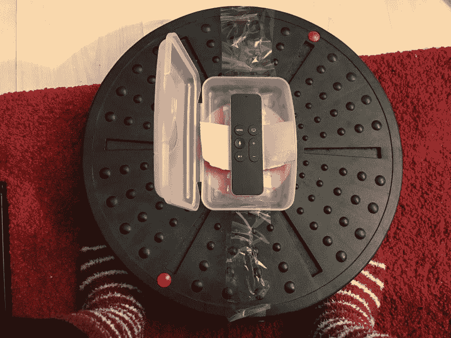
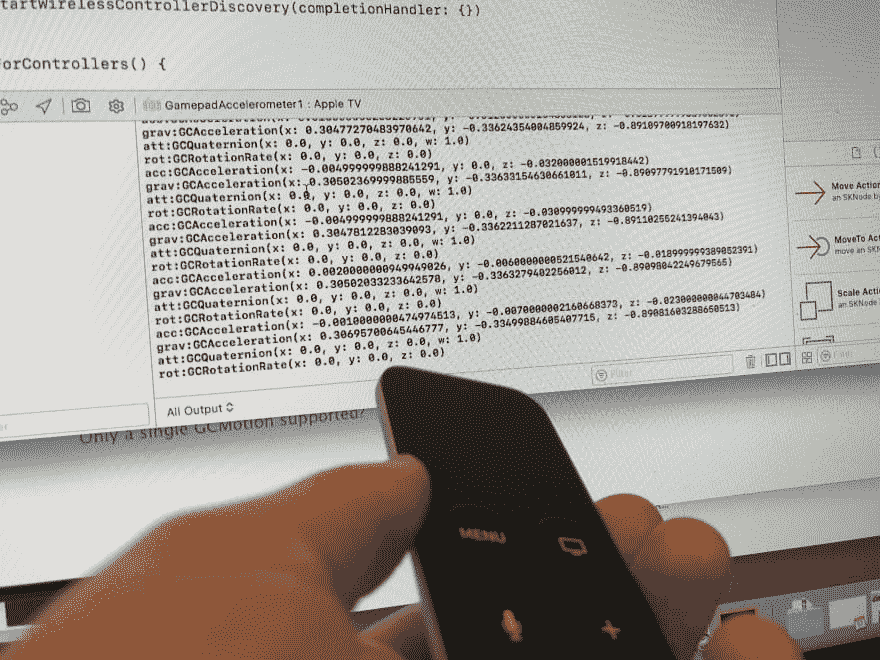
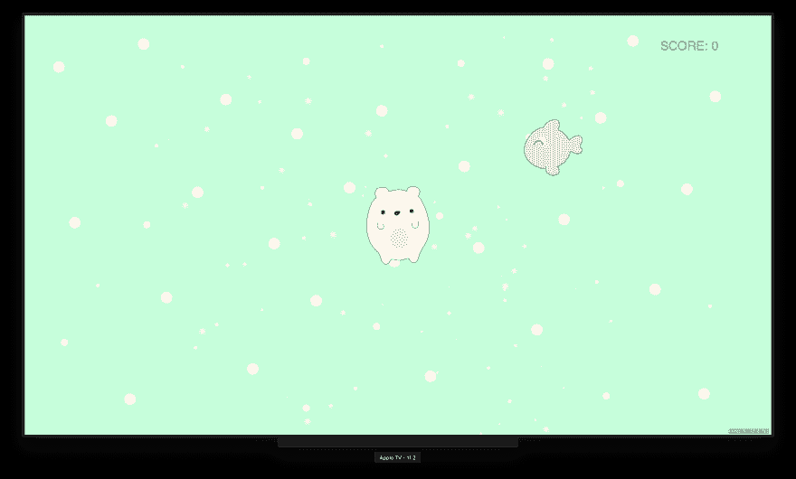

# DIY 苹果电视平衡板

> 原文：<https://dev.to/denisenepraunig/diy-apple-tv-balance-board--2m9o>

[https://www.youtube.com/embed/5PygsgZDwFk](https://www.youtube.com/embed/5PygsgZDwFk)

几年前，我摔断了腿(骑马)，我用平衡板来训练肌肉。使用平衡板的训练非常有效，但也非常无聊。我梦想创造自己的平衡棋盘游戏，并在电视上玩。我摆弄过 Arduino——但是唷——所有那些电缆，如何模拟按键，如何编写游戏，嗯，每次我想玩的时候，我都需要把笔记本电脑连接到电视上。树莓派怎么样？需要学习 Linux 和 Python 以及一个游戏框架...还是应该把手机当传感器？通过 web 套接字将传感器数据通过本机应用程序发送到 HTML5 游戏？这些事情不是不可解决，而是非常“hacky”——不“终端消费者友好”。Wii 平衡板本身是一个很好的想法，但当时它对我的肌肉来说并不具有挑战性。

**快进 2018**:2016 年底我转行做 Swift iOS 开发者(之前的 web 开发者)。2017 年我买了一台 Apple TV，2017 年底我编写了我的第一个 iOS 版 SpriteKit 游戏(很久以前我用 Flash 创建了游戏)，几天前我创建了我的第一个 Apple TV 应用程序和游戏。*特别感谢[保罗·哈德森](https://twitter.com/twostraws)对 tvOS 书籍的和[黑客。](https://www.hackingwithswift.com/store/hacking-with-tvos)*

[T2】](https://res.cloudinary.com/practicaldev/image/fetch/s--icZh5qRz--/c_limit%2Cf_auto%2Cfl_progressive%2Cq_auto%2Cw_880/https://github.com/denisenepraunig/apple-tv-balance-board/raw/master/pictures/siri-remote-in-a-lunchbox.jpg)

我拥有当前 Apple TV 的前一版本，遥控器名为 Siri Remote，内置加速度计和陀螺仪。现在我只需要将 Siri 遥控器安装到我的平衡板上。我在考虑一个 3D 打印的盒子，但当我在厨房洗碗时，我发现了我的塑料午餐盒。哈！！！看起来是个完美的解决方案。它应该会阻止我踩上我的 Siri 遥控器。如果你伤害了自己或者弄坏了 Siri 遥控器，我不承担任何责任。我用了一些胶带来固定饭盒( *velcro 胶带也可以*)，还剪了一些纸板，这样 Siri 遥控器就不会四处移动了。

[T2】](https://res.cloudinary.com/practicaldev/image/fetch/s--ZH9DD_D9--/c_limit%2Cf_auto%2Cfl_progressive%2Cq_auto%2Cw_880/https://github.com/denisenepraunig/apple-tv-balance-board/raw/master/pictures/siri-remote-accelerometer.jpg)

现在我只需要从遥控器读取传感器值，然后创建一个游戏，很简单，对吗？哈哈，开个玩笑。在我可以读取传感器值之前，我需要将 Siri 遥控器注册为游戏手柄，这花了我一段时间来弄清楚这是如何做到的。就游戏而言——是的，提出正确的想法，学习如何使用 SpriteKit，画一些可爱的角色并将它们数字化是一个完全不同的故事。我设法创造了一个小原型(一只抓鱼的熊)并在大屏幕上看到我自己的游戏并用我“自己的”控制器控制它，这真是太棒了！

[T2】](https://res.cloudinary.com/practicaldev/image/fetch/s--xofHygTT--/c_limit%2Cf_auto%2Cfl_progressive%2Cq_auto%2Cw_880/https://github.com/denisenepraunig/apple-tv-balance-board/raw/master/pictures/bear-fish-new.png)

我已经创建了一个 [GitHub 资源库](https://github.com/denisenepraunig/apple-tv-balance-board)，在这里你可以找到更多的背景信息、技术细节和一个启动项目。我将继续致力于不同类型的游戏，写下 UX 对平衡棋盘游戏的考虑，相应地更新我的资料库，并在推特上发布一些[状态更新](https://twitter.com/denisenepraunig)。希望在 2018 年发布一款支持平衡板的 Apple TV 游戏。通过我目前的解决方案，每个人都可以把他们的 Siri 遥控器变成一个平衡板，并根据你的预算和健康水平使用平衡板。让我知道你的想法！

*PS:如果你在 Apple TV store 上找到一个只能通过向左/向右/向上/向下倾斜 Siri 遥控器来控制的游戏，如果你把 Siri 遥控器倒过来，你也可以通过平衡板来控制它。*