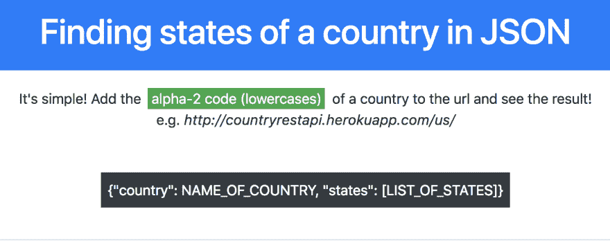

# Django API -来自不同国家的州列表

> 原文：<https://dev.to/moklavie/django-api---list-of-states-from-different-countries-3cad>

**【TL:DR】**
我在搜索每个国家的州列表。有一些 API 项目有助于揭示不同国家的货币、纬度/经度、语言和时区。然而，很少有免费简单的 API 可以简单地生成状态列表。所以我做了一个！

这里是[环节](https://countryrestapi.herokuapp.com/)。

**【简单易用】**

要使用它，只需在链接末尾输入 2 个字符的 alpha2-code 即可。
比如美国是“us”，澳大利亚是“au”，香港是“hk”。

渲染页面，你会看到那个国家的州列表以 JSON 格式呈现。

希望你会觉得有用！

原岗位在[https://devjunior.com](https://devjunior.com/blog/23/)