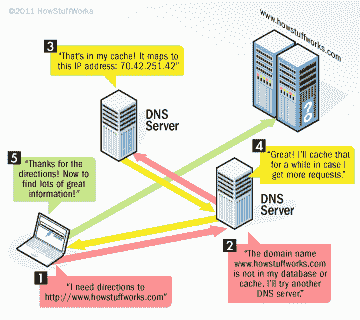

# 面向开发者的 DNS

> 原文：<https://dev.to/funkysi1701/dns-for-developers-3mmj>

DNS 是互联网的支柱，因此我相信每个开发人员都应该了解一些基础知识，而不仅仅是留给系统管理员去整理。

### 什么是 DNS？

DNS 或域名系统将域名转换成 IP 地址，反之亦然。

### 等等什么是 IP 地址，什么是域名？

你知道这是一个开发者博客吧？IP 地址是互联网上的唯一地址，域名是一个或多个 IP 地址的用户友好标签。

一个例子可能是 google.com，对我来说它决定去 216.58.204.14

### 工作原理

 当您的浏览器向 google.com 发出请求时，它会向您的 ISPs DNS 服务器发出请求。这决定了 google.com 归属于 216.58.204.14

更详细地说，您的 ISPs DNS 服务器会将 DNS 查询转发到另一个 DNS 服务器，并将结果缓存一段时间。这是 TTL 或生存时间。下一次，ISP DNS 服务器将能够直接回复，而不需要转发请求。

这种转发和缓存使得 DNS 更改不是即时的。需要达到 TTL，以便不会从全球 DNS 服务器的缓存中获取任何结果。

### DNS 记录

现在我们大致了解了 DNS 的工作原理，让我们看看最常见的记录类型

#### 一

(主机)记录是将域名转换为 IP 的最简单的记录

www.google.com 到 216.58.204.14

#### [t1 网络 NAME](#cname)

CNAME(规范名称)记录不同于 A 记录，因为当不存在 A 记录时，它将一个域名映射到另一个域名。

www.google.com 到 somethingelse.google.com

通常，Azure 的许多服务都使用 CNAMEs，尤其是添加自定义域名

#### MX

MX 代表邮件交换，用于配置电子邮件

#### 名称服务器

每个域都有许多域名服务器，这些服务器会告诉您哪些服务器控制着该域的 DNS 设置。如果您更改名称服务器，那么新的名称服务器将是您可以更改 DNS 设置的地方。

如果你想使用像 [DNSimple](https://dnsimple.com/) 这样的服务，而不是 [123reg](https://www.123-reg.co.uk/) 或任何你注册域名的地方，那么你需要做的就是改变你的域名服务器。

#### AAAA

像一个记录，但 ipv6

### 接下来呢？

想把一些不同的 DNS 记录付诸实践？买一个域名，给它发布一些内容。查看我之前关于以编程方式添加记录的帖子。想要 SSL 证书吗？获得一个通配符，然后你可以将它应用到你添加到你的域的任何子域。

如果你想发布一个新网站，考虑以下哪一个更好:

[https://www.example.com/newsite](https://www.example.com/newsite)

[https://newsite.example.com](https://newsite.example.com)

我更喜欢第二种选择，它看起来更干净，没有与父站点的潜在冲突，在生产和开发之间没有子文件夹问题。