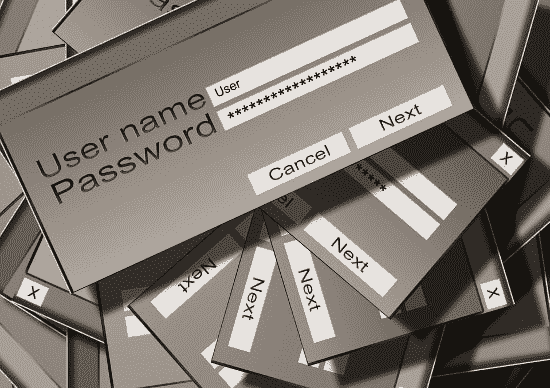

# 密码规则让我们更安全吗？

> 原文：<https://dev.to/pbeekums/do-password-rules-make-us-safer-4pd6>

密码在保护我们的数据方面发挥着重要作用。要么一个服务提供一种用密码登录的方法，要么他们提供一种用另一个服务登录的方法，如电子邮件、谷歌或 Twitter，这些服务使用密码。密码是不可避免的，也是重要的。这意味着密码本身需要是安全的。许多服务都有密码规则来确保人们创建安全的密码。

[T2】](https://res.cloudinary.com/practicaldev/image/fetch/s--P1-hCbnb--/c_limit%2Cf_auto%2Cfl_progressive%2Cq_auto%2Cw_880/https://blog.professorbeekums.com/img/2018/password.jpg)

关于密码规则已经写了很多。有些很有趣，有些更严肃。我花了很多时间研究密码规则，因为我想为[马利加](https://maleega.com/)制定明智的规则。

大多数密码规则确实使密码更加安全，但是它们增加了可以忽略不计的额外安全性。它们还会产生一种虚假的安全感，因为人们会认为如果他们每个人都有 1 个密码，他们就可以设置更短的密码:

*   大写字母
*   小写字母
*   数字
*   特殊字符

要理解为什么，我们需要理解什么是密码熵。很多文章都有提到，但是很少解释。尽管标题如此，这篇文章还是提供了相当深入的描述。我会尽量简短些。

用最简单的方法计算熵，我们需要知道暴力破解密码需要多少次尝试。英语字母表中的 26 个字母将是 1 个字符密码的 26 次尝试。加上大写字母和小写字母，我们加倍到 52 次尝试。添加 10 个数字和 33 个特殊字符，我们有 95 次尝试。

每个字符都会成倍增加尝试次数。仅使用小写字母，5 个字符的密码将是 26^5(1190 万次)尝试，10 个字符的密码将是 26^10 (141 万亿次)尝试。根据所有 4 个密码规则，5 个字符的密码将是 95^5(77 亿)。10 个字符的密码现在将是 95^10 (5.9 x 10^19 或 100 万乘以 59 万亿)

天真地说，密码规则确实有帮助。他们似乎很有帮助。对于 10 个字符的密码，我们的密码规则会将尝试次数增加 400，000 次。让我们假设每秒钟可以运行一百万次猜测。只有小写字母的 10 个字符的密码将花费我们 4.5 年的时间来暴力破解。一个包含所有密码规则的 10 个字符的密码需要 190 万年才能破解。这就是为什么许多人认为密码规则是有意义的。原始数学表明它们是有帮助的。

这就是我们需要在计算中加入一点人性的地方。XKCD 漫画是有针对性的，因为密码规则使得密码更难记住。人类通过变矮来弥补。问题是指数增长意味着更长的密码更好。只有 26 个小写字母，16 个字符的密码将是 26^16 或 4.3 x 10^22.这相当于 10 亿乘以 43 万亿，或者说，按照我们所有的密码规则，10 个字符的密码的暴力尝试次数要多 1000 倍。

不仅密码规则鼓励使用更小的密码，人们还想方设法让密码更容易记忆。我们大多数人这样做是通过把特殊字符放在开头或结尾。或者我们做一些明智的替换，比如用零替换单词中的字母 O。任何想侵入你账户的人都会把这些考虑进去。也许你的密码中只有前 2 个和后 2 个字符有 95 种可能满足密码规则，但其他字母都是小写。也许他们测试的不是 26 个字母，而是 26 个字母+零代表 27 个字母。

XKCD 漫画就是一个很好的例子。带有密码规则的 12 个字符的密码应该是 95^12，以每秒 100 万次的速度破解应该需要 170 亿年。相反，每秒 1000 次尝试只需要 3 天。以每秒 100 万次的速度，密码破解需要 4.5 分钟。

所以在这一点上，听起来长度是最重要的。这就是为什么我选择了最少 16 个字符的 Maleega 密码。人们可以选择任何他们容易记住的密码，只是密码要长。

然而，所有这些数学都没有考虑到获得计算能力是多么容易。我只是从 XKCD 的每秒 1000 次尝试到每秒 100 万次尝试好像什么都不是。那是因为它什么都不是。根据你的密码对某人的价值(对于一个巨大的电子邮件帐户来说)，有人可以支付足够的云计算资源来每秒运行 1000、100 万或 10 亿次尝试。这可能要花很多钱，但并非不可能。如果你的数据物有所值，就会有人花这笔钱。

注意:还有一个问题是你的系统是否能处理那么大的流量，但这是另外一个话题了。

这就引出了一个非常重要的问题:人类实际上可以输入多少次密码？是啊，从一开始就应该很明显。对于一个真正的人来说，一秒钟尝试一次密码也太快了。将登录尝试次数限制为每秒 1 次，会将破解 XKCD 的 12 个字符密码所需的时间从每秒 1000 次 3 天更改为每秒 1 次 10 年以上。如果您的系统创建了每个 IP 地址每个用户每秒 1 次尝试的绝对限制，那么再多的云计算资源也无法帮助试图破解密码的人。在一定次数(比如 10 次)的失败尝试后，您可以锁定帐户，防止新的登录尝试，这样会使操作变得更加困难。

另一个需要考虑的是前 100 万个常见密码。这些是从过去几年的各种密码漏洞中检索到的，将在试图侵入用户帐户时首先使用。即使以每秒 1 次尝试的缓慢速度，密码也可以在 11 天内被破解。这是假设您也使用了列表中的最后一个密码。所以清单上的所有东西都必须被禁止。让用户查看所有这些内容以了解哪些是不允许的是不明智的，但是如果用户试图使用列表中的一个设置密码，仍然可以提供反馈。

我们只剩下 3 个明智的密码策略:

*   相当长的长度。最少 16 个字符甚至可能有点太长了，我可能会为 [Maleega](https://maleega.com/) 降低它。
*   对尝试次数的限制
*   对常用密码的禁令。

大多数其他密码规则只是给用户带来不便，而几乎没有提供额外的安全性。一些明智的政策将提供最大的份额，同时使用户的生活变得容易。最终这就是我们想要的:最大化用户的安全性和便利性。