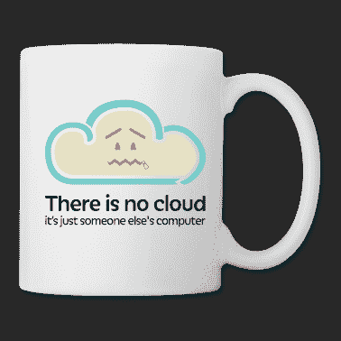
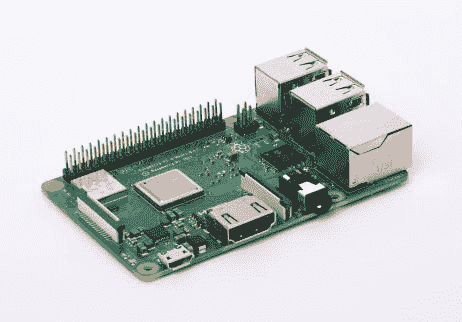
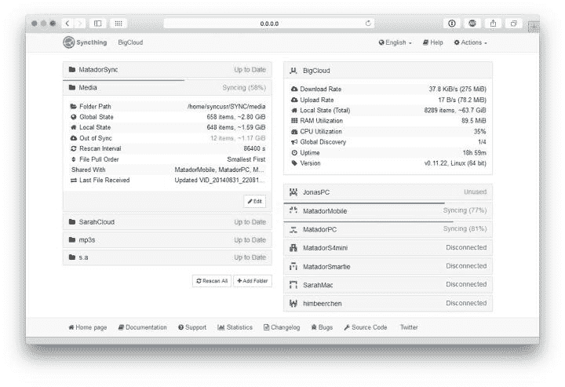
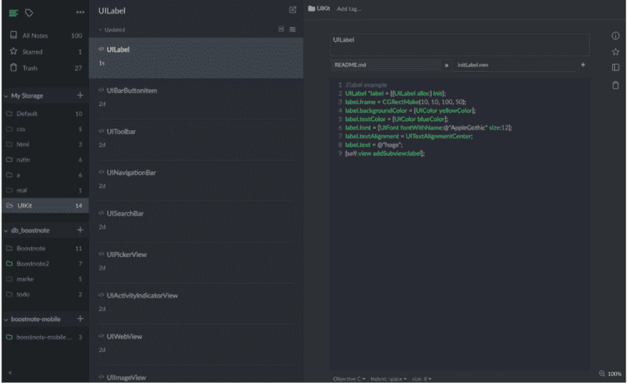

# 你在乎你的隐私吗？也许是时候建立自己的 Dropbox 了。

> 原文：<https://dev.to/shostarsson/do-you-care-about-your-privacy-maybe-it-is-time-to-set-up-your-own-dropbox-ncf>

*图片来自[sync thing](https://syncthing.net/)T3】*

* * *

互联网上有一个非常著名的迷因说

> “没有云，只是别人的电脑”

[T2】](https://res.cloudinary.com/practicaldev/image/fetch/s--z2UerQ0u--/c_limit%2Cf_auto%2Cfl_progressive%2Cq_auto%2Cw_880/http://www.freeitdata.com/wp-content/uploads/There-is-no-Cloud-Mug-1.png)

* * *

这可能会让你有些焦虑，当你看到非常大和著名的数据泄露时，重要的是要明白，这不是一个如果 ( *你将有一个数据泄露*的**的问题，而是一个当** ( *你将有一个数据泄露*的**的问题。**

但是我们非常幸运，因为随着开源技术的发展，每个人都有可能为非常受欢迎的服务安装我们自己的替代品。我可以突出显示 [Evernote](https://evernote.com/) 作为笔记应用，突出显示 [Dropbox](https://www.dropbox.com) 让你电脑文件系统中的每个人都能看到你的文件。

所以让我们说，我们想真正拥有你的文件，而不是把它们留给一个可以单方面改变其条款和条件的公司。

就我个人而言，我是 Evernote 和 Dropbox 的超级用户，Evernote 和 Dropbox 可以让我的文件在任何地方和所有设备上都可以使用。

如果我想继续使用 Dropbox，但你想确保 Dropbox 上的任何人都无法读取你的文件，你可以使用一个软件，在你向 Dropbox 发送任何东西之前，在你的硬盘上对文件进行加密。

Cryptomator 是一个非常好的工具，它可以做到这一点，并在你将数据发送到云端之前对其进行加密。

[T2】](https://res.cloudinary.com/practicaldev/image/fetch/s--2GduoAiE--/c_limit%2Cf_auto%2Cfl_progressive%2Cq_auto%2Cw_880/https://cryptomator.org/img/stage/logo.png)

这是对您使用过的任何云的巨大升级。尤其是在数据泄露的情况下。如果你选择一个足够强的密码，你是好的。

> 提示:“使用 [KeePassXC 密码管理器](https://keepassxc.org/)为您保存所有密码。”

但这种解决方案在某些时候可能会有问题，因为当你在旅途中使用智能手机时，你无法轻松解密你的数据。每次你想看一个文件的时候，你都需要输入密码。

所以让我们转到另一种方法，容易建立，但更有用的长期和支持你的隐私。

* * *

### 你掌控着你的文件

我将向你展示一些绝对令人惊奇的东西，那就是开源(非常重要，因为你将把你所有的文件，甚至是最隐私的文件都给它；-))

### 从收存箱移动

[T2】](https://res.cloudinary.com/practicaldev/image/fetch/s--WVTViG3v--/c_limit%2Cf_auto%2Cfl_progressive%2Cq_auto%2Cw_880/https://syncthing.nimg/logo-horizontal.svg)

Syncthing 是多平台的，它可以在 Linux，MacOS 和 Windows 上工作。它在 Android 上也有应用程序(抱歉，没有 iOS，但是如果你是一个 iOS 开发者，你会发现这太悲伤了，你应该解决这个问题；-)).
此外， [Syncthing](https://syncthing.net/) 可以安装在 ARM 设备上。这意味着它对某些 NAS 可用。
因此，如果你有一个 [QNAP](https://www.qnap.com) 或 [Synology](https://www.synology.com/en-global) (以及其他)NAS，你可以像在智能手机上安装应用程序一样安装它。

> 但是我没有那么有钱去买 NAS。:-(
> 但是我足够有钱拥有一把 [RaspberryPi](https://www.raspberrypi.org/) 。:-D

Raspberry Pi 是一种小型且价格合理的计算机，最初是为了学习编程而开发的。
[T3】](https://res.cloudinary.com/practicaldev/image/fetch/s--aAg318VV--/c_limit%2Cf_auto%2Cfl_progressive%2Cq_auto%2Cw_880/https://www.raspberrypi.org/app/uploads/2018/03/770A5842-462x322.jpg)

但是它是如此强大和多才多艺，以至于 DIY(自己动手)社区接受了它，并以如此多的方式破解它，如果你想以低成本做一些事情，树莓派现在是必不可少的设备。

我会认为你在你的树莓派上安装了 [Raspbian](https://www.raspberrypi.org/downloads/raspbian/) 。

所以现在你只需要在你的 Raspbian 上安装 Raspbian(别忘了在 Linux 上通过 signature ( `sha256sum file`)检查你下载的完整性；-))，你只需要下载并安装 RaspberryPi 的同步。

由于 Raspbian 是基于 Debian 的，你可以按照第页的说明在 RaspberryPi 上安装 Syncthing。

* * *

### 配置

Syncthing 基于[点对点技术](https://en.wikipedia.org/wiki/Peer-to-peer)。
这意味着只有你的设备在相互通信。有**没人**在某个时候做一些介绍。

配置您的 Syncthing 非常容易。

我喜欢有一台主计算机，树莓派，这台机器将成为我的任何其他机器的参考。

让我们考虑下面的图表。

每台机器都在主设备上推送更改，即 Raspberry Pi。

```
graph TD;

MacOS --> RaspberryPi
Ubuntu --> RaspberryPi
Windows10 --> RaspberryPi 
```

Enter fullscreen mode Exit fullscreen mode

但是 RaspberryPi 会在一台设备连接到网络时，将它从该设备收到的更改推送给其他设备。以便每个人都同步。

```
graph TD;

RaspberryPi --> MacOS
RaspberryPi --> Ubuntu
RaspberryPi --> Windows10 
```

Enter fullscreen mode Exit fullscreen mode

但是 MacOS，Ubuntu 和 Windows 10 的机器并没有互相对话。因为树莓派总是开着的，所以没必要让机器互相交谈。它消除了日常生活中的许多冲突(T2)。

如果你把这个比作 Dropbox，树莓 Pi 上的 Syncthing 就是我们的 Dropbox。永远在线，同步我们的文件修改。

Syncthing 正在您的浏览器中运行。
号刚刚在`8384`港发射`localhost`。
您还有 syncthing 接口，您可以通过代码机制发现您拥有的新设备(非常简单)。
！ [](https://res.cloudinary.com/practicaldev/image/fetch/s--INUVlSb4--/c_limit%2Cf_auto%2Cfl_progressive%2Cq_auto%2Cw_880/https://syncthing.nimg/screenshot-720.jpg)

* * *

### 高级配置

您可以从 Web UI 配置很多东西。一旦你对 Syncthing 的工作方式有了更多的了解，你就可以通过配置文件进行更深入的配置。
一切都在同步的[文档中有非常清晰的描述。](https://docs.syncthing.net/)

* * *

### 移自 Evernote

现在我们已经有了 Dropbox 的替代品，并且正在运行。我希望有一个笔记应用程序，可以在本地同步我的 Syncthing 文件夹，这样它就可以在我所有的机器上使用。

在做了大量研究来寻找满足我需求的完美笔记应用程序之后，我发现了 T2 的 Boostnote。

它是为开发者设计的，具有非常简洁的代码片段功能，可以在每个主要平台上运行，Linux，MacOs 和 Windows10，这对我很重要。

这里有一篇关于 iOS 开发者如何使用 snippets 来改进开发的好文章。

[T2】](https://res.cloudinary.com/practicaldev/image/fetch/s--U7w35dK1--/c_limit%2Cf_auto%2Cfl_progressive%2Cq_auto%2Cw_880/https://cdn-images-1.medium.com/max/1000/1%2A6Af2MvBFeO2csxqS4cz96w.png)

笔记本(正如 Evernote 中描述的那样)只是你电脑上的一个目录。所以你只需要选择一个与 Syncthing 同步的位置，你就有了自己的 Evernote。

您可以创建任意数量的笔记本。您只需在同步的 Boostnote 文件夹中创建新文件夹。

Boostnote 是一个非常好的软件，最重要的是，它是开源的。作为 Syncthing，你可以在 [Github](https://github.com/BoostIO/Boostnote) 上看看它的源代码。

* * *

我希望这篇文章会让你感兴趣，并让你决定拥有自己的东西。
我知道还有很多其他方法可以实现这一点。 [Nextcloud](https://nextcloud.com/) 非常好， [Resilio](https://www.resilio.com/) 也是，但我必须承认 Syncthing 和 Boostnote 拥有我解决问题所需的一切。
我很想听听您的意见，以及您为收回您的资产而采取的解决方案。