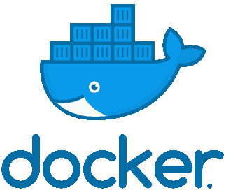
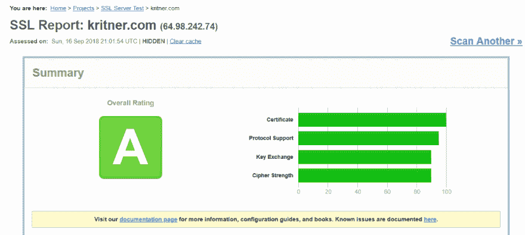

# docker、nginx 和 lets encrypt——为可爱的 HTTPS 建立的网站！

> 原文：<https://dev.to/kritner/docker-compose-nginx-and-letsencrypt--setting-up-website-to-do-all-the-things-for-that-https-4klk>

### docker、nginx 和 lets encrypt——为可爱的 HTTPS 建立的网站！

[T2】](https://res.cloudinary.com/practicaldev/image/fetch/s--pdV6xnoq--/c_limit%2Cf_auto%2Cfl_progressive%2Cq_auto%2Cw_880/https://cdn-images-1.medium.com/max/323/0%2Am-xEibEV8ttbhv7W.png)

我曾经使用过免费的证书，但是自从转移到 docker/kestrel/nginx 之后，我就没有成功地使用过它。今天一切都变了，我花了很长时间才弄明白我该怎么做才能让它正常工作。

这整个 unix、docker、nginx 的东西是相当新的(对我来说)，所以也许它只是我一直缺少的一些简单的东西。尽管如此，我希望这能帮助其他人，或者几个月后如果我决定再做一次的话，能帮助我自己。

#### 原始设置

我有一个[。net core](https://www.microsoft.com/net/download) 网站，通过 [kestrel](https://docs.microsoft.com/en-us/aspnet/core/fundamentals/servers/kestrel?view=aspnetcore-2.1) 托管，运行在 [docker](https://www.docker.com/) 上，通过 [nginx](https://www.nginx.com/) 进行反向代理。到目前为止，来自 nginx 的反向代理只能在 http/port 80 上工作。我不太了解反向代理，但是从声音上来看，它可以接收请求，并代表请求者将它们转发到特定的位置。在我的例子中，nginx 容器接收 http 请求，nginx 将该请求转发到我托管的 kestrel。net 核心站点。是这样吗？希望如此！

如前所述，nginx 只能处理 http 流量，我很难让它处理 https，原始配置如下:

坞站-组合:

```
version: '3.6'
services:

  kritner-website-web:
    image: ${DOCKER_REGISTRY}/kritnerwebsite
    expose:
      - "5000"
    networks:
      - frontend
    restart: always
    container_name: kritnerwebsite_web
  kritner-website-nginx:
    image: nginx:latest
    ports:
      - "80:80"
    volumes:
      - ../src/nginx/nginx.conf:/etc/nginx/nginx.conf
    depends_on:
      - kritner-website-web
    networks:
      - frontend
    restart: always
    container_name: kritnerwebsite_nginx

networks:
  frontend: 
```

在 docker-compose 文件中，我使用了两个独立的容器——公开端口 5000 的网站(在 docker 网络上，不公开)和在端口 80 上运行的 nginx。

engine x . conf 文件

```
worker_processes 4;

events { worker_connections 1024; }

http {
    sendfile on;

    upstream app_servers {
        server kritner-website-web:5000;
    }

    server {
        listen 80;

        location / {
            proxy_pass [http://app_servers](http://app_servers);
            proxy_redirect off;
            proxy_set_header Host $host;
            proxy_set_header X-Real-IP $remote_addr;
            proxy_set_header X-Forwarded-For $proxy_add_x_forwarded_for;
            proxy_set_header X-Forwarded-Host $server_name;
        }
    }
} 
```

在配置文件中，我们正在设置一个上游服务器，它的名称与我们从 docker-compose 文件 kritner-website-web:5000 中调用的容器服务的名称相同。

请注意，以上所有内容都可以在我网站的知识库中的这个[提交点](https://github.com/Kritner/KritnerWebsite/tree/0e86849c97bdcabf68d0df7ed7eb7e5eebdccd4f)找到。

#### 进入 HTTPS

Letsencrypt 是一个证书颁发机构，提供免费证书来帮助保护您的网站。为什么通过 TLS HTTPS 很重要？这里面有很多东西，以及它是如何工作的，但基本思想是，用户流量在发送到另一端之前，在两端都是加密的。这意味着，如果您在公共 wifi 和 https 上，可以说“嗅探线路”的人会看到正在发生的流量，但不会看到所述流量的内容，因为两端都使用相同的加密密钥加密/解密所述流量。如果你在一个 http 网站上，这种流量会以纯文本的形式来回发送——这意味着你的数据有被窃听的危险！也许我会在某个时候多写一点关于加密的内容(*自我提醒*)——尤其是因为这是我的日常工作！

所以 let sencrypt——这是我以前用过的一个服务，有各种各样的实现试图让它尽可能容易使用。通过对这篇文章的研究，我偶然发现:

[ACME 客户端实现-让我们加密-免费 SSL/TLS 证书](https://letsencrypt.org/docs/client-options/)

虽然我直到现在才真正找到这个页面，但在我的冒险开始之前，它可能会有用。我想将 letsencrypt 与我的 docker 容器网站和 nginx 一起使用，尽可能少地维护，因为 letsencrypt 证书的有效期只有 90 天。在我的研究中，我偶然发现了一个 docker 映像 [linuxserver/letsencrypt](https://hub.docker.com/r/linuxserver/letsencrypt/) ，它承诺利用 nginx、letsencrypt 证书生成和自动更新。听起来棒极了！虽然图像的文档似乎大部分足够了，至少我认为，对于精通所有这一过程的人来说；我发现它是缺乏的。整个设置过程花了我一些时间来弄清楚，因此这篇文章，希望能帮助下一个人，或者未来的我！

[](https://res.cloudinary.com/practicaldev/image/fetch/s--X38oiZT---/c_limit%2Cf_auto%2Cfl_progressive%2Cq_auto%2Cw_880/https://cdn-images-1.medium.com/max/1024/0%2ApH4NlR14ZjQskZxa.png) 

<figcaption>Linux 服务器。IO 标志</figcaption>

#### 斗争

当这个 linuxserver/letsencrypt 映像启动并工作时，我最大的困难是:

*   docker 卷如何“工作”以及它们与此容器的关系
*   如何设置卷以利用我的配置(与上述要点相关)—我最初很难弄清楚为什么我在容器上更改的设置会在重新加载所述容器时被更改回来(因为这是它们应该做的)
*   如何设置正确的 nginx 配置——放在哪里，放什么。

#### Docker 卷

Docker 卷( [doc](https://docs.docker.com/storage/volumes/) ):

> 卷是保存 Docker 容器生成和使用的数据的首选机制。虽然[绑定挂载](https://docs.docker.com/storage/bind-mounts/)依赖于主机的目录结构，但是卷完全由 Docker 管理。与绑定装载相比，卷有几个优势

letsencrypt 有很多配置要做，我花了一段时间才意识到，但是我需要一个从 **docker 主机**上的目录映射到 letsencrypt 映像上的特定目录的卷。我最终在 compose 文件中实现了这一点，如下所示:

```
volumes:
      - ${DOCKER_KRITNER_NGINX}:/config 
      - ./nginx.conf:/config/nginx/site-confs/default 
```

数组中的第一项($ { DOCKER _ krit ner _ NGINX }:/config)采用一个新的环境变量，该变量将主机目录(在变量中定义)映射到 DOCKER 容器本身中的/config。这意味着 **docker 主机**(在 env var 路径)将包含与卷映射(/config)第二部分的 **docker 容器**相同的配置

第二项(。/nginx.conf:/config/nginx/site-confs/default)映射我的本地存储库 nginx . conf 文件(我设置反向代理的文件)来覆盖 docker 主机和容器上的/config/nginx/site-confs/default 文件。

对于我的特殊情况，我最终需要修改的文件的完整列表是:

*   /config/dns-conf/dnsimple.ini
*   /config/nginx/site-confs/default

dnsimple.ini 配置是 add my api key，而…/default 包含 nginx 配置。

我最后得到的默认配置是:

```
upstream app_servers {
        server kritnerwebsite:5000;
}

## Version 2018/09/12 - Changelog: https://github.com/linuxserver/docker-letsencrypt/commits/master/root/defaults/default

# listening on port 80 disabled by default, remove the "#" signs to enable
# redirect all traffic to https
server {
 listen 80;
 server_name kritnerwebsite;
 return 301 https://$host$request_uri;
}

# main server block
server {
 listen 443 ssl;

# enable subfolder method reverse proxy confs
 include /config/nginx/proxy-confs/*.subfolder.conf;

# all ssl related config moved to ssl.conf
 include /config/nginx/ssl.conf;

 # enable for ldap auth
 #include /config/nginx/ldap.conf;

client_max_body_size 0;

location / {
            proxy_pass http://app_servers;
            proxy_redirect off;
            proxy_set_header Host $host;
            proxy_set_header X-Real-IP $remote_addr;
            proxy_set_header X-Forwarded-For $proxy_add_x_forwarded_for;
            proxy_set_header X-Forwarded-Host $server_name;
    }

}

# enable subdomain method reverse proxy confs
include /config/nginx/proxy-confs/*.subdomain.conf;
# enable proxy cache for auth
proxy_cache_path cache/ keys_zone=auth_cache:10m; 
```

这里的默认设置有一些变化，接下来我将重点介绍这些变化。

```
upstream app_servers {
        server kritnerwebsite:5000;
} 
```

以上是相当酷的，因为 docker 有自己的内部 DNS(我猜？)您可以通过容器名设置一个上游服务器，在我的例子中是“kritnerwebsite”(注意，我在文章的前面已经更改了它，即“kritner-website-web”)。

```
# listening on port 80 disabled by default, remove the "#" signs to enable
# redirect all traffic to https
server {
 listen 80;
 server_name kritnerwebsite;
 return 301 https://$host$request_uri;
} 
```

取消此部分的默认注释，应用我的服务器名“kritnerwebsite”

```
# main server block
server {
 listen 443 ssl;

# enable subfolder method reverse proxy confs
 include /config/nginx/proxy-confs/*.subfolder.conf;

# all ssl related config moved to ssl.conf
 include /config/nginx/ssl.conf;

 # enable for ldap auth
 #include /config/nginx/ldap.conf;

client_max_body_size 0;

location / {
            proxy_pass http://app_servers;
            proxy_redirect off;
            proxy_set_header Host $host;
            proxy_set_header X-Real-IP $remote_addr;
            proxy_set_header X-Forwarded-For $proxy_add_x_forwarded_for;
            proxy_set_header X-Forwarded-Host $server_name;
    }

} 
```

在上面，它主要来自“默认”保存的“位置”和该对象中的所有内容。这里，我们设置了反向代理，将对“/”(任何内容)的请求转发到我们的 [http://app_servers](http://app_servers) (上游的 kritnerwebsite)。

#### 坞站-组合. yml

我们的 docker compose 文件并没有改变最初的*整个* lot，但是有一些值得注意的变化，我也将描述这些变化:

```
version: '3.6'
services:

  nginx:
    image: linuxserver/letsencrypt
    ports:
      - "80:80"
      - "443:443"
    volumes:
      - ${DOCKER_KRITNER_NGINX}:/config 
      - ./nginx.conf:/config/nginx/site-confs/default
    depends_on:
      - kritnerwebsite
    networks:
      - frontend
    container_name: nginx
    environment:
      - PUID=1001 # get on dockerhost through command "id <user>""
      - PGID=1001
      - EMAIL=kritner@gmail.com
      - URL=kritner.com
      - SUBDOMAINS=www
      - TZ=America/NewYork
      - VALIDATION=dns # using dns validation
      - DNSPLUGIN=dnsimple # via dnsimple, note there is additional configuration require separate from this file
      # - STAGING=true # this should be uncommented when testing for initial success, to avoid some rate limiting

kritnerwebsite:
    image: ${DOCKER_REGISTRY}/kritnerwebsite
    networks:
      - frontend
    expose:
      - "5000"
    restart: always
    container_name: kritnerwebsite

networks:
  frontend: 
```

对于新零件:

```
nginx:
    image: linuxserver/letsencrypt 
```

使用不同的映像——Linux server/lets encrypt 而不是 nginx。这个映像包含 nginx 和 certbot，以及一个在应用程序启动时运行 certbot 的 cronjob。

```
ports:
      - "80:80"
      - "443:443" 
```

现在我们同时使用 http 和 https 端口(注意，我们通过 nginx 配置将 http 调用重定向到 https。

```
volumes:
      - ${DOCKER_KRITNER_NGINX}:/config 
      - ./nginx.conf:/config/nginx/site-confs/default 
```

在本文前面已经讨论过，使用这些卷来正确地设置 nginx 配置，使用我们的 dnsimple api 密钥，以及我们对 kritnerwebsite 的反向代理。

```
environment:
      - PUID=1001 # get on dockerhost through command "id <user>"
      - PGID=1001
      - EMAIL=kritner@gmail.com
      - URL=kritner.com
      - SUBDOMAINS=www
      - TZ=America/NewYork
      - VALIDATION=dns # using dns validation
      - DNSPLUGIN=dnsimple # via dnsimple, note there is additional configuration require separate from this file
      # - STAGING=true # this should be uncommented when testing for initial success, to avoid some rate limiting 
```

根据 letsencrypt 文档，需要以下环境变量:

[linuxserver/letsencrypt](https://hub.docker.com/r/linuxserver/letsencrypt/)

*   PUID/PGID —通过命令“ID”进入 dockerhost
*   电子邮件—嗯，您的电子邮件(显然是用于证书过期电子邮件)
*   URL —主域 URL
*   子域—要认证的 URL 的任何子域
*   TZ —时区
*   验证——要做的验证类型——我使用的是 DNSimple，所以在这个领域我需要 DNS。其他选项有 html、tls-sni
*   dnsplugin — dnsimple —根据 letsencrypt 文档，其他选项有 cloudflare、cloudxns、digitalocean、dnsmadeeasy、google、luadns、nsone、rfc2136 和 route53
*   staging = true——在让它工作之前，我用它来测试我所有的各种尝试。当不在分段模式下运行时，letsencrypt 有速率限制(或者至少在分段模式下更难运行)。

以上所有的改变，试验，失败，然后最终成功都可以在这个拉取请求中找到:

[Nginx by krit ner Pull Request # 24 krit ner/krit ner website](https://github.com/Kritner/KritnerWebsite/pull/24/commits)

最后的结果？

[](https://res.cloudinary.com/practicaldev/image/fetch/s--L5OrkqD0--/c_limit%2Cf_auto%2Cfl_progressive%2Cq_auto%2Cw_880/https://cdn-images-1.medium.com/max/281/1%2Abkwc9XLdHIlMJhApeGFU7Q.png) 

<figcaption>Awww 耶</figcaption>

从[https://www.ssllabs.com/](https://www.ssllabs.com/)

[T2】](https://res.cloudinary.com/practicaldev/image/fetch/s--IEiGkfZP--/c_limit%2Cf_auto%2Cfl_progressive%2Cq_auto%2Cw_880/https://cdn-images-1.medium.com/max/1024/1%2AjYoRBXlE7i8JoWsT9-9BOg.png)

不是“A+”，但对于使用一个预构建的 docker 映像来满足我的 HTTPs 需求来说，确实不错！

相关:

*   [在 ssllabs.com 从“A”到“A+”](https://dev.to/kritner/going-from-an-a-to-an-a-on-ssllabscom-3pda)

* * *