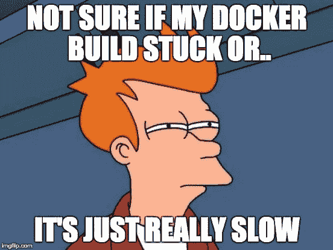

# Docker 容器:未捕获的终止信号

> 原文：<https://dev.to/mdemblani/docker-container-uncaught-kill-signal-10l6>

您是否曾经无法终止/停止正在运行的 Docker 容器实例？尝试多次按下你终端里的 Ctrl+C (Cmd+C)，却一直倒霉。

最终，您求助于终止 Docker 进程，这样，您的容器会成功地停止，并出现著名的`exit code 0`(如果您幸运的话)，或者它会因退出错误而被强行终止。

[T2】](https://res.cloudinary.com/practicaldev/image/fetch/s--4SDZWCPd--/c_limit%2Cf_auto%2Cfl_progressive%2Cq_auto%2Cw_880/https://thepracticaldev.s3.amazonaws.com/i/eomlakvyh35h9m4o5vw1.jpg)

如果由于终止容器而出现退出错误，则会导致与该容器相关联的卷中的数据损坏，因此，您必须重新构建容器。

[T2】](https://res.cloudinary.com/practicaldev/image/fetch/s--4a6bTTsp--/c_limit%2Cf_auto%2Cfl_progressive%2Cq_auto%2Cw_880/https://thepracticaldev.s3.amazonaws.com/i/9fy084yxhybykv80nhms.png)

发生这种情况有两个原因:

1.  容器不会侦听由 Ctrl+C (Cmd+C)组合键生成的终止信号，如 SIGINT
2.  容器关闭进程超过了 docker 进程指定的超时时间，它将容器分配给关闭进程，导致 docker 进程强行杀死容器，从而导致损坏。

## 解

现在有两种已知的方法来解决上述问题:

1.  增加超时时间
2.  修补入口脚本

#### 增加超时

在这种情况下，您只需通知 docker 进程等待一段时间，直到容器执行正常关闭。超时应该增加的值应该比检测到信号后容器关闭所用的时间稍长。开始时，您可以将超时设置为 30 秒左右作为安全赌注。

```
docker stop -t 30 CONTAINER_NAME 
```

#### 修补入口脚本

在这个方法中，我们基本上用自定义代码对容器的入口文件进行猴子式修补，这允许我们检测发送到容器的`SIGINT`信号。

为了修补入口脚本，我们必须创建一个监听器文件(`signal-listener.sh` ):

```
 #!/bin/bash
# A wrapper around /entrypoint.sh to trap the SIGINT signal (Ctrl+C) and forwards it to the mysql daemon
# In other words : traps SIGINT and SIGTERM signals and forwards them to the child process as SIGTERM signals

signalListener() {
    "$@" &
    pid="$!"
    trap "echo 'Stopping PID $pid'; kill -SIGTERM $pid" SIGINT SIGTERM

    # A signal emitted while waiting will make the wait command return code > 128
    # Let's wrap it in a loop that doesn't end before the process is indeed stopped
    while kill -0 $pid > /dev/null 2>&1; do wait done
}

signalListener /entrypoint.sh $@ 
```

确保该文件与您将要构建的`Dockerfile`在同一个文件夹中。

下一步是用`signal-listener.sh`文件包装`entrypoint.sh`文件。在你的`Dockerfile`中，在最后添加下面几行:

```
 COPY signal-listener.sh /run.sh

# Entrypoint overload to catch the ctrl+c and stop signals
ENTRYPOINT ["/bin/bash", "/run.sh"]
CMD [ADD_THE_DEFAULT_DOCKER_CMD_IF_ANY] 
```

现在，如果您注意到，在运行 docker 容器之后，您可以按下 Ctrl+C(Cmd+C)组合键并向其传递 SIGINT 命令。这个命令现在会被容器检测到，并且会正常终止。

##### *演员表:*

##### *本帖基于以下 Github 问题提供的解决方案:[容器没有捕捉到信号并退出(Ctrl+C)](https://github.com/docker-library/mysql/issues/47) 。感谢用户 [Jérémy VIGNELLES](https://github.com/jeremyVignelles) 提供的解决方案。*