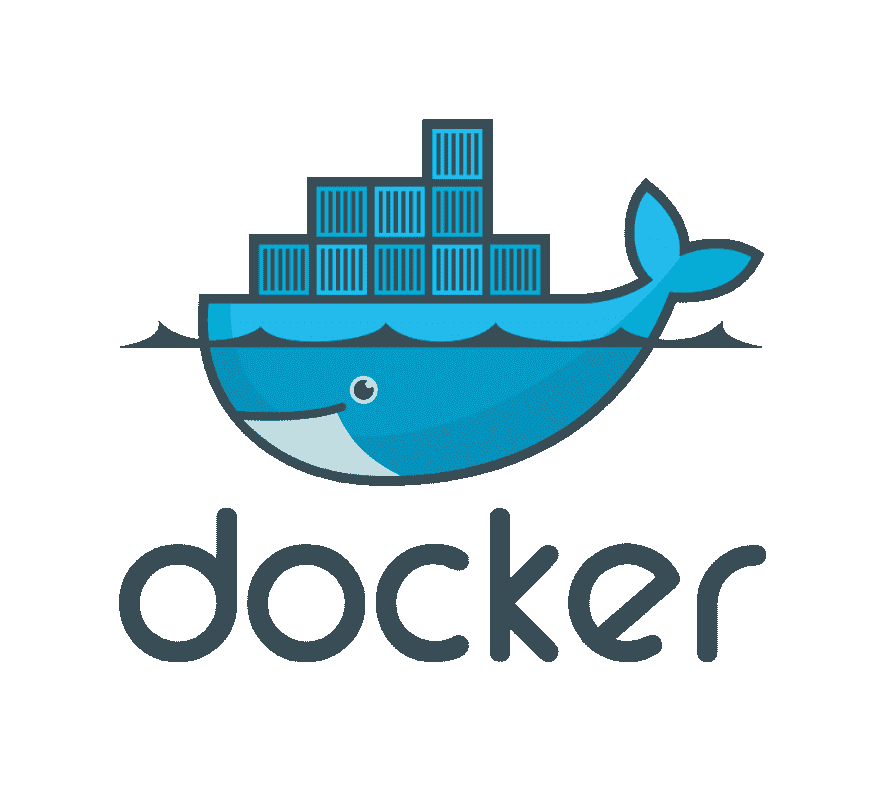
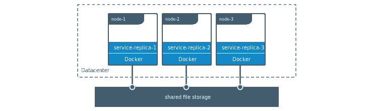

# 遗留 Drupal 开发的 Docker

> 原文：<https://dev.to/jonesrussell/docker-for-legacy-drupal-development-2igm>

#### 利用 Linux 容器将 Drupal 6 迁移到 Drupal 8

阿妮。先说这篇文章/教程(artorial，tutarticle！？)，这个 *artorial* 可以被命名为“ **Docker for Development** 、*Leveraging Linux containers*”，并且几乎可以应用于任何你想要的栈。

[T2】](https://res.cloudinary.com/practicaldev/image/fetch/s--fhn6Wm5I--/c_limit%2Cf_auto%2Cfl_progressive%2Cq_auto%2Cw_880/https://cdn-images-1.medium.com/max/1024/1%2As-YgL1NW7evYyCBWI-7w8Q.png)

我使用 Drupal 是因为我最近开始了从 Drupal 6 (D6)到 Drupal 8 (D8)的网站迁移。

> Drupal 是一个免费的开源内容管理系统(CMS ),拥有一个大型的支持性社区。它被全球数百万人和组织用来建立和维护他们的网站。

两个版本都运行在 LAMP 栈上，但是使用不同版本的 PHP。D6 在 2016 年初达到了它的生命终点，几乎比 PHP 7 发布早了一年。因此，它需要 PHP 5.6 和更低版本才能运行。

*myDropWizard.com***的乡亲们正勇敢地支持着 D6，直到母牛回家，为他们喝彩！我和他们没有任何联系，我只是被他们* [*的承诺*](https://www.mydropwizard.com/blog/drupal-6-2019-yes-really) *的水平震惊了。**

 *根据文档，D8 将在 PHP 5.5.9+上运行，但任何低于 7.1 的版本[都不推荐](https://www.drupal.org/docs/8/system-requirements/php-requirements#php_required)。**如果你在 PHP 5.6 上运行 Drupal 8，你会发现只有痛苦**。

那么如何在同一台主机上同时运行 PHP 5 和 PHP 7 呢？启动一对虚拟机？[和 Apache 一起滑入 Nginx 和 PHP-FPM](https://www.tecmint.com/install-different-php-versions-in-ubuntu/)？前一种选择是可以接受的。后者近乎虐待狂。

<figure>[](https://res.cloudinary.com/practicaldev/image/fetch/s--WY990CuX--/c_limit%2Cf_auto%2Cfl_progressive%2Cq_auto%2Cw_880/https://cdn-images-1.medium.com/max/244/1%2A4jh-4MnN2NkYxWZVOKBklw.jpeg) 

<figcaption>还有就是，凯文！</figcaption>

</figure>

答案当然是 Docker。

### 这家伙的设定

我使用 Linux 作为我的主要操作系统。Ubuntu 18.04 加载了来自 Ubuntu 官方仓库的 Apache 2.4、MySQL 5.7 和 PHP 7.2 的最新包。

#### Drupal 8

我的 Ubuntu 主机与 D8 将要部署的生产环境非常相似，我创建了一个 Apache 虚拟主机(vhost)和 MySQL 数据库，然后[使用一个 composer 模板](https://www.drupal.org/docs/develop/using-composer/using-composer-to-manage-drupal-site-dependencies#download-core-option-a)下载 D8，并用 [Drupal 控制台](https://docs.drupalconsole.com/en/commands/site-install.html)安装它。

> 什么是 Drupal 控制台？Drupal CLI。一个生成样板代码、与 Drupal 交互和调试 Drupal 的工具。从一开始，它就利用了 Drupal 8 中引入的相同的现代 PHP 实践。

#### Drupal 6

这就是乐趣的开始。但是首先我将解释 VM 和容器之间的区别。

### 虚拟机和容器对比

#### 虚拟机

有许多虚拟机提供商。 [VirtualBox](https://www.virtualbox.org/) 、 [QEMU](https://www.qemu.org/) 和 [VMWare](https://www.vmware.com/) 等等。一个虚拟机包含一个完整的操作系统和独立于主机运行的内核。它与正常的台式机或服务器没有什么区别。

在启动之前，会为虚拟机分配 RAM 和 CPU 内核等资源。虚拟机在客户操作系统和主机之间提供了一个硬件仿真层，就客户操作系统而言，它看起来和感觉上都像裸机。

因为它们类似于物理桌面和服务器，所以虚拟机需要大量的主机系统资源。与容器相比，这严重限制了单个主机上可以并发运行的虚拟机数量。启动和关闭时间也与物理机相同；另一个显著的区别。

#### 容器

容器提供了虚拟机的优势，而没有开销。通过在内核级虚拟化，容器与主机共享资源。与虚拟机相比，更多的容器可以在一台机器上同时运行。

容器更担心的是资源优先级而不是资源分配。换句话说，一个容器说“你什么时候为我运行这个过程？”而不是“我需要多少 CPU 来运行这个进程？”。

最后，启动或关闭容器非常快** whooooosh **。因为容器与主机共享一个完全加载的内核，所以它们可以在几毫秒内启动、执行任务，然后关闭。容器是科技世界的蜉蝣。另一方面，它们会持续到天灾把它们连同你的房子一起拖垮。

#### 码头工人

我几年前就开始使用 Docker，但直到最近才在我的常规计划中给了它一个黄金时段。

Docker 通过将应用程序与其依赖项打包在一起并作为映像发送出去，使得在一个轻量级和可移植的容器中创建、部署和运行应用程序变得更加容易。

我只是浏览了一下 Docker 的皮毛，并不完全理解它是如何工作的。我也渴望了解竞争对手，比如 Canonical 的 LXD 或 T2 的 CoreOS/Redhat 的 Rkt。一切都会好起来的。

#### Docker 图片

Docker 将包含操作系统和完成工作所需软件的映像加载到容器中。换句话说，映像包含您的应用程序运行时环境。

根据需求的复杂程度，创建一个图像是相当容易的。您在 YAML 编写一组指令，保存为 docker 文件，然后运行 docker build。我们的教程要求很简单，可以通过从 Docker 图像注册服务 [Docker Hub](https://hub.docker.com/) 获取的现有图像来满足。

虽然我可以找到一个包含 Apache、PHP 和 MySQL 的图像，但我们将遵循[最佳实践](https://devops.stackexchange.com/questions/447/why-it-is-recommended-to-run-only-one-process-in-a-container)并将 web 服务器从数据库分离到两个容器中，它们将通过 Docker 创建的内部子网进行通信。

#### 持久化数据

最后，容器被设计为一次性的，能够作为单个实例在单个主机上运行，或者作为分布在服务器集群上的多个实例进行扩展。默认情况下，数据被写入容器的可写层，并将与容器一起被处理。

卷和绑定挂载是持久化数据的两个选项。我可以，也许会，写一整篇文章来充分解释它们。但为了简单起见，我会说卷由 Docker 管理，与主机隔离，可以安装到多个容器中，并存储在远程主机或云提供商中。

绑定装载是装载到容器中的主机上的文件或目录。它们是在开发期间共享配置数据、源代码和构建工件的好选择。在生产中，您的构建工件最好直接复制到映像中，在环境中配置，不需要源代码。

[T2】](https://res.cloudinary.com/practicaldev/image/fetch/s--WdOtDgdR--/c_limit%2Cf_auto%2Cfl_progressive%2Cq_auto%2Cw_880/https://cdn-images-1.medium.com/max/740/1%2AW49kEOLhKZTuC9DmRKD6Qg.png)

建议使用卷来存储容器使用和生成的数据。绑定挂载依赖于主机的目录结构，阻碍了容器的可移植性。

在本教程中，我们将通过绑定挂载。

### 总结

据我所知，那是码头工人。我希望你能从中受益，并鼓励你开始使用 Docker 进行开发。我邀请你加入到下面的乐趣中来，按照一步一步的指示去使用 Docker。

### 教程

让我们在 Ubuntu 的容器中设置 Drupal 6。如果你没有使用 Ubuntu，不要担心，你唯一需要改变的步骤是“安装 Docker”。在这种情况下，请参考[https://docs.docker.com/install/#supported-platforms](https://docs.docker.com/install/#supported-platforms)获取在您的操作系统上安装 Docker 的说明。

如果您发现任何错误或看到改进的空间，请联系我。否则，瓦卡瓦卡。

#### 先决条件

sudo(或 root)——安装和运行 Docker 所必需的。要在没有 sudo 或 root 的情况下运行 docker 命令，您必须将您的用户帐户添加到 *docker* 组。

#### 目录

1.  安装 Docker
2.  将用户添加到 docker 组
3.  启动 Docker
4.  拉 MySQL 图像
5.  启动容器
6.  下载 Drupal 6
7.  提取 Apache/PHP 图像
8.  启用修改重写
9.  允许覆盖
10.  使用绑定挂载启动容器
11.  安装 Drupal
12.  清除

比米尼扎。

#### 安装 Docker

打开一个终端，确保你的包列表是最新的，然后安装 Docker(又名 Docker 引擎):

```
$ sudo apt update
$ sudo apt install docker.io -y 
```

Enter fullscreen mode Exit fullscreen mode

*输出:*

```
\<heaps of output\>
Processing triggers for systemd (237-3ubuntu10.3) ... 
```

Enter fullscreen mode Exit fullscreen mode

Docker 引擎由三个主要组件组成:

*   *dockerd* (服务器)—一个长期运行的后台进程守护程序
*   *docker* (客户端)——命令行界面
*   REST API —指定程序可以用来与守护程序通信的接口

#### 启动 Docker

启动前面提到的长时间运行的后台进程:

```
$ sudo systemctl start docker 
```

Enter fullscreen mode Exit fullscreen mode

可选地，告诉 *systemd* 在系统启动时启动 docker:

```
$ sudo systemctl enable docker 
```

Enter fullscreen mode Exit fullscreen mode

Docker 现在已经安装好，可以使用了。检查 docker 是否正在运行:

```
$ systemctl is-active docker 
```

Enter fullscreen mode Exit fullscreen mode

*输出:*

```
active 
```

Enter fullscreen mode Exit fullscreen mode

#### 拉 MySQL 图片

现在你已经运行了 docker，你可以提取你的第一个图像了。从[MySQL](https://hub.docker.com/r/mysql/mysql-server/)5.6 版本开始(未指定 *:5.6* ，隐含*最新*:

```
$ sudo docker pull mysql:5.6 
```

Enter fullscreen mode Exit fullscreen mode

*输出:*

```
5.6: Pulling from library/mysql
802b00ed6f79: Pull complete 
30f19a05b898: Pull complete 
3e43303be5e9: Pull complete 
94b281824ae2: Pull complete 
51eb397095b1: Pull complete 
3f6fe5e46bae: Pull complete 
b5a334ca6427: Pull complete 
115764d35d7a: Pull complete 
719bba2efabc: Pull complete 
284e66788ee1: Pull complete 
0f085ade122c: Pull complete 
Digest: sha256:4c44f46efaff3ebe7cdc7b35a616c77aa003dc5de4b26c80d0ccae1f9db4a372
Status: Downloaded newer image for mysql:5.6 
```

Enter fullscreen mode Exit fullscreen mode

### 启动 MySQL

启动 DB 容器，选项解释如下:

```
$ sudo docker run -d \
--name="drupal-mysql" \
-e MYSQL\_ROOT\_PASSWORD=drupalroot \
-e MYSQL\_DATABASE=drupal6 \
-e MYSQL\_USER=drupal \
-e MYSQL\_PASSWORD=drupal6pass \
mysql:5.6 
```

Enter fullscreen mode Exit fullscreen mode

*   -d —作为后台进程启动容器。
*   -name-将在 Drupal 安装过程中被引用。如果没有提供名称，将会分配一个随机名称。
*   -e-Set 是一个环境变量。MySQL 将被配置为由环境在中传递的[值。](https://hub.docker.com/_/mysql/)

*输出(会有所不同):*

```
de99c912e3fbeb4f113889c145b5fab82787259c21d51962c9186e90c27d2857 
```

Enter fullscreen mode Exit fullscreen mode

#### 下载 Drupal 6

D6 可以从 Drupal 官方网站下载，打包成一个 gzip 压缩包。可以用 wget:
抢

```
$ cd ~
$ wget [https://ftp.drupal.org/files/projects/drupal-6.38.tar.gz](https://ftp.drupal.org/files/projects/drupal-6.38.tar.gz)
$ tar -xzf drupal-6.38.tar.gz 
```

Enter fullscreen mode Exit fullscreen mode

验证 drupal-6.38 是否存在于您的主目录:

```
$ if test -d ~/drupal-6.38; then echo “It exists”; fi 
```

Enter fullscreen mode Exit fullscreen mode

*输出:*

```
It exists 
```

Enter fullscreen mode Exit fullscreen mode

#### 拉 Apache/PHP 图片

现在拉一个 Ubuntu 14.04 LTS 的 docker 镜像，带有 Apache 2、PHP 5 和来自[https://hub.docker.com/r/nimmis/apache-php5/:](https://hub.docker.com/r/nimmis/apache-php5/:)T2【的 Composer】

```
$ sudo docker pull nimmis/apache-php5 
```

Enter fullscreen mode Exit fullscreen mode

*输出:*

```
Using default tag: latest
latest: Pulling from nimmis/apache-php5
c2c80a08aa8c: Pull complete 
6ace04d7a4a2: Pull complete 
f03114bcfb25: Pull complete 
99df43987812: Pull complete 
9c646cd4d155: Pull complete 
5c017123b62e: Pull complete 
8f95d9abec41: Pull complete 
c46de42c66c3: Pull complete 
9a19620cecad: Pull complete 
5c62abdf642f: Pull complete 
Digest: sha256:712d35d5cc30e6a911e260e871f08f77d5684edcc50cba21163535714c547ff5
Status: Downloaded newer image for nimmis/apache-php5:latest 
```

Enter fullscreen mode Exit fullscreen mode

#### 文档根和传入端口

容器化的 Apache 的默认 DocumentRoot 是/var/www/html，我们将把它绑定到~/drupal-6.38 中的 D6 文件。

因为我已经在主机上安装了 Apache，所以我必须将容器的端口 80 绑定到其他地方。我使用的是 10080，但你可以选择几乎任何其他自由港。

```
$ sudo docker run -d \
-p 10080:80 \
-v ~/drupal-6.38:/var/www/html \
--name="drupal-app" \
--link="drupal-mysql" \
nimmis/apache-php5 
```

Enter fullscreen mode Exit fullscreen mode

*输出:*

```
0398890ab8e0a082f68373c8e7fd088e925f9bac0eca178399b883091919ee77 
```

Enter fullscreen mode Exit fullscreen mode

run 和 nimmis/apache-php5 之间的解释:

*   -d —后台运行。
*   -p 10080:80 —将主机端口 10080 绑定到容器端口 80。
*   -v ~/drupal-6.38:/var/www/html —将主机目录绑定到容器目录。
*   —Name = " Drupal-app”—为了方便起见，命名容器实例。
*   -Link = " drupal-mysql "-链接到 MySQL 容器，以便 Drupal 可以与数据库通信。

#### 安装 Drupal

在浏览器中打开[http://localhost:10080](http://localhost:10080)(*xdg-open 是一个程序，它将在您的操作系统中设置的首选应用程序中打开文件或 URL*):

```
$ xdg-open [http://localhost:10080](http://localhost:10080) 
```

Enter fullscreen mode Exit fullscreen mode

Tada！Drupal 6 安装页面应该在浏览器中打开，由一组 Docker 容器提供服务。

要完成安装，使用在*启动 MySQL* 步骤中设置的数据库名称( *drupal6* )、用户名( *drupal* )和密码( *drupal6pass* )。在*高级选项*下，将*数据库主机*设置为您的 MySQL 容器的名称 *drupal-mysql* 。

### 清理

当您使用完 Drupal 6 后，关闭容器并从主机中删除它们。

停止容器:

```
$ sudo docker container stop drupal-app drupal-mysql 
```

Enter fullscreen mode Exit fullscreen mode

*输出:*

```
drupal-app
drupal-mysql 
```

Enter fullscreen mode Exit fullscreen mode

移除容器:

```
$ sudo docker container rm drupal-app drupal-mysql 
```

Enter fullscreen mode Exit fullscreen mode

*输出:*

```
drupal-app
drupal-mysql 
```

Enter fullscreen mode Exit fullscreen mode

验证容器已被删除:

```
$ sudo docker container ls 
```

Enter fullscreen mode Exit fullscreen mode

就这样，往前走。Baamaapii。

### 奖金:*码头工人*组

显示您所属的群组列表很简单:

```
$ group 
```

Enter fullscreen mode Exit fullscreen mode

*输出:*

```
roosta adm cdrom sudo dip plugdev lpadmin sambashare 
```

Enter fullscreen mode Exit fullscreen mode

将您的用户帐户添加到 *docker* 组:

```
$ sudo usermod -aG docker $USER 
```

Enter fullscreen mode Exit fullscreen mode

您必须先注销，然后重新登录，它才会生效。*