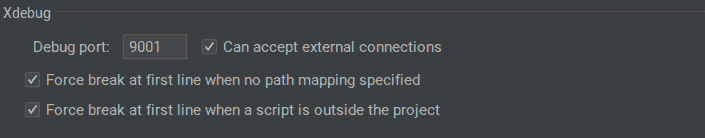
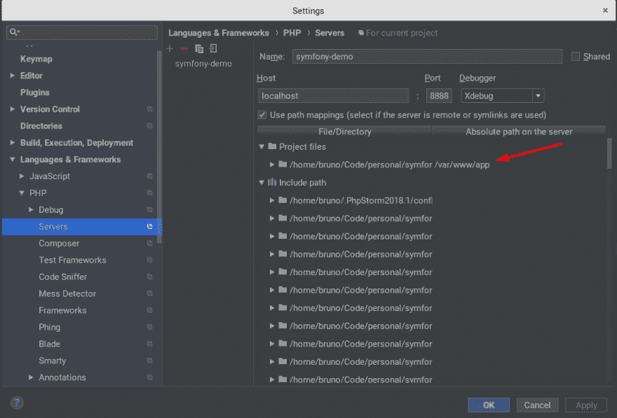
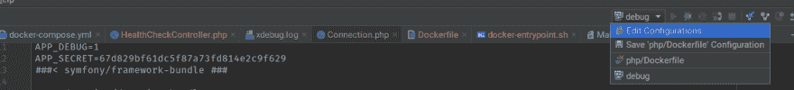
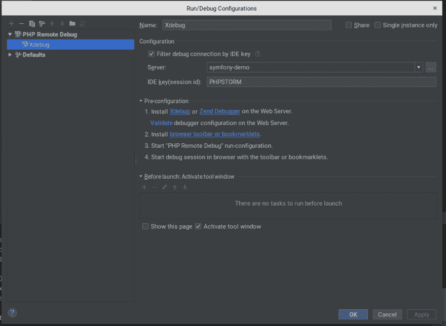
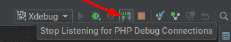
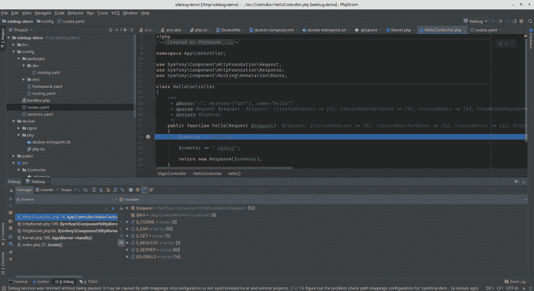

# Docker，PHPStorm 和 Xdebug，权威指南

> 原文：<https://dev.to/brpaz/docker-phpstorm-and-xdebug-the-definitive-guide-14og>

Docker 极大地改变了我们开发应用程序的方式。有了它，每个人都可以用一个命令轻松运行一个复杂的应用程序，而不必担心依赖关系等内部细节。当在团队或企业环境中工作时，这些优势甚至更大。我仍然记得我加入当前公司的前 3 天，配置项目和所有相关的库和工具。Docker 使它变得更加容易、快速和一致。

但凡事都有代价。维护所有 Docker 的东西是一件额外的复杂事情。此外，一些在本地运行的普通开发环境中非常容易的事情，比如从 IDE 中调试应用程序，现在需要一些额外的配置。如果让 Xdebug 工作，这不是一件容易的事情。我找不到一本从头到尾包含所有步骤的指南。这就是我决定写这篇文章的原因。它将指导您一步一步地使用 Dockerized Symfony 4 应用程序安装和配置 Xdebug 和 PHPStorm。

## 先决条件

*   这是在一台 Ubuntu 18.04 机器上测试的，该机器装有 PHPStorm 2018.1.4 和最新版本的 [Docker](https://www.docker.com/) 和 [Docker Compose](https://docs.docker.com/compose/) 。有些东西在其他操作系统中可能会有所不同。
*   我假设你有 Docker，PHP 和 XDebug 的基础知识。
*   您可以克隆这个库作为基础来跟踪这个 gude，因为它包含一个基本的 Symfony Flex 应用程序，包含了本文中解释的所有 Docker 内容。

## 第一步——将申请归档

当然，为了能够使用 Xdebug，您必须将它安装在 Docker 容器上。做到这一点的方法取决于你的基本形象。我总是使用阿尔卑斯山的图片。我不会进入如何 Dockerize 一个 Symfony 应用程序的细节。您可以跟随演示资源库中的 [Dockerfile](https://github.com/brpaz/symfony-docker-xdebug-demo/blob/master/Dockerfile) 一起学习。

下面是安装 Xdebug 的 Dockerfile 的相关摘录:

```
ARG WITH_XDEBUG=false

RUN if [ $WITH_XDEBUG = "true" ] ; then \
        pecl install xdebug; \
        docker-php-ext-enable xdebug; \
        echo "error_reporting = E_ALL" >> /usr/local/etc/php/conf.d/docker-php-ext-xdebug.ini; \
        echo "display_startup_errors = On" >> /usr/local/etc/php/conf.d/docker-php-ext-xdebug.ini; \
        echo "display_errors = On" >> /usr/local/etc/php/conf.d/docker-php-ext-xdebug.ini; \
        echo "xdebug.remote_enable=1" >> /usr/local/etc/php/conf.d/docker-php-ext-xdebug.ini; \
    fi ; 
```

Enter fullscreen mode Exit fullscreen mode

我不想有一个单独的 docker 文件用于开发和生产，所以我定义了一个 build 参数，它将告诉我们是否要安装 Xdebug。

然后，在我的 Docker-compose 文件中，我为我的应用程序定义了如下内容:

```
version: "3"

services:

  php:
    build:
      context: .
      args:
        - WITH_XDEBUG=true
    env_file: .env
    volumes:
      - .:/var/www/app:rw 
```

Enter fullscreen mode Exit fullscreen mode

[参见](https://github.com/brpaz/symfony-docker-xdebug-demo/blob/master/docker-compose.yml)获取完整的 docker-compose 文件。

这没什么特别的。重要的一点是“env_file”指令，它告诉 Compose 从“env _ file”加载环境变量。env”文件，这是 Symfony 4 应用程序的标准方式。

我们将使用该文件为 Xdebug 添加一些必需的环境变量。如果你愿意，你也可以使用“环境”部分直接添加到 docker-compose 文件中。

## 环境变量

我们将定义以下环境变量:

*   PHP _ IDE _ CONFIG——这个变量定义了与应用程序相关的服务器配置。稍后将详细介绍。
*   XDEBUG _ CONFIG——这个变量允许定义一些 XDEBUG 配置。“远程主机”是您的主机(PHPStorm 正在运行的那台)的私有 ip。“remote_port”是 PHPStorm 将监听传入 Xdebug 连接的端口。这两个设置允许 PHPStorm 和 Xdebug 进行通信。没有这个是不行的。

我们会将它们添加到我们的”。env "文件是这样的:

```
PHP_IDE_CONFIG=serverName=symfony-demo
XDEBUG_CONFIG=remote_host=192.168.1.102 remote_port=9001 
```

Enter fullscreen mode Exit fullscreen mode

就代码而言，就是这样。

接下来让我们深入研究 PHPStorm 配置。

## PHP 表单配置

您应该做的第一件事是检查您的调试设置。在 PHPStorm 中，进入文件->设置->语言和框架-> PHP >调试。

确保您拥有之前在“XDEBUG_CONFIG”环境变量中配置的 some 端口:

[T2】](https://res.cloudinary.com/practicaldev/image/fetch/s--W5IaOGuQ--/c_limit%2Cf_auto%2Cfl_progressive%2Cq_auto%2Cw_880/http://i.imgur.com/lt8ayc9.png)

接下来，我们需要配置一个服务器。这就是 PHPStorm 将本地系统中的文件路径映射到容器中的路径的方式。

进入文件->设置->语言和框架-> PHP ->服务器

[T2】](https://res.cloudinary.com/practicaldev/image/fetch/s--0bGXXi9F--/c_limit%2Cf_auto%2Cfl_progressive%2Cq_auto%2Cw_880/http://i.imgur.com/zTF9QFb.png)

为您的服务器命名。它应该与您在“PHP_IDE_CONFIG”环境变量中定义的值相匹配。我们称之为“symfony-demo”。

“主机”和“端口”是将如何访问您的应用程序。在我的例子中是 localhost:8888。

然后是“路径映射”。

在“项目文件”部分，您必须将应用程序的根路径映射到容器内部的路径。在我的例子中是“/var/www/app”。

单击“应用”保存您的配置。

最后一部分是配置项目的远程调试器。

在右上角，点击“编辑配置”:

[T2】](https://res.cloudinary.com/practicaldev/image/fetch/s--1oC-0LvC--/c_limit%2Cf_auto%2Cfl_progressive%2Cq_auto%2Cw_880/http://i.imgur.com/G4r1uoo.png)

点击左上角的绿色加号，从列表中选择“PHP 远程调试”。

现在像这样配置它:

[T2】](https://res.cloudinary.com/practicaldev/image/fetch/s--evUdFVZM--/c_limit%2Cf_auto%2Cfl_progressive%2Cq_auto%2Cw_880/http://i.imgur.com/hTi2lM6.png)

确保将它与先前创建的“服务器”定义相关联。使用“PHPSTORM”作为 idekey。

您的 IDE 现在应该已经正确配置了。让我们测试一下。

## 测试

*   打开“src/Controllers/hello controller . PHP”，在“hello”方法中放置一个断点。

*   用

    `docker-compose up`
    启动你的 Docker 容器

*   然后点击 PHPStorm 右上角的“开始监听 PHP 调试连接”图标。

[T2】](https://res.cloudinary.com/practicaldev/image/fetch/s--MIxYgVTs--/c_limit%2Cf_auto%2Cfl_progressive%2Cq_auto%2Cw_880/http://i.imgur.com/e6kD7BT.png)

*   打开 [http://localhost:8888？XDEBUG _ SESSION _ START = PHP storm](http://localhost:8888?XDEBUG_SESSION_START=PHPSTORM)

如果一切顺利，您应该看到执行在断点处停止。

[T2】](https://res.cloudinary.com/practicaldev/image/fetch/s--jo3PLd-i--/c_limit%2Cf_auto%2Cfl_progressive%2Cq_auto%2Cw_880/http://i.imgur.com/UxgccEi.png)

就这样。现在，您应该拥有一个完全配置好的开发环境，Docker 和 Xdebug 与 PHPStorm IDE 集成在一起。

如果您有任何问题或疑问，请在下面或 GitHub 资源库中发表评论。

谢谢大家和好调试；)