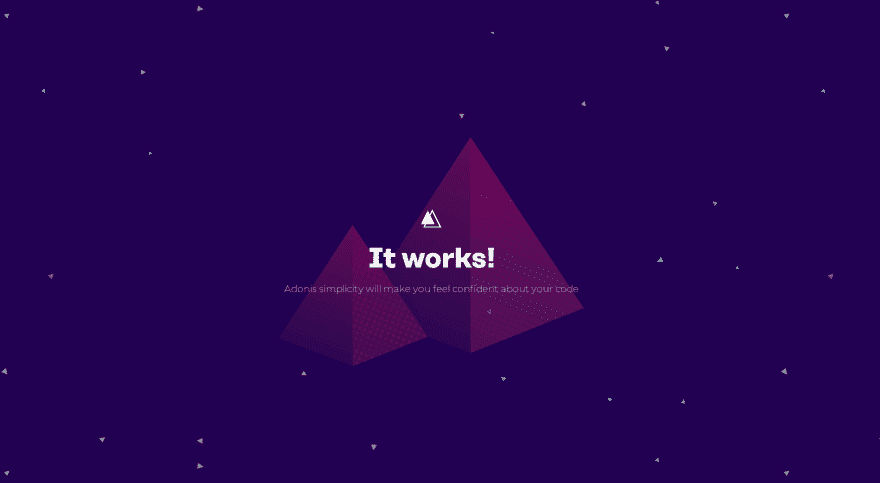

# 将 AdonisJs 应用程序归档

> 原文：<https://dev.to/itachiuchiha/dockerizing-an-adonisjs-app-27bd>

[T2】](https://res.cloudinary.com/practicaldev/image/fetch/s--_cg5Qmbv--/c_limit%2Cf_auto%2Cfl_progressive%2Cq_auto%2Cw_880/https://thepracticaldev.s3.amazonaws.com/i/0uky2oh007zs0tkqz7c9.png)

嗨，在这篇文章中，我将谈论一个 AdonisJs 应用程序的 Dockerizing。我将使用 docker-compose 来简化它。

# 将一个 AdonisJs 应用程序归档

在开始之前，我应该说，这个帖子不会给出任何关于 adonisjs 的深入信息。比如它的控制器系统我就不教了。如果你没问题的话，我们开始吧。

# 安装 Docker 到 Ubuntu

Docker 要求 64 位 Ubuntu 系统。所以如果你打算安装你的服务器或者你的个人电脑，你需要确定你有 64 位的 Ubuntu 系统。

### 1-)将 GPG 密钥添加到官方 Docker 存储库系统中

```
curl -fsSL https://download.docker.com/linux/ubuntu/gpg | sudo apt-key add - 
```

Enter fullscreen mode Exit fullscreen mode

### 2-)将 Docker 储存库添加到 APT 资源

```
sudo add-apt-repository "deb [arch=amd64] https://download.docker.com/linux/ubuntu $(lsb_release -cs) stable" 
```

Enter fullscreen mode Exit fullscreen mode

在上面的代码中，我们使用了带有标志的 **lsb_release** 命令作为变量。它以简短的形式给出了你的系统的代号。[经由](https://refspecs.linuxfoundation.org/LSB_2.0.1/LSB-Core/LSB-Core/lsbrelease.html)

### 让我们为新添加的存储库更新我们的系统。

```
sudo apt-get update 
```

Enter fullscreen mode Exit fullscreen mode

### 4-)为了确保收到 docker repo，我们将使用 apt-cache。

```
apt-cache policy docker-ce 
```

Enter fullscreen mode Exit fullscreen mode

我们应该在命令行上看到如下所示的输出。

```
Version table:
 *** 18.06.0~ce~3-0~ubuntu 500
        500 https://download.docker.com/linux/ubuntu artful/stable amd64 Packages
        100 /var/lib/dpkg/status
     18.03.1~ce-0~ubuntu 500
        500 https://download.docker.com/linux/ubuntu artful/stable amd64 Packages
     18.03.0~ce-0~ubuntu 500
        500 https://download.docker.com/linux/ubuntu artful/stable amd64 Packages
     17.12.1~ce-0~ubuntu 500
        500 https://download.docker.com/linux/ubuntu artful/stable amd64 Packages
     17.12.0~ce-0~ubuntu 500
        500 https://download.docker.com/linux/ubuntu artful/stable amd64 Packages 
```

Enter fullscreen mode Exit fullscreen mode

### 5-)码头工人安装

我们现在可以用这个命令
安装 Docker

```
sudo apt-get install -y docker-ce 
```

Enter fullscreen mode Exit fullscreen mode

### 6-)检查对接机运行状态

我们需要确定 Docker 是否成功运行。为此，我们将使用这个命令

```
sudo systemctl status docker 
```

Enter fullscreen mode Exit fullscreen mode

输出应该是这样的；

```
docker.service - Docker Application Container Engine
   Loaded: loaded (/lib/systemd/system/docker.service; enabled; vendor preset: e
   Active: active (running) since Sat 2018-08-11 15:24:13 +03; 1h 59min ago
     Docs: https://docs.docker.com 
```

Enter fullscreen mode Exit fullscreen mode

亲爱的开发者，你应该知道 Docker 需要超级用户帐号。所以，你总是需要使用 **sudo** 命令。如果你不想一直这样做，你可以改变 Docker 的用户模式。但是码头工，不推荐这个。

```
sudo usermod -aG docker ${USER}

su - ${USER} 
```

Enter fullscreen mode Exit fullscreen mode

这样，我们就完成了 Docker 的安装。现在，我们将安装 **docker-compose** 来轻松管理 docker。

# 安装 Docker 作曲

Ubuntu 上的安装应该是这样的

```
sudo apt install docker-compose 
```

Enter fullscreen mode Exit fullscreen mode

您可以通过此[链接](https://docs.docker.com/compose/install/#install-compose)访问其他操作系统的更多信息。

# AdonisJs 的安装

使用下面的命令，我们将把 Adonis CLI 安装为全局的

```
npm i -g @adonisjs/cli 
```

Enter fullscreen mode Exit fullscreen mode

安装后，您应该在命令行上使用以下命令检查 adonis 命令。

```
adonis –help 
```

Enter fullscreen mode Exit fullscreen mode

# 创建新的 Adonis 项目

我创建了一个名为 **dockerize** 的目录。我用 **cd dockerize** 命令进入这个目录。如果您这样做了，我们将使用此命令创建一个新的 adonis 项目；

```
adonis new . 
```

Enter fullscreen mode Exit fullscreen mode

圆点表示当前目录。项目创建完成后，我将打开 **routes.js** 文件。这个文件在开始文件夹下。

然后我将添加一个名为 **hello** 的新端点。因此，我们的 routes 文件应该如下所示:

```
const Route = use('Route')

Route.on('/').render('welcome')

Route.get('/hello', async () => {
    return "Hello World"
}) 
```

Enter fullscreen mode Exit fullscreen mode

在使用 docker 之前，我将使用 Adonis CLI 检查我们的项目。

```
adonis serve --dev 
```

Enter fullscreen mode Exit fullscreen mode

目前，我们的项目服务于 3333 端口。我用 8080 端口换一下。我会打开**。根文件夹下的 env** 文件。那么我们的**主机**和**端口**的值就会发生变化。

```
HOST=0.0.0.0
PORT=8080 
```

Enter fullscreen mode Exit fullscreen mode

现在我们的应用程序将使用端口 8080。

# docker file

要创建 Dockerfile 文件，我们将使用以下命令；

```
touch Dockerfile 
```

Enter fullscreen mode Exit fullscreen mode

docker 文件将是这样的

```
FROM node:8

WORKDIR . /app

COPY package*.json ./

RUN npm install

COPY . .

EXPOSE 8080

CMD [ "npm", "start" ] 
```

Enter fullscreen mode Exit fullscreen mode

我选择了 Node JS 8 的版本。我已经设置了暴露端口。那么应该设置命令参数。

之后我们会准备 **docker-compose.yml** 文件。为了创建一个 **docker-compose.yml** 文件，我们将使用这个命令；

```
touch docker-compose.yml 
```

Enter fullscreen mode Exit fullscreen mode

**docker-compose.yml** 文件的内容应该是这样的

```
web:
  build: .
  ports:
   - "8080:8080"
  volumes:
   - .:/code 
```

Enter fullscreen mode Exit fullscreen mode

现在让我们运行以下命令来发布项目:

```
sudo docker-compose build 
```

Enter fullscreen mode Exit fullscreen mode

此命令正在构建项目。目前，该项目尚未部署。然后使用下面的命令，我们将使用-d 标志在分离模式下启动项目。

```
sudo docker-compose up -d 
```

Enter fullscreen mode Exit fullscreen mode

**-d** 标志在后台运行进程并终止它们。

现在，我将使用下面的命令启动项目；

```
sudo docker-compose start 
```

Enter fullscreen mode Exit fullscreen mode

您的项目现在正在端口 8080 上运行。如果你的项目代码改变，你需要停止 docker 容器

```
sudo docker-compose stop 
```

Enter fullscreen mode Exit fullscreen mode

然后再重复前三步。等等！“如果你说我是懒人，我有一个非常非常基本的项目”，你可以创建一个 bash 脚本如下；

```
# dock.sh
sudo docker-compose stop

sudo docker-compose build

sudo docker-compose up -d

sudo docker-compose start 
```

Enter fullscreen mode Exit fullscreen mode

你会用这个；

```
bash dock.sh 
```

Enter fullscreen mode Exit fullscreen mode

仅此而已。感谢阅读。希望这能帮到你。