# 用 CircleCI 和 Jib 对接 Java 应用程序

> 原文：<https://dev.to/circleci/dockerizing-java-apps-with-circleci-and-jib-2af8>

*本文是全球 DNS 背后的多云部署系列文章的第一篇。它最初发布在 CircleCI 的博客上。*

部署平台和编排引擎的发展已经成为应用程序和基础设施团队的巨大催化剂。我们的技术堆栈各层之间清晰的边界和定义良好的接口意味着我们可以快速迭代和部署，并获得可重复的结果。对于许多团队来说，Docker 已经成为这个架构中的一个关键要素，允许部署到像 Kubernetes 这样的平台。

在 Docker 中包装应用程序是加强正确的依赖关系和操作系统的强大方法。不幸的是，正确配置和打包容器映像需要额外的知识。在这篇博文中，我将讨论 Jib 的使用，Jib 是 Google 的一个开源项目，旨在简化 Java 应用程序的工作。

我们将在这个博客中使用几种技术，并且需要对 CircleCI 有一个基本的了解。如果你是 CircleCI 的新手，我们有[介绍性内容](https://circleci.com/docs/2.0/basics/)帮助你入门。

## 什么是 Jib？

Jib 为你的 Java 应用程序构建 Docker 和 [OCI](https://github.com/opencontainers/image-spec) 图像，并作为 [Maven](https://github.com/GoogleContainerTools/jib/tree/master/jib-maven-plugin) 和 [Gradle](https://github.com/GoogleContainerTools/jib/tree/master/jib-gradle-plugin) 的插件。

Jib 有一些有趣的价值主张。在他们的[项目页面](https://github.com/GoogleContainerTools/jib)上有更详细的描述。也就是说，它降低了将独立的 Java 应用程序转变为完全可移植的 Docker 映像所需的复杂性和时间。我们的示例应用程序是一个 Spring Starter web 应用程序，但是该项目支持任何基于 Java 的应用程序，并对任何所需的定制提供了强大的支持。除了核心库，该团队还为 Maven 和 Gradle 共享插件，以无缝集成到您现有的构建流程中。

## 先决条件

为了跟随这个演示，你需要一个 Docker 注册的帐户。我将使用 Docker Hub，但也支持许多其他产品，包括 Artifactory、Nexus 和 GCR。

## 我们的示例应用程序

我正在使用一个来自 [Spring Initializer](http://start.spring.io/) 的示例 Java 应用程序。我已经在 https://github.com/eddiewebb/circleci-jib-demo 的[分享了完整的项目，如果你想直接进入代码或者跟随的话。在继续之前，请确认您的应用程序在本地运行。对于 Spring Boot 应用程序，这很简单:](https://github.com/eddiewebb/circleci-jib-demo) 

```
mvn spring-boot:run 
```

Enter fullscreen mode Exit fullscreen mode

示例项目和博客文章使用了 Maven 插件，但是如上所述，Gradle 是完全受支持的。

## 运行臂架

Jib 通过设置一些合理的缺省值，包括一个基本的发行版映像，减少了所需的样板配置。Jib 甚至会在启动应用程序时推断出合适的类作为入口点。

如果您想在本地测试，您可以直接构建到 Docker 守护进程中。

```
mvn clean compile com.google.cloud.tools:jib-maven-plugin:0.9.7:dockerBuild 
```

Enter fullscreen mode Exit fullscreen mode

[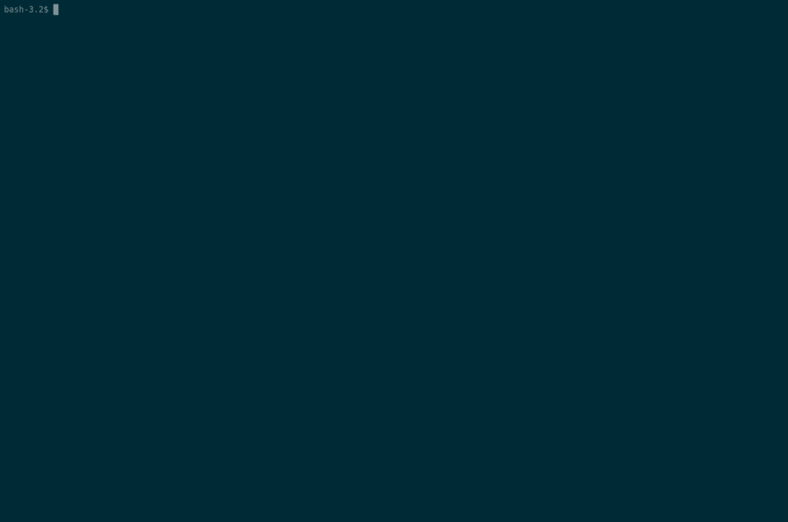T2】](https://res.cloudinary.com/practicaldev/image/fetch/s--OI59gbDw--/c_limit%2Cf_auto%2Cfl_progressive%2Cq_66%2Cw_880/https://thepracticaldev.s3.amazonaws.com/i/kq63q7k5u29euwsyi0tq.gif)

你可以用
来旋转它

```
docker run -p 8080:8080 java-jib-demo:0.0.1-SNAPSHOT 
```

Enter fullscreen mode Exit fullscreen mode

注意:`8080`是 Spring Boot 应用程序的默认端口。根据你的起点可能会有所不同。

## 将 Jib 图像推送到注册表中

使用 Jib 的好处之一是我们实际上不需要 Docker 守护进程。我们可以构建一个图像并直接发布到公共/私有注册中心。因为注册中心需要认证，所以让我们设置 Maven 项目来使用 Docker Hub 凭证。(Docker Hub 是默认注册表，如果您使用替代注册表，请参见[配置指南](https://github.com/GoogleContainerTools/jib/tree/master/jib-maven-plugin#configuration))。

在您的 Maven 的`settings.xml`(通常在`<HOME>/.m2/settings.xml`中找到)中，为 Docker Hub 注册表定义一个服务器块，其中包括您的 Docker 用户名和密码:

[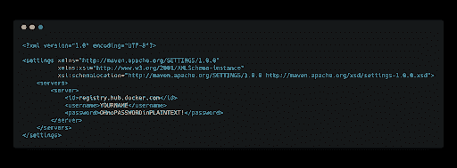T2】](https://res.cloudinary.com/practicaldev/image/fetch/s--absj0wv5--/c_limit%2Cf_auto%2Cfl_progressive%2Cq_auto%2Cw_880/https://thepracticaldev.s3.amazonaws.com/i/sbvbmx2yypsdxr93yqh9.png)

用明文设置密码从来都不是一个好主意，当然也不是我们希望在代码库中出现的东西。在下面的“启用 CircleCI 部署”一节中，我们将设置 Maven 加密。

配置好凭证后，您需要提供的唯一其他信息是通过传递`-Dimage`使用的结果 Docker 映像名称。

让我们把创建的图像保存在本地。为此，我们将使用`jib:build`目标:

```
mvn clean compile com.google.cloud.tools:jib-maven-plugin:0.9.7:build -Dimage=eddiewebb/hello-spring 
```

Enter fullscreen mode Exit fullscreen mode

[T2】](https://res.cloudinary.com/practicaldev/image/fetch/s--IQT32aIm--/c_limit%2Cf_auto%2Cfl_progressive%2Cq_66%2Cw_880/https://thepracticaldev.s3.amazonaws.com/i/sai5pp7s86jdwbe8sweh.gif)

一旦构建完成，你会发现一个全新的形象坐在你的注册表中。

[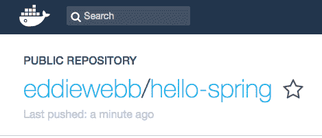T2】](https://res.cloudinary.com/practicaldev/image/fetch/s--QKTwUsGT--/c_limit%2Cf_auto%2Cfl_progressive%2Cq_auto%2Cw_880/https://thepracticaldev.s3.amazonaws.com/i/e7qdnormw0inkgv7rlw6.png)

## 配置吊臂

除了琐碎的应用程序，您还需要对生成的图像进行修改。幸运的是，Jib 提供了几个[配置参数](https://github.com/GoogleContainerTools/jib/tree/master/jib-maven-plugin#configuration)，可以直接放到你的`pom.xml`中。

为了让我们的版本控制保持一定的纪律性，我们不能发布每个带有默认“最新”标签的图像。使用配置中的`<to>`元素，我们可以完全指定位置和标记。

[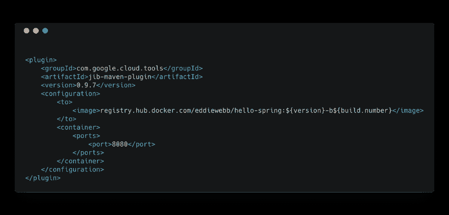T2】](https://res.cloudinary.com/practicaldev/image/fetch/s--eMsGIGyT--/c_limit%2Cf_auto%2Cfl_progressive%2Cq_auto%2Cw_880/https://thepracticaldev.s3.amazonaws.com/i/q0v457emjw7grhodbzyl.png)

属性`build.number`是我们将传入的与 CircleCI 构建标识符相关的内容。添加一个默认值以保持本地开发的简单性，即`000`。

[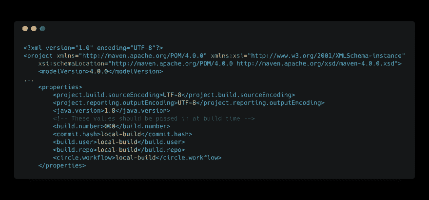T2】](https://res.cloudinary.com/practicaldev/image/fetch/s--4vL_tNnu--/c_limit%2Cf_auto%2Cfl_progressive%2Cq_auto%2Cw_880/https://thepracticaldev.s3.amazonaws.com/i/btt23ziaeczfqoethyxi.png)

您将注意到其他几个属性，包括提交散列和工作流 ID。这些只是每个 CircleCI 作业可用的几个[环境变量。我们将把它们作为附加属性，传递到应用程序中，以显示正在运行的应用程序的重要构建信息。为了在 JVM 中设置这些值，我们将使用另一个配置块`<jvmFlags>`。](https://circleci.com/docs/2.0/env-vars/#built-in-environment-variables)

[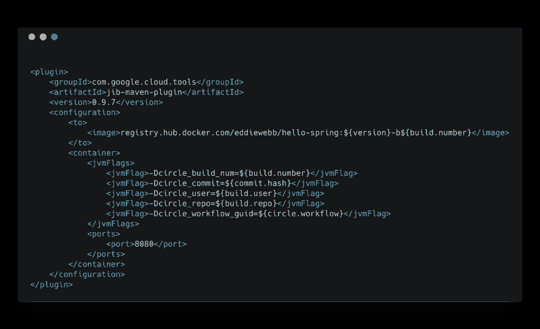T2】](https://res.cloudinary.com/practicaldev/image/fetch/s--DVk5YYmx--/c_limit%2Cf_auto%2Cfl_progressive%2Cq_auto%2Cw_880/https://thepracticaldev.s3.amazonaws.com/i/sn2d4y9frqo89onihpzj.png)

您可以在项目页面上找到其他配置参数。

在配置 CircleCI 之前，让我们最后一次验证我们的配置。

现在，访问[http://localhost:8080/build-info](http://localhost:8080/build-info)，您将看到演示应用程序如何公开我们传入的附加 JVM 标志。

[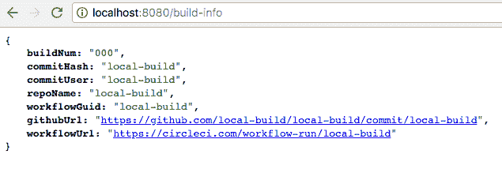T2】](https://res.cloudinary.com/practicaldev/image/fetch/s--EJ0XMFH5--/c_limit%2Cf_auto%2Cfl_progressive%2Cq_auto%2Cw_880/https://thepracticaldev.s3.amazonaws.com/i/nfxnubrqisowvjgmfc7d.png)

让我们使用 CircleCI 来为可重复和确定性的构建自动化这个过程，实现端到端的可追溯性。

## 加密 Maven 凭证

首先要解决的是凭证管理。我们不会将任何敏感的凭证签入源代码，但是我们的 CircleCI 构建需要访问它们。有几种方法可以解决这个问题，我的例子结合使用了 [Maven Encryption](https://maven.apache.org/guides/mini/guide-encryption.html) 和 CircleCI 环境变量。

加密“主”密码:

```
mvn --encrypt-master-password
Master password: <<type some random but lengthy string as input>>
{sqtg2346i10Hf2Z1u9bYgyDxooiIa6AXlBY92E5x+2dvqsCU7kI+iM9b8lI42Thh} 
```

Enter fullscreen mode Exit fullscreen mode

将结果保存在 Maven 主目录下名为 settings-security.xml 的文件中，即`~/.m2/settings-security.xml`。

[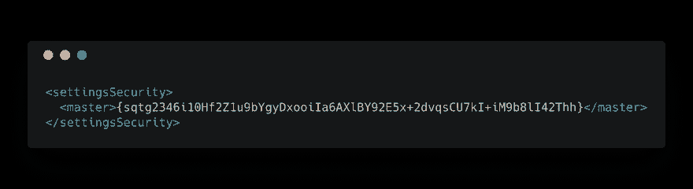T2】](https://res.cloudinary.com/practicaldev/image/fetch/s--aV_kkm2g--/c_limit%2Cf_auto%2Cfl_progressive%2Cq_auto%2Cw_880/https://thepracticaldev.s3.amazonaws.com/i/4dbbhonlzuo9bb25qzyv.png)

加密您的 Docker 注册表密码:

```
mvn --encrypt-password
Password: <<your Docker registry credentials>>
{9Z0In9ZySLsH7re5LlnGsvstLmfGfHL+7vi92maAXGiZ4oBP1iGwdoXR7QElP3TU} 
```

Enter fullscreen mode Exit fullscreen mode

用生成的密码更新 settings.xml:

[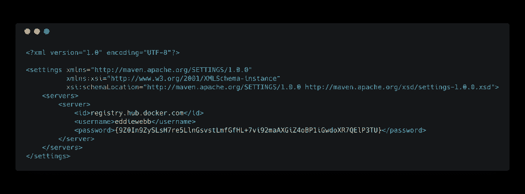T2】](https://res.cloudinary.com/practicaldev/image/fetch/s--EKzew0tV--/c_limit%2Cf_auto%2Cfl_progressive%2Cq_auto%2Cw_880/https://thepracticaldev.s3.amazonaws.com/i/y8qe7ga39xxchicqw3wr.png)

此时你可以运行

```
mvn clean compile jib:build 
```

Enter fullscreen mode Exit fullscreen mode

再次确认加密的凭证正在工作。

## 设置 CircleCI

通过访问[https://circleci.com/dashboard](https://circleci.com/dashboard)并按照提示“开始构建”您的项目库，将您的项目添加到 CircleCI。

第一次构建将会失败，因为我们还没有完成项目的配置。为了让它通过，您需要访问项目的配置页面，并添加一个名为`maven_security_master`的变量，该变量包含您在前面步骤中的主密码。我们的 [`.circleci/config.yml`](https://github.com/eddiewebb/circleci-jib-demo/blob/master/.circleci/config.yml#L56) 使用该变量在我们的构建中重新创建关键的`settings-security.xml`文件。

您还需要将您的`~/.m2/settings.xml`复制到项目`.mvn/wrapper/`文件夹中。CircleCI 可获得`settings.xml`和主密码以正确上传，这一点很重要。

准备好`settings.xml`文件后，提交您的最新变更并将其推送到您的存储库中。CircleCI 应该开始建立并成功发布您的 Docker 图像。

[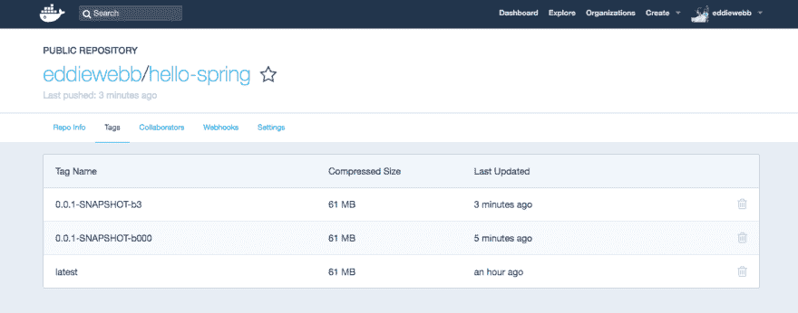T2】](https://res.cloudinary.com/practicaldev/image/fetch/s--j-rFRuKH--/c_limit%2Cf_auto%2Cfl_progressive%2Cq_auto%2Cw_880/https://thepracticaldev.s3.amazonaws.com/i/f93qdkblhrbk4ec5smp9.png)

一旦发布，如果您运行我们新生成的图像，您将看到我们从 CircleCI 的构建环境中传递的所有值，这些值显示在`/build-info` url 上，为您的应用提供了端到端的可追溯性！

[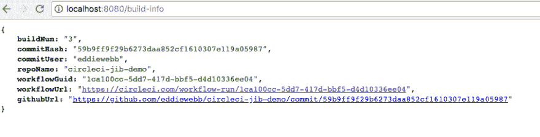T2】](https://res.cloudinary.com/practicaldev/image/fetch/s--NKUzYXMF--/c_limit%2Cf_auto%2Cfl_progressive%2Cq_auto%2Cw_880/https://thepracticaldev.s3.amazonaws.com/i/8yr3wda1x8i26nprcbku.png)

如果您想将 CircleCI 工作流提升到一个新的水平，并开始将您的容器化应用程序部署到 ECS 或 Kubernetes，请务必查看我们系列的下一篇博客文章，并观看我们之前录制的与我们的解决方案工程师 Chris Black-[Docker Deployments 102](https://www.youtube.com/watch?v=eZxKs1mrxTM)的网络研讨会。

快乐大厦！