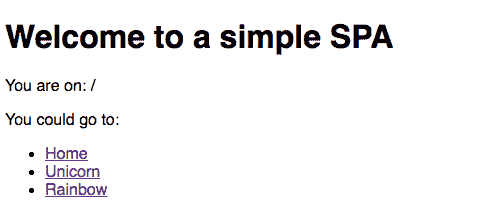
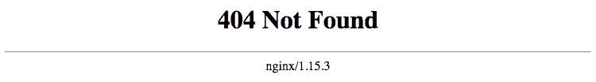
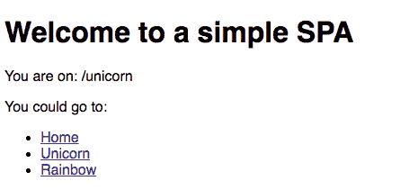

# 现代网络应用的文档化

> 原文：<https://dev.to/hoverbaum/dockerizing-spas-2lc9>

如今，大多数网站都是单页应用程序(简称 SPA ),其中一个条目文件处理用户可能访问的所有路线。在云托管的持续趋势下，你可能会发现自己需要“整理”你的 SPA。也就是说，将它包装在 Docker 映像中，并作为容器运行。

[](https://res.cloudinary.com/practicaldev/image/fetch/s--P94VfCdb--/c_limit%2Cf_auto%2Cfl_progressive%2Cq_auto%2Cw_880/https://thepracticaldev.s3.amazonaws.com/i/suyyg0olin0mx6ugrjzd.jpg) 
<small>这年头所有的东西都是用集装箱运来的，连软件也不例外。</small>

在这篇文章中，我们将探讨如何做到这一点。我们将建立一个简单的 SPA，告诉用户他们当前正在访问我们网站的哪条路线。这意味着你不仅可以游览`/`，还可以游览你能想到的任何路线，比如`/unicorn`或`/rainbow`。这个 SPA 将是一个超级简单的手工制作的 SPA，但你可以将其视为任何复杂的 React、Angular 或 Vue 应用程序的代表。最后，我们将把我们的 SPA 构建到 Docker 映像中，并将其作为容器进行部署。

我们将介绍我们正在做的所有基础知识。因此，无论您是否熟悉 Docker，只是无法让 SPA 在您的集群上运行，或者您是一名出色的 web 开发人员，负责 Docker 的工作，这篇文章都适合您。

### 网站

我们的网站会超级简单。只有一个标题和一个段落，通过检查`window.location`告诉我们的用户他们在哪里。下面我们将提供导航到几条路线的链接。

```
<!DOCTYPE html>
<html>
<head>
  <meta charset="utf-8" />
  <meta http-equiv="X-UA-Compatible" content="IE=edge">
  Simple SPA
  <meta name="viewport" content="width=device-width, initial-scale=1">
</head>
<body style="font-family: sans-serif;">
  <h1>Welcome to a simple SPA</h1>

  <p>You are on: <span id="locationSpan"></span></p>

  <p>You could go to:</p>
  <ul>
    <li><a href="/">Home</a></li>
    <li><a href="/unicorn">Unicorn</a></li>
    <li><a href="/rainbow">Rainbow</a></li>
  </ul>

  <script>
    const span = document.querySelector('#locationSpan')
    span.innerHTML = window.location.pathname
  </script>
</body>
</html> 
```

Enter fullscreen mode Exit fullscreen mode

要在本地测试这个，你可以初始化 package.json，安装[实时服务器](https://www.npmjs.com/package/live-server)，并添加一个启动脚本到你的 package.json `"start": "live-server --entry-file=index.html"`。

```
npm init
npm i -D live-server
# Now add the script o your package.json before running:
npm start 
```

Enter fullscreen mode Exit fullscreen mode

继续点击几个链接四处移动，或者在你的导航栏中输入另一个路径。

[](https://res.cloudinary.com/practicaldev/image/fetch/s--9qOVSIWk--/c_limit%2Cf_auto%2Cfl_progressive%2Cq_auto%2Cw_880/https://cdn-images-1.medium.com/max/800/1%2Al3FxcPMlOckHHpGZC8sXsw.png) 
<small>我们的超级简单 SPA 告诉用户他们在哪里，并允许他们
导航。</small>

你可能已经注意到，我们正在做一些事情，使我们的温泉工作，因为我们期望它。我们需要告诉 live-server 在它找不到文件的所有路线上为我们的 index.html 提供服务。我们使用`--entry-file=index.html`来做这件事。请随意尝试运行不带-entry-file 参数的 ive-server，看看在这种情况下会发生什么。

记住这个标志，因为我们将需要为我们的 dockerization 做一些等效的事情。

在 [dockerized-spa.now.sh](https://dockerized-spa.now.sh/) 查看网站运行情况。(已经在 Now.sh 上归档和托管。)

### 天真的码头工人企图

Docker 是一个创建图像的系统，这些图像可以作为容器运行。您可以将 docker 映像视为可以在许多平台上运行的超级轻量级虚拟机(在这个映像中，容器正在运行虚拟机)。所有这一切的神奇之处在于，一旦你构建了一个 docker 映像，并在某个地方运行它，你将得到同样的东西在任何地方运行。一旦我们成功地在本地构建了一个 Docker 映像，我们可以成功地将其作为一个容器运行，我们知道它也可以在 AWS、GCP、Portainer 或贵公司可能使用的任何其他设备上运行。

> Docker 解决了臭名昭著的“它在我的机器上工作”的问题。无论你在哪里启动容器，它们都是一样的！

首先你需要一个 Dockerfile 文件。让我们从一个简单的 Dockerfile 文件开始。在其中，我们将定义创建图像所需的步骤。在我们的情况下，我们只是想要一个图像，可以为网站服务，并持有我们的单页应用程序的副本。

```
FROM nginx

COPY index.html /usr/share/nginx/html 
```

Enter fullscreen mode Exit fullscreen mode

在这里，我们的图像基于`nginx`图像。 [NGINX](https://www.nginx.com/) 是一个简单而轻量级的网络服务器，可以服务于我们的*index.html*。为此，我们将我们的网站复制到 NGINX 将提供服务的文件夹中。现在我们有了这个，让我们建立我们的形象，并运行它。

上面我们首先使用 [Docker build](https://docs.docker.com/engine/reference/commandline/build/) 创建 Docker 映像。使用`-f`标志，我们告诉 Docker 使用哪个“Dockerfile ”,哪个文件包含构建我们的映像的配置。`-t`标志“标记”了我们的 Docker 图像。它给了我们一个名字来运行它。

使用 [Docker run](https://docs.docker.com/engine/reference/commandline/run/) ,我们开始将图像作为一个容器。通过使用`-p`，我们可以为暴露的端口指定一个映射，在这种情况下，我们希望到达本地机器上端口 *8888* 处的暴露端口 *80* 。因此，请打开 [http://localhost:8888/](http://localhost:8888/daf) 来检查我们得到了什么。

[T2】](https://res.cloudinary.com/practicaldev/image/fetch/s--VoKLp7ps--/c_limit%2Cf_auto%2Cfl_progressive%2Cq_auto%2Cw_880/https://cdn-images-1.medium.com/max/800/1%2A8P6hCT8oQOhOqXt_ZePcwA.png)

[T2】](https://res.cloudinary.com/practicaldev/image/fetch/s--hTDkPuon--/c_limit%2Cf_auto%2Cfl_progressive%2Cq_auto%2Cw_880/https://thepracticaldev.s3.amazonaws.com/i/w0bdiudbddoio61axrxt.png)

这不是我们想象的情况…

用我们的“幼稚的 Docker”方法，除了我们的入口路径`/`显示 NGINXs 404 页面。

```
docker rmi -f docker-spa 
```

Enter fullscreen mode Exit fullscreen mode

让我们用 [Dockerrmi](https://docs.docker.com/engine/reference/commandline/rmi/) 命令和`-f`强制它删除我们创建的图像来清理我们自己。是时候卷起袖子让它充分发挥作用了。

### 赋予水疗功能

还记得我们需要将`--entry-file=index.html`传递给 live-server，以便它为每条找不到文件的路线提供我们的*index.html*文件吗？我们现在需要的是 NGINX 的这个参数的等价物。

为此，我们将使用 NGINX 配置，并将其添加到 Docker 映像中。

```
server {
    listen   80;
    listen   [::]:80 default ipv6only=on;

    root /usr/share/nginx/html;
    index index.html;

    server_name _; # all hostnames

    location / {
        try_files $uri /index.html;
    }
} 
```

Enter fullscreen mode Exit fullscreen mode

在上面的配置中，我们告诉 NGINX 接受端口 *80* 上的流量，而不管域。然后我们告诉它把以斜杠结尾的路径解析为`index.html`，最后指定对于所有路由，它应该检查是否有文件，否则提供索引文件。

将上述内容添加到我们的项目后，我们现在也可以将它复制到 Docker 映像中，告诉 NGINX 使用它。

```
FROM nginx

COPY nginx.config /etc/nginx/conf.d/default.conf
COPY index.html /usr/share/nginx/html 
```

Enter fullscreen mode Exit fullscreen mode

同样，您可以使用与上面相同的命令，使用我们新的 *Dockerfile* 在本地测试这一点。记得把你的浏览器指向[http://localhost:8888/unicorn](http://localhost:8888/unicorn)来看看它的运行。

```
docker rmi -f docker-spa 
```

Enter fullscreen mode Exit fullscreen mode

点击链接，你会发现现在它确实工作了。您访问的每条路线现在都由我们在开始时构建的单页应用程序提供服务。

[T2】](https://res.cloudinary.com/practicaldev/image/fetch/s--jyIACsGq--/c_limit%2Cf_auto%2Cfl_progressive%2Cq_auto%2Cw_880/https://cdn-images-1.medium.com/max/800/1%2AGgY0vSpeKgif4-93-0s6IQ.png)

[T2】](https://res.cloudinary.com/practicaldev/image/fetch/s--RQ84lFRK--/c_limit%2Cf_auto%2Cfl_progressive%2Cq_auto%2Cw_880/https://cdn-images-1.medium.com/max/800/1%2APMs3fV3LMoFLxOzvHCI-yg.png)

### 奖励等级—在 Docker 中编译您的 SPA

您的应用程序可能不仅仅是一个单一的静态 HTML 文件。事实上，您可能有一个非常现代和复杂的工具链，包括 TypeScript、Webpack、package 或类似工具来构建您的应用程序。您可以在 Docker 文件中轻松完成这个构建步骤。

```
# ---- Base Node ----
FROM node:alpine AS base
# Copy project file
COPY . .
# Build project
RUN npm run build

# ---- Prod ----
FROM nginx
# Copy needed files
COPY nginx.config /etc/nginx/conf.d/default.conf
COPY --from=base build /usr/share/nginx/html 
```

Enter fullscreen mode Exit fullscreen mode

上面用了一个[多级船坞主建造](https://docs.docker.com/develop/develop-images/multistage-build/)。它首先基于我们运行构建脚本的节点构建一个映像，然后像之前一样构建一个映像，但是从
构建映像而不是从我们运行`docker run`的本地文件系统复制编译后的应用程序。

我们可以通过向我们的 *package.json* 添加一个构建脚本来说明这个简单 SPA 的用法。

```
"build": "rm -rf build && mkdir build && cp index.html build/index.html" 
```

Enter fullscreen mode Exit fullscreen mode

去试试吧。

```
docker rmi -f docker-spa 
```

Enter fullscreen mode Exit fullscreen mode

看看这个[报告中的所有内容，它展示了如何使用 Docker](https://github.com/HoverBaum/super-simple-dockerized-spa) 托管 spa。

### 什么日子

我们构建了一个单页面应用程序，在本地对其进行了测试，并将其打包到一个 Docker 映像中，最终使 Docker 映像能够充当一个 SPA 应该充当的角色，对所有路由进行响应。

我希望你今天学到了一些东西。现在，勇敢一点，大胆一点，走出去，运用你新发现的知识，用 Docker 托管你的应用程序。

[T2】](https://res.cloudinary.com/practicaldev/image/fetch/s--jFzbRnMo--/c_limit%2Cf_auto%2Cfl_progressive%2Cq_auto%2Cw_880/https://thepracticaldev.s3.amazonaws.com/i/28pv566f0zxb6u33evwf.png)

* * *

[代码为](https://github.com/HoverBaum/super-simple-dockerized-spa)的回购

[现在开始现场演示](https://dockerized-spa.now.sh/)