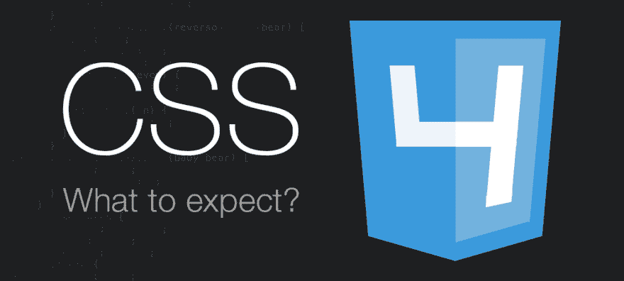

# CSS4 存在吗？

> 原文：<https://dev.to/rnrnshn/does-css4-exist-5ao4>

[T2】](https://res.cloudinary.com/practicaldev/image/fetch/s--RQxe_Ww3--/c_limit%2Cf_auto%2Cfl_progressive%2Cq_auto%2Cw_880/https://thepracticaldev.s3.amazonaws.com/i/jv5izolsa4bf8eflldju.png)

我为什么要说这个？这不是很明显吗？是啊。这似乎是显而易见的，但它不是。这个困惑是我在看 Chrome 69 发布会的视频时突然听到[...和一些新的 CSS4 功能]这意味着最新版本的 Chrome 已经支持 CSS4 的新功能。我就像是在说什么？CSS4？。

我试图从朋友和开发者那里了解他们对 CSS4 的了解，一些人说它不存在，另一些人听说它仍然是一个工作草案。我不是说这是不可能的，但对我来说有点困惑的是，一些 CSS3 规范仍在工作草案中，而我们已经在考虑 CSS4，对我来说这没有意义。让我知道你对评论的看法。

我认为媒体宠坏了我们，并不是所有的东西都会像 Chrome 69 一样被版本化，等待 70 版本是很有意义的，对吗？但是事情并不总是这样，尤其是当我们谈论 CSS 或其他东西的时候。

## CSS4 不存在。

为什么？

CSS 出现在版本 1 中，几年后推出了版本 2，它是对第一个版本的回顾。而且这里需要强调的是，CSS2 用了 9 年才被强烈推荐，也就是 2002 年 8 月到 2011 年 6 月[阅读更多](https://developer.mozilla.org/en-US/docs/Web/CSS/CSS30)。

为了加速浏览器所支持的特性的标准化，W3C 的 CSS 工作组将 CSS 分割成更小的组件，称为模块。我们必须强调 CSS3 并不正式存在，它是 CSS 2.1 的扩展。术语 CSS3 指的是在 CSS 2.1 之后发布的所有内容。

所有的模块都是独立标准化改进的，并在完成后添加到 CSS 2.1 中，这并不意味着它们都在同一个版本上。举个例子，我们有 CSS 选择器级别 4，它与 CSS4 混淆了，但它只是一个仍在工作草案中的模块，一些现代浏览器已经实现了这个规范的一些部分。

另一件事是，想象一下会有多乱？就拿我来说，我还在学习 CSS3，突然就要意识到 CSS4？光是想想就很可怕。

> CSS 网格的例子也许是未来 CSS 特性和更新的最典型的例子。**在模块中工作总是一个好主意**，
> 它允许你根据浏览器实现一个或另一个功能的使用水平或难度来使用不同的周期和工作速度。[阅读更多](https://www.silocreativo.com/en/css4-the-new-version-of-css-that-will-never-exist/)

CSS 工作组发现，推出仍在开发中的新版本并不是正确的选择，它很难维护，而且需要很长的开发时间。将这个“版本”分成包含小特性的模块是非常有意义的。我认为模块式学习比一次性学习更容易。

让我知道你对评论的看法。