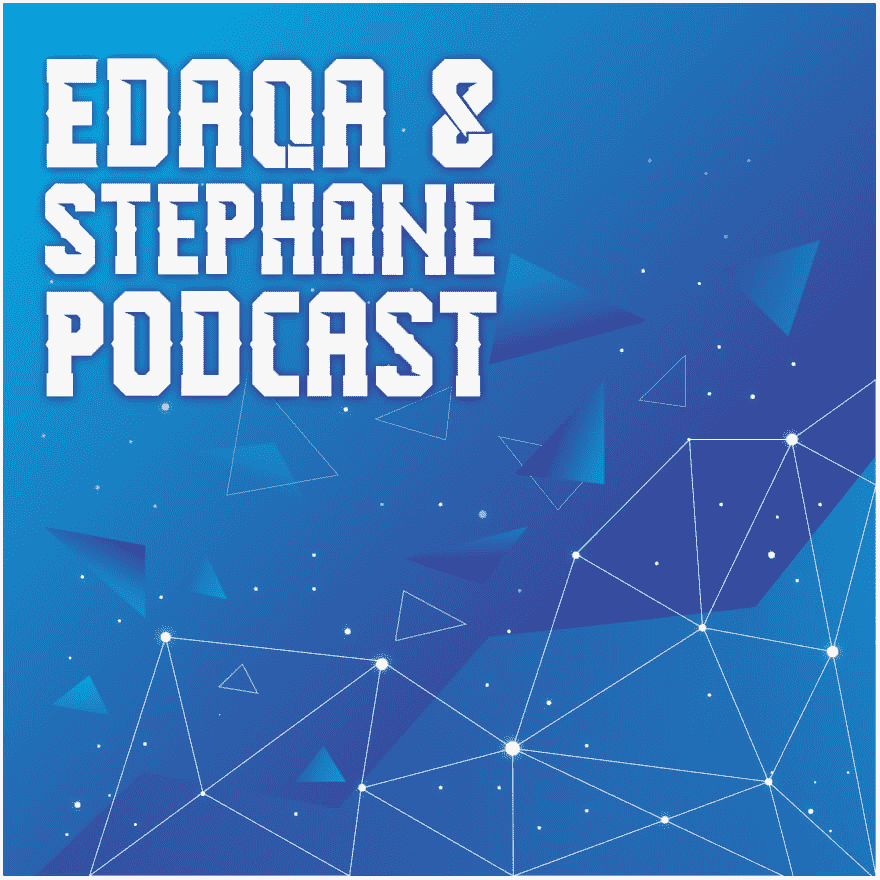
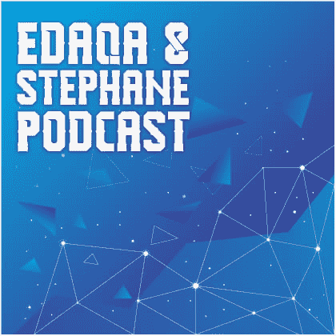

# 编程需要同理心吗？

> 原文：<https://dev.to/mortoray/does-programming-require-empathy-4m0j>

> “编程的艺术始于同理心，而不是格式、语言、工具、算法或数据结构。”肯特·贝克

我们在 Twitter 上发现了这句话，但没有上下文。在我们的节目中(接近尾声)，我们试图确定它可能意味着什么，以及我们是否同意它。

 [# #11 泄漏代理](/edaqa-and-stephane-podcast/11-leaking-proxies)  [## 埃达卡&夏羽播客](/edaqa-and-stephane-podcast)   

<audio id="audio" data-episode="11-leaking-proxies" data-podcast="edaqa-and-stephane-podcast"><source src="https://dts.podtrac.com/redirect.mp3/edaqaandstephane.net/audio/episode-011.mp3" type="audio/mpeg"> Your browser does not support the audio element.</audio>

           <input type="range" name="points" id="volumeslider" value="50" min="0" max="100" data-show-value="true">      1x  initializing... × 

贝克指的是对用户的同理心，对其他开发者的同理心，还是别的？你怎么想呢?你同意吗？

最后，我的观点是，我同意必须理解用户的期望，但是“感同身受”是一个错误的词。