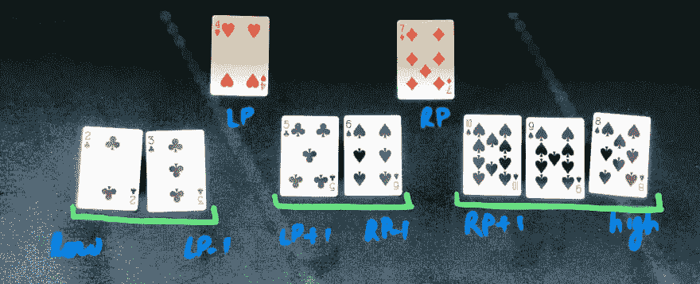
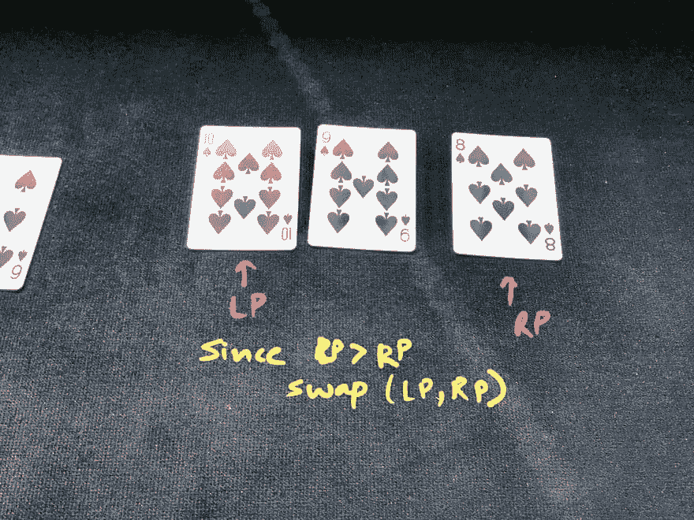
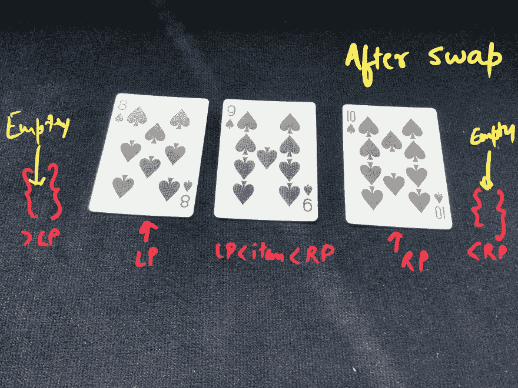
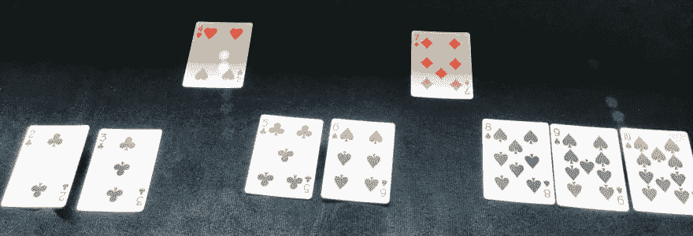

# Dual Pivot 快速排序:Java 对原始数据类型的默认排序算法。

> 原文：<https://dev.to/s_awdesh/double-pivot-quick-sort--javas-default-sorting-algorithm-1m4>

当我们在 Java 中做 Arrays.sort()时会发生什么？Java 在后台使用哪种排序算法？

自 2011 年 Java 7 发布以来，使用的默认排序算法是 DualPivotQuickSort，这是对经典 QuickSort 算法的增强。

双枢轴快速排序是插入排序和快速排序的结合。当要排序的元素数量较少时，插入排序具有更快的运行时间，Double pivot quicksort 利用了这一事实，因此当元素数量< = 47 时，Java 在幕后执行插入排序。

当数组的输入大小大于 47 时，Java 使用双枢轴快速排序。顾名思义，DualPivotQuickSort 算法选择 2 个枢轴，而不是 1 个。与快速排序不同，在快速排序中，我们围绕 1 个支点将数组划分为 3 个部分，围绕 2 个支点。

第一子数组:items < LP
第二子数组:LP < = items < = RP
第三子数组=: items > = RP

**算法**

LP:左枢轴
RP:右枢轴

1.)将数组中最左边的项目作为左枢纽，将最右边的项目作为右枢纽。
2。)如果 LP > RP
3，用右枢轴交换左枢轴。)将阵列分成围绕左和右枢轴三个子阵列。

一旦划分完成，我们在三个子阵列上递归地执行上述 3 个步骤。

让我们看一个例子:

[T2】](https://res.cloudinary.com/practicaldev/image/fetch/s--R6O0sTwr--/c_limit%2Cf_auto%2Cfl_progressive%2Cq_auto%2Cw_880/https://thepracticaldev.s3.amazonaws.com/i/n6mp5fdei3q441ycdn4y.jpg)

不需要交换上图中的枢轴，因为 LP < RP.
现在我们按照下面的方案划分数组。

第一子数组:items < LP
第二子数组:LP < = items < = RP
第三子数组=: items > = RP

[T2】](https://res.cloudinary.com/practicaldev/image/fetch/s--lGQastLO--/c_limit%2Cf_auto%2Cfl_progressive%2Cq_auto%2Cw_880/https://thepracticaldev.s3.amazonaws.com/i/a3eq0j679g59dthcw42d.jpg)

现在我们有 3 个子数组，我们将对其执行与上面相同的步骤。由于前两个数组只有两个项目，一个将成为左枢纽，另一个将成为右枢纽。如果左轴大于右轴，我们就把左轴换成右轴，前两个子数组不是这种情况。

[T2】](https://res.cloudinary.com/practicaldev/image/fetch/s--GBFSvnl9--/c_limit%2Cf_auto%2Cfl_progressive%2Cq_auto%2Cw_880/https://thepracticaldev.s3.amazonaws.com/i/ehghis7p9tsd9g1wm4q4.jpg)

对于第三个子阵列，正如我们在下图中看到的，左轴大于右轴，因此我们将交换它们。

[T2】](https://res.cloudinary.com/practicaldev/image/fetch/s--09N5kict--/c_limit%2Cf_auto%2Cfl_progressive%2Cq_auto%2Cw_880/https://thepracticaldev.s3.amazonaws.com/i/g95l8m8pa9g66l0v3ov0.jpg)

交换枢轴。
[T3】](https://res.cloudinary.com/practicaldev/image/fetch/s--XH6MY1Mf--/c_limit%2Cf_auto%2Cfl_progressive%2Cq_auto%2Cw_880/https://thepracticaldev.s3.amazonaws.com/i/6f473lb9nolxytzohalq.jpg)

我们在数组中没有更多可以进一步划分的元素了。
[T3】](https://res.cloudinary.com/practicaldev/image/fetch/s--X5jxC5dK--/c_limit%2Cf_auto%2Cfl_progressive%2Cq_auto%2Cw_880/https://thepracticaldev.s3.amazonaws.com/i/13zl7hgjyjuz0tkpilhr.jpg)

[T2】](https://res.cloudinary.com/practicaldev/image/fetch/s--KhQZfXVy--/c_limit%2Cf_auto%2Cfl_progressive%2Cq_auto%2Cw_880/https://thepracticaldev.s3.amazonaws.com/i/nwl0r1opeozphmvzzwby.jpg)

**参考文献**

[https://www.geeksforgeeks.org/dual-pivot-quicksort/](https://www.geeksforgeeks.org/dual-pivot-quicksort/)
[https://stack overflow . com/questions/20917617/what-the-difference-of-dual-pivot-quick-sort-and-quick-sort](https://stackoverflow.com/questions/20917617/whats-the-difference-of-dual-pivot-quick-sort-and-quick-sort)
[http://codeblab . com/WP-content/uploads/2009/09/dualpivot quicksort . pdf](http://codeblab.com/wp-content/uploads/2009/09/DualPivotQuicksort.pdf)

**结论**
同样，Python 使用的是插入排序和归并排序相结合的 Timsort。在接下来的几天里，我想阅读和写作一些不同的快速排序的变体。

* * *

如果你想让我写一个特定的话题，请在下面的评论区随意发表。

你可以在下面给我买杯咖啡来支持我的工作。💚💚💚💚💚💚！！
[T3】](https://ko-fi.com/F1F0J8U1)