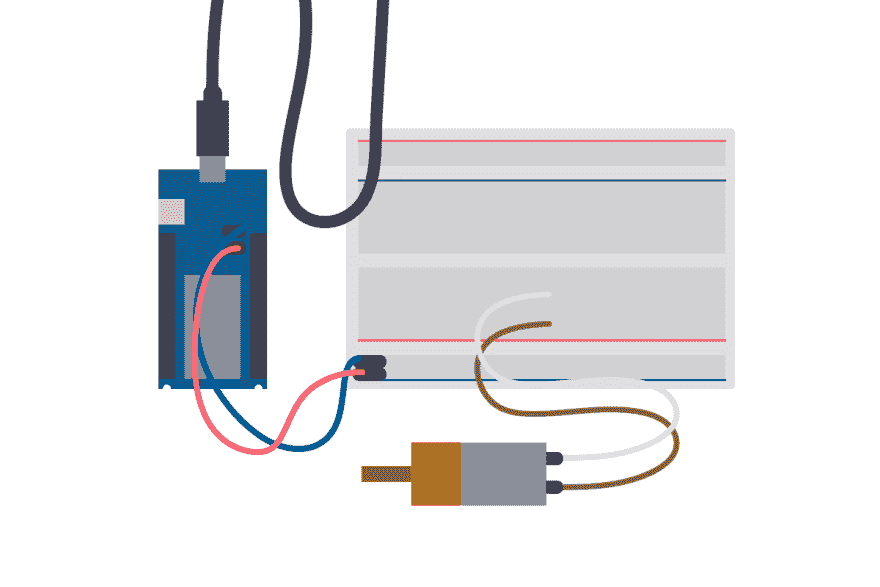
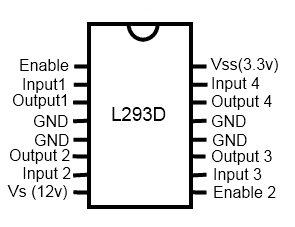
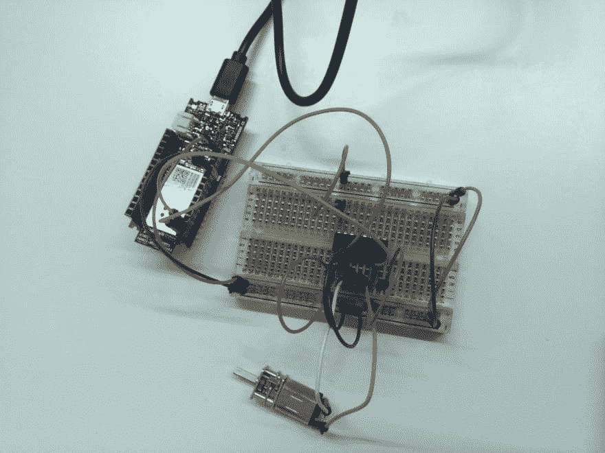

# 使用 Arduino 和 L293D 电机驱动器驱动 DC 电机

> 原文：<https://dev.to/wiaio/driving-a-dc-motor-with-an-arduino-and-the-l293d-motor-driver--541e>

[](https://res.cloudinary.com/practicaldev/image/fetch/s--p6lfQ8Y2--/c_limit%2Cf_auto%2Cfl_progressive%2Cq_auto%2Cw_880/https://s3-eu-west-1.amazonaws.com/wia-flarum-bucket/2018-06-07/1528381887-132077-dc-motor-arduino-2.png) 
在本教程中，我们将了解如何使用 L293D 和 Arduino 为 DC 电机供电和驱动(我们在这里使用 Arduino MKR 1000，但您可以使用任何为您的电机提供足够电压并具有 2 个数字输出引脚的 Arduino)。
L293D 是一款 16 针电机驱动器 IC，可以同时控制多达两个 DC 电机，在任何方向。

### **你将需要**

*   您选择的 Arduino 板
*   微型 USB 电缆
*   L293D 电机驱动器
*   直流电动机
*   试验板
*   跳线
*   [Arduino IDE](https://www.arduino.cc/en/main/software)

### **连接组件**

首先，让我们连接试验板上的元件。下面您将看到 L293D 的引脚图-注意每个引脚相对于顶部槽口的位置。

[T2】](https://res.cloudinary.com/practicaldev/image/fetch/s--vKtnGjdj--/c_limit%2Cf_auto%2Cfl_progressive%2Cq_auto%2Cw_880/https://files.readme.io/850b98a-L293D-pinout.png)

由于在本教程中我们只驱动一个电机，所以我们不会使用所有电机驱动器的引脚。

*   首先将 Arduino 插入电源(如电脑)
*   将 Arduino 上的`GND`和`5V`连接到试验板的一侧，并用跳线延伸到另一侧
*   将 L293D 放在试验板的中心，一半引脚放在试验板的两侧
*   将`5V`连接到 L293D 上的`Enable 1`、`Vss`和`Vs`
*   将数字输出引脚(我们使用 6 和 7)连接到 L293D 上的`input 1`和`input 2`
*   将 Arduino 的`GND`连接到 L293D 同一侧的两个`GND`引脚
*   最后，将 L293D 的`output 1`和`output 2`连接到您的电机引脚

*注意:电机驱动器上的`Vs`引脚给电机供电。如果您的马达需要的电压超过 Arduino 所能提供的电压，您可以连接外部电池或电池组。只需将负极引线连接到试验板上的`GND`，将正极引线连接到 L293D 的`Vs`引脚。*

一旦这一切都连接起来，它应该看起来有点像这样:
[](https://res.cloudinary.com/practicaldev/image/fetch/s--5ejGuteN--/c_limit%2Cf_auto%2Cfl_progressive%2Cq_auto%2Cw_880/https://files.readme.io/d45570e-IMG_20180601_132215-2.jpg)

### **代码**

注意:如果你对 Arduino IDE 完全不熟悉，观看[这个视频](https://www.youtube.com/watch?v=nbD_V4QtNvY)可以让你更好地理解它是如何工作的。

在 Arduino IDE 中:

*   确保在`Tools > Port`下选择了正确的端口
*   确保在`Tools > Board`下选择了正确的 Arduino 板
*   点击文件>新建创建一个新草图
*   复制并粘贴下面的代码，如果您在 Arduino 上使用 6 和 7 以外的输出引脚，替换`motorPin1`和`motorPin2`值

```
// Define the pin numbers
int motorPin1 = 6;
int motorPin2 = 7;

void setup() {
  // Set the pin modes of the above IO pins to OUTPUT
  pinMode(motorPin1, OUTPUT);
  pinMode(motorPin2, OUTPUT);
}

void loop() {
  // Turn the motor in one direction
  digitalWrite(motorPin1, LOW);
  digitalWrite(motorPin2, HIGH);
} 
```

Enter fullscreen mode Exit fullscreen mode

*   前往`Sketch > Upload`将代码上传到您的 Arduino

草图上传成功后，电机会朝一个方向转动。
如果想改变方向，只需在`loop`功能中反转`HIGH`和`LOW`即可。

为了更进一步，[将你的设备连接到 Wia](https://developers.wia.io/docs/getting-started-add-a-device) 并添加[命令](https://developers.wia.io/docs/add-a-command)和[流](https://developers.wia.io/docs/getting-started-build-a-flow)。如果您有任何问题，请使用我们网站[右下角的聊天图标](https://www.wia.io/)联系我们！