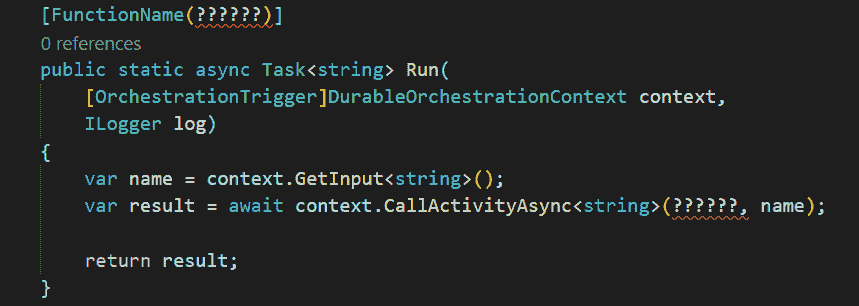

# 持久函数——函数命名剖析

> 原文：<https://dev.to/xpirit/durable-functions-the-anatomy-of-function-naming-1n58>

[T2】](https://res.cloudinary.com/practicaldev/image/fetch/s--ExgbRLMw--/c_limit%2Cf_auto%2Cfl_progressive%2Cq_auto%2Cw_880/https://blog.marcduiker.nl/assets/2018/06/21/functionnaming.png)

## 函数名在野外

每当我看到 Azure 函数的例子或实现时，我总是看到这样的情况:

`[FunctionName("myfunction")]`

其中函数名以直接字符串的形式出现。我并不怀疑它*是*字符串，因为这就是目前`FunctionName`属性的工作方式。我更关心绳子是怎么到那里的。

我想展示两种安全一致地引用函数名的方法。当您使用[持久函数](https://docs.microsoft.com/en-us/azure/azure-functions/durable-functions-overview)并且需要在编排函数中引用活动函数名称时，这尤其有用。

## 字面字符串及含义

我承认我这辈子可能读了太多的*代码完成*和*干净代码*，因为每当我看到代码中的文字字符串时，我通常会不寒而栗。所以我可能有点反应过度了…

一般来说，我发现直接使用文字字符串最令人讨厌的是，其意图或含义通常不清楚或不明确(又名[魔法字符串](https://en.wikipedia.org/wiki/Magic_string))。

虽然`[FunctionName]`属性中字符串的含义很清楚，但是对于名称来说什么是有效的输入还不清楚。您需要深入研究 [FunctionNameAttribute.cs](https://github.com/Azure/azure-webjobs-sdk/blob/9f96d3f1e63ae1241431990f256f1b2e6880167f/src/Microsoft.Azure.WebJobs/FunctionNameAttribute.cs#L34) 类，找到验证`[FunctionName]`属性字符串的正则表达式:

`^[a-z][a-z0-9_\-]{0,127}$(?<!^host$)`

…然后你还需要理解正则表达式；).

此外，您只会在运行时收到无效`[FunctionName]`属性的通知:

`"Orchestrator function 'HelloName' failed:``The function 'Hello.Activity' doesn't exist, is disabled, or is not an activity function.`T2】

如果我们可以使用一种类型安全的方法来命名函数，那么无效的名字就可以更早地被检测出来。

## 命名很难

在这一点上，我绝对同意菲尔·卡尔顿的观点。我经常在创建一个类或方法后几分钟就给它重新命名。

当提到命名函数时，我总是从一个动词开始，后面跟着一个与领域语言相关的名词。我不介意冗长的类名或方法名，只要它们清楚地传达了它们的意图。

例如，我最近更新了我的持久函数演示代码，在那里我在活动函数中包装了一些对 swapi.co(星球大战 API)的调用。这些函数名被命名为`GetCharacter`、`SearchCharacter`、`GetPlanet`和`SearchPlanet`。我希望你会同意意图是明确的。

## 结构化编排和活动功能

我更喜欢我的编排和活动功能在不同的类中。此外，我更喜欢将每个活动函数放在自己的类(和文件)中。对我来说，这带来了以下好处:

*   文件和类都很小，因此可读性很强。
*   当我添加一个新的活动函数时，我不会冒险“触及”其他函数(当然，从编排函数调用它除外)。
*   在 Visual Studio 中很容易找到各个函数。
*   我可以用类名作为`FunctionName`标识符！(继续读…)

## 安全一致的命名

编排功能取决于实施的活动功能，两种类型的功能位于同一功能应用程序中。这意味着我们不需要为活动中的`[FunctionName]`和编排中的`CallActivityAsync()`方法分别提供字符串，但是我们可以做得更好。

### 选项 1:带常量的静态类

拥有一致的函数命名的最基本的选择是使用带有字符串常量的静态类。现在，编排和活动功能都可以使用该命名类: