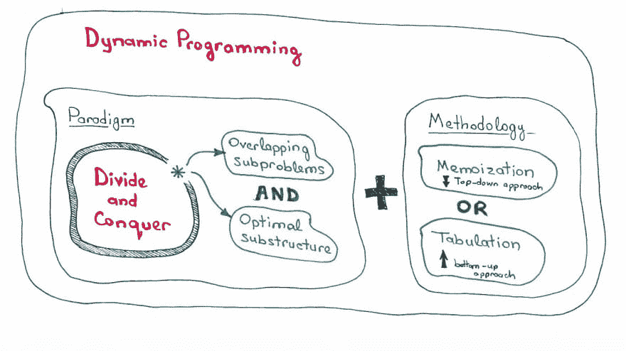
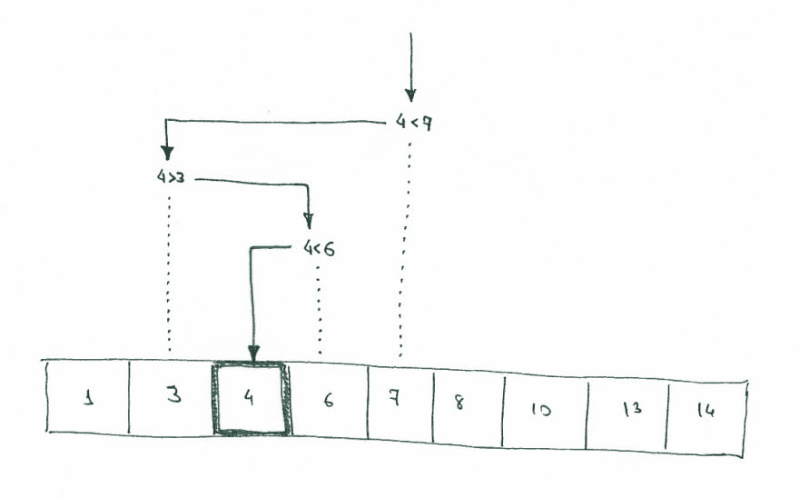
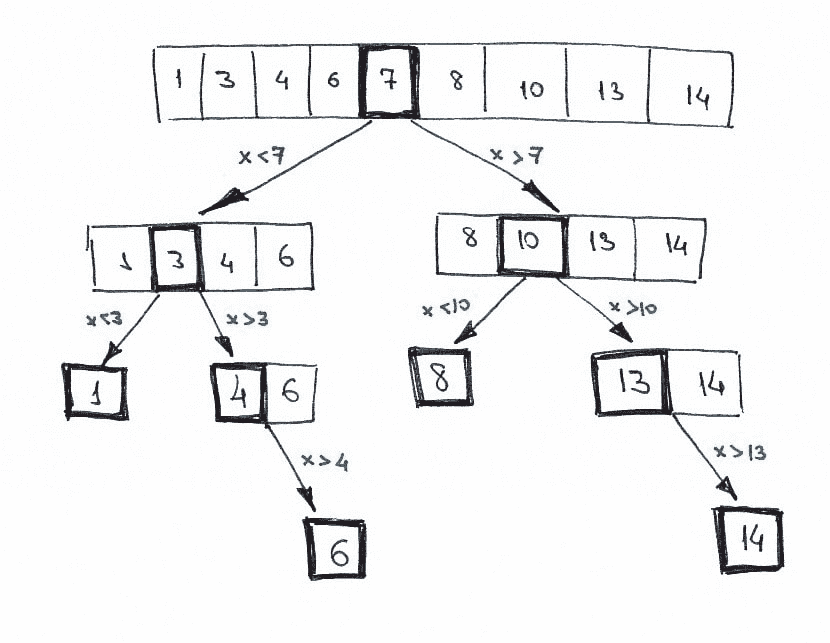
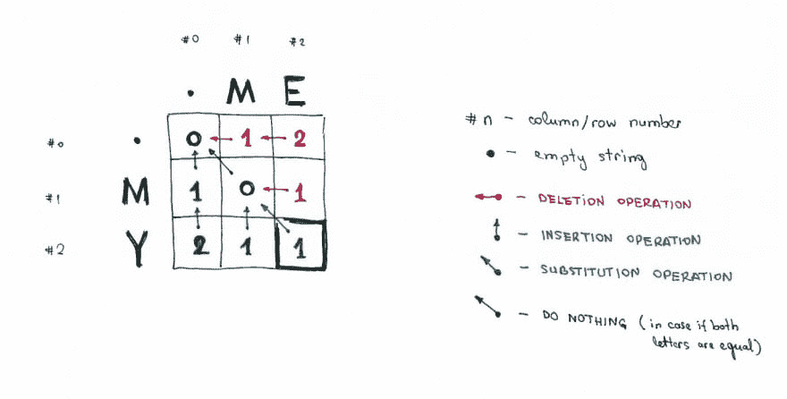
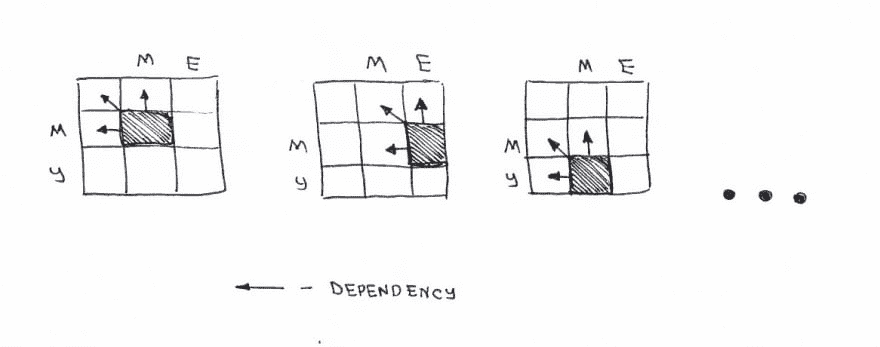
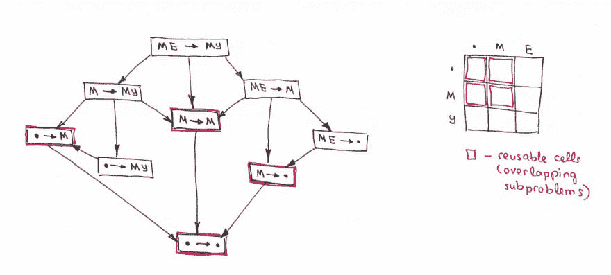
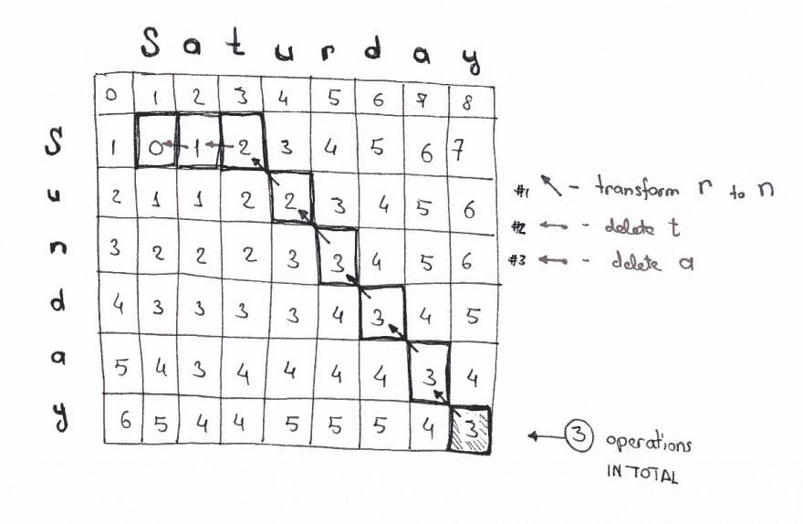

# 动态编程与分治

> 原文：<https://dev.to/trekhleb/dynamic-programming-vs-divide-and-conquer-218i>

* * *

# 或者在类固醇上各个击破


#### TL；速度三角形定位法(dead reckoning)

在这篇文章中，我试图通过两个例子来解释动态编程和分治法之间的区别/相似之处: [**【二分搜索法】**](https://github.com/trekhleb/javascript-algorithms/tree/master/src/algorithms/search/binary-search) 和 [**最小编辑距离**](https://github.com/trekhleb/javascript-algorithms/tree/master/src/algorithms/string/levenshtein-distance) (Levenshtein 距离)。

#### 问题是

当我 [**开始学习算法**](https://github.com/trekhleb/javascript-algorithms) 时，我很难理解动态编程( **DP** )的主要思想，以及它与各个击破( **DC** )的方法有何不同。当比较这两种范式时，通常斐波那契函数会作为一个很好的例子。但是当我们试图使用 DP 和 DC 方法来解释每一种方法来解决相同的问题时，我感觉我们可能会失去有价值的细节，而这些细节可能有助于更快地发现差异。这些细节告诉我们，每种技术最适合不同类型的问题。

我仍然在理解 DP 和 DC 差异的过程中，我不能说我已经完全掌握了这些概念。但是我希望这篇文章能够提供一些额外的启示，帮助您更进一步地学习像动态编程和分治这样有价值的算法范例。

#### 动态编程和分治的相似之处

在我看来，现在我可以说**动态编程是分而治之范式**的延伸。

我不会把他们视为完全不同的东西。因为**他们** **都是通过递归地将一个问题分解成两个或更多相同或相关类型的子问题**，直到这些变得足够简单，可以直接解决。然后将子问题的解决方案组合起来，给出原问题的解决方案。

那么为什么我们仍然有不同的范式名称，为什么我称动态编程为扩展。这是因为只有当问题具有某些 **限制或先决条件**时，动态规划方法才可以应用于问题**。然后动态编程**用**记忆**或**列表**技术扩展**分治法。**

让我们一步一步来…

#### 动态编程先决条件/限制

正如我们刚刚发现的，为了使动态编程适用，分治问题必须具有两个关键属性:

1.  [最优子结构](https://en.wikipedia.org/wiki/Optimal_substructure) —最优解可以由其子问题的最优解构建
2.  [重叠子问题](https://en.wikipedia.org/wiki/Overlapping_subproblems)——问题可以分解为子问题，这些子问题可以重复使用几次，或者问题的递归算法反复解决同一个子问题，而不是总是产生新的子问题

一旦这两个条件得到满足，我们就可以说这个分而治之的问题可以用动态规划方法来解决。

#### **分而治之的动态编程扩展**

动态编程方法使用两种技术(**记忆**和**制表**)扩展了分治方法，这两种技术都具有存储和重用子问题解决方案的目的，可以极大地提高性能。例如，斐波纳契函数的朴素递归实现具有时间复杂度`O(2^n)`，而 DP 解决方案仅用`O(n)`时间做同样的事情。

**记忆化(自顶向下缓存填充)**指的是缓存和重用先前计算结果的技术。记忆化的`fib`函数看起来像这样:

```
memFib(n) {
    if (mem[n] is undefined)
        if (n < 2) result = n
        else result = memFib(n-2) + memFib(n-1)
        mem[n] = result
    return mem[n]
}
```

**制表(自底向上的缓存填充)**类似，但侧重于填充缓存的条目。迭代计算缓存中的值是最简单的。`fib`的列表版本如下所示:

```
tabFib(n) {
    mem[0] = 0
    mem[1] = 1
    for i = 2...n
        mem[i] = mem[i-2] + mem[i-1]
    return mem[n]
}
```

你可以在这里阅读更多关于记忆和列表比较的内容[。](https://programming.guide/dynamic-programming-vs-memoization-vs-tabulation.html)

这里你应该掌握的主要思想是，因为我们的分治问题有重叠的子问题，子问题解决方案的缓存成为可能，因此记忆/列表逐步出现。

#### 那么迪拜和 DC 到底有什么区别呢

既然我们现在已经熟悉了 DP 的先决条件及其方法，我们就准备将上面提到的所有内容放入一张图片中。


<figure>

<figcaption>Dynamic programming and divide and conquer paradigms dependency</figcaption>

</figure>

让我们试着用 DP 和 DC 方法来解决一些问题，让这个例子更清楚。

#### 分而治之的例子:二分搜索法

[二分搜索法](https://en.wikipedia.org/wiki/Binary_search_algorithm)算法，也称为半区间搜索，是一种查找目标值在排序数组内的位置的搜索算法。二分搜索法将目标值与数组的中间元素进行比较；如果它们不相等，则目标不能位于其中的那一半被消除，并且在剩余的一半上继续搜索，直到找到目标值。如果搜索结束时剩下的一半为空，则目标不在数组中。

**例子**

这里是二分搜索法算法的可视化，其中`4`是目标值。


<figure>

<figcaption>Binary search algorithm logic</figcaption>

</figure>

让我们画出同样的逻辑，但以决策树的形式。


<figure>

<figcaption>Binary search algorithm decision tree</figcaption>

</figure>

在这里你可以清楚地看到解决问题的分而治之的原则。我们迭代地将原始数组分解成子数组，并试图在其中找到所需的元素。

我们能把动态编程应用到它上面吗？**没有**是因为**没有重叠的子问题**。每次我们把数组分割成完全独立的部分。根据分而治之的先决条件/限制，子问题**必须以某种方式**重叠。

通常每次你画一个决策树，它实际上是一个**树**(并且**不是**一个决策**图**)这意味着你没有重叠的子问题，这不是动态规划问题。

**代码**

[在这里](https://github.com/trekhleb/javascript-algorithms/tree/master/src/algorithms/search/binary-search)你可以找到二分搜索法函数的完整源代码，以及测试用例和解释。

```
function binarySearch(sortedArray, seekElement) {
  let startIndex = 0;
  let endIndex = sortedArray.length - 1;
```

```
  while (startIndex <= endIndex) {
    const middleIndex = startIndex + Math.floor((endIndex - startIndex) / 2);
```

```
    // If we've found the element just return its position.
    if (sortedArray[middleIndex] === seekElement)) {
      return middleIndex;
    }
```

```
    // Decide which half to choose: left or right one.
    if (sortedArray[middleIndex] < seekElement)) {
      // Go to the right half of the array.
      startIndex = middleIndex + 1;
    } else {
      // Go to the left half of the array.
      endIndex = middleIndex - 1;
    }
  }
```

```
  return -1;
}
```

#### 动态编程示例:最小编辑距离

通常，当涉及到动态编程的例子时，默认情况下采用的是[斐波那契](https://github.com/trekhleb/javascript-algorithms/tree/master/src/algorithms/math/fibonacci)数字算法。但是让我们用一个稍微复杂一点的算法，来做一些变化，这将有助于我们理解这个概念。

[最小编辑距离](https://en.wikipedia.org/wiki/Levenshtein_distance)(或 Levenshtein Distance)是一个字符串度量，用于测量两个序列之间的差异。非正式地，两个单词之间的 Levenshtein 距离是将一个单词变成另一个单词所需的单个字符编辑(*插入、删除或替换*)的最小数量。

**例子**

对于的例子，在“小猫”和“坐着”之间的 Levenshtein 距离是 3，因为下面的三个编辑将一个改变为另一个，并且没有办法用少于三个的编辑来完成:

1.  **k** itten → **s** itten(用“s”代替“k”)
2.  位置 **e** n →位置 **i** n(用“I”代替“e”)
3.  sittin → sittin **g** (末尾插入“g”)。

**应用程序**

这具有广泛的应用，例如，拼写检查器、用于光学字符识别的校正系统、模糊字符串搜索以及基于翻译记忆的辅助自然语言翻译的软件。

**数学定义**

数学上，两个弦`a`、`b`(长度分别为`|a|`和`|b|`)之间的 Levenshtein 距离由函数`lev(|a|, |b|)`给出，其中


注意，最小值中的第一个元素对应于**删除**(从`a`到`b`)，第二个对应于**插入**，第三个对应于**匹配** **或不匹配**，这取决于各个符号是否相同。

**解释**

好，让我们试着弄清楚这个公式在说什么。让我们举一个简单的例子，找出字符串 **ME** 和 **MY** 之间的最小编辑距离。直觉上你已经知道这里的最小编辑距离是 **1** 操作，这个操作是“*用* ***Y*** 替换 ***E*** *”。但是让我们试着用算法的形式将它形式化，以便能够做更复杂的例子，比如将星期六转化为星期天。*

要将公式应用于*M****E****→M****Y***变换，我们需要知道之前的 *ME→M* 、 *M→MY* 和 *M→M* 变换的最小编辑距离。然后我们将需要选择最小的一个，并添加+1 运算来转换最后一个字母 *E→Y* 。

因此，我们已经可以在这里看到解决方案的递归性质:最小编辑距离的 *ME→MY* 转换是基于三个先前可能的转换计算的。因此我们可以说这是**分治算法**。

为了进一步解释这一点，让我们画出下面的矩阵。


<figure>

<figcaption>Simple example of finding minimum edit distance between ME and MY strings</figcaption>

</figure>

**单元格(0，1)** 包含红色数字 1。意味着我们需要 1 次操作将 **M** 转换为**空串**:删除 **M** 。这就是为什么这个数字是红色的。

**单元格(0，2)** 包含红色数字 2。意味着我们需要 2 个操作来将 **ME** 转换为**空串**:删除 **E** ，删除 **M** 。

**单元格(1，0)** 包含绿色数字 1。这意味着我们需要 1 次操作将空字符串转换为 **M** :插入 **M** 。这就是为什么这个数字是绿色的。

**单元格(2，0)** 包含绿色数字 2。这意味着我们需要 2 个操作来将空字符串转换为 **MY** :插入 **Y** ，插入 **M** 。

**单元格(1，1)** 包含数字 0。也就是说把 **M** 改造成 **M** 不需要任何成本。

**单元格(1，2)** 包含红色数字 1。意味着我们需要 1 次操作将 **ME** 转换为 **M** :删除 **E** 。

诸如此类…

对于我们这样的小矩阵来说，这看起来很容易(它只有 3x3)。但是对于更大的矩阵，我们如何计算所有这些数字呢(比如 9x7 的一个，对于星期六 *→* 星期天的变换)？

好消息是，根据公式，你只需要三个相邻的单元格`(i-1,j)`、`(i-1,j-1)`和`(i,j-1)`来计算当前单元格`(i,j)`的数量。我们需要做的就是找到这三个单元格中的最小值，然后加上+1，以防我们在`i`的行和`j`的列中有不同的字母

所以你可以再次清楚地看到这个问题的递归性质。


<figure>

<figcaption>Recursive nature of minimum edit distance problem</figcaption>

</figure>

好了，我们刚刚发现，我们正在处理分而治之的问题。但是我们能应用动态规划方法吗？这个问题满足我们的**重叠子问题**和**最优子结构**限制吗？**是的**。从决策图来看。


<figure>

<figcaption>Decision graph for minimum edit distance with overlapping sub-problems</figcaption>

</figure>

首先这是**而不是**一棵决定**的树**。这是一个决定**图**。您可能会在图片上看到许多用红色标记的**重叠子问题**。也没有办法减少运算的次数，使其小于公式中三个相邻单元格的最小值。

您可能还会注意到，矩阵中的每个单元号都是基于以前的单元号计算的。因此，这里应用了**制表**技术(自底向上填充缓存)。您将在下面的代码示例中看到它。

进一步应用这个原则，我们可以解决更复杂的情况，比如星期六 *→* 星期天的转换。


<figure>

<figcaption>Minimum edit distance to convert Saturday to Sunday</figcaption>

</figure>

**代码**

[在这里](https://github.com/trekhleb/javascript-algorithms/tree/master/src/algorithms/string/levenshtein-distance)你可以找到完整的源代码的最小编辑距离功能与测试案例和解释。

```
function levenshteinDistance(a, b) {
  const distanceMatrix = Array(b.length + 1)
    .fill(null)
    .map(
      () => Array(a.length + 1).fill(null)
    );
```

```
  for (let i = 0; i <= a.length; i += 1) {
    distanceMatrix[0][i] = i;
  }
```

```
  for (let j = 0; j <= b.length; j += 1) {
    distanceMatrix[j][0] = j;
  }
```

```
  for (let j = 1; j <= b.length; j += 1) {
    for (let i = 1; i <= a.length; i += 1) {
      const indicator = a[i - 1] === b[j - 1] ? 0 : 1;

      distanceMatrix[j][i] = Math.min(
        distanceMatrix[j][i - 1] + 1, // deletion
        distanceMatrix[j - 1][i] + 1, // insertion
        distanceMatrix[j - 1][i - 1] + indicator, // substitution
      );
    }
  }
```

```
  return distanceMatrix[b.length][a.length];
}
```

#### 结论

在本文中，我们比较了两种算法方法，如动态编程和分治法。我们已经发现，动态规划是基于分治原则的，只有当问题有重叠的子问题和最优子结构时(如在 Levenshtein 距离的情况下)，才可以应用动态规划。然后，动态规划使用记忆或列表技术来存储重叠子问题的解，以备后用。

我希望这篇文章没有给你带来更多的困惑，而是让你对这两个重要的算法概念有所了解！:)

您可能会在 [JavaScript 算法和数据结构](https://github.com/trekhleb/javascript-algorithms)资源库中找到更多分而治之和动态编程问题的示例以及解释、注释和测试案例。

编码快乐！