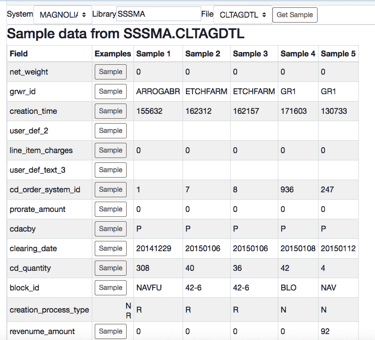

# 动态 SQL 备忘单

> 原文：<https://dev.to/jreighley/dynamic-sql-cheatsheet--1chp>

最近，我使用 Clojure 和 ClojureScript 编写了很多自己的 IBMi 诊断工具。

我经常遇到的一个问题是需要跟踪一些数据，而对我查询的表和数据没有很好的理解..所以我建立了这个工具来帮助我建立查询。

[T2】](https://res.cloudinary.com/practicaldev/image/fetch/s--tpxDyTRB--/c_limit%2Cf_auto%2Cfl_progressive%2Cq_auto%2Cw_880/https://thepracticaldev.s3.amazonaws.com/i/88pcutqw1ce5aglwr18c.png)

当我选择一台机器时，它会选择一个默认模式，并给出所有可能的表的列表。我选择一个表，然后按“获取样本”，它会显示“从表限制 5 中选择”,并显示结果。这非常有帮助，因为我可以看到字段名称以及每个字段中数据使用的格式。有时我的 5 个样本不能给我足够的信息。也许所有五个样本在一个字段中具有相同的值，或者根本没有值。我在每一行中添加了一个示例按钮来帮助我处理这个案例。当它被按下时，它从那个字段中取出前五个不同的值。该客户是否使用该字段？是我想的那样吗？答案往往是一键之遥。

在示例的底部，我有一个文本框，可以在其中键入 SQL 查询。现在容易多了，因为我有了一个动态生成的备忘单，可以为任何表提供提示。

已经很有帮助了。像“什么日期格式”这样的问题不再是猜测。

我计划通过让它为我建议加入来增强它。我还计划让它保存查询以备将来使用，并让它在选择特定表时建议这些查询。我可能会添加完整的交互式 SQL 功能。时间会证明一切。