# 使用 katalog studio 更轻松地处理多浏览器测试

> 原文：<https://dev.to/dohertykornelia/easier-handling-multiple-browser-testing-with-katalon-studio--go9>

## 介绍

本教程简要介绍了如何在多种浏览器中运行一个测试用例。Katalon 使自动化测试中的网格选项变得更加容易，无需下载任何外部资源。使用 Katalon，只需简单的步骤就可以完成多浏览器测试。

## 要求

工具:卡塔隆工作室
免费下载:[https://www.katalon.com/download](https://www.katalon.com/download)T3】教程:[https://www.katalon.com/resources-center/tutorials/](https://www.katalon.com/resources-center/tutorials/)

## 如何使用 Katalon Studio 实现多浏览器测试？

### *第一步:*

要启动 Katalon Studio，请双击 katalon.exe。

### *第二步:*

启动 Katalon Studio 后，提供您的注册用户名和密码来激活您的 Katalon Studio。

[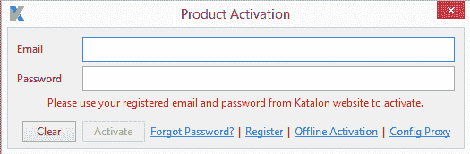T2】](https://res.cloudinary.com/practicaldev/image/fetch/s--HUeBpyW5--/c_limit%2Cf_auto%2Cfl_progressive%2Cq_auto%2Cw_880/https://i0.wp.com/testautomationresources.com/wp-content/uploads/2018/09/1.png%3Fw%3D525%26ssl%3D1)

### *第三步:*

一旦 Katalon Studio 被激活，输入项目名称及其描述。

[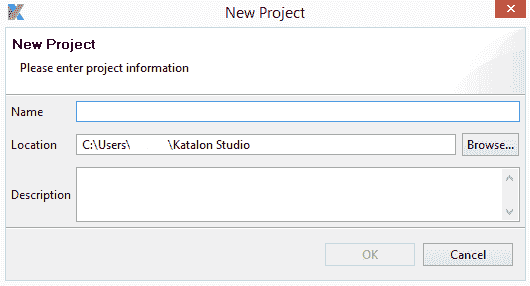T2】](https://res.cloudinary.com/practicaldev/image/fetch/s--Z9gELDr5--/c_limit%2Cf_auto%2Cfl_progressive%2Cq_auto%2Cw_880/https://i2.wp.com/testautomationresources.com/wp-content/uploads/2018/09/2.png%3Fw%3D530%26ssl%3D1)

### *第四步:*

创建一个新的测试用例，并输入测试用例的名称和描述。

[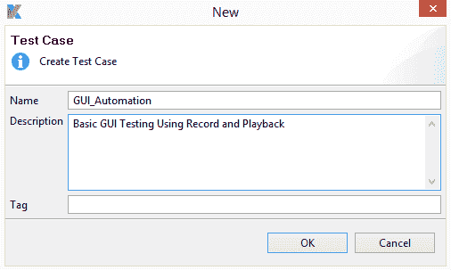T2】](https://res.cloudinary.com/practicaldev/image/fetch/s--ebXtgKPv--/c_limit%2Cf_auto%2Cfl_progressive%2Cq_auto%2Cw_880/https://i1.wp.com/testautomationresources.com/wp-content/uploads/2018/09/3.png%3Fw%3D506%26ssl%3D1)

### *第五步:*

点击 Record Web 图标，继续创建测试用例。

[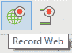](https://res.cloudinary.com/practicaldev/image/fetch/s--rv1IyK3l--/c_limit%2Cf_auto%2Cfl_progressive%2Cq_auto%2Cw_880/https://i0.wp.com/testautomationresources.com/wp-content/uploads/2018/09/4.png%3Fresize%3D91%252C68%26ssl%3D1)
[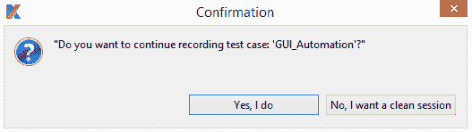T6】](https://res.cloudinary.com/practicaldev/image/fetch/s--x5CaHNHi--/c_limit%2Cf_auto%2Cfl_progressive%2Cq_auto%2Cw_880/https://i2.wp.com/testautomationresources.com/wp-content/uploads/2018/09/5.png%3Fw%3D527%26ssl%3D1)

### *第六步:*

在单击记录 Web 图标后打开的对话框中输入 URL，以防需要暂停或停止记录。在整个记录过程中，同一个对话框中提供了中间选项。
[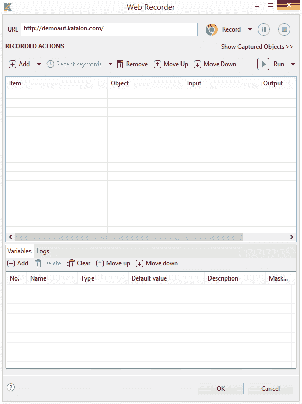T3】](https://res.cloudinary.com/practicaldev/image/fetch/s--EG2S2D_M--/c_limit%2Cf_auto%2Cfl_progressive%2Cq_auto%2Cw_880/https://i1.wp.com/testautomationresources.com/wp-content/uploads/2018/09/6.png%3Fw%3D594%26ssl%3D1)

### *第七步:*

从下拉列表中选择记录 UI 元素所需的浏览器。

[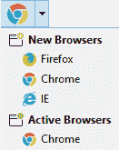T2】](https://res.cloudinary.com/practicaldev/image/fetch/s--go1R2XWw--/c_limit%2Cf_auto%2Cfl_progressive%2Cq_auto%2Cw_880/https://i0.wp.com/testautomationresources.com/wp-content/uploads/2018/09/7.png%3Fresize%3D131%252C165%26ssl%3D1)

### *第八步:*

一旦选择了浏览器，浏览器将被启动，并且具有 URL 的所选浏览器将被打开。一旦页面被完全加载，用户可以与页面交互，并且记录网页的必要动作，并且每当用户执行动作时，UI 元素将被记录。

[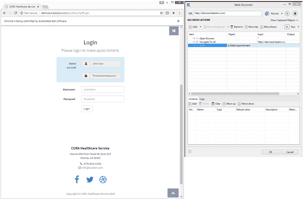T2】](https://res.cloudinary.com/practicaldev/image/fetch/s--7RzWNdHD--/c_limit%2Cf_auto%2Cfl_progressive%2Cq_auto%2Cw_880/https://i1.wp.com/testautomationresources.com/wp-content/uploads/2018/09/8.png%3Fw%3D606%26ssl%3D1)

### *第九步:*

点击“停止”按钮后，记录将完成。动作、动作数据和元素将被保存和显示。

[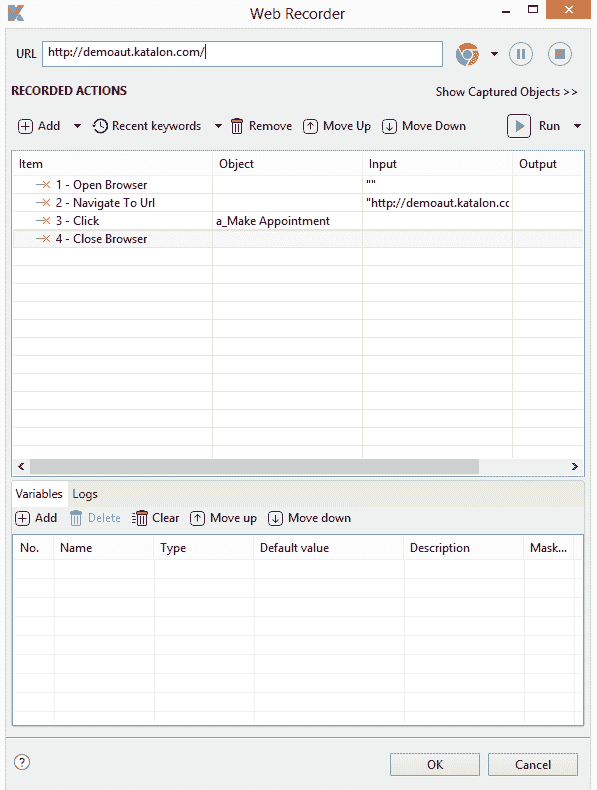T2】](https://res.cloudinary.com/practicaldev/image/fetch/s--inQ4wChX--/c_limit%2Cf_auto%2Cfl_progressive%2Cq_auto%2Cw_880/https://i0.wp.com/testautomationresources.com/wp-content/uploads/2018/09/9.png%3Fw%3D597%26ssl%3D1)

### *第十步:*

单击确定后，将打开对象存储库对话框，用户必须创建一个新文件夹并保存对象存储库。

[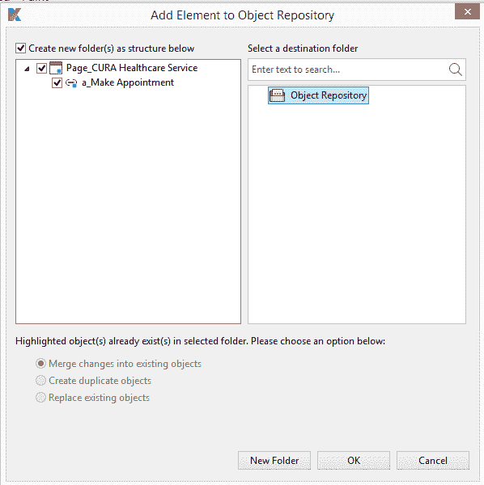T2】](https://res.cloudinary.com/practicaldev/image/fetch/s--rYyrfF0a--/c_limit%2Cf_auto%2Cfl_progressive%2Cq_auto%2Cw_880/https://i2.wp.com/testautomationresources.com/wp-content/uploads/2018/09/10.png%3Fw%3D598%26ssl%3D1)

### *第十一步:*

完成上述步骤后，创建的对象存储库文件夹将显示在对象存储库下。(注意:我的对象存储库被命名为 GUI)

[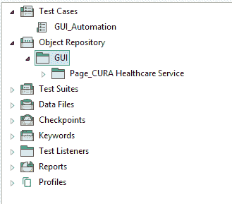T2】](https://res.cloudinary.com/practicaldev/image/fetch/s--Nyhyzm0---/c_limit%2Cf_auto%2Cfl_progressive%2Cq_auto%2Cw_880/https://i0.wp.com/testautomationresources.com/wp-content/uploads/2018/09/11.png%3Fw%3D329%26ssl%3D1)

### *第十二步:*

单击对象存储库文件夹时，将显示捕获的元素。

[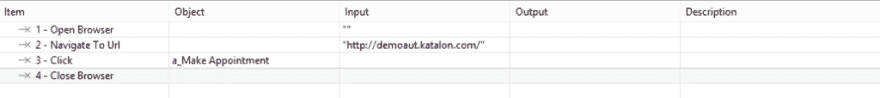T2】](https://res.cloudinary.com/practicaldev/image/fetch/s--BzvHjW-y--/c_limit%2Cf_auto%2Cfl_progressive%2Cq_auto%2Cw_880/https://i2.wp.com/testautomationresources.com/wp-content/uploads/2018/09/12.png%3Fresize%3D1024%252C114%26ssl%3D1)

### *第十三步:*

要在多个浏览器中运行测试用例，右键单击测试套件选项。

[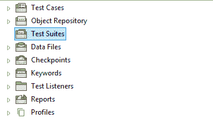T2】](https://res.cloudinary.com/practicaldev/image/fetch/s--18UAGJJA--/c_limit%2Cf_auto%2Cfl_progressive%2Cq_auto%2Cw_880/https://i2.wp.com/testautomationresources.com/wp-content/uploads/2018/09/13.png%3Fw%3D357%26ssl%3D1)

### *第十四步:*

选择 new 选项，创建一个新的测试套件，并给出一个合适的测试套件名称和描述。

[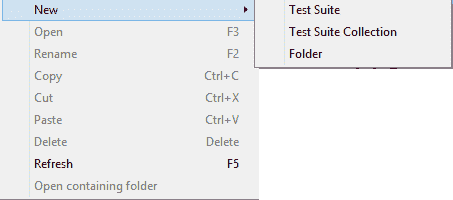T2】](https://res.cloudinary.com/practicaldev/image/fetch/s--rILWw9Ob--/c_limit%2Cf_auto%2Cfl_progressive%2Cq_auto%2Cw_880/https://i1.wp.com/testautomationresources.com/wp-content/uploads/2018/09/14.png%3Fw%3D453%26ssl%3D1)

[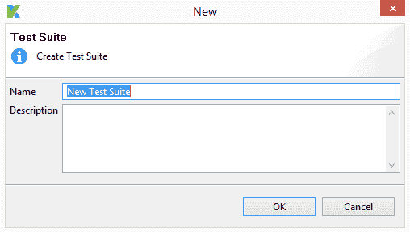T2】](https://res.cloudinary.com/practicaldev/image/fetch/s--A0b_rYqE--/c_limit%2Cf_auto%2Cfl_progressive%2Cq_auto%2Cw_880/https://i1.wp.com/testautomationresources.com/wp-content/uploads/2018/09/15.png%3Fw%3D508%26ssl%3D1)

### *第十五步:*

现在，用户必须将测试用例与测试套件集成在一起。成功创建测试套件后，单击 add 按钮将打开测试套件页面，并单击 add 选项。

[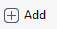T2】](https://res.cloudinary.com/practicaldev/image/fetch/s--4ZKN2aGg--/c_limit%2Cf_auto%2Cfl_progressive%2Cq_auto%2Cw_880/https://i1.wp.com/testautomationresources.com/wp-content/uploads/2018/09/16.png%3Fresize%3D57%252C29%26ssl%3D1)

### *第十六步:*

一旦按下 add 按钮，将会打开一个对话框，将测试用例添加到测试套件中。现在选中复选框并单击确定。测试用例将被集成到测试套件中。

**注意:**如果有多个测试用例，按照顺序选择测试用例。
我的测试用例被命名为 GUI_Automation。

[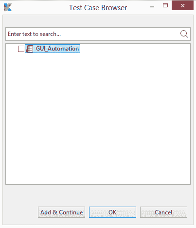T2】](https://res.cloudinary.com/practicaldev/image/fetch/s--wsN_IRpi--/c_limit%2Cf_auto%2Cfl_progressive%2Cq_auto%2Cw_880/https://i1.wp.com/testautomationresources.com/wp-content/uploads/2018/09/17.png%3Fw%3D403%26ssl%3D1)

### *第十七步:*

选择 new 选项，创建一个新的测试套件集合，并给出一个合适的测试套件集合名称和描述。

[T2】](https://res.cloudinary.com/practicaldev/image/fetch/s--rILWw9Ob--/c_limit%2Cf_auto%2Cfl_progressive%2Cq_auto%2Cw_880/https://i1.wp.com/testautomationresources.com/wp-content/uploads/2018/09/14.png%3Fw%3D453%26ssl%3D1)

### *第十八步:*

现在，用户必须将测试套件与测试套件集合集成在一起。成功创建测试套件集合后，单击 add 按钮将打开 test suite collection 页面，并单击 add 选项。

### *第十九步:*

现在选择添加到测试套件集合中的测试套件，以便在多个浏览器中运行测试用例。

**注意:**两次以上添加同一个测试套件，在不同浏览器中运行该测试套件。
我已经将我的测试套件命名为 GUI_Multiplebrowser。

[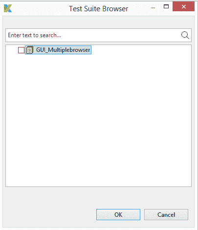T2】](https://res.cloudinary.com/practicaldev/image/fetch/s--Y9aajAHQ--/c_limit%2Cf_auto%2Cfl_progressive%2Cq_auto%2Cw_880/https://i1.wp.com/testautomationresources.com/wp-content/uploads/2018/09/19.png%3Fw%3D405%26ssl%3D1)

### *第二十步:*

一旦选择了测试套件，使用“Run with”选项来选择浏览器，以便在不同的浏览器中运行测试套件。

[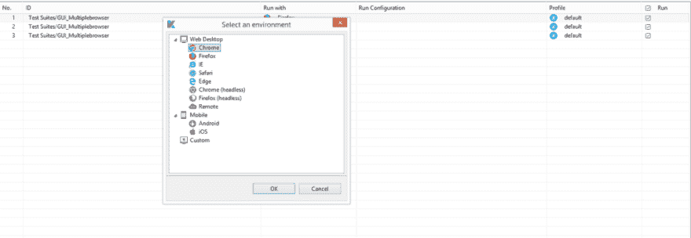T2】](https://res.cloudinary.com/practicaldev/image/fetch/s--aBhRPL2D--/c_limit%2Cf_auto%2Cfl_progressive%2Cq_auto%2Cw_880/https://i1.wp.com/testautomationresources.com/wp-content/uploads/2018/09/20.png%3Fresize%3D1024%252C354%26ssl%3D1)

### *第 21 步:*

一旦使用适当的浏览器选择了测试套件，测试套件集合就可以执行了。

[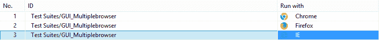T2】](https://res.cloudinary.com/practicaldev/image/fetch/s--aLd7l0O_--/c_limit%2Cf_auto%2Cfl_progressive%2Cq_auto%2Cw_880/https://i0.wp.com/testautomationresources.com/wp-content/uploads/2018/09/21.png%3Fw%3D761%26ssl%3D1)

### *第二十二步:*

测试套件集合可以通过两种不同的方式来执行

**1。顺序:**测试套件将被一个接一个地执行。
2**。并行:**测试套件将同时执行。
[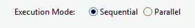T8】](https://res.cloudinary.com/practicaldev/image/fetch/s--3Qny9QvO--/c_limit%2Cf_auto%2Cfl_progressive%2Cq_auto%2Cw_880/https://i0.wp.com/testautomationresources.com/wp-content/uploads/2018/09/22.png%3Fresize%3D283%252C42%26ssl%3D1)

### *第二十三步:*

我将在下运行我的测试套件集合，并将执行测试套件集合。
T3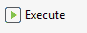T5】

### *第 24 步:*

测试套件的执行将在三种不同的浏览器中运行测试用例，日志可以在日志中查看。

[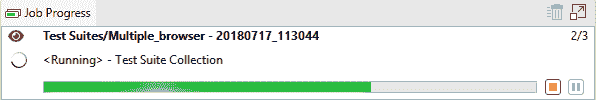T2】](https://res.cloudinary.com/practicaldev/image/fetch/s--SdoyCxBO--/c_limit%2Cf_auto%2Cfl_progressive%2Cq_auto%2Cw_880/https://i1.wp.com/testautomationresources.com/wp-content/uploads/2018/09/24.png%3Fw%3D596%26ssl%3D1)

完整源代码:

```
import static com.kms.katalon.core.checkpoint.CheckpointFactory.findCheckpoint
import static com.kms.katalon.core.testcase.TestCaseFactory.findTestCase
import static com.kms.katalon.core.testdata.TestDataFactory.findTestData
import static com.kms.katalon.core.testobject.ObjectRepository.findTestObject
import com.kms.katalon.core.checkpoint.Checkpoint as Checkpoint
import com.kms.katalon.core.checkpoint.CheckpointFactory as CheckpointFactory
import com.kms.katalon.core.mobile.keyword.MobileBuiltInKeywords as MobileBuiltInKeywords
import com.kms.katalon.core.mobile.keyword.MobileBuiltInKeywords as Mobile
import com.kms.katalon.core.model.FailureHandling as FailureHandling
import com.kms.katalon.core.testcase.TestCase as TestCase
import com.kms.katalon.core.testcase.TestCaseFactory as TestCaseFactory
import com.kms.katalon.core.testdata.TestData as TestData
import com.kms.katalon.core.testdata.TestDataFactory as TestDataFactory
import com.kms.katalon.core.testobject.ObjectRepository as ObjectRepository
import com.kms.katalon.core.testobject.TestObject as TestObject
import com.kms.katalon.core.webservice.keyword.WSBuiltInKeywords as WSBuiltInKeywords
import com.kms.katalon.core.webservice.keyword.WSBuiltInKeywords as WS
import com.kms.katalon.core.webui.keyword.WebUiBuiltInKeywords as WebUiBuiltInKeywords
import com.kms.katalon.core.webui.keyword.WebUiBuiltInKeywords as WebUI
import internal.GlobalVariable as GlobalVariable
WebUI.openBrowser('')
WebUI.navigateToUrl('http://www.practiceselenium.com/')
WebUI.click(findTestObject('Object Repository/GUI/Page_Welcome/span_See Collection'))
WebUI.click(findTestObject('Object Repository/GUI/Page_Menu/span_Check Out'))
WebUI.setText(findTestObject('Object Repository/GUI/Page_Check Out/input_email'), 'test@yopmail.com')
WebUI.setText(findTestObject('Object Repository/GUI/Page_Check Out/input_name'), 'Testing')
WebUI.click(findTestObject('Object Repository/GUI/Page_Check Out/div_Address'))
WebUI.setText(findTestObject('Object Repository/GUI/Page_Check Out/textarea_address'), 'New Testing , Katalon')
WebUI.selectOptionByValue(findTestObject('Object Repository/GUI/Page_Check Out/select_Visa              Maste'), 'American Express', true)
WebUI.setText(findTestObject('Object Repository/GUI/Page_Check Out/input_card_number'), '65656565656')
WebUI.setText(findTestObject('Object Repository/GUI/Page_Check Out/input_cardholder_name'), 'TESTING')
WebUI.setText(findTestObject('Object Repository/GUI/Page_Check Out/input_verification_code'), '6565656')
WebUI.click(findTestObject('Object Repository/GUI/Page_Check Out/button_Place Order'))
WebUI.closeBrowser() 
```

本教程最初发布在[测试自动化资源](https://testautomationresources.com/web-testing/multiple-browser-testing-katalon-studio/)T3