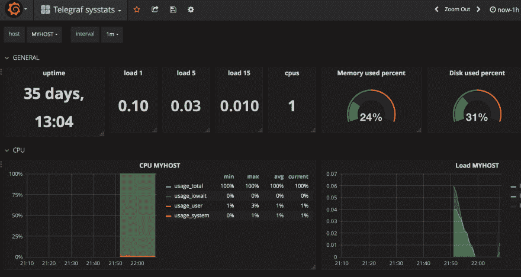
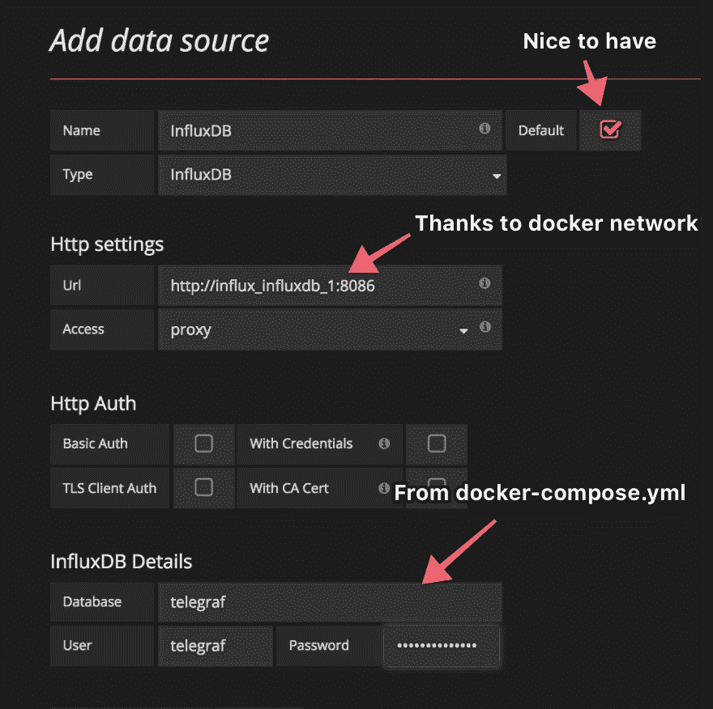

# 使用 Traefik 轻松安装 InfluxDB & Grafana

> 原文：<https://dev.to/joenas/easy-influxdb--grafana-setup-with-traefik-172j>

[T2】](https://res.cloudinary.com/practicaldev/image/fetch/s--t_z2kcBW--/c_limit%2Cf_auto%2Cfl_progressive%2Cq_auto%2Cw_880/https://jonnev.se/conteimg/2018/08/Screen-Shot-2018-08-15-at-22.09.30-1.png)

有什么比盯着图形看更刺激的？一切都不对。如果你只是喜欢一些系统指标，或者想显示你家一段时间内的温度，像 [InfluxDB](https://www.influxdata.com/time-series-platform/influxdb/) 结合 [Grafana](https://grafana.com/grafana) 这样的时间序列数据库是不错的选择！

本指南将向您展示在 Traefik 和 Docker 的帮助下快速安装这两个系统的简单方法。如果您已经有一个运行 Traefik 的服务器，那么继续。否则，我推荐你阅读我在[之前的帖子](https://dev.to/joenas/traefik-with-docker-and-lets-encrypt-pon-temp-slug-5403439)，你很快就会回到这里。

## 设置

让我们为你的数据建立一个目录，如果需要的话

```
sudo su
mkdir /opt/influx 
```

Enter fullscreen mode Exit fullscreen mode

然后，我们需要一个内部 docker 网络，让服务在
上进行通信

```
docker network create influx 
```

Enter fullscreen mode Exit fullscreen mode

### 码头工-化合物. yml

我们将把我们的服务放在 docker-compose 文件中，以便于管理。我们先把基本的放进去。

```
nano /opt/influx/docker-compose.yml

version: "2"
services:
  influxdb:
    # We'll add stuff here
  grafana:
    # and here

networks:
  default:
    external:
      name: influx # The network we created
  web:
    external: true # For traefik 
```

Enter fullscreen mode Exit fullscreen mode

### InfluxDB

有许多[环境变量](https://jonnev.se/easy-influxdb-grafana-setup-with-traefik/(https://hub.docker.com/_/influxdb/))可用于图像，我们将使用其中的一些。

如果你想发送数据到来自外界的流入你需要有一个*前端*在 Traefik 与端口和主机名，如果没有，然后删除`labels`部分。也可以去掉`networks`下的`- web`。

我们还需要一个有写权限的用户和一个可以写入的数据库。对于一些不错的系统指标，我使用了 [telegraf](https://www.influxdata.com/time-series-platform/telegraf/) ,因此这里我们将让 InfluxDB 映像最初创建数据库和用户。如果您想使用其他东西作为输入，只需相应地更改值。

```
influxdb:
    image: influxdb:1.5.4-alpine
    restart: unless-stopped
    ports:
      - "127.0.0.1:8086:8086"
    volumes:
      - ./influxdb:/var/lib/influxdb
    environment:
      - INFLUXDB_DB=telegraf 
      - INFLUXDB_USER=telegraf
      - INFLUXDB_USER_PASSWORD=secretpassword
    labels:
      - "traefik.enable=true"
      - "traefik.frontend.rule=Host:influxdb.example.com"
      - "traefik.port=8086"
      - "traefik.docker.network=web"
    networks:
      - web
      - default # The external "influx" network 
```

Enter fullscreen mode Exit fullscreen mode

☝️ **记得替换`traefik.frontend.rule`中的** `example.com`。

### 格拉法纳

现在让我们添加 Grafana 服务，这样我们就有东西来显示我们未来的统计数据了。首先，让我们添加一个用于永久存储的卷。

```
docker volume create grafana-storage 
```

Enter fullscreen mode Exit fullscreen mode

然后把这个加到`influxdb`和`networks`之间的`docker-compose.yml`。

```
grafana:
    image: grafana/grafana:4.4.1
    restart: unless-stopped
    ports:
      - "127.0.0.1:3000:3000"
    volumes:
     - grafana-storage:/var/lib/grafana
     - ./log/grafana:/var/log/grafana
    environment:
     - GF_SECURITY_ADMIN_PASSWORD=supersecret
     # Comment out if you have users that should sign up
     - GF_USERS_ALLOW_SIGN_UP=false 
     - GF_SERVER_ROOT_URL=https://grafana.example.com
    labels:
      - "traefik.enable=true"
      - "traefik.frontend.rule=Host:grafana.example.com"
      - "traefik.port=3000"
      - "traefik.docker.network=web"
    networks:
      - web
      - default

volumes:
  grafana-storage:
    external: true 
```

Enter fullscreen mode Exit fullscreen mode

☝️ **记得替换上面 2 处的** `grafana.example.com`。

### Grafana UI

现在您应该能够运行服务了！

```
# To start
docker-compose up -d
# Check logs
docker-compose logs
# Check processes
docker-compose ps 
```

Enter fullscreen mode Exit fullscreen mode

如果一切正常，打开你的 Grafana 网址，你会看到一个登录界面。使用`admin`和您设置为`GF_SECURITY_ADMIN_PASSWORD`的密码。登录后，点击“添加数据源”并填写如下字段。

[T2】](https://res.cloudinary.com/practicaldev/image/fetch/s--QHLdQAhZ--/c_limit%2Cf_auto%2Cfl_progressive%2Cq_auto%2Cw_880/https://jonnev.se/conteimg/2018/08/grafana-settings.png)

Url 设置中的主机名`influx_influxdb_1`来自 docker 网络`influx`，因为服务在单独的容器中，所以这里不能使用`localhost`。

如果您在保存/测试数据源和使用 Safari 时收到**错误信息，请尝试其他浏览器。**

### 在那里获取一些数据

如果你已经有办法将数据发送到 Influx，那么你就大功告成了！如果没有，那么前面提到的`telegraf`也很容易设置。

```
mkdir /opt/telegraf
cd /opt/telegraf
nano docker-compose.yml

version: "2"
services:
  telegraf:
    image: telegraf:1.5.2
    restart: unless-stopped
    volumes:
      - ./telegraf.conf:/etc/telegraf/telegraf.conf:ro
      # For docker stats
      - /var/run/docker.sock:/var/run/docker.sock:ro
    labels:
      - "traefik.enable=false"
    networks:
      - default

networks:
  default:
    external:
      name: influx

nano telegraf.conf 
```

Enter fullscreen mode Exit fullscreen mode

这里有一个非常简单的会议，只需启动并运行。随意使用[默认选项](https://github.com/influxdata/telegraf/blob/master/etc/telegraf.conf)获得更多选项。

```
# Configuration for telegraf agent
[agent]
  interval = "10s"
  round_interval = true
  metric_batch_size = 1000
  metric_buffer_limit = 10000
  collection_jitter = "0s"
  flush_interval = "10s"
  flush_jitter = "0s"
  precision = ""
  debug = false
  quiet = false
  logfile = ""
  hostname = "MYHOST"

###############################################################################
# OUTPUT PLUGINS #
###############################################################################

# Configuration for influxdb server to send metrics to
[[outputs.influxdb]]
  urls = ["http://influxdb:8086"] # required
  database = "telegraf" # required
  username = "telegraf"
  password = "secretpassword"
  retention_policy = ""
  write_consistency = "any"
  timeout = "5s"

###############################################################################
# INPUT PLUGINS #
###############################################################################

# Read metrics about cpu usage
[[inputs.cpu]]
  ## Whether to report per-cpu stats or not
  percpu = true
  ## Whether to report total system cpu stats or not
  totalcpu = true
  ## If true, collect raw CPU time metrics.
  collect_cpu_time = false

# Read metrics about disk usage by mount point
[[inputs.disk]]
  ## Ignore some mountpoints by filesystem type. For example (dev)tmpfs (usually
  ## present on /run, /var/run, /dev/shm or /dev).
  ignore_fs = ["tmpfs", "devtmpfs"]

# Read metrics about disk IO by device
[[inputs.diskio]]
  ## Setting devices will restrict the stats to the specified devices.
  # devices = ["sda", "sdb"]

# Get kernel statistics from /proc/stat
[[inputs.kernel]]
  # no configuration

# Read metrics about memory usage
[[inputs.mem]]
  # no configuration

# Get the number of processes and group them by status
[[inputs.processes]]
  # no configuration

# Read metrics about swap memory usage
[[inputs.swap]]
  # no configuration

# Read metrics about system load & uptime
[[inputs.system]]
  # no configuration

# # Read metrics about docker containers
[[inputs.docker]]
  endpoint = "unix:///var/run/docker.sock"
  timeout = "5s"

# # Read metrics about network interface usage
[[inputs.net]]
  interfaces = ["eth*"] 
```

Enter fullscreen mode Exit fullscreen mode

启动服务，您将有一些数据传入。

```
docker-compose up -d
docker-compose logs 
```

Enter fullscreen mode Exit fullscreen mode

现在回到 Grafana 实例，创建一些[仪表板](https://grafana.com/dashboards?dataSource=influxdb)！

[T2】](https://res.cloudinary.com/practicaldev/image/fetch/s--zfUyJ7_J--/c_limit%2Cf_auto%2Cfl_progressive%2Cq_auto%2Cw_880/https://jonnev.se/conteimg/2018/08/Screen-Shot-2018-08-15-at-22.09.30.png)

[电报局系统状态](https://grafana.com/dashboards/4823)为[电报局](https://grafana.com/orgs/broferek)

## 结束

如果您注意到任何事实错误、拼写错误(是的)、我不知道的最佳实践或遇到任何麻烦，请在下面发表评论或通过 [Twitter](https://twitter.com/jonnever) 联系我🙌